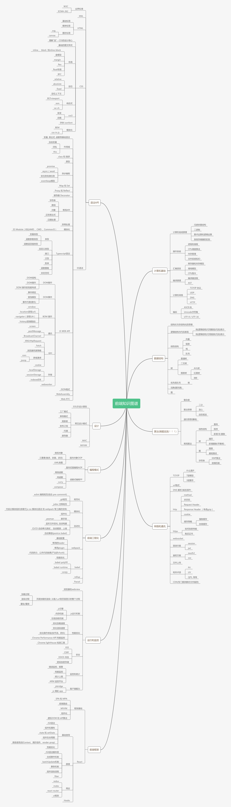

                                                      _.-"\
                                                _.-"     \
                                              ,-"           \
                                              \            \
                                              \ \    Library    \
                                              \ \            \
                                                \ \         _.-;
                                                \ \    _.-"   :
                                                  \ \,-"    _.-"
                                                  \(   _.-"
                                                    `--"

### Life is moment. The more you know, the more you don't know.

 

#### 基础语法篇
* [你不知道的Error](./docs/views/JS基础/Error.md)
* [你不知道的js之你不知道的this](./docs/views/JS基础/This.md)
* [这一次我真的搞懂了Babel](./docs/views/JS基础/Babel.md)
* [es系列学习](./docs/views/JS基础/es系列.md)
* [小朋友你对于Base64是不是有很多问号](./docs/views/JS基础/file-base64.md)
* [基于Base64的探索与实践](./docs/views/JS基础/file-base64-2.md)
* [reduce常用功能汇总](./docs/views/JS基础/reduce.md)
* [力导向图的推导与优化](./docs/views/JS基础/performance.md)
* [分享《构建自动接收派发机器人》](./docs/views/JS基础/邮件机器人.md)
* [探寻public class fields](./docs/views/JS基础/classFields.md)
* [在画布上绘图](./docs/views/JS基础/在画布上绘图.md)

#### 样式学习篇
* [css常用选择](./docs/views/css样式/选择器.md)

#### React学习篇
* [Hook的基本使用](./docs/views/React篇/hooks.md)
* [HOC的学习](./docs/views/React篇/hoc.md)
* [React Hooks - 重新认识useEffect](./docs/views/React篇/HooksBestPractices.md)
* [深度理解Hook规则](./docs/views/React篇/hooksRule.md)
* [常用的自定Hooks](./docs/views/React篇/extraHooks.md)
* [从0实现React框架](./docs/views/React篇/Toy-React.md)
* [基于React+Topology构建在线绘图工具](./docs/views/React篇/react-editer.md)
* [F7 移动端组件最佳实践指南](./docs/views/React篇/framework7.md)
* [React+Topology在线绘图工具支持UI组件啦](./docs/views/React篇/react-editer2.md)
* [React+Topology在线绘图工具支持事件啦](./docs/views/React篇/react-editer3.md)
* [基于Topology构建报表和列表界面](./docs/views/React篇/react-editer4.md)
* [深入浅出Context](./docs/views/React篇/useContext.md)
* [useState源码解析](./docs/views/React篇/useState.md)

#### 随笔记录

* [从零部署前端项目(https)](./docs/views/随笔记录/serviceHttps.md)
* [使用workflow完成打包部署项目](./docs/views/随笔记录/gitActions.md)
* [使用verdaccio搭建私服](./docs/views/随笔记录/verdaccio.md)
* [替换文本,恐怕没那么简单](./docs/views/随笔记录/searchAndReplace.md)
* [一些常用小工具](./docs/views/随笔记录/someTools.md)
* [基于Antd表格的思考](./docs/views/随笔记录/antd-table.md)
* [口琴的简单推导](./docs/views/随笔记录/music.md)
* [深入理解styled-components运行机制](./docs/views/随笔记录/styled-components.md)
* [前端赋能-APP的全链路开发](./docs/views/随笔记录/app-build.md)
* [记一次给create-react-app提的PR](./docs/views/随笔记录/css-build.md)
* [vite插件化的探索](./docs/views/随笔记录/vite插件化的探索.md)
* [node包学习之chokidar](./docs/views/随笔记录/chokidar.md)

#### 设计模式

* [策略模式](./docs/views/设计模式/策略模式.md)
* [鸭子模型](./docs/views/设计模式/duck.md)

#### 年度总结篇
* [24岁, 接触前端的这三年](./docs/guide/review/2020.md)

