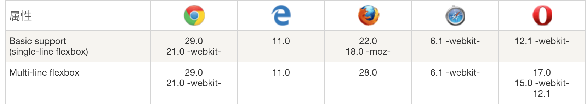

#### css3弹性盒子布局
###### 弹性盒子是css3的一种新的布局模式。css3弹性盒子,是一种当页面需要适应不同屏幕大小或者不同设备类型时,确保元素拥有恰当的行为布局方式。引入弹性盒子的目的是为了能够提供更加有效的方式来对容器中的元素进行布局。当然, 一个好的页面往往是各种布局方式混合起来一起使用。

###### 当然布局离不开浏览器的支持：

###### 弹性盒子是由弹性容器和弹性子元素组成的。弹性容器通过设置display属性为flex或者inline-flex将其定义为弹性容器。在弹性容器中居中非常方便,只需要设置margin: auto 就可以实现上下左右居中。