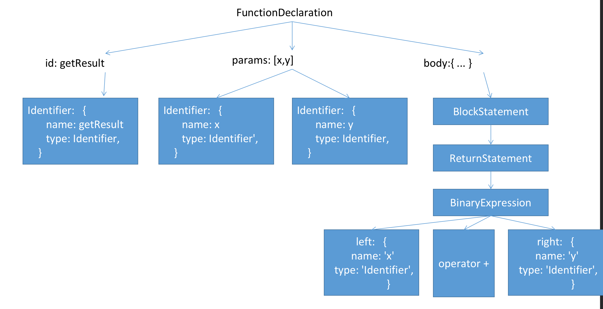
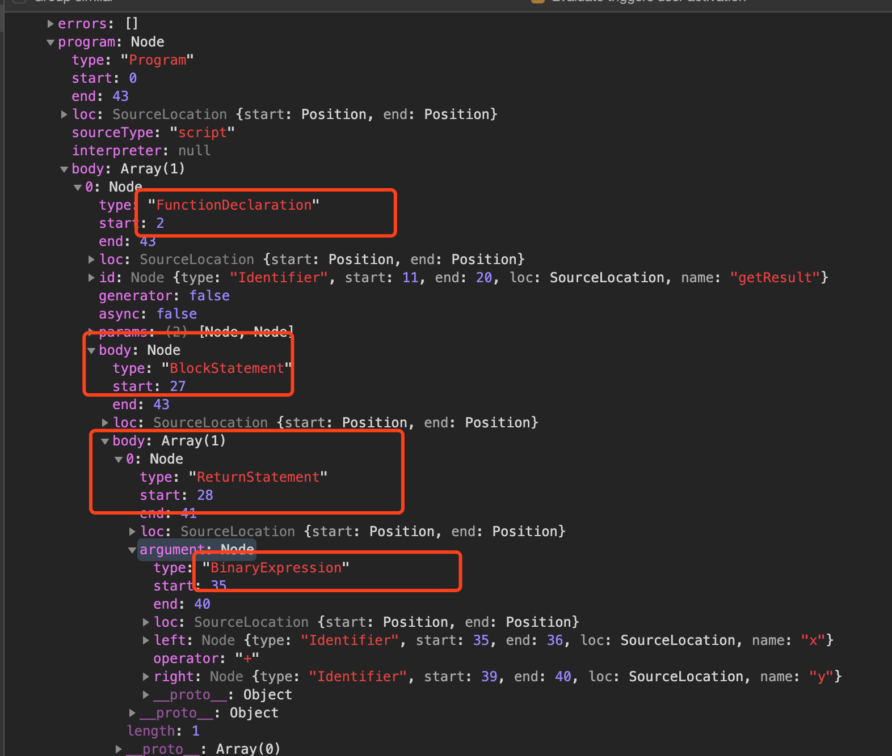

#### 这一次我真的搞懂了Babel
   前言: 之前虽然大致看了看Babel相关的知识,但是并没有深入了解。本文前半部分先详细介绍一下Babel是如何编译JS代码并且转化为浏览器能够理解的代码, 后半部分将会实现一个简单的babel插件。

#### 什么是Babel？
    Babel is a compiler for writing next generation JavaScript.Babel是编写下一代JavaScript的编译器。

#### Babel的作用？
    帮我们编写的es6,es7...解析成浏览器能够理解的代码

#### Babel是如何完成解析工作的？
 - 解析: 使用[babel-parser](https://github.com/babel/babel/tree/master/packages/babel-parser)将我们编写的高级JS代码转化成AST语法树。
 - 转换: 配合[babel-traverse](https://github.com/babel/babel/tree/master/packages/babel-traverse)将AST语法树进行遍历转换。
 - 生成: 使用[babel-generator](https://github.com/babel/babel/tree/master/packages/babel-generator)将转换后的AST语法树转化为JS代码。

##### 接下来我们开始第一步:```解析 ```
 - 在开始之前我们先介绍一下这一步涉及到的名词: ```AST```。它的全称是Abstract Syntax Tree(抽象语法树)。在百度百科中, 它是这么介绍的: 在计算机科学中,抽象语法树是源代码语法结构的一种抽象表示。它以树状的形式表现编程语言的语法结构,树上的每一个节点都表示源代码的结构。其实简单可以理解为:``` 它就是我们所编写代码的树状结构化的一种表现形式  ```。
 - 有了基本的概念之后我们来举一个例子来说明一下这个过程。
   ```
   function getResult(x, y) {
     return x + y;
   }
   ```
   在下面的解释中会出现一些关键词。我们先不用深究,先理解这个过程。首先当我们的``` babel-parser ```遇到这个代码块的时候,他会认为这是一个FunctionDeclaration(函数定义)对象。然后他会先把这一大块拆成三个小块:

   -  id: 就是它的名称标识getResult
   -  两个参数: [x,y]
   -  一大块Body: ``` { return x + y } ```
  
    第一块已经无法继续拆下去了那么它就会被解析成: 
      ```
      {
        name: 'getResult'
        type: 'Identifier',
        ...
      }
      ```

    第二块就是一个数组,它也无法拆下去了,同样的它被解析成:
      ```
      [
        {
        name: 'x'
        type: 'Identifier',
        ...
        },
        {
        name: 'y'
        type: 'Identifier',
        ...
        }
      ]
      ```
     第三块是一个Body,很明显第三块还可以继续拆: 首先解析器解析到了一个BlockStatement(块区域)对象, 它用来表示 ``` { return x + y } ```.继续解析它我们得到了一个 ReturnStatement(Return域)对象, 它用来表示return ``` x + y ```;我们再解析它,我们又得到了一个BinaryExpression(二项式)对象,它用来表示 ``` x + y ```;我们再解析这个二项式对象,它分成了三部分, ```  left ```,```  operator ```, ``` right ```

     - left： x
     - operator: +
     - right: y
     下面这张图就是这个function解析后AST树的样子。
      


    实战操作

    ```
    const parse = require('@babel/parser');
    const code = 'function getResult(x, y) {return x + y; }';
    console.log(parse.parse(code));
    ```
    我们引入@babel/parser把我们刚刚的表达式当成输入,我们看看输出是怎么样的, 发现他解析出来的AST树正是我们所解释的样子。
    至于上面提到的关键词(比如```BlockStatement```、```ReturnStatement```...)我们可以在[MDN](https://developer.mozilla.org/en-US/docs/Mozilla/Projects/SpiderMonkey/Parser_API#Node_objects)中寻找到。
     


##### 然后我们开始第二步:```遍历转换 ```
   - 我们这里使用@babel/traverse来遍历AST,继续上面的代码,我们简单的使用一下traverse,我们可以在控制台看到path输出的其实每一个节点的信息,我们可以在enter里面对某一个节点进行快速的操作。
  
      ```
      traverse.default(ast,{
        enter(path) {
          if (
            path.node.type === "Identifier" &&
            path.node.name === "x"
          ) {
            path.node.name = "n";
          }
        }
      });
     ```

 ##### 最后一步: ```AST语法树转化为JS代码```
   - 这里我们使用babel-generator将AST转化为JS, generate的第一个参数就是转化后的ast了, 第二个参数是一些生成js代码时候的一些选项比如要不注释,压缩等等。至此上半节的内容已经结束了。下半节我们将会开始编写插件。
  
   ```
    const oj = generate.default(ast,{ },code)
    console.log(oj.code);   // function getResult(n, y) {  return n + y; }
   ```

   ### 编写Babel插件

   #### 前言: 在我们编写Babel插件之前我们还需要了解几个知识点:
-  Visitor: 当Babel处理每一个节点的时候,是通过访问者的形式获取节点的从而处理节点的, 而这种方式是通过visitor对象来操作的,在visitor对象中内置了一系列对节点的访问的函数,这样我就可以针对不同的节点进行快速的处理。我们编写的Babel插件其实也就是实例化一个Visitor对象处理一系列的AST节点。我们举一个简单的例子。假如我们想按需加载react-ladingg。那么很简单我只需要把下面这段代码 ```  import BabelLoading  from  'react-ladingg/lib/BabelLoading' ```即可。
    ```
    import { BabelLoading } from  'react-ladingg'
    ```

    那么我们定义的Babel插件的对象就应该是:

    ```
    visitor: {
    ImportDeclaration: (path, state) => {
    }
    }
   ```
   当我们的Babel处理节点的时候 遇到了 import语句的时候那么它就会进入ImportDeclaration方法.我们来看一下它的传参。
   - path: 它包含了属性和方法: 属性: node: 当前节点, parent: 父节点, scope: 作用域... 方法:replaceWith: 用AST节点替换当前节点， replaceWithMultiple: 用多个AST节点替换当前节点， remove： 删除节点...
   - state: state是visitor对象中每次访问节点方法时传入的第二个参数。包含诸如当前plugin的信息、plugin传入的配置参数信息，甚至当前节点的path信息也能获取到，当然也可以把babel插件处理过程中的自定义状态存储到state对象。
 
 - Babel/Types: 这是一个处理AST很强大的一个工具它包含了构造、验证以及变换AST节点的方法。该工具库包含考虑周到的工具方法，对编写处理AST逻辑非常有用。就比如我们这个例子: 有三种基本的import方法
   1. ``` import { BabelLoading } from 'reactloadingg' ```
   2. ``` import  BabelLoading  from 'reactloadingg' ```
   3. ``` import  * as Loading  from 'reactloadingg' ```.他们分别对应Types中ImportSpecifier, ImportDefaultSpecifier, ImportNamespaceSpecifier。现在可以又可以继续编写Babel插件了
   ``` js
    visitor: {
	        ImportDeclaration (path, state) { 
        	    const specifiers = path.node.specifiers;
        	    specifiers.forEach((specifier) => {
	                if (!types.isImportDefaultSpecifier(specifier) && !types.isImportNamespaceSpecifier(specifier)) {
            	        // do something
            	    }
    	        })
          }
    }
   ```
   这边我们过滤掉第二种和第三种写法。我们只处理第一种。