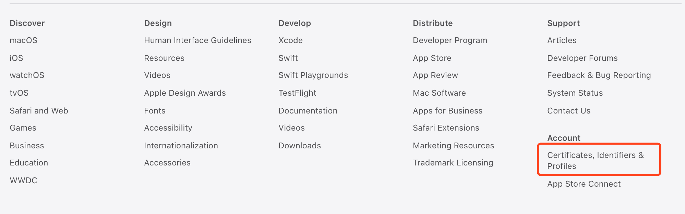
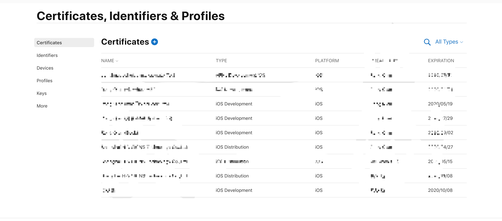
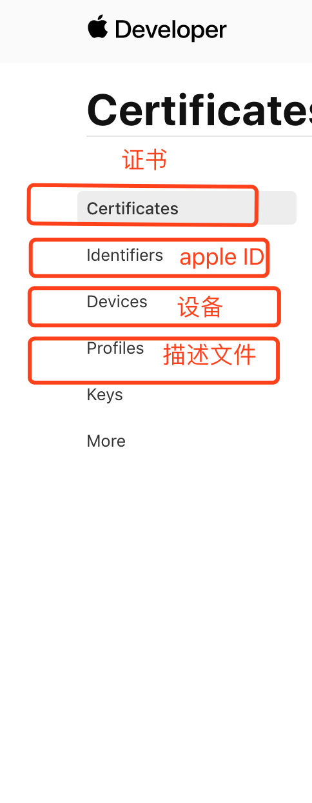
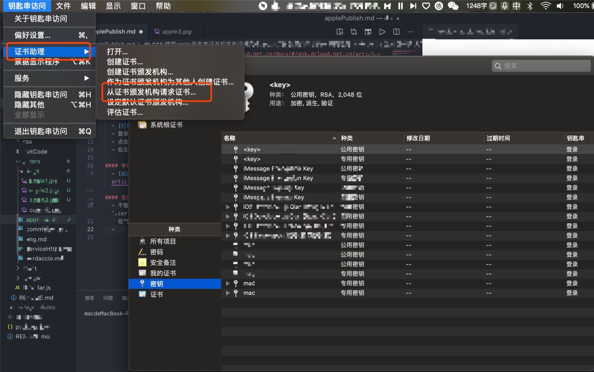
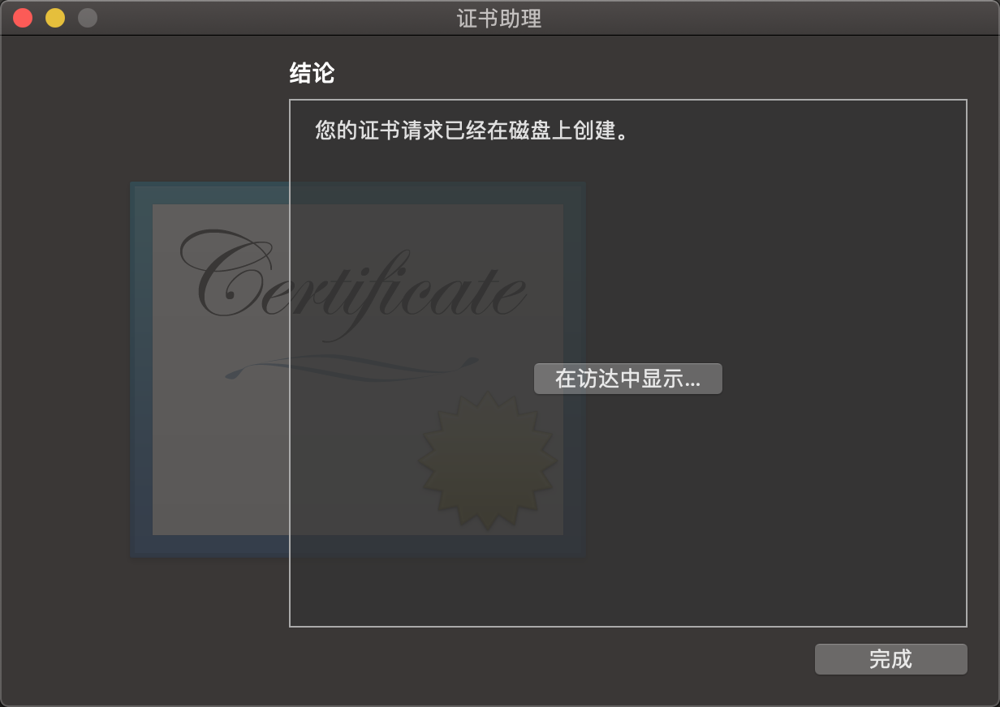
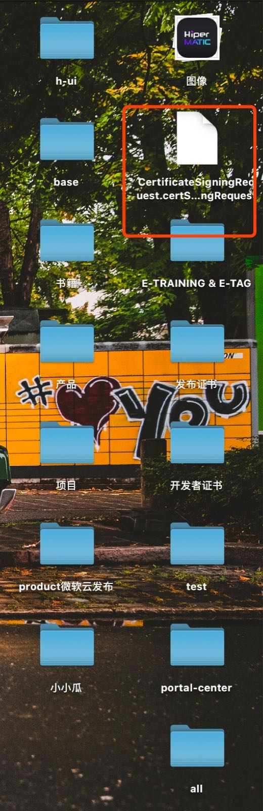

### 使用apple开发者证书和发布证书完成app从打包到提交审核的一系列流程

#### 本文参考[Dcloud官方文档](https://ask.dcloud.net.cn/docs/#/ask.dcloud.net.cn/article/152),由于DCloud的官方文档有些步骤写的比较模糊并且步骤的截图(apple官网网站)也是很早之前的。为了节省大家的打包提交审核时间,我打算在官方文档的基础上,进一步优化一下。

#### 前置准备
  - apple开发者账号, 并且加入了“iOS Developer Program”(注意角色需要是)
  - mac电脑(用于生成p12文件)
  
#### 登录ios Dev Center
  - [打开IOSDevCenter](https://developer.apple.com)
  - 登录成功后,滑到底部可以看到 
  - 点击红色部分后我们可以看到 
  - 在左侧我们可以看到我们创建的证书,appleId,设备,描述文件等等 
  
#### 申请Apple ID
  - [此步骤可以参考DCloud申请Apple ID](https://ask.dcloud.net.cn/docs/#/ask.dcloud.net.cn/article/152)

#### 生成证书请求文件
  - 不管是申请开发(Development)证书还是发布(Distribution)证书，都需要使用证书请求(.certSigningRequest)文件，证书请求文件需在Mac OS上使用“Keychain Access”工具生成。
  - 在“Spltlight Search”中搜索“Keychain”并打开“Keychain Access”工具
  - 打开菜单“Keychain Access”->“Certificate Assistant”，选择“Request a Certificate From a Certificate Authority...” 
  - 打开创建请求证书页面，在页面中输入用户邮件地址(User Email Address)、证书名称(Common Name)，请求类型（Request is）选择保存到磁盘(Saved to disk). 我一般保存在桌面, 因为找起来方便。  
  - 我们可以在桌面上看到证书请求文件 