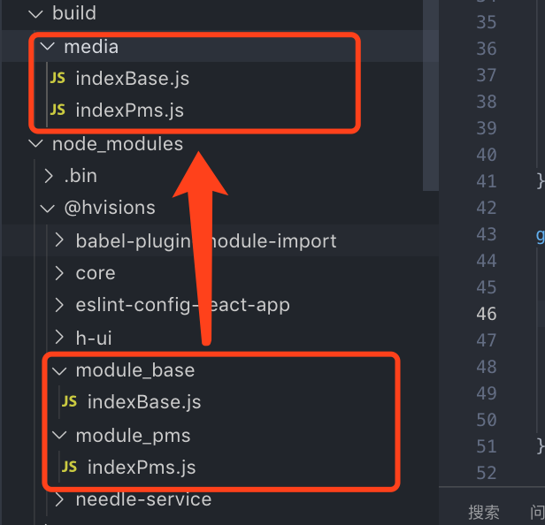

### glob 与 fs-extra 的结合

#### 需求描述

    我们需要将node_modules/@hvisions里面的所有module_开头的都复制到build/media中。



#### 实现代码

```
const fs = require('fs-extra');
const glob = require('glob');

glob('node_modules/@hvisions/module_*', function name(err, files) {
    if(!err) {
      files.forEach(item => {
        fs.copySync(item, 'build/media', {
          dereference: true
        });
      });
    }
});

```

#### 拓展

- glob 介绍: glob 是基于 minimatch 库来编写规则从而配置对应的文件
- glob 安装: `npm install glob`
- glob 使用:
  ```
  const glob = require('glob');
  glob('**/*.js', options, function(err, files){
     // 在此编写逻辑
  });
  ```
- 例子
  1 - \*匹配该路径段中 0 个或多个任意字符

  ```
  // 获取js目录下所有以.js结尾的文件

  glob("js/*.js",function (er, files) {
    console.log(files)
  })

  ```

  2 - ?匹配该路径下中 1 个任意字符

  ```
  // 获取js下的只有一个字符的js文件(a.js, b.js...)

  glob("js/?.js",function (er, files) {
      console.log(files)
  })

  ```

  3 - [...]匹配改路径段下的字符

  ```
  // 获取js下第二个字符在0-3之间的数字字符(a1.js, a2.js), 注意a0.js 和 a3.js不能被匹配到

  glob("js/a[0-3].js",function (er, files) {
    console.log(files)
  })

  ```

  4 - \*(pattern|pattern|pattern) : 匹配括号中多个模型的 0 个或多个或任意个的组合

  ```
  // 除了可以匹配a.js a1.js b.js以为还可以组合匹配 比如 ab.js。注意 a4.js 不可以被匹配

    glob("js/\*(a|a1|b).js",function (er, files) {
    console.log(files)
    })
  ```

  5 - !(pattern|pattern|pattern) : 匹配不包含任何模型

  ```
  // 排除带有a或者b字符的js文件

  glob("js/!(a|b).js",function (er, files) {
      console.log(files)
  })

  ```

  6 - ?(pattern|pattern|pattern) : 匹配多个模型中的 0 个或任意 1 个

  ```
  // 必须完全匹配,区别4

  glob("js/?(a|a2|b).js",function (er, files) {
      console.log(files)
  })

  ```

  7 - +(pattern|pattern|pattern) : 匹配多个模型中的 1 个或多个.

  ```

  // 至少有一个并且为空不匹配区别于4
  glob("js/+(a|a1|b).js",function (er, files) {
    console.log(files)
  })

  ```

  8 - @(pattern|pat\*|pat?erN) : 匹配多个模型中的任意 1 个

  ```
  // 精确匹配，不匹配组合模型,不匹配为空的情况
  glob("js/@(a|a1|b).js",function (er, files) {
  console.log(files)
  })

  ```

  9 - ** : 和 1 一样,可以匹配任何内容,但**不仅匹配路径中的某一段,而且可以匹配 'a/b/c' 这样带有'/'的内容,所以,它还可以匹配子文件夹下的文件.

  ```

  glob("**/@(a|a1|b).js",function (er, files) {
      console.log(files)
  }

  ```
