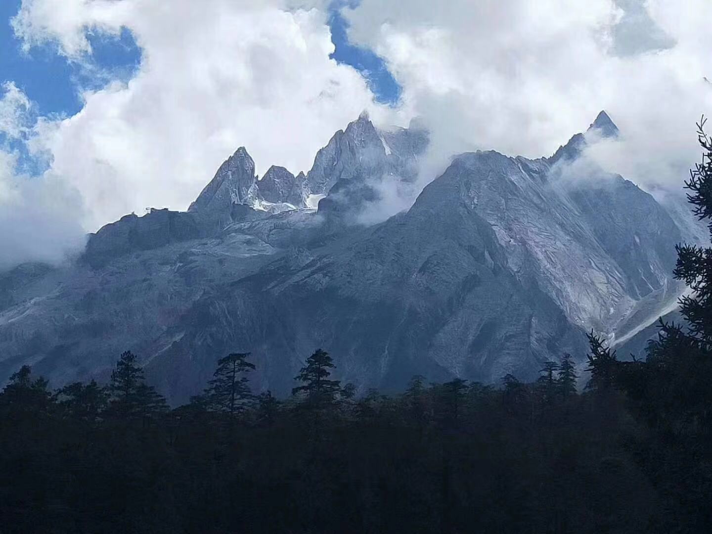

 
 ## 我的2019年度总结 | 掘金年度征文

 ##### 每一段你经历过的快乐亦或是难过的时光,在若干年后都是一杯值得你细细品味的咖啡。就好比电影《红猪》里面的插曲《一去不复返的时光》一样,在人生中每个不同阶段来听这首插曲都会有不同的感觉。本文是对自己2019年的生活做一个整体的回顾以及在2020年需要提升自己的地方做一次记录。

 
 ### 2019-06 
 #### 2019年6月学校举行了毕业典礼🎓,这也意味着我即将踏出校门开始我新的生活。在踏上去上海的列车前, 我们去了美丽的七彩云南。我记得在中学时期, 对《彩云之南》这首歌特别有感觉。因此从那会儿开始, 就特别希望能够去云南感受一下秀色的丽江, 闪耀着银光的玉龙雪山, 泸沽湖旁湛蓝的天空......。
  
 #### 这是我当时在大理学的扎染, 除了边上一些圈圈点点以外, 我感觉还扎的还行哈哈。

 #### 2019年6月12号我踏上了去上海的列车。很荣幸能够收到慧程offer, 并且能够让我在研发部担任前端开发这个岗位。我任职期间参与了慧程前端架构整个设计与开发, 让我对前端开发这个职位有了更进一步的了解,也让我明白自己还欠缺哪方面的知识。