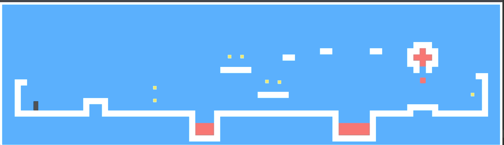
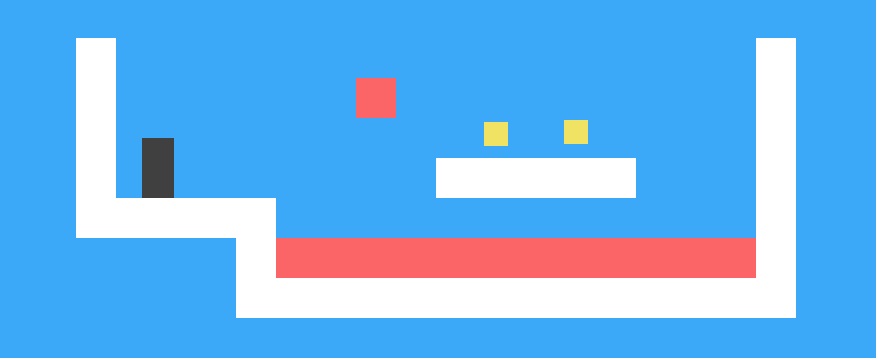

## 写在前面

   本文将会手把手带着大家完成一款超级玛丽游戏。

## 介绍   

  游戏界面大致如下: 

  

  黑色的小方块代表的是玩家, 他的任务时收集关卡内所有的金币同时需要避开岩浆。当最后一个金币被收集到了之后, 这一关就通过了。

  如何操作? 

  玩家通过键盘上下左右键进行移动。好, 那么接下来我们就开始我们的游戏之旅吧？

## 建模

  ### 定义关卡

  首先我们需要用一种方式来表示我们的地图, 并且该方式应该尽可能的简单易懂, 在本文我们使用一个大字符串来表示, 比如一个比较简单的地图可能是这样的: 

  ```js
  let simplePlan = 
  `......................
  ..#................#..
  ..#..............=.#..
  ..#.........o.o....#..
  ..#.@......#####...#..
  ..#####............#..
  ......#++++++++++++#..
  ......##############..
  ......................`
  ```

  

  其中句号(.)表示空气, 哈希标记(#)表示路和墙, 加号(+)表示熔岩, 字母o表示的是硬币, @表示的是玩家起始的位置。同时熔岩是可以移动的, | 代表上下移动的熔岩, = 表示水平移动的熔岩, v表示滴落的熔岩(只会向下移动不会来回反弹), 当玩家碰到熔岩就表示闯关失败,然后回到当前关卡的起始位置重新开始。


  ### 读取关卡

  我们需要定义一个类来存储和解析关卡.

  ```js
  class Level {
    constructor(plan) {
      let rows = plan.trim().split("\n").map(l => [...l]);
      this.height = rows.length;
      this.width = rows[0].length;
      this.startActors = [];

      this.rows = rows.map((row, y) => {
        return row.map((ch, x) => {
          let type = levelChars[ch];
          if (typeof type == "string") return type;
          this.startActors.push(
            type.create(new Vec(x, y), ch));
          return "empty";
        });
      });
    }
  }
  ```

  首先我们需要去除首尾的空格。由于我们的地图是二维模型的, 因此我们解析的时候可以一行一行解析, 当然也可一列一列解析。每遇到换行符, 我们就把当前这一行推入数组中, 最后生成一个字符串数组。通过读取该字符串数组, 我们可以知道关卡的高度和宽度。 

  我们还需要区分静态元素和动态元素。因为动态元素有附加的额外属性比如: 运动的速度、初始位置、当前位置等等信息。因此我们需要为每一个动态元素(定义为玛丽)都定义一个类, 并且该类需要有一个静态的方法去初始化元素添加到 ``` startActors ```中。

  同时我们需要将地图上的每个元素抽象到代码中: 

  ```js
  const levelChars = {
    ".": "empty",
    "#": "wall",
    "+": "lava",
    "@": Player,
    "o": Coin,
    "=": Lava,
    "|": Lava,
    "v": Lava
  }
  ```

  随着游戏的运行, 玛丽将会在不同的地方结果， 甚至消失(比如金币)。因此我们需要一个持久化的数据。

  ```js
  class State {
    constructor(level, actors, status) {
      this.level = level;
      this.actors = actors;
      this.status = status;
    }

    static start(level) {
      return new State(level, level.startActors, 'playing')
    }

    get player() {
      return this.actors.find(a => a.type === 'player');
    }
  }
  ```

  游戏结束后, status的值会切换成 win 或者 lost.

  ### 定义玛丽

  玛丽代表着关卡中可移动元素的当前位置和状态。所有的玛丽都将会有相同的接口。``` pos ```属性代表相对于左上角(0,0)的坐标点, ```size``` 表示的是它的大小(宽度和高度)。同时他们都有一个 ``` update ``` 方法用于计算给定当前时间步后的新状态和位置。比如玩家按了上下左右键后, 需要返回一个新的位置和状态。