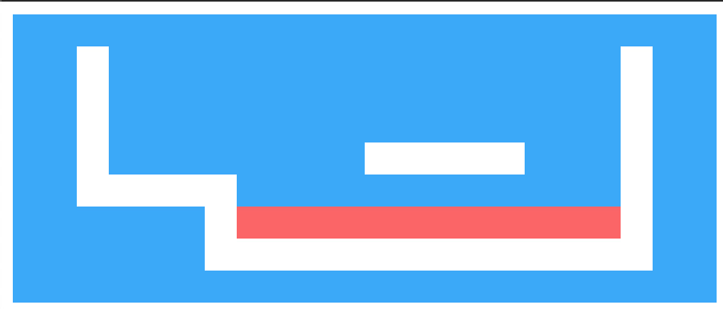
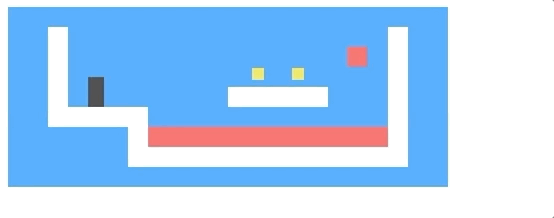

## 写在前面

  本文将会手把手带着大家完成一款低配超级玛丽游戏。[线上地址](http://139.196.82.33:8089/) 

## 介绍   

  游戏界面大致如下: 

  

  黑色的小方块代表的是玩家, 他的任务时收集关卡内所有的金币同时需要避开岩浆。当最后一个金币被收集到了之后, 这一关就通过了。

  如何操作? 

  玩家通过键盘上下左右键进行移动。好, 那么接下来我们就开始我们的游戏之旅吧？

## 建模

  ### 定义关卡

  首先我们需要用一种方式来表示我们的地图, 并且该方式应该尽可能的简单易懂, 在本文我们使用一个大字符串来表示, 比如一个比较简单的地图可能是这样的: 

  ```js
  let simplePlan = 
  `......................
  ..#................#..
  ..#..............=.#..
  ..#.........o.o....#..
  ..#.@......#####...#..
  ..#####............#..
  ......#++++++++++++#..
  ......##############..
  ......................`
  ```

  

  其中句号(.)表示空气, 哈希标记(#)表示路和墙, 加号(+)表示熔岩, 字母o表示的是硬币, @表示的是玩家起始的位置。同时熔岩是可以移动的, | 代表上下移动的熔岩, = 表示水平移动的熔岩, v表示滴落的熔岩(只会向下移动不会来回反弹), 当玩家碰到熔岩就表示闯关失败,然后回到当前关卡的起始位置重新开始。


  ### 读取关卡

  我们需要定义一个类来存储和解析关卡.

  ```js
  class Level {
    constructor(plan) {
      let rows = plan.trim().split("\n").map(l => [...l]);
      this.height = rows.length;
      this.width = rows[0].length;
      this.startActors = [];

      this.rows = rows.map((row, y) => {
        return row.map((ch, x) => {
          let type = levelChars[ch];
          if (typeof type == "string") return type;
          this.startActors.push(
            type.create(new Vec(x, y), ch));
          return "empty";
        });
      });
    }
  }
  ```

  首先我们需要去除首尾的空格。由于我们的地图是二维模型的, 因此我们解析的时候可以一行一行解析, 当然也可一列一列解析。每遇到换行符, 我们就把当前这一行推入数组中, 最后生成一个字符串数组。通过读取该字符串数组, 我们可以知道关卡的高度和宽度。 

  我们还需要区分静态元素和动态元素。因为动态元素有附加的额外属性比如: 运动的速度、初始位置、当前位置等等信息。因此我们需要为每一个动态元素(定义为玛丽)都定义一个类, 并且该类需要有一个静态的方法去初始化元素添加到 ``` startActors ```中。

  同时我们需要将地图上的每个元素抽象到代码中: 

  ```js
  const levelChars = {
    ".": "empty",
    "#": "wall",
    "+": "lava",
    "@": Player,
    "o": Coin,
    "=": Lava,
    "|": Lava,
    "v": Lava
  }
  ```

  随着游戏的运行, 玛丽将会在不同的地方结果， 甚至消失(比如金币)。因此我们需要一个持久化的数据。

  ```js
  class State {
    constructor(level, actors, status) {
      this.level = level;
      this.actors = actors;
      this.status = status;
    }

    static start(level) {
      return new State(level, level.startActors, 'playing')
    }

    get player() {
      return this.actors.find(a => a.type === 'player');
    }
  }
  ```

  游戏结束后, status的值会切换成 win 或者 lost.

  ### 定义玛丽

  玛丽代表着关卡中可移动元素的当前位置和状态。所有的玛丽都将会有相同的接口。``` pos ```属性代表相对于左上角(0,0)的坐标点, ```size``` 表示的是它的大小(宽度和高度)。同时他们都有一个 ``` update ``` 方法用于计算给定当前时间步后的新状态和位置。比如玩家按了上下左右键后, 需要返回一个新的位置和状态。

  ```js
  class Vec {
    constructor(x, y) {
      this.x = x; this.y = y;
    }

    plus(other) {
      return new Vec(this.x + other.x, this.y + other.y);
    }

    times(factor) {
      return new Vec(this.x * factor, this.y * factor);
    }
  }
  ```

  不同的玛丽都将会不同的表现形态, 因此除了坐标之外, 还需要有其他的方法来表明各自不同的行为。

  此外, 我们还需要有一个 ``` type ```属性, 它用来标识玛丽是 ```coin ```、 ``` player ``` 或者 ``` lava ```。它们各自的大小是通过type属性来设置的。

  - Player玩家

    ```js
    class Player {
      constructor(pos, speed) {
        this.pos = pos;
        this.speed = speed;
      }

      get type() {
        return 'player';
      }

      static create(pos) {
          return new Player(pos.plus(new Vec(0, -0.5)), new Vec(0, 0))
      }
    }

    Player.prototype.size = new Vec(0.8, 1.5);
    ```

    我们的游戏中一个正方形是1*1, 而我们设置的玩家高度是1个半高度的正方形, 因此起始位置的y坐标要减去0.5。


  - Lava熔岩

    ```js
    class Lava {
      constructor(pos, speed, reset) {
          this.pos = pos;
          this.speed = speed;
          this.reset = reset;
      }

      get type() {
        return "lava"
      }

      static create(pos, ch) {
        if(ch === '=') {
          return new Lava(pos, new Vec(2, 0));
        } else if(ch === '|') {
          return new Lava(pos, new Vec(0, 2));
        } else if (ch === 'v') {
          return new Lava(pos, new Vec(0, 3, pos));
        }
      }
    }
    Lava.prototype.size = new Vec(1, 1);
    ```

  - Coin 金币

    ```js
    class Coin {
      constructor(pos, basePos, wobble) {
          this.pos = pos;
          this.basePos = basePos;
          this.wobble = wobble;
      }

      get type() {
        return 'coin'
      }

      static create(pos) {
        let basePos = pos.plus(new Vec(0.2, 0.1));
        return new Coin(basePos, basePos, Math.random() * Math.PI * 2);
      }
    }

    Coin.prototype.size = new Vec(0.6, 0.6)
    ```

  ### 绘制地图

  现在我们可以开始绘制地图, 让关卡内的元素能够静态的显示出来。
  我们定义地图中元素的比例为1:20。因此我们设置``` scale ```为 20.我们需要将静止的元素和动态元素分开存放, 因为静止的元素只会被执行一次, 而动态的元素会会一直改变, 因此我们定义个 ``` actorLayer ```来存放玛丽。

  ```js
  function elt(name, attrs, ...children) {
    let dom = document.createElement(name);
    for (let attr of Object.keys(attrs)) {
      dom.setAttribute(attr, attrs[attr]);
    }
    for (let child of children) {
      dom.appendChild(child);
    }
    return dom;
  }
  ```  

  ```js
  class DOMDisplay {
    constructor(parent, level) {
      this.dom = elt("div", {class: "game"}, drawGrid(level));
      this.actorLayer = null;
      parent.appendChild(this.dom);
    }

    clear() { this.dom.remove(); }
  }
  ```

  ```js
  const scale = 20;

  function drawGrid(level) {
    return elt("table", {
      class: "background",
      style: `width: ${level.width * scale}px`
    }, ...level.rows.map(row =>
      elt("tr", {style: `height: ${scale}px`},
          ...row.map(type => elt("td", {class: type})))
    ));
  }
  ```

 现在我们只需要给样式表添加每种静态元素的样式即可。

 ```css
  .background    { background: rgb(52, 166, 251);
                 table-layout: fixed;
                 border-spacing: 0;              }
  .background td { padding: 0;                     }
  .lava          { background: rgb(255, 100, 100); }
  .wall          { background: white;              }
 ```

  看我们的地图已经出来了， 接下来我们要开始绘制玛丽啦。

 
 

 ### 绘制玛丽

  ```js
  function drawActors(actors) {
    return elt("div", {}, ...actors.map(actor => {
      let rect = elt("div", {class: `actor ${actor.type}`});
      rect.style.width = `${actor.size.x * scale}px`;
      rect.style.height = `${actor.size.y * scale}px`;
      rect.style.left = `${actor.pos.x * scale}px`;
      rect.style.top = `${actor.pos.y * scale}px`;
      return rect;
    }));
  }
  ```

  我们通过绝对定位让这些玛丽都脱离```束缚```, 并且不同玛丽设置不同的样式。

  ```css
  .actor  { position: absolute;            }
  .coin   { background: rgb(241, 229, 89); }
  .player { background: rgb(64, 64, 64);  }
  .lost .player {
     background: rgb(160, 64, 64);
  }
  .won .player {
    box-shadow: -4px -7px 8px white, 4px -7px 8px white;
  }
  ```

  因为玛丽是会动的, 因此我们每次绘制新的状态的时候需要将旧的状态给删除掉。

  ```js
  DOMDisplay.prototype.syncState = function(state) {
    if (this.actorLayer) this.actorLayer.remove();
    this.actorLayer = drawActors(state.actors);
    this.dom.appendChild(this.actorLayer);
    this.dom.className = `game ${state.status}`;
  };
  ```

  ok, 此时我们地图上所有的元素都已经绘制完毕。我们运行一下demo:

  ```js
  let simpleLevelPlan = `
  ......................
  ..#................#..
  ..#..............=.#..
  ..#.........o.o....#..
  ..#.@......#####...#..
  ..#####............#..
  ......#++++++++++++#..
  ......##############..
  ......................`;

  let simpleLevel = new Level(simpleLevelPlan);
  let display = new DOMDisplay(document.body, simpleLevel);
  display.syncState(State.start(simpleLevel));
  ```

 

  ### 运动与碰撞

  当我们绘制完静态的元素后, 我们需要让他们可以跑起来, 并且需要有交互。由于我们当前的关卡不可能总是会铺满当前屏幕视图, 因此随着player的移动当前地图的视图也需要随之改变。当player太靠近视图边缘的时候,
  这时候我们需要设置改元素的 ``` scrollLeft ``` 和 ``` scrollTop ``` 属性。 可能有的同学想偷懒, 直接以当前玩家为中心点就好了么？ 但是这样会有一个问题，只要player动了, 视图就会发生移动, 视觉上容易造成晕眩效果, 因此我们定义边距即可, 距离边界相应距离, 则视图随之移动。
  
  ```js
    DOMDisplay.prototype.scrollPlayerIntoView = function(state) {
      let width = this.dom.clientWidth;
      let height = this.dom.clientHeight;
      let margin = width / 3;

      // The viewport
      let left = this.dom.scrollLeft, right = left + width;
      let top = this.dom.scrollTop, bottom = top + height;

      let player = state.player;
      let center = player.pos.plus(player.size.times(0.5))
                            .times(scale);

      if (center.x < left + margin) {
        this.dom.scrollLeft = center.x - margin;
      } else if (center.x > right - margin) {
        this.dom.scrollLeft = center.x + margin - width;
      }
      if (center.y < top + margin) {
        this.dom.scrollTop = center.y - margin;
      } else if (center.y > bottom - margin) {
        this.dom.scrollTop = center.y + margin - height;
      }
    };
  ```

  这里面最麻烦的就是处理玛丽之间的相互作用了。
  比如: 玩家遇到了墙壁, 他不能穿过去, 必须停止运动。金币被吃了后, 需要消失。如果碰到了熔岩, 则宣布游戏失败, 重新开始。不过网上也有类似的物理引擎可以帮我们解决在二维或者三维空间中碰撞问题。

  我们可以做一个简单的碰撞检测机制: 当我们移动玩家或者熔岩移动的时候, 如果下一步会穿墙, 那么我们就取消它的动作。

  ```js
  Level.prototype.touches = function(pos, size, type) {
    var xStart = Math.floor(pos.x);
    var xEnd = Math.ceil(pos.x + size.x);
    var yStart = Math.floor(pos.y);
    var yEnd = Math.ceil(pos.y + size.y);

    for (var y = yStart; y < yEnd; y++) {
      for (var x = xStart; x < xEnd; x++) {
        let isOutside = x < 0 || x >= this.width ||
                        y < 0 || y >= this.height;
        let here = isOutside ? "wall" : this.rows[y][x];
        if (here == type) return true;
      }
    }
    return false;
  };
  ```

  通过在State中添加update方法用来检测玩家是否碰到了熔岩。

  ```js
  State.prototype.update = function(time, keys) {
    let actors = this.actors
      .map(actor => actor.update(time, this, keys));
    let newState = new State(this.level, actors, this.status);

    if (newState.status != "playing") return newState;

    let player = newState.player;
    if (this.level.touches(player.pos, player.size, "lava")) {
      return new State(this.level, actors, "lost");
    }

    for (let actor of actors) {
      if (actor != player && overlap(actor, player)) {
        newState = actor.collide(newState);
      }
    }
    return newState;
  };
  ```

  如果熔岩检测到被触碰到了或者金币被吃完了, 那么我们需要返回结果的失败和胜利。

  ```js
  Lava.prototype.collide = function(state) {
    return new State(state.level, state.actors, "lost");
  };

  Coin.prototype.collide = function(state) {
    let filtered = state.actors.filter(a => a != this);
    let status = state.status;
    if (!filtered.some(a => a.type == "coin")) status = "won";
    return new State(state.level, filtered, status);
  };
  ```

  ### 玛丽的更新

  有了碰撞检测后, 我们就可以绘制每种玛丽的更新操作了。比如：金币会上下跳动, 熔岩会左右上下流动。玩家可以自由地移动。

  - 金币的更新

    ```js
    const wobbleSpeed = 8, wobbleDist = 0.07;

    Coin.prototype.update = function(time) {
      let wobble = this.wobble + time * wobbleSpeed;
      let wobblePos = Math.sin(wobble) * wobbleDist;
      return new Coin(this.basePos.plus(new Vec(0, wobblePos)),
                      this.basePos, wobble);
    };
    ```

  - 熔岩的更新

    update方法中熔岩的位置由时间步长和速度决定。如果下一个位置没有障碍物(墙壁)那么熔岩就移动到新的位置。如果下一个位置有障碍物。那么它的下个状态就去取决于熔岩的类型。比如滴落的熔岩遇到障碍物就重新开始, 上下移动的熔岩就把速度乘以-1朝着反方向移动。

    ```js
    Lava.prototype.update = function(time, state) {
      let newPos = this.pos.plus(this.speed.times(time));
      if (!state.level.touches(newPos, this.size, "wall")) {
        return new Lava(newPos, this.speed, this.reset);
      } else if (this.reset) {
        return new Lava(this.reset, this.speed, this.reset);
      } else {
        return new Lava(this.pos, this.speed.times(-1));
      }
    };
    ```  

  - 玩家的更新

    ```js
    const playerXSpeed = 7; // 速度
    const gravity = 30; // 重力系数
    const jumpSpeed = 17; // 跳的高度

    Player.prototype.update = function(time, state, keys) {
      let xSpeed = 0;
      if (keys.ArrowLeft) xSpeed -= playerXSpeed;
      if (keys.ArrowRight) xSpeed += playerXSpeed;
      let pos = this.pos;
      let movedX = pos.plus(new Vec(xSpeed * time, 0));
      if (!state.level.touches(movedX, this.size, "wall")) {
        pos = movedX;
      }

      let ySpeed = this.speed.y + time * gravity;
      let movedY = pos.plus(new Vec(0, ySpeed * time));
      if (!state.level.touches(movedY, this.size, "wall")) {
        pos = movedY;
      } else if (keys.ArrowUp && ySpeed > 0) {
        ySpeed = -jumpSpeed;
      } else {
        ySpeed = 0;
      }
      return new Player(pos, new Vec(xSpeed, ySpeed));
    };
    ```
  
  ## 跟踪按键

  当我们绘制完地图上所有的玛丽后, 我们需要有事件来触发他们。因此我们需要监听键盘上的方向键, 从而控制玩家的移动。

  ```js
  function trackKeys(keys) {
    let down = Object.create(null);
    function track(event) {
      if (keys.includes(event.key)) {
        down[event.key] = event.type == "keydown";
        event.preventDefault();
      }
    }
    window.addEventListener("keydown", track);
    window.addEventListener("keyup", track);
    return down;
  }

  const arrowKeys =
    trackKeys(["ArrowLeft", "ArrowRight", "ArrowUp"]);
  ```
  
  ### 让游戏跑起来吧

  定义游戏入口执行函数

  我们假设游戏有很多关。因此定义plans为关卡数组。如果当前关通过了, 那么就进入下一关。

  ```js
  async function runGame(plans, Display) {
    for (let level = 0; level < plans.length;) {
      let status = await runLevel(new Level(plans[level]),
                                  Display);
      if (status == "won") level++;
    }
    console.log("You've won!");
  }
  ```

  ```js
  function runLevel(level, Display) {
    let display = new Display(document.body, level);
    let state = State.start(level);
    let ending = 1;
    return new Promise(resolve => {
      runAnimation(time => {
        state = state.update(time, arrowKeys);
        display.syncState(state);
        if (state.status == "playing") {
          return true;
        } else if (ending > 0) {
          ending -= time;
          return true;
        } else {
          display.clear();
          resolve(state.status);
          return false;
        }
      });
    });
  }

  function runAnimation(frameFunc) {
    let lastTime = null;
    function frame(time) {
      if (lastTime != null) {
        let timeStep = Math.min(time - lastTime, 100) / 1000;
        if (frameFunc(timeStep) === false) return;
      }
      lastTime = time;
      requestAnimationFrame(frame);
    }
    requestAnimationFrame(frame);
  }

  ```

  ok！至此我们的游戏已经结束了！来跑一遍看看

 
