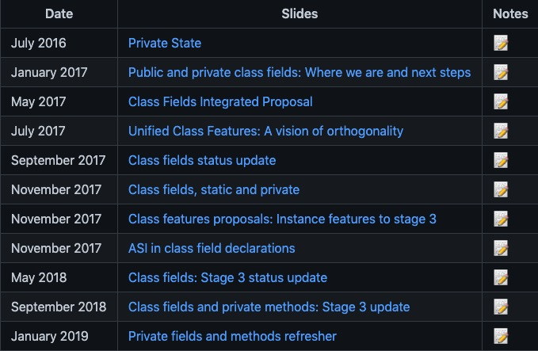
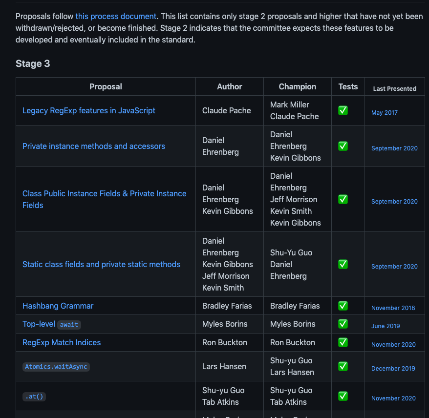
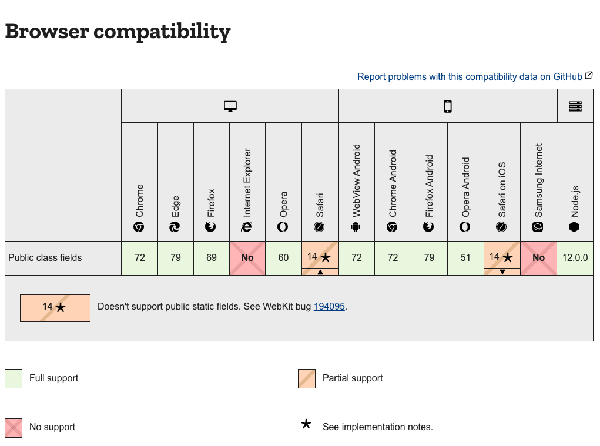
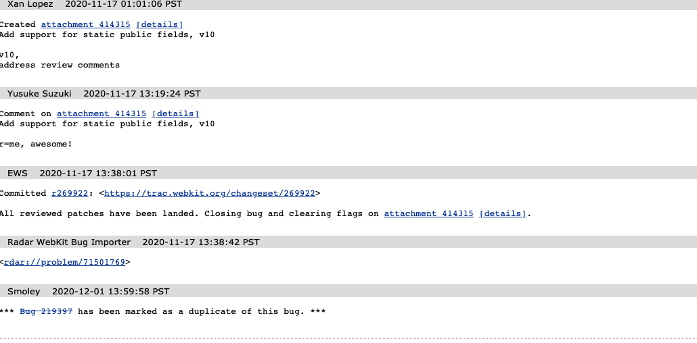
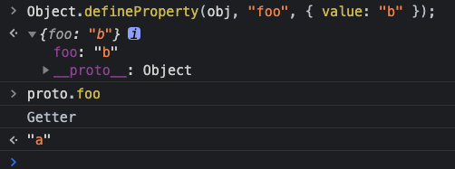
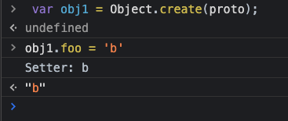
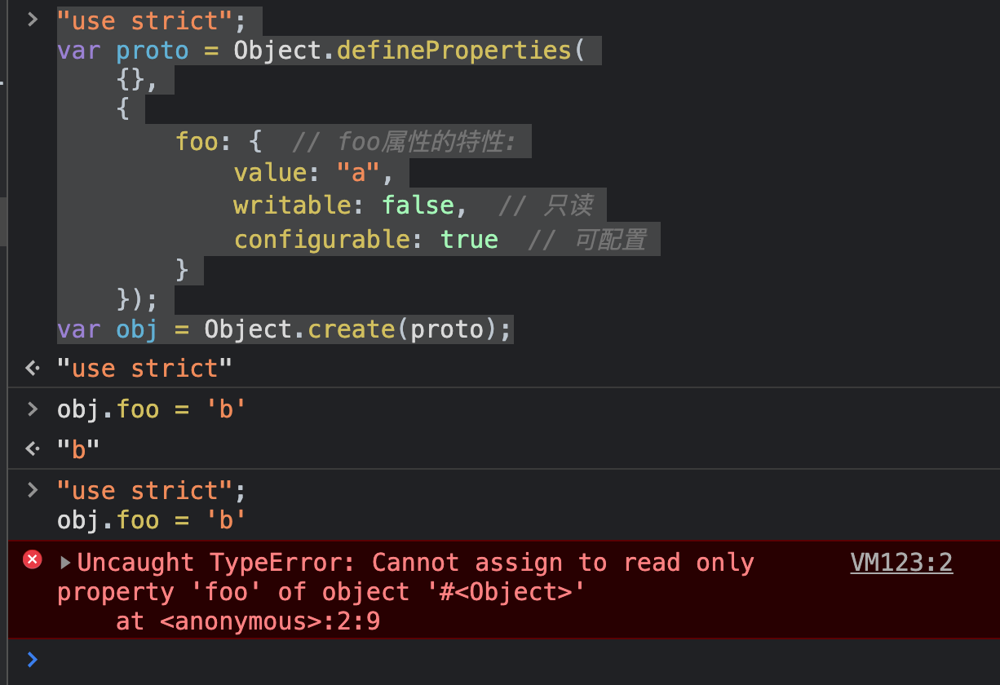
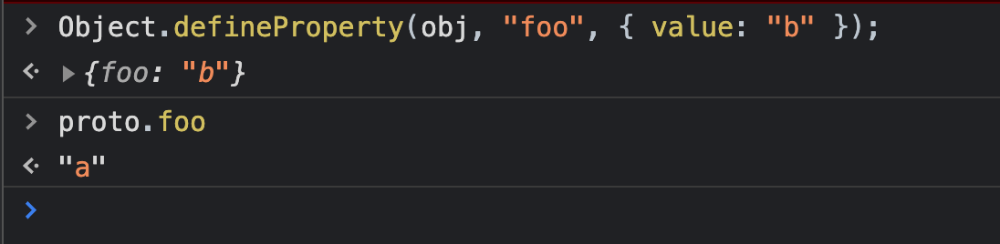

## 前言

   相信很多同学在刚刚开始编写React的代码的时候, 都会在构造器中使用 ``` bind ``` 方法去绑定函数。可能刚刚开始大多人会以为这是在React中特有的操作, 其实不然, 这其实是跟JS函数的执行原理有关。随着时间的推移, 我们以前的写法已经不需要手动把函数去 ```bind``` this了, 这是为什么呢？

   ```js
   class Toggle extends React.Component {
    constructor(props) {
      super(props);
      this.state = {isToggleOn: true};
      // 为了在回调中使用 `this`，这个绑定是必不可少的
      this.handleClick = this.handleClick.bind(this);
    }

    handleClick() {
      this.setState(state => ({
        isToggleOn: !state.isToggleOn
      }));
    }

    render() {
      return (
        <button onClick={this.handleClick}>
          {this.state.isToggleOn ? 'ON' : 'OFF'}
        </button>
      );
    }
  }
   ```
  
  这是因为babel已经内置 ``` @babel/plugin-proposal-class-properties ``` 来帮助我们自动绑定this, 也就是说我们无需编写 ``` this.handleClick = this.handleClick.bind(this) ``` 这行代码了。此插件的作用就是让我们的项目支持 ``` public class fields ```语法。


  ## public class fields

  在TC39的[官方仓库](https://github.com/tc39/proposal-class-fields)中我们可以看到在3年前就建立关于 ```  public class fields ``` 的提案了。
  
  
  
  截止到目前为止该提案处于 ``` stage-3 ```阶段, 它表明提案的代码都已经实现, 但是需要等待实验验证、用户反馈以及验收测试通过。
  
  可能有的同学不清楚ECMA标准提案的几个阶段,  ECMA标准提案可以分为5个阶段:

  - stage-0：还是一个设想，只能由TC39成员或TC39贡献者提出。
  - stage-1:：提案阶段，比较正式的提议，只能由TC39成员发起，这个提案要解决的问题必须有正式的书面描述。
  - stage-2：草案，有了初始规范，必须对功能语法和语义进行正式描述，包括一些实验性的实现。
  - stage-3：候选，该提议基本已经实现，需要等待实验验证，用户反馈及验收测试通过。
  - stage-4：已完成，必须通过 Test262 验收测试，下一步就纳入ECMA标准。

  同时我们也可以通过在 [此仓库](https://github.com/tc39/proposals) 查看目前在各个阶段的提案情况。

  

  虽然 ``` public class fields ``` 还没有被纳入ECMA标准, 但是浏览器对它的兼容性已经做得很棒了。

  

  我们可以看到除了IE浏览器和三星浏览器表示明确不支持它以外, 其余的浏览器都支持了。细心的同学可能发现了它似乎在苹果浏览器中不支持 ``` public static fields ``` 语法。时至今日, 我们发现这个在webkit内核中的[bug](https://bugs.webkit.org/show_bug.cgi?id=194095)已经不存在了, 在 ``` 2020-11-17 01:01:06 PST ``` 的时候, ``` Xan Lopez  ``` 已经完成对其的修复工作。

  

   聊完浏览器的兼容性之后, 我们来看一下 ``` public class fields ``` 的实现过程。
   
   请看以下代码转换: 

   转化前: 

   ```js
    class Bork {
      static a = 'foo';
      static b;

      x = 'bar';
      y;
    }
   ```

   -> 

   转换后: 

   ```js
  var Bork = function Bork() {
    babelHelpers.classCallCheck(this, Bork);
    Object.defineProperty(this, "x", {
      configurable: true,
      enumerable: true,
      writable: true,
      value: 'bar'
    });
    Object.defineProperty(this, "y", {
      configurable: true,
      enumerable: true,
      writable: true,
      value: void 0
    });
  };

  Object.defineProperty(Bork, "a", {
    configurable: true,
    enumerable: true,
    writable: true,
    value: 'foo'
  });
  Object.defineProperty(Bork, "b", {
    configurable: true,
    enumerable: true,
    writable: true,
    value: void 0
  });
   ```
    
  对于public的属性 我们使用了 ``` Object.defineProperty ``` 将它自己挂载在this上, 而对于静态的属性,则通过挂载在当前方法的属性上。

  当然上述的原始代码也可以转化成赋值型(上面那种我们称之为定义型)。

  ```js
  var Bork = function Bork() {
    babelHelpers.classCallCheck(this, Bork);
    this.x = 'bar';
    this.y = void 0;
  };

  Bork.a = 'foo';
  Bork.b = void 0;
  ```

  可能有的同学会有疑问了, 浏览器到底是使用定义型还是赋值型的呀? 可能上面的例子不够简单, 我们来看简单的: 

  ```js
  var obj = {
      foo: 123
  };
  ```

  上面的代码按照我们之前的讨论, 可能会被转成以下两种代码:

  赋值型

  ```js
  var obj = new Object();
  obj.foo = 123;
  ```

  定义型

  ```js
  var obj = new Object();
  Object.defineProperties(obj, {
      foo: {
          value: 123,
          enumerable: true,
          configurable: true,
          writable: true
      }
  });
  ```
  
  事实上, 浏览器引擎会执行第二种操作, 因为定义型的操作能够更好地表达出对象字面量的语义。那么赋值型操作和定义型操作除了语义化上面有差异外, 还有什么不一样的地方呢？

  ## 定义型和赋值型的主要差别

  -  赋值可能会调用原型上的setter,定义会创建一个自身属性

      给定一个空对象obj, 它的原型proto有一个foo的访问器属性。

      ```js
      var proto = {
          get foo() {
              console.log("Getter");
              return "a";
          },
          set foo(x) {
              console.log("Setter: "+x);
          },
      };
      var obj = Object.create(proto);
      ```

      如果我们使用了定义型操作的话, 则会在obj上添加一个自身的属性foo

      

      但是如果是赋值型操作的话, 则意味着我们想要改变某个已经存在的值。所以赋值操作会转交给原型proto的foo属性的setter访问器来处理。

      

  - 原型链中的同名只读属性可能会阻止赋值操作,但不会阻止定义操作

    如果原型链中存在一个同名的只读属性,则无法通过赋值的方式在原对象上添加这个自身属性,必须使用定义操作才可以.这项限制是在ECMAScript 5.1中引入的:

    ```js
    "use strict";
    var proto = Object.defineProperties(
        {},
        {
            foo: {  // foo属性的特性:
                value: "a",
                writable: false,  // 只读
                configurable: true  // 可配置
            }
        });
    var obj = Object.create(proto);
    ```

    赋值操作会导致异常：

    

    这貌似是个很奇怪的表现,原型上的属性居然可以影响到能否创建一个同名的自身属性。但是这样的表现是有道理的,因为另外一种形式的只读属性(只有getter的访问器属性)也是这样的表现,这样才能统一。

    通过定义的方式, 我们可以成功创建一个新的自身属性:

    

    至于其他的差别大家可以查看[这篇文章](https://2ality.com/2012/08/property-definition-assignment.html)


  ## 总结

  通过对 ``` public class fields ``` 的探寻, 我们可以总结出以下两点:
  1. 如果我们想创建一个新的属性, 那么就用定义型操作
  2. 如果我们想改变一个属性的值, 就用赋值型操作


  ## 参考文献

  - 1. [https://2ality.com/2012/08/property-definition-assignment.html](https://2ality.com/2012/08/property-definition-assignment.html)
  - 2. [https://github.com/tc39/proposal-class-fields](https://github.com/tc39/proposal-class-fields)
  - 3. [https://reactjs.org/docs/handling-events.html](https://reactjs.org/docs/handling-events.html)
  - 4. [https://github.com/tc39/proposals](https://github.com/tc39/proposals)
  - 5. [https://babeljs.io/docs/en/babel-plugin-proposal-class-properties](https://babeljs.io/docs/en/babel-plugin-proposal-class-properties)