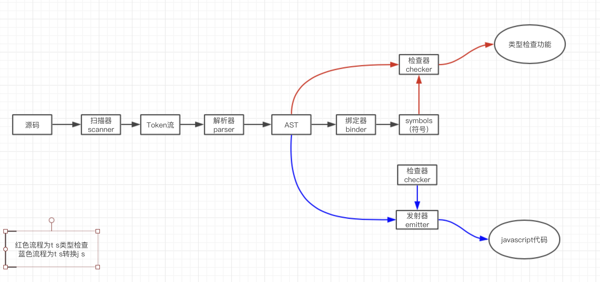
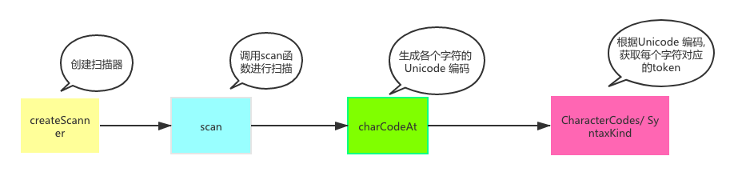

## 前言

   本文是对《深入理解Typescript》中编译原理章节做了总结, 分享给大家, 如有错误, 欢迎指正！

## 编译器

  Typescript编译器主要分为以下五个关键部分:

  - Scanner 扫描器 (scanner.ts)
  - Parser 解析器 (parser.ts) 
  - Binder 绑定器 (binder.ts)
  - Checker 检查器 (checker.ts)
  - Emitter 发射器 (emitter.ts)

  每个部分的编译器代码在src/compiler都可以找到, 本文会对每个解析器进行一一讲解。在开始之前,我从网上找了一张图 能够帮助我们了解编译器是如何将上述几个关键部分组合在一起的。

  

  从上图我们可以发现, 编译器主要分了三条线路: 

  - 源代码 -> 扫描器 -> token流 -> 解析器 -> AST ->绑定器 -> Symbol(符号)
  - AST -> 检查器 ~~ Symbol(符号) -> 类型检查
  - AST -> 检查器 ~~ 发射器 -> js代码

  我先介绍每个解析器的工作原理, 最后我将会对每一条线路做一次概括。

## 扫描器

  ts扫描器的源代码均位于scanner.ts中。通过先前的流程图, 我们发现扫描器的作用就是将源代码生成token流。
  我们接下来直接进入到scanner.ts中的``` createScanner ``` 创建扫描器的函数进行逐一解读。为了便于大家理解大致流程, 我将会对一些代码进行删减。

  ```js
export function createScanner(languageVersion: ScriptTarget,
    skipTrivia: boolean,
    languageVariant = LanguageVariant.Standard,
    text?: string,
    onError?: ErrorCallback,
    start?: number,
    length?: number): Scanner {
        let pos: number;
        let end: number;
        let startPos: number;
        let tokenPos: number;
        let token: SyntaxKind;
        let tokenValue: string;
        setText(text, start, length);
        // ...
        return {
            getStartPos: () => startPos,
            getTextPos: () => pos,
            getToken: () => token,
            getTokenPos: () => tokenPos,
            getTokenText: () => text.substring(tokenPos, pos),
            getTokenValue: () => tokenValue,
            // ...
            scan,
            // ...
        };

  ```

  我们通过``` createScanner ```创建扫描器之后, 需要对源代码进行扫描操作, 对应源码中的```scan```函数。我们继续找到scan函数的逻辑, 因为createScanner函数里面只是定义了一些函数, 并没有实质上的逻辑流程进展。

  ```js
 function scan(): SyntaxKind {
      startPos = pos;
      hasExtendedUnicodeEscape = false;
      precedingLineBreak = false;
      tokenIsUnterminated = false;
      numericLiteralFlags = 0;
      while (true) {
          tokenPos = pos;
          if (pos >= end) {
              return token = SyntaxKind.EndOfFileToken;
          }
          let ch = text.charCodeAt(pos);

          // Special handling for shebang
          if (ch === CharacterCodes.hash && pos === 0 && isShebangTrivia(text, pos)) {
              pos = scanShebangTrivia(text, pos);
              if (skipTrivia) {
                  continue;
              }
              else {
                  return token = SyntaxKind.ShebangTrivia;
              }
          }

          switch (ch) {
              case CharacterCodes.lineFeed:
              case CharacterCodes.carriageReturn:
                  precedingLineBreak = true;
                  if (skipTrivia) {
                      pos++;
                      continue;
                  }
                  else {
                      if (ch === CharacterCodes.carriageReturn && pos + 1 < end && text.charCodeAt(pos + 1) === CharacterCodes.lineFeed) {
                          // consume both CR and LF
                          pos += 2;
                      }
                      else {
                          pos++;
                      }
                      return token = SyntaxKind.NewLineTrivia;
                  }
              case CharacterCodes.tab:
                // ...

  ```

  scan函数返回了``` SyntaxKind ``` 类型的值, 我们且来看看这到底是啥?
  通过源代码中的注释``` token > SyntaxKind.Identifer => token is a keyword ```, 我发现它是生成```token```的必要条件。 
  除此之外, 它还定义了各种关键字比如: ``` return ```, ``` super ```, ``` switch ``` ...。我们先暂且认定它为词法关键词的枚举。

  ```js
    // token > SyntaxKind.Identifer => token is a keyword
    // Also, If you add a new SyntaxKind be sure to keep the `Markers` section at the bottom in sync
    export const enum SyntaxKind {
        Unknown,
        EndOfFileToken,
        SingleLineCommentTrivia,
        MultiLineCommentTrivia,
        NewLineTrivia,
        WhitespaceTrivia,
        // We detect and preserve #! on the first line
        ShebangTrivia,
        // We detect and provide better error recovery when we encounter a git merge marker.  This
        // allows us to edit files with git-conflict markers in them in a much more pleasant manner.
        ConflictMarkerTrivia,
        // Literals
        NumericLiteral,
        StringLiteral,
        JsxText,
        JsxTextAllWhiteSpaces,
        RegularExpressionLiteral,
        NoSubstitutionTemplateLiteral,
        // Pseudo-literals
        TemplateHead,
        TemplateMiddle,
        TemplateTail,
        // Punctuation
        OpenBraceToken,
        ReturnKeyword,
        SuperKeyword,
        SwitchKeyword,
        ThisKeyword,
        ThrowKeyword,
        TrueKeyword,
        TryKeyword,
        TypeOfKeyword,
        VarKeyword,
        VoidKeyword,
        WhileKeyword,
        WithKeyword,
        // ...
    }
  ```

  继续阅读scan函数内的逻辑。我们发现后半部分的逻辑主要都是根据   ``` let ch = text.charCodeAt(pos); ``` 这句话有关。通过生成 Unicode 编码, 从而得到扫描的结果。那么我们可以得出一个简单的结论： 扫描器通过对输入的源代码进行词法分析, 得到对应的```SyntaxKind ```即“token”。

  为了验证结论是否正确, 我们可以创建一个例子来简单测试一下: 

  在开始扫描之前, 我们需要初始化一些配置, 比如扫描的字符串、设置js语言的标准版本等等。然后我们通过``` createScanner ``` 函数创建一个扫描器,
  并且通过调用``` scan ``` 获取 ``` token ```。只要token不是结束的token那么扫描器会一直扫描输入的字符串。

  ```js
    import * as ts from 'ntypescript';

    const scanner = ts.createScanner(ts.ScriptTarget.Latest, true);

    function initializeState(text: string) {
        scanner.setText(text);
        scanner.setScriptTarget(ts.ScriptTarget.ES5);
        scanner.setLanguageVariant(ts.LanguageVariant.Standard);
    }

    const str = 'const foo = 123;'

    initializeState(str);

    var token = scanner.scan();

    while(token != ts.SyntaxKind.EndOfFileToken) {
        console.log(token);
        console.log(ts.formatSyntaxKind(token));
        token = scanner.scan();
    }
  ```
  
   运行以上代码: 

   ```js
    76
    ConstKeyword
    71
    Identifier
    58
    EqualsToken
    8
    NumericLiteral
    25
    SemicolonToken
   ```

   我们发现 ``` const foo = 123; ``` 每一部分的单词都生成了一个token, 为了更加直观的解释这个扫描的结果, 我们使用``` formatSyntaxKind ```, 将SyntaxKind对应的枚举值输出,
   可以得出以下结果:

   - const -> ConstKeyword
   - foo -> Identifier
   - = -> EqualsToken
   - 123 -> NumericLiteral
   - ; -> SemicolonToken

   token对应的枚举值刚刚好也对应上了。证明我们的推断是正确, 其实这个过程跟词法分析有点类似。我画了一张简易的图总结了上述的主要步骤:

   

  ## 解析器

  第一步的扫描器生成的token, 为接下来解析器生成AST提供了必要的条件。

  因此在这一小节, 我们需要搞清楚第一步生成的token是如何转化为AST节点。先来看看一个生成AST的例子:

  ```js
    import * as ts from 'ntypescript';
    function printAllChildren(node: ts.Node, depth = 0) {
        console.log(new Array(depth + 1).join('----'), ts.formatSyntaxKind(node.kind), node.pos, node.end);
        depth++;
        node.getChildren().forEach(c => printAllChildren(c, depth));
    }
    var sourceCode = `const foo = 123;`;
    var sourceFile = ts.createSourceFile('foo.ts', sourceCode, ts.ScriptTarget.ES5, true);
    printAllChildren(sourceFile);
  ```

  运行以上代码得到: 

  ```js
    SourceFile 0 16
    ---- SyntaxList 0 16
    -------- VariableStatement 0 16
    ------------ VariableDeclarationList 0 15
    ---------------- ConstKeyword 0 5
    ---------------- SyntaxList 5 15
    -------------------- VariableDeclaration 5 15
    ------------------------ Identifier 5 9
    ------------------------ EqualsToken 9 11
    ------------------------ NumericLiteral 11 15
    ------------ SemicolonToken 15 16
    ---- EndOfFileToken 16 16
  ```

  如果之前对AST有了解过的同学, 应该一眼就能看出其实我们打印出来就是AST树。AST树里面有以下关键的信息:  1.节点的对应的类型type 2. 节点的起始位置。那么节点的类型
  刚刚好对应着``` formatSyntaxKind ``` 的枚举值, 而起始位置则对应``` node.pos ``` 和 ``` node.end ```。 如果大家有疑问, 可以结合着[MDN](https://developer.mozilla.org/en-US/docs/Mozilla/Projects/SpiderMonkey/Parser_API#Node_objects)上的文档进行逐一校对。

  我们看到生成AST的过程其实就调用了一个``` createSourceFile ``` 函数。那么我们接下来就从``` parser.ts ```中的 ``` createSourceFile ``` 函数入手: 

  ```js
    export function createSourceFile(fileName: string, sourceText: string, languageVersion: ScriptTarget, setParentNodes = false, scriptKind?: ScriptKind): SourceFile {
        performance.mark("beforeParse");
        const result = Parser.parseSourceFile(fileName, sourceText, languageVersion, /*syntaxCursor*/ undefined, setParentNodes, scriptKind);
        performance.mark("afterParse");
        performance.measure("Parse", "beforeParse", "afterParse");
        return result;
    }
  ```

  我们发现``` createSourceFile ``` 函数里面有两行代码: ``` performance.mark("beforeParse"); ``` 、 ``` performance.mark("afterParse")```。它会标记解析前和解析后。那么中间的应该就是正儿八经的解析过程了。
  因此我们继续深入 ``` Parser.parseSourceFile ``` 函数。

  ```js
    export function parseSourceFile(fileName: string, sourceText: string, languageVersion: ScriptTarget, syntaxCursor: IncrementalParser.SyntaxCursor, setParentNodes?: boolean, scriptKind?: ScriptKind): SourceFile {
        scriptKind = ensureScriptKind(fileName, scriptKind);
        initializeState(sourceText, languageVersion, syntaxCursor, scriptKind);
        const result = parseSourceFileWorker(fileName, languageVersion, setParentNodes, scriptKind);
        clearState();
        return result;
    }
  ```

  首先它初始化了状态, 这一步刚刚好对着我们的扫描器的第一步, 为了保证我们的每一步都是能够看懂的, 我们查看``` initializeState ``` 是不是做扫描前的准备工作。

  ```js
    function initializeState(_sourceText: string, languageVersion: ScriptTarget, _syntaxCursor: IncrementalParser.SyntaxCursor, scriptKind: ScriptKind) {
        // ...
        // Initialize and prime the scanner before parsing the source elements.
        scanner.setText(sourceText);
        scanner.setOnError(scanError);
        scanner.setScriptTarget(languageVersion);
        scanner.setLanguageVariant(getLanguageVariant(scriptKind));
    }
  ```

  ok, 经过我们验证, 它的的确确是为扫描前做准备。那我们继续下一步 ``` parseSourceFileWorker ```.

  ```js
    function parseSourceFileWorker(fileName: string, languageVersion: ScriptTarget, setParentNodes: boolean, scriptKind: ScriptKind): SourceFile {
        sourceFile = createSourceFile(fileName, languageVersion, scriptKind);
        sourceFile.flags = contextFlags;

        // Prime the scanner.
        nextToken();
        processReferenceComments(sourceFile);

        sourceFile.statements = parseList(ParsingContext.SourceElements, parseStatement);
        Debug.assert(token() === SyntaxKind.EndOfFileToken);
        sourceFile.endOfFileToken = addJSDocComment(parseTokenNode() as EndOfFileToken);

        setExternalModuleIndicator(sourceFile);

        sourceFile.nodeCount = nodeCount;
        sourceFile.identifierCount = identifierCount;
        sourceFile.identifiers = identifiers;
        sourceFile.parseDiagnostics = parseDiagnostics;

        if (setParentNodes) {
            fixupParentReferences(sourceFile);
        }

        return sourceFile;
    }
  ```
  
  - 1. createSourceFile为我们创建解析的目标
  - 2. 执行nextToken() 新扫描的token替换``` currentToken ```


  - 3. 执行processReferenceComments生成每个range的各种信息(包括起点和终点)

   ```js
    function processReferenceComments(sourceFile: SourceFile): void {
        const triviaScanner = createScanner(sourceFile.languageVersion, /*skipTrivia*/ false, LanguageVariant.Standard, sourceText);
        while (true) {
            const kind = triviaScanner.scan();

            const range = {
                kind: <SyntaxKind.SingleLineCommentTrivia | SyntaxKind.MultiLineCommentTrivia>triviaScanner.getToken(),
                pos: triviaScanner.getTokenPos(),
                end: triviaScanner.getTextPos(),
            };

            const comment = sourceText.substring(range.pos, range.end);
            else {
                const amdModuleNameRegEx = /^\/\/\/\s*<amd-module\s+name\s*=\s*('|")(.+?)\1/gim;
                const amdModuleNameMatchResult = amdModuleNameRegEx.exec(comment);
                if (amdModuleNameMatchResult) {
                    if (amdModuleName) {
                        parseDiagnostics.push(createFileDiagnostic(sourceFile, range.pos, range.end - range.pos, Diagnostics.An_AMD_module_cannot_have_multiple_name_assignments));
                    }
                    amdModuleName = amdModuleNameMatchResult[2];
                }

                const amdDependencyRegEx = /^\/\/\/\s*<amd-dependency\s/gim;
                const pathRegex = /\spath\s*=\s*('|")(.+?)\1/gim;
                const nameRegex = /\sname\s*=\s*('|")(.+?)\1/gim;
                const amdDependencyMatchResult = amdDependencyRegEx.exec(comment);
                if (amdDependencyMatchResult) {
                    const pathMatchResult = pathRegex.exec(comment);
                    const nameMatchResult = nameRegex.exec(comment);
                    if (pathMatchResult) {
                        const amdDependency = { path: pathMatchResult[2], name: nameMatchResult ? nameMatchResult[2] : undefined };
                        amdDependencies.push(amdDependency);
                    }
                }

                const checkJsDirectiveRegEx = /^\/\/\/?\s*(@ts-check|@ts-nocheck)\s*$/gim;
                const checkJsDirectiveMatchResult = checkJsDirectiveRegEx.exec(comment);
                if (checkJsDirectiveMatchResult) {
                    checkJsDirective = {
                        enabled: compareStrings(checkJsDirectiveMatchResult[1], "@ts-check", /*ignoreCase*/ true) === Comparison.EqualTo,
                        end: range.end,
                        pos: range.pos
                    };
                }
            }
        }

        sourceFile.referencedFiles = referencedFiles;
        sourceFile.typeReferenceDirectives = typeReferenceDirectives;
        sourceFile.amdDependencies = amdDependencies;
        sourceFile.moduleName = amdModuleName;
        sourceFile.checkJsDirective = checkJsDirective;
    }
   ```

  - 4. parseList函数, 我们发现返回的``` result ``` 最终是由 ``` parseListElement ``` 函数决定的那么我们继续查看。

    ```js
    function parseList<T extends Node>(kind: ParsingContext, parseElement: () => T): NodeArray<T> {
    const saveParsingContext = parsingContext;
    parsingContext |= 1 << kind;
    const result = createNodeArray<T>();

    while (!isListTerminator(kind)) {
        if (isListElement(kind, /*inErrorRecovery*/ false)) {
            const element = parseListElement(kind, parseElement);
            result.push(element);

            continue;
        }

        if (abortParsingListOrMoveToNextToken(kind)) {
            break;
        }
    }

    result.end = getNodeEnd();
    parsingContext = saveParsingContext;
    return result;
    }
    ```
   
 - 5. parseListElement: 搞到最后发现最终的结果是通过 ``` parseElement ``` 来决定, 可把我套晕了。

    ```js
    function parseListElement<T extends Node>(parsingContext: ParsingContext, parseElement: () => T): T {
        const node = currentNode(parsingContext);
        if (node) {
            return <T>consumeNode(node);
        }

        return parseElement();
    }
    ```

 - 6. parseElement
    
  ```js
    function parseStatement(): Statement {
        switch (token()) {
            case SyntaxKind.SemicolonToken:
                return parseEmptyStatement();
            case SyntaxKind.OpenBraceToken:
                return parseBlock(/*ignoreMissingOpenBrace*/ false);
            case SyntaxKind.VarKeyword:
                return parseVariableStatement(scanner.getStartPos(), /*decorators*/ undefined, /*modifiers*/ undefined);
            // ...
                break;
        }
        return parseExpressionOrLabeledStatement();
    }
  ```

     
