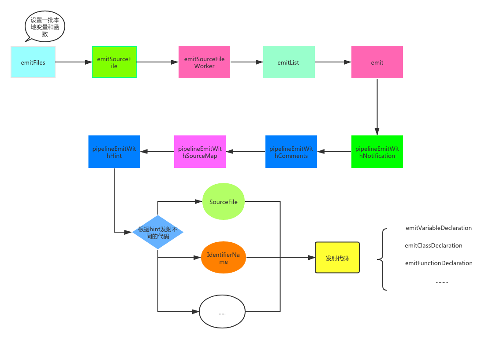

## 前言

   本文是对《深入理解Typescript》中编译原理章节做了总结, 分享给大家, 如有错误, 欢迎指正！

   > 本篇文章已收录于[个人博客blog](https://github.com/Summer-andy/life-is-moment)欢迎star✨!

## 编译器

  Typescript编译器主要分为以下五个关键部分:

  - Scanner 扫描器 (scanner.ts)
  - Parser 解析器 (parser.ts) 
  - Binder 绑定器 (binder.ts)
  - Checker 检查器 (checker.ts)
  - Emitter 发射器 (emitter.ts)

  每个部分的编译器代码在src/compiler都可以找到, 本文会对每个解析器进行一一讲解。在开始之前,我从网上找了一张图 能够帮助我们了解编译器是如何将上述几个关键部分组合在一起的。

  

  从上图我们可以发现, 编译器主要分了三条线路: 

  - 源代码 -> 扫描器 -> token流 -> 解析器 -> AST ->绑定器 -> Symbol(符号)
  - AST -> 检查器 ~~ Symbol(符号) -> 类型检查
  - AST -> 检查器 ~~ 发射器 -> js代码

  我先介绍每个解析器的工作原理, 最后我将会对每一条线路做一次概括。

## 扫描器

  ts扫描器的源代码均位于scanner.ts中。通过先前的流程图, 我们发现扫描器的作用就是将源代码生成token流。
  我们接下来直接进入到scanner.ts中的``` createScanner ``` 创建扫描器的函数进行逐一解读。为了便于大家理解大致流程, 我将会对一些代码进行删减。

  ```js
export function createScanner(languageVersion: ScriptTarget,
    skipTrivia: boolean,
    languageVariant = LanguageVariant.Standard,
    text?: string,
    onError?: ErrorCallback,
    start?: number,
    length?: number): Scanner {
        let pos: number;
        let end: number;
        let startPos: number;
        let tokenPos: number;
        let token: SyntaxKind;
        let tokenValue: string;
        setText(text, start, length);
        // ...
        return {
            getStartPos: () => startPos,
            getTextPos: () => pos,
            getToken: () => token,
            getTokenPos: () => tokenPos,
            getTokenText: () => text.substring(tokenPos, pos),
            getTokenValue: () => tokenValue,
            // ...
            scan,
            // ...
        };

  ```

  我们通过``` createScanner ```创建扫描器之后, 需要对源代码进行扫描操作, 对应源码中的```scan```函数。我们继续找到scan函数的逻辑, 因为createScanner函数里面只是定义了一些函数, 并没有实质上的逻辑流程进展。

  ```js
 function scan(): SyntaxKind {
      startPos = pos;
      hasExtendedUnicodeEscape = false;
      precedingLineBreak = false;
      tokenIsUnterminated = false;
      numericLiteralFlags = 0;
      while (true) {
          tokenPos = pos;
          if (pos >= end) {
              return token = SyntaxKind.EndOfFileToken;
          }
          let ch = text.charCodeAt(pos);

          // Special handling for shebang
          if (ch === CharacterCodes.hash && pos === 0 && isShebangTrivia(text, pos)) {
              pos = scanShebangTrivia(text, pos);
              if (skipTrivia) {
                  continue;
              }
              else {
                  return token = SyntaxKind.ShebangTrivia;
              }
          }

          switch (ch) {
              case CharacterCodes.lineFeed:
              case CharacterCodes.carriageReturn:
                  precedingLineBreak = true;
                  if (skipTrivia) {
                      pos++;
                      continue;
                  }
                  else {
                      if (ch === CharacterCodes.carriageReturn && pos + 1 < end && text.charCodeAt(pos + 1) === CharacterCodes.lineFeed) {
                          // consume both CR and LF
                          pos += 2;
                      }
                      else {
                          pos++;
                      }
                      return token = SyntaxKind.NewLineTrivia;
                  }
              case CharacterCodes.tab:
                // ...

  ```

  scan函数返回了``` SyntaxKind ``` 类型的值, 我们且来看看这到底是啥?
  通过源代码中的注释``` token > SyntaxKind.Identifer => token is a keyword ```, 我发现它是生成```token```的必要条件。 
  除此之外, 它还定义了各种关键字比如: ``` return ```, ``` super ```, ``` switch ``` ...。我们先暂且认定它为词法关键词的枚举。

  ```js
    // token > SyntaxKind.Identifer => token is a keyword
    // Also, If you add a new SyntaxKind be sure to keep the `Markers` section at the bottom in sync
    export const enum SyntaxKind {
        Unknown,
        EndOfFileToken,
        SingleLineCommentTrivia,
        MultiLineCommentTrivia,
        NewLineTrivia,
        WhitespaceTrivia,
        // We detect and preserve #! on the first line
        ShebangTrivia,
        // We detect and provide better error recovery when we encounter a git merge marker.  This
        // allows us to edit files with git-conflict markers in them in a much more pleasant manner.
        ConflictMarkerTrivia,
        // Literals
        NumericLiteral,
        StringLiteral,
        JsxText,
        JsxTextAllWhiteSpaces,
        RegularExpressionLiteral,
        NoSubstitutionTemplateLiteral,
        // Pseudo-literals
        TemplateHead,
        TemplateMiddle,
        TemplateTail,
        // Punctuation
        OpenBraceToken,
        ReturnKeyword,
        SuperKeyword,
        SwitchKeyword,
        ThisKeyword,
        ThrowKeyword,
        TrueKeyword,
        TryKeyword,
        TypeOfKeyword,
        VarKeyword,
        VoidKeyword,
        WhileKeyword,
        WithKeyword,
        // ...
    }
  ```

  继续阅读scan函数内的逻辑。我们发现后半部分的逻辑主要都是根据   ``` let ch = text.charCodeAt(pos); ``` 这句话有关。通过生成 Unicode 编码, 从而得到扫描的结果。那么我们可以得出一个简单的结论： 扫描器通过对输入的源代码进行词法分析, 得到对应的```SyntaxKind ```即“token”。

  为了验证结论是否正确, 我们可以创建一个例子来简单测试一下: 

  在开始扫描之前, 我们需要初始化一些配置, 比如扫描的字符串、设置js语言的标准版本等等。然后我们通过``` createScanner ``` 函数创建一个扫描器,
  并且通过调用``` scan ``` 获取 ``` token ```。只要token不是结束的token那么扫描器会一直扫描输入的字符串。

  ```js
    import * as ts from 'ntypescript';

    const scanner = ts.createScanner(ts.ScriptTarget.Latest, true);

    function initializeState(text: string) {
        scanner.setText(text);
        scanner.setScriptTarget(ts.ScriptTarget.ES5);
        scanner.setLanguageVariant(ts.LanguageVariant.Standard);
    }

    const str = 'const foo = 123;'

    initializeState(str);

    var token = scanner.scan();

    while(token != ts.SyntaxKind.EndOfFileToken) {
        console.log(token);
        console.log(ts.formatSyntaxKind(token));
        token = scanner.scan();
    }
  ```
  
   运行以上代码: 

   ```js
    76
    ConstKeyword
    71
    Identifier
    58
    EqualsToken
    8
    NumericLiteral
    25
    SemicolonToken
   ```

   我们发现 ``` const foo = 123; ``` 每一部分的单词都生成了一个token, 为了更加直观的解释这个扫描的结果, 我们使用``` formatSyntaxKind ```, 将SyntaxKind对应的枚举值输出,
   可以得出以下结果:

   - const -> ConstKeyword
   - foo -> Identifier
   - = -> EqualsToken
   - 123 -> NumericLiteral
   - ; -> SemicolonToken

   token对应的枚举值刚刚好也对应上了。证明我们的推断是正确, 其实这个过程跟词法分析有点类似。我画了一张简易的图总结了上述的主要步骤:

   

  ## 解析器

  第一步的扫描器生成的token, 为接下来解析器生成AST提供了必要的条件。

  因此在这一小节, 我们需要搞清楚第一步生成的token是如何转化为AST节点。先来看看一个生成AST的例子:

  ```js
    import * as ts from 'ntypescript';
    function printAllChildren(node: ts.Node, depth = 0) {
        console.log(new Array(depth + 1).join('----'), ts.formatSyntaxKind(node.kind), node.pos, node.end);
        depth++;
        node.getChildren().forEach(c => printAllChildren(c, depth));
    }
    var sourceCode = `const foo = 123;`;
    var sourceFile = ts.createSourceFile('foo.ts', sourceCode, ts.ScriptTarget.ES5, true);
    printAllChildren(sourceFile);
  ```

  运行以上代码得到: 

  ```js
    SourceFile 0 16
    ---- SyntaxList 0 16
    -------- VariableStatement 0 16
    ------------ VariableDeclarationList 0 15
    ---------------- ConstKeyword 0 5
    ---------------- SyntaxList 5 15
    -------------------- VariableDeclaration 5 15
    ------------------------ Identifier 5 9
    ------------------------ EqualsToken 9 11
    ------------------------ NumericLiteral 11 15
    ------------ SemicolonToken 15 16
    ---- EndOfFileToken 16 16
  ```

  如果之前对AST有了解过的同学, 应该一眼就能看出其实我们打印出来就是AST树。AST树里面有以下关键的信息:  1.节点的对应的类型type 2. 节点的起始位置。那么节点的类型
  刚刚好对应着``` formatSyntaxKind ``` 的枚举值, 而起始位置则对应``` node.pos ``` 和 ``` node.end ```。 如果大家有疑问, 可以结合着[MDN](https://developer.mozilla.org/en-US/docs/Mozilla/Projects/SpiderMonkey/Parser_API#Node_objects)上的文档进行逐一校对。

  我们看到生成AST的过程其实就调用了一个``` createSourceFile ``` 函数。那么我们接下来就从``` parser.ts ```中的 ``` createSourceFile ``` 函数入手: 

  ```js
    export function createSourceFile(fileName: string, sourceText: string, languageVersion: ScriptTarget, setParentNodes = false, scriptKind?: ScriptKind): SourceFile {
        performance.mark("beforeParse");
        const result = Parser.parseSourceFile(fileName, sourceText, languageVersion, /*syntaxCursor*/ undefined, setParentNodes, scriptKind);
        performance.mark("afterParse");
        performance.measure("Parse", "beforeParse", "afterParse");
        return result;
    }
  ```

  我们发现``` createSourceFile ``` 函数里面有两行代码: ``` performance.mark("beforeParse"); ``` 、 ``` performance.mark("afterParse")```。它会标记解析前和解析后。那么中间的应该就是正儿八经的解析过程了。
  因此我们继续深入 ``` Parser.parseSourceFile ``` 函数。

  ```js
    export function parseSourceFile(fileName: string, sourceText: string, languageVersion: ScriptTarget, syntaxCursor: IncrementalParser.SyntaxCursor, setParentNodes?: boolean, scriptKind?: ScriptKind): SourceFile {
        scriptKind = ensureScriptKind(fileName, scriptKind);
        initializeState(sourceText, languageVersion, syntaxCursor, scriptKind);
        const result = parseSourceFileWorker(fileName, languageVersion, setParentNodes, scriptKind);
        clearState();
        return result;
    }
  ```

  首先它初始化了状态, 这一步刚刚好对着我们的扫描器的第一步, 为了保证我们的每一步都是能够看懂的, 我们查看``` initializeState ``` 是不是做扫描前的准备工作。

  ```js
    function initializeState(_sourceText: string, languageVersion: ScriptTarget, _syntaxCursor: IncrementalParser.SyntaxCursor, scriptKind: ScriptKind) {
        // ...
        // Initialize and prime the scanner before parsing the source elements.
        scanner.setText(sourceText);
        scanner.setOnError(scanError);
        scanner.setScriptTarget(languageVersion);
        scanner.setLanguageVariant(getLanguageVariant(scriptKind));
    }
  ```

  ok, 经过我们验证, 它的的确确是为扫描前做准备。那我们继续下一步 ``` parseSourceFileWorker ```.

  ```js
    function parseSourceFileWorker(fileName: string, languageVersion: ScriptTarget, setParentNodes: boolean, scriptKind: ScriptKind): SourceFile {
        sourceFile = createSourceFile(fileName, languageVersion, scriptKind);
        sourceFile.flags = contextFlags;

        // Prime the scanner.
        nextToken();
        processReferenceComments(sourceFile);

        sourceFile.statements = parseList(ParsingContext.SourceElements, parseStatement);
        Debug.assert(token() === SyntaxKind.EndOfFileToken);
        sourceFile.endOfFileToken = addJSDocComment(parseTokenNode() as EndOfFileToken);

        setExternalModuleIndicator(sourceFile);

        sourceFile.nodeCount = nodeCount;
        sourceFile.identifierCount = identifierCount;
        sourceFile.identifiers = identifiers;
        sourceFile.parseDiagnostics = parseDiagnostics;

        if (setParentNodes) {
            fixupParentReferences(sourceFile);
        }

        return sourceFile;
    }
  ```
  
  - 1. createSourceFile为我们创建解析的目标
  - 2. 执行nextToken() 新扫描的token替换``` currentToken ```


  - 3. 执行processReferenceComments生成每个range的各种信息(包括起点和终点)

   ```js
    function processReferenceComments(sourceFile: SourceFile): void {
        const triviaScanner = createScanner(sourceFile.languageVersion, /*skipTrivia*/ false, LanguageVariant.Standard, sourceText);
        while (true) {
            const kind = triviaScanner.scan();

            const range = {
                kind: <SyntaxKind.SingleLineCommentTrivia | SyntaxKind.MultiLineCommentTrivia>triviaScanner.getToken(),
                pos: triviaScanner.getTokenPos(),
                end: triviaScanner.getTextPos(),
            };

            const comment = sourceText.substring(range.pos, range.end);
            else {
                const amdModuleNameRegEx = /^\/\/\/\s*<amd-module\s+name\s*=\s*('|")(.+?)\1/gim;
                const amdModuleNameMatchResult = amdModuleNameRegEx.exec(comment);
                if (amdModuleNameMatchResult) {
                    if (amdModuleName) {
                        parseDiagnostics.push(createFileDiagnostic(sourceFile, range.pos, range.end - range.pos, Diagnostics.An_AMD_module_cannot_have_multiple_name_assignments));
                    }
                    amdModuleName = amdModuleNameMatchResult[2];
                }

                const amdDependencyRegEx = /^\/\/\/\s*<amd-dependency\s/gim;
                const pathRegex = /\spath\s*=\s*('|")(.+?)\1/gim;
                const nameRegex = /\sname\s*=\s*('|")(.+?)\1/gim;
                const amdDependencyMatchResult = amdDependencyRegEx.exec(comment);
                if (amdDependencyMatchResult) {
                    const pathMatchResult = pathRegex.exec(comment);
                    const nameMatchResult = nameRegex.exec(comment);
                    if (pathMatchResult) {
                        const amdDependency = { path: pathMatchResult[2], name: nameMatchResult ? nameMatchResult[2] : undefined };
                        amdDependencies.push(amdDependency);
                    }
                }

                const checkJsDirectiveRegEx = /^\/\/\/?\s*(@ts-check|@ts-nocheck)\s*$/gim;
                const checkJsDirectiveMatchResult = checkJsDirectiveRegEx.exec(comment);
                if (checkJsDirectiveMatchResult) {
                    checkJsDirective = {
                        enabled: compareStrings(checkJsDirectiveMatchResult[1], "@ts-check", /*ignoreCase*/ true) === Comparison.EqualTo,
                        end: range.end,
                        pos: range.pos
                    };
                }
            }
        }

        sourceFile.referencedFiles = referencedFiles;
        sourceFile.typeReferenceDirectives = typeReferenceDirectives;
        sourceFile.amdDependencies = amdDependencies;
        sourceFile.moduleName = amdModuleName;
        sourceFile.checkJsDirective = checkJsDirective;
    }
   ```

  - 4. parseList函数, 我们发现返回的``` result ``` 最终是由 ``` parseListElement ``` 函数决定的那么我们继续查看。

    ```js
    function parseList<T extends Node>(kind: ParsingContext, parseElement: () => T): NodeArray<T> {
    const saveParsingContext = parsingContext;
    parsingContext |= 1 << kind;
    const result = createNodeArray<T>();

    while (!isListTerminator(kind)) {
        if (isListElement(kind, /*inErrorRecovery*/ false)) {
            const element = parseListElement(kind, parseElement);
            result.push(element);

            continue;
        }

        if (abortParsingListOrMoveToNextToken(kind)) {
            break;
        }
    }

    result.end = getNodeEnd();
    parsingContext = saveParsingContext;
    return result;
    }
    ```
   
 - 5. parseListElement: 搞到最后发现最终的结果是通过 ``` parseElement ``` 来决定, 可把我套晕了。

    ```js
    function parseListElement<T extends Node>(parsingContext: ParsingContext, parseElement: () => T): T {
        const node = currentNode(parsingContext);
        if (node) {
            return <T>consumeNode(node);
        }

        return parseElement();
    }
    ```

 - 6. parseElement
    
  ```js
    function parseStatement(): Statement {
        switch (token()) {
            case SyntaxKind.SemicolonToken:
                return parseEmptyStatement();
            case SyntaxKind.OpenBraceToken:
                return parseBlock(/*ignoreMissingOpenBrace*/ false);
            case SyntaxKind.VarKeyword:
                return parseVariableStatement(scanner.getStartPos(), /*decorators*/ undefined, /*modifiers*/ undefined);
            // ...
                break;
        }
        return parseExpressionOrLabeledStatement();
    }
  ```
 
   我们好像快要成功了！在 ``` parseStatement ```中对token做了switch处理, 根据不同的token获取不同的Node节点。比如我们以最后的```; ```来做一下简单的判断。
   首先``` ; ```对应的 token值应该是  ``` SyntaxKind.SemicolonToken ```刚刚好是条件判断中的第一个。因此我们进入到下一步查看``` parseEmptyStatement ``` 函数
   到底做了什么？

   - 7. parseEmptyStatement

   ```js
   function parseEmptyStatement(): Statement {
        const node = <Statement>createNode(SyntaxKind.EmptyStatement);
        parseExpected(SyntaxKind.SemicolonToken);
        return finishNode(node);
    }
   ```

   我们通过观察可以得出``` createNode ```函数是真正为我们创建节点的地方。

   ```js
    function createNode<TKind extends SyntaxKind>(kind: TKind, pos?: number): Node | Token<TKind> | Identifier {
        nodeCount++;
        if (!(pos >= 0)) {
            pos = scanner.getStartPos();
        }

        return isNodeKind(kind) ? new NodeConstructor(kind, pos, pos) :
            kind === SyntaxKind.Identifier ? new IdentifierConstructor(kind, pos, pos) :
                new TokenConstructor(kind, pos, pos);
    }
   ```

   通过以上代码我们可以得出: createNode负责创建节点，设置传入的 SyntaxKind（语法类别），和初始位置（默认使用当前扫描器状态提供的位置信息。
   而``` parseExpected ```将会检查解析器状态中的当前 token 是否与指定的 SyntaxKind 匹配。如果不匹配将会生成错误报告。

  ```js
    function parseExpected(kind: SyntaxKind, diagnosticMessage?: DiagnosticMessage, shouldAdvance = true): boolean {
        if (token() === kind) {
            if (shouldAdvance) {
                nextToken();
            }
            return true;
        }

        // Report specific message if provided with one.  Otherwise, report generic fallback message.
        if (diagnosticMessage) {
            parseErrorAtCurrentToken(diagnosticMessage);
        }
        else {
            parseErrorAtCurrentToken(Diagnostics._0_expected, tokenToString(kind));
        }
        return false;
    }
  ```

  最后一步``` finishNode ``` 将会设置节点的end 位置。并且添加上下文的标志 ``` contextFlags ```以及解析该节点前出现的错误（如果有错的话，就不能在增量解析中重用此 AST 节点).

  ```js
    function finishNode<T extends Node>(node: T, end?: number): T {
        node.end = end === undefined ? scanner.getStartPos() : end;

        if (contextFlags) {
            node.flags |= contextFlags;
        }

        // Keep track on the node if we encountered an error while parsing it.  If we did, then
        // we cannot reuse the node incrementally.  Once we've marked this node, clear out the
        // flag so that we don't mark any subsequent nodes.
        if (parseErrorBeforeNextFinishedNode) {
            parseErrorBeforeNextFinishedNode = false;
            node.flags |= NodeFlags.ThisNodeHasError;
        }

        return node;
    }
  ```

  整个解析器的流程我们已经走了一遍, 按照老规矩, 我们画个简单的流程图,复盘一下刚刚的过程~

  

  ## 绑定器

  大多数的 JavaScript 转译器（transpiler）都比 TypeScript 简单，因为它们几乎没提供代码分析的方法。典型的 JavaScript 转换器只有以下流程：

  ```js
    源码 ~~扫描器~~> Tokens ~~解析器~~> AST ~~发射器~~> JavaScript
  ```

  上述架构确实对于简化 TypeScript 生成 JavaScript 的理解有帮助，但缺失了一个关键功能，即 TypeScript 的语义系统。```为了协助（检查器执行）类型检查，绑定器将源码的各部分连接成一个相关的类型系统，供检查器使用。绑定器的主要职责是创建符号（Symbols）。```

  ### 符号

  符号将 AST 中的声明节点与其它声明连接到相同的实体上。符号是语义系统的基本构造块。那么符号到底长啥样呢？

  ```js
    function Symbol(flags: SymbolFlags, name: string) {
    this.flags = flags;
    this.name = name;
    this.declarations = undefined;
    }
  ```

  SymbolFlags 符号标志是个标志枚举，用于识别额外的符号类别（例如：变量作用域标志 FunctionScopedVariable 或 BlockScopedVariable 等）具体可以查看compiler/types 中SymbolFlags的枚举定义。


  ### 创建符号并且绑定节点

   首先我们进入bind.ts中的``` bindSourceFile ```。又出现了熟悉的那一幕, 在每次进行解析和绑定之前, 源码中都会``` performance.mark() ``` 标识一下当前的操作。那么我们就顺着它提供的思路
   查看在绑定之前``` beforeBind ``` 和 绑定之后``` beforeBind ``` 中间的 ``` binder ```函数一探究竟。

   - bindSourceFile
   ```js
    export function bindSourceFile(file: SourceFile, options: CompilerOptions) {
        performance.mark("beforeBind");
        binder(file, options);
        performance.mark("afterBind");
        performance.measure("Bind", "beforeBind", "afterBind");
    }
   ```


   - binder

   ```js
    const binder = createBinder();
   ```

   -  createBinder

   ```js
    function createBinder(): (file: SourceFile, options: CompilerOptions) => void {

     function bindSourceFile(f: SourceFile, opts: CompilerOptions) {
            file = f;
            options = opts;
            languageVersion = getEmitScriptTarget(options);
            inStrictMode = bindInStrictMode(file, opts);
            classifiableNames = createMap<string>();
            symbolCount = 0;
            skipTransformFlagAggregation = file.isDeclarationFile;

            Symbol = objectAllocator.getSymbolConstructor();

            if (!file.locals) {
                bind(file);
                file.symbolCount = symbolCount;
                file.classifiableNames = classifiableNames;
            }
            // ...
        }

        return bindSourceFile;
        // ...
    }

   ```

   由于createBinder函数体实在是太长了, 我就截取最最关键的部分。一开始我本以为这么长片段的代码肯定是实现了, 结果具体的绑定还是在bind函数中。而``` bindSourceFile ``` 主要是
   检查``` file.locals ```是否定义，如果没有则交给（本地函数） bind 来处理, 一开始的file肯定是没有被定义的, 因此我们就直接走bind里面的逻辑。

   - bind

   ```js
        function bind(node: Node): void {
        if (!node) {
            return;
        }
        node.parent = parent;
        const saveInStrictMode = inStrictMode;

        // Even though in the AST the jsdoc @typedef node belongs to the current node,
        // its symbol might be in the same scope with the current node's symbol. Consider:
        //
        //     /** @typedef {string | number} MyType */
        //     function foo();
        //
        // Here the current node is "foo", which is a container, but the scope of "MyType" should
        // not be inside "foo". Therefore we always bind @typedef before bind the parent node,
        // and skip binding this tag later when binding all the other jsdoc tags.
        if (isInJavaScriptFile(node)) bindJSDocTypedefTagIfAny(node);

        // First we bind declaration nodes to a symbol if possible. We'll both create a symbol
        // and then potentially add the symbol to an appropriate symbol table. Possible
        // destination symbol tables are:
        //
        //  1) The 'exports' table of the current container's symbol.
        //  2) The 'members' table of the current container's symbol.
        //  3) The 'locals' table of the current container.
        //
        // However, not all symbols will end up in any of these tables. 'Anonymous' symbols
        // (like TypeLiterals for example) will not be put in any table.
        bindWorker(node);
        // Then we recurse into the children of the node to bind them as well. For certain
        // symbols we do specialized work when we recurse. For example, we'll keep track of
        // the current 'container' node when it changes. This helps us know which symbol table
        // a local should go into for example. Since terminal nodes are known not to have
        // children, as an optimization we don't process those.
        if (node.kind > SyntaxKind.LastToken) {
            const saveParent = parent;
            parent = node;
            const containerFlags = getContainerFlags(node);
            if (containerFlags === ContainerFlags.None) {
                bindChildren(node);
            }
            else {
                bindContainer(node, containerFlags);
            }
            parent = saveParent;
        }
        else if (!skipTransformFlagAggregation && (node.transformFlags & TransformFlags.HasComputedFlags) === 0) {
            subtreeTransformFlags |= computeTransformFlagsForNode(node, 0);
        }
            inStrictMode = saveInStrictMode;
        }
   ```
   
   一看到```bind ``` 函数里面这么多密密麻麻的注释, 凭我看源码的经验肯定是很重要的。首先它为当前节点添加了一个``` parent ```其次调用``` bindWorker ```根据不同的节点调用与之对应的绑定函数
   最后调用``` bindChildren ```, 对当前节点的每个子节点进行一一绑定, ``` bindChildren ```内部也是通过递归调用```bind``` 对每一个节点进行绑定。, 至于 ``` bindContainer ``` 根据注释上推断, 应该是对一些特别的节点做统一的绑定处理, 比如exports、members、locals等等

   - bindWorker

   ```js
  function bindWorker(node: Node) {
    switch (node.kind) {
        case SyntaxKind.Identifier:
            if ((<Identifier>node).isInJSDocNamespace) {
                let parentNode = node.parent;
                while (parentNode && parentNode.kind !== SyntaxKind.JSDocTypedefTag) {
                    parentNode = parentNode.parent;
                }
                bindBlockScopedDeclaration(<Declaration>parentNode, SymbolFlags.TypeAlias, SymbolFlags.TypeAliasExcludes);
                break;
            }
            case SyntaxKind.ThisKeyword:
            if (currentFlow && (isExpression(node) || parent.kind === SyntaxKind.ShorthandPropertyAssignment)) {
                node.flowNode = currentFlow;
            }
            return checkStrictModeIdentifier(<Identifier>node);

        // ...
    }
   ```

   我截取了部分代码, 因为bindWorker里面做的事情是根据node.kind（SyntaxKind类型)进行分别绑定,并且将工作委托给对应bindXXX 函数进行实际的绑定操作。我们就以``` Identifier ``` 为例。查看``` bindBlockScopedDeclaration ``` 做了什么❓

   - bindBlockScopedDeclaration

   ```js

    function bindBlockScopedDeclaration(node: Declaration, symbolFlags: SymbolFlags, symbolExcludes: SymbolFlags) {
        switch (blockScopeContainer.kind) {
            case SyntaxKind.ModuleDeclaration:
                declareModuleMember(node, symbolFlags, symbolExcludes);
                break;
            case SyntaxKind.SourceFile:
                if (isExternalModule(<SourceFile>container)) {
                    declareModuleMember(node, symbolFlags, symbolExcludes);
                    break;
                }
            // falls through
            default:
                if (!blockScopeContainer.locals) {
                    blockScopeContainer.locals = createMap<Symbol>();
                    addToContainerChain(blockScopeContainer);
                }
              declareSymbol(blockScopeContainer.locals, /*parent*/ undefined, node, symbolFlags, symbolExcludes);
        }
    }
   ```

   追本溯源, 我们直接看最后一行代码``` declareSymbol ```, 当然你也可以看其他的declare比如 ``` declareModuleMember```, 不过看到最后你会发现基本都是需要通过 ``` declareSymbol```来定义符号。

  - declareSymbol

   ```js
    function declareSymbol(symbolTable: SymbolTable, parent: Symbol, node: Declaration, includes: SymbolFlags, excludes: SymbolFlags): Symbol {
        Debug.assert(!hasDynamicName(node));

        const isDefaultExport = hasModifier(node, ModifierFlags.Default);

        // The exported symbol for an export default function/class node is always named "default"
        const name = isDefaultExport && parent ? "default" : getDeclarationName(node);

        let symbol: Symbol;
        if (name === undefined) {
            symbol = createSymbol(SymbolFlags.None, "__missing");
        }
        else {
        symbol = symbolTable.get(name);
            addDeclarationToSymbol(symbol, node, includes);
            symbol.parent = parent;
        // ..
        return symbol;
    }
   ```

   declareSymbol中主要做了两件事情: 1. createSymbol 2.addDeclarationToSymbol

   - createSymbol

   ```js
    function createSymbol(flags: SymbolFlags, name: string): Symbol {
            symbolCount++;
            return new Symbol(flags, name);
    }
   ```

   createSymbol主要是简单地更新 symbolCount（一个 bindSourceFile 的本地变量），并使用指定的参数创建符号。创建了符号之后需要进行对节点的绑定。

   - addDeclarationToSymbol

   ```js
    function addDeclarationToSymbol(symbol: Symbol, node: Declaration, symbolFlags: SymbolFlags) {
        symbol.flags |= symbolFlags;

        node.symbol = symbol;

        if (!symbol.declarations) {
            symbol.declarations = [];
        }
        symbol.declarations.push(node);
        // ...
    }
   ```

   addDeclarationToSymbol函数内主要做了两件事情: 1. 创建 AST 节点到 symbol 的连接 ( node.symbol = symbol;) 2. 为节点添加一个声明(symbol.declarations.push(node);
)。

  绑定器做的最重要的工作已经做完了, 我们简单画一张流程图来重温符号创建的过程:

  

  至此宣告着我们的第一条路线已经全部走完: 

  ```js
    源代码 -> 扫描器 -> token流 -> 解析器 -> AST ->绑定器 -> Symbol(符号)
  ```

  接下来我们看其余的两条路线: ``` 类型检查 ``` 和 ``` 代码发射 ```。


  ## 检查器

  ### 程序对检查器的使用

  在开始源码分析, 我们需要知道检查器是由程序初始化, 并且绑定器中的``` bindSourceFile ```是通过检查器来启动的。简单来, 看一下程序的调用栈: 

  ```js
    program.getTypeChecker ->
      ts.createTypeChecker（检查器中）->
        initializeTypeChecker（检查器中） ->
            for each SourceFile `ts.bindSourceFile`（绑定器中）
            // 接着
            for each SourceFile `ts.mergeSymbolTable`（检查器中）
  ```

  我可以发现在``` initializeTypeChecker ``` 的时候会调用 绑定器的``` bindSourceFile ``` 以及 `检查器本身的 ``` mergeSymbolTable ```
  
  ### 验证调用栈的正确与否

   ```js
       function initializeTypeChecker() {
            // Bind all source files and propagate errors
            for (const file of host.getSourceFiles()) {
                bindSourceFile(file, compilerOptions);
            }
            // Initialize global symbol table
            let augmentations: LiteralExpression[][];
            for (const file of host.getSourceFiles()) {
                if (!isExternalOrCommonJsModule(file)) {
                    mergeSymbolTable(globals, file.locals);
                }
                    // ...
            }
            // ...
        }

   ```

   查看检查器中的源码, 我们确实验证了上述调用栈的过程。先调用 ``` bindSourceFile ``` 再调用了 ``` mergeSymbolTable  ```。

   ### 分析mergeSymbolTable

   在上一节中我们对``` bindSourceFile ```做了一个的分析, 最后给每一个节点都创建了一个符号,将各个节点连接成一个相关的类型系统。
   查看以下两段代码: 我们不难发现mergeSymbolTable主要做的事情即是: 将所有的 global 符号合并到 let globals: SymbolTable = {} 符号表中。往后的类型检查都
   统一在global上校验即可。

  ```js
   function mergeSymbolTable(target: SymbolTable, source: SymbolTable) {
            source.forEach((sourceSymbol, id) => {
                let targetSymbol = target.get(id);
                if (!targetSymbol) {
                    target.set(id, sourceSymbol);
                }
                else {
                    if (!(targetSymbol.flags & SymbolFlags.Transient)) {
                        targetSymbol = cloneSymbol(targetSymbol);
                        target.set(id, targetSymbol);
                    }
                    mergeSymbol(targetSymbol, sourceSymbol);
                }
            });
        }
  ```

  ```js
       function mergeSymbol(target: Symbol, source: Symbol) {
            if (!(target.flags & getExcludedSymbolFlags(source.flags))) {
                if (source.flags & SymbolFlags.ValueModule && target.flags & SymbolFlags.ValueModule && target.constEnumOnlyModule && !source.constEnumOnlyModule) {
                    // reset flag when merging instantiated module into value module that has only const enums
                    target.constEnumOnlyModule = false;
                }
                target.flags |= source.flags;
                if (source.valueDeclaration &&
                    (!target.valueDeclaration ||
                        (target.valueDeclaration.kind === SyntaxKind.ModuleDeclaration && source.valueDeclaration.kind !== SyntaxKind.ModuleDeclaration))) {
                    // other kinds of value declarations take precedence over modules
                    target.valueDeclaration = source.valueDeclaration;
                }
                addRange(target.declarations, source.declarations);
                if (source.members) {
                    if (!target.members) target.members = createMap<Symbol>();
                    mergeSymbolTable(target.members, source.members);
                }
                if (source.exports) {
                    if (!target.exports) target.exports = createMap<Symbol>();
                    mergeSymbolTable(target.exports, source.exports);
                }
                recordMergedSymbol(target, source);
            }
            else if (target.flags & SymbolFlags.NamespaceModule) {
                error(getNameOfDeclaration(source.declarations[0]), Diagnostics.Cannot_augment_module_0_with_value_exports_because_it_resolves_to_a_non_module_entity, symbolToString(target));
            }
            else {
                const message = target.flags & SymbolFlags.BlockScopedVariable || source.flags & SymbolFlags.BlockScopedVariable
                    ? Diagnostics.Cannot_redeclare_block_scoped_variable_0 : Diagnostics.Duplicate_identifier_0;
                forEach(source.declarations, node => {
                    error(getNameOfDeclaration(node) || node, message, symbolToString(source));
                });
                forEach(target.declarations, node => {
                    error(getNameOfDeclaration(node) || node, message, symbolToString(source));
                });
            }
        }
  ```

  ### 类型检查

   真正的类型检查会在调用 ```getDiagnostics``` 时才发生。该函数被调用时（比如由 Program.emit 请求），检查器返回一个 EmitResolver（由程序调用检查器的 getEmitResolver 函数得到），EmitResolver 是 createTypeChecker 的一个本地函数的集合。我们接下去从```getDiagnostics ```` 函数开始一步一步分析它是如何做类型检查的


 ###  getDiagnostics

   ```js
    function getDiagnostics(sourceFile: SourceFile, ct: CancellationToken): Diagnostic[] {
        try {
            cancellationToken = ct;
            return getDiagnosticsWorker(sourceFile);
        }
        finally {
            cancellationToken = undefined;
        }
    }
   ```
   来不及解释了, 我们直接进入``` getDiagnosticsWorker ```

  ###  getDiagnosticsWorker

  ```js
     function getDiagnosticsWorker(sourceFile: SourceFile): Diagnostic[] {
            throwIfNonDiagnosticsProducing();
            if (sourceFile) {
                // ..
                checkSourceFile(sourceFile);
                // ..
                const semanticDiagnostics = diagnostics.getDiagnostics(sourceFile.fileName);
                // ..
                return semanticDiagnostics;
            }
            forEach(host.getSourceFiles(), checkSourceFile);
            return diagnostics.getDiagnostics();
        }

  ```
  把所有不相干的东西都去掉, 我们发现了一个小递归, 如果sourceFile存在那么进行``` checkSourceFile ``` 操作, 否则就进入``` diagnostics.getDiagnostics() ```  再来一遍。

  ### checkSourceFile

  ```js
    function checkSourceFile(node: SourceFile) {
        performance.mark("beforeCheck");
        checkSourceFileWorker(node);
        performance.mark("afterCheck");
        performance.measure("Check", "beforeCheck", "afterCheck");
    }
  ```

  又看到了熟悉的场景, 同样的``` performance.mark ```, 按照老规矩中间 ``` checkSourceFileWorker ``` 一定是我们寻找的。


  ### checkSourceFileWorker

   ```js

     function checkSourceFileWorker(node: SourceFile) {
            const links = getNodeLinks(node);
            if (!(links.flags & NodeCheckFlags.TypeChecked)) {
                if (compilerOptions.skipLibCheck && node.isDeclarationFile || compilerOptions.skipDefaultLibCheck && node.hasNoDefaultLib) {
                    return;
                }
                // Grammar checking
                checkGrammarSourceFile(node);

                forEach(node.statements, checkSourceElement);

                checkDeferredNodes();

                if (isExternalModule(node)) {
                  registerForUnusedIdentifiersCheck(node);
                }

                if (!node.isDeclarationFile) {
                    checkUnusedIdentifiers();
                }

                if (isExternalOrCommonJsModule(node)) {
                    checkExternalModuleExports(node);
                }
                // ...
                links.flags |= NodeCheckFlags.TypeChecked;
            }
        }

   ```

   仔细阅读以上代码, 我们发现在checkSourceFileWorker函数内有各种各样的check操作比如: ``` checkGrammarSourceFile ``` 、 ``` checkDeferredNodes ```、 ``` registerForUnusedIdentifiersCheck ``` ...
   这不就是我们苦苦探寻的么？我们随便调一个继续深究下去.

   ### checkGrammarSourceFile

   ```js
    function checkGrammarSourceFile(node: SourceFile): boolean {
            return isInAmbientContext(node) && checkGrammarTopLevelElementsForRequiredDeclareModifier(node);
    }
   ```
   这边先判断了节点是否是 ``` isInAmbientContext ```。咱也不管, 就当他是就完了。

   ### checkGrammarTopLevelElementsForRequiredDeclareModifier

   ```js
    function checkGrammarTopLevelElementsForRequiredDeclareModifier(file: SourceFile): boolean {
            for (const decl of file.statements) {
                if (isDeclaration(decl) || decl.kind === SyntaxKind.VariableStatement) {
                    if (checkGrammarTopLevelElementForRequiredDeclareModifier(decl)) {
                        return true;
                    }
                }
            }
        }
   ```

  ### checkGrammarTopLevelElementForRequiredDeclareModifier
 
  ```js
  function checkGrammarTopLevelElementForRequiredDeclareModifier(node: Node): boolean {
        if (node.kind === SyntaxKind.InterfaceDeclaration ||
            node.kind === SyntaxKind.TypeAliasDeclaration ||
            node.kind === SyntaxKind.ImportDeclaration ||
            node.kind === SyntaxKind.ImportEqualsDeclaration ||
            node.kind === SyntaxKind.ExportDeclaration ||
            node.kind === SyntaxKind.ExportAssignment ||
            node.kind === SyntaxKind.NamespaceExportDeclaration ||
            getModifierFlags(node) & (ModifierFlags.Ambient | ModifierFlags.Export | ModifierFlags.Default)) {
                return false;
        }

        return grammarErrorOnFirstToken(node, Diagnostics.A_declare_modifier_is_required_for_a_top_level_declaration_in_a_d_ts_file);
     }
  ```

  ###  grammarErrorOnFirstToken

  ```js
    function grammarErrorOnFirstToken(node: Node, message: DiagnosticMessage, arg0?: any, arg1?: any, arg2?: any): boolean {
            const sourceFile = getSourceFileOfNode(node);
            if (!hasParseDiagnostics(sourceFile)) {
                const span = getSpanOfTokenAtPosition(sourceFile, node.pos);
                diagnostics.add(createFileDiagnostic(sourceFile, span.start, span.length, message, arg0, arg1, arg2));
                return true;
            }
        }
  ```  

  ### createFileDiagnostic

  ```js
    export function createFileDiagnostic(file: SourceFile, start: number, length: number, message: DiagnosticMessage): Diagnostic {
            const end = start + length;

            Debug.assert(start >= 0, "start must be non-negative, is " + start);
            Debug.assert(length >= 0, "length must be non-negative, is " + length);

            if (file) {
                Debug.assert(start <= file.text.length, `start must be within the bounds of the file. ${start} > ${file.text.length}`);
                Debug.assert(end <= file.text.length, `end must be the bounds of the file. ${end} > ${file.text.length}`);
            }

            let text = getLocaleSpecificMessage(message);

            if (arguments.length > 4) {
                text = formatStringFromArgs(text, arguments, 4);
            }

            return {
                file,
                start,
                length,

                messageText: text,
                category: message.category,
                code: message.code,
            };
        }
  ```

  终于结束了, 我们发现最后的类型校验都会通过``` Debug.assert ``` 函数给抛出来。至于``` assert ``` 里面做了什么, 我在此就不赘述了。有兴趣的同学可以自行查看源码。检查器源码总结下来：
  它就是根据我们生成AST上节点的声明起始节点的位置对传进来的字符串做位置类型语法等的校验与异常的抛出。

  最后我们画个简单的图来为本次的校验器结个尾: 

  

  至此我们的第二段路线也结束了: 

  ```js
    AST -> 检查器 ~~ Symbol(符号) -> 类型检查
  ```

  ## 发射器

  TypeScript 编译器提供了两个发射器: 

  - emitter.ts: 它是 TS -> JavaScript 的发射器
  - declarationEmitter.ts: 用于为 TypeScript 源文件（.ts） 创建声明文件

  程序对发射器的使用:
  Program 提供了一个 emit 函数。该函数主要将功能委托给 emitter.ts中的 emitFiles 函数。下面是调用栈：
  
  ```js
    Program.emit ->
    `emitWorker` （在 program.ts 中的 createProgram） ->
        `emitFiles` （emitter.ts 中的函数）
  ```


  ### emitFiles

  ```js
     export function emitFiles(resolver: EmitResolver, host: EmitHost, targetSourceFile: SourceFile, emitOnlyDtsFiles?: boolean, transformers?: TransformerFactory<SourceFile>[]): EmitResult {
        const compilerOptions = host.getCompilerOptions();
        const moduleKind = getEmitModuleKind(compilerOptions);
        const sourceMapDataList: SourceMapData[] = compilerOptions.sourceMap || compilerOptions.inlineSourceMap ? [] : undefined;
        const emittedFilesList: string[] = compilerOptions.listEmittedFiles ? [] : undefined;
        const emitterDiagnostics = createDiagnosticCollection();
        const newLine = host.getNewLine();
        const writer = createTextWriter(newLine);
        const sourceMap = createSourceMapWriter(host, writer);

        let currentSourceFile: SourceFile;
        let bundledHelpers: Map<boolean>;
        let isOwnFileEmit: boolean;
        let emitSkipped = false;

        const sourceFiles = getSourceFilesToEmit(host, targetSourceFile);

        // Transform the source files
        const transform = transformNodes(resolver, host, compilerOptions, sourceFiles, transformers, /*allowDtsFiles*/ false);

        // Create a printer to print the nodes
        const printer = createPrinter();

        // Emit each output file
        performance.mark("beforePrint");
        forEachEmittedFile(host, emitSourceFileOrBundle, transform.transformed, emitOnlyDtsFiles);
        performance.measure("printTime", "beforePrint");

        // Clean up emit nodes on parse tree
        transform.dispose();

        return {
            emitSkipped,
            diagnostics: emitterDiagnostics.getDiagnostics(),
            emittedFiles: emittedFilesList,
            sourceMaps: sourceMapDataList
        };

        function emitSourceFileOrBundle({ jsFilePath, sourceMapFilePath, declarationFilePath }: EmitFileNames, sourceFileOrBundle: SourceFile | Bundle) {

        }

        function printSourceFileOrBundle(jsFilePath: string, sourceMapFilePath: string, sourceFileOrBundle: SourceFile | Bundle) {
    
        }

        function setSourceFile(node: SourceFile) {
         
        }

        function emitHelpers(node: Node, writeLines: (text: string) => void) {

        }
    }
  ```
 
  它主要设置了一批本地变量和函数（这些函数构成 emitter.ts 的大部分内容），接着交给本地函数 emitSourceFile 发射文本。emitSourceFile 函数设置 currentSourceFile 然后交给本地函数 emit 去处理。

  ### emit

  ```js
   function emit(node: Node) {
            pipelineEmitWithNotification(EmitHint.Unspecified, node);
    }
  ```
 
  ### pipelineEmitWithHint

   emit触发后的函数都是一环一环套着的, 经过我们一层层的排查，最后卡在了 ``` pipelineEmitWithHint ```中。通过不同的``` hint ``` 发射不同的代码。
   

  ```js

        function pipelineEmitWithNotification(hint: EmitHint, node: Node) {
            if (onEmitNode) {
                onEmitNode(hint, node, pipelineEmitWithComments);
            }
            else {
                pipelineEmitWithComments(hint, node);
            }
        }

        function pipelineEmitWithComments(hint: EmitHint, node: Node) {
            node = trySubstituteNode(hint, node);
            if (emitNodeWithComments && hint !== EmitHint.SourceFile) {
                emitNodeWithComments(hint, node, pipelineEmitWithSourceMap);
            }
            else {
                pipelineEmitWithSourceMap(hint, node);
            }
        }

        function pipelineEmitWithSourceMap(hint: EmitHint, node: Node) {
            if (onEmitSourceMapOfNode && hint !== EmitHint.SourceFile && hint !== EmitHint.IdentifierName) {
                onEmitSourceMapOfNode(hint, node, pipelineEmitWithHint);
            }
            else {
                pipelineEmitWithHint(hint, node);
            }
        }

        function pipelineEmitWithHint(hint: EmitHint, node: Node): void {
            switch (hint) {
                case EmitHint.SourceFile: return pipelineEmitSourceFile(node);
                case EmitHint.IdentifierName: return pipelineEmitIdentifierName(node);
                case EmitHint.Expression: return pipelineEmitExpression(node);
                case EmitHint.Unspecified: return pipelineEmitUnspecified(node);
            }
        }

  ```

  ### pipelineEmitSourceFile

  如果一开始传进来的hint是不确定的（Unspecified）, 那么在```pipelineEmitUnspecified```中就根据节点的kind来判断。

  ```js
   function pipelineEmitUnspecified(node: Node): void {
        const kind = node.kind;

        // Reserved words
        // Strict mode reserved words
        // Contextual keywords
        if (isKeyword(kind)) {
            writeTokenNode(node);
            return;
        }

        switch (kind) {
            // Pseudo-literals
            case SyntaxKind.TemplateHead:
            case SyntaxKind.TemplateMiddle:
            case SyntaxKind.TemplateTail:
                return emitLiteral(<LiteralExpression>node);

        }

   }
  ```

  ### emitLiteral

  比如我们节点类型是 ``` TemplateHead ```，那么就会执行 ``` emitLiteral ``` 函数进行发射代码。

   ```js
     function emitLiteral(node: LiteralLikeNode) {
            const text = getLiteralTextOfNode(node);
            if ((printerOptions.sourceMap || printerOptions.inlineSourceMap)
                && (node.kind === SyntaxKind.StringLiteral || isTemplateLiteralKind(node.kind))) {
                writer.writeLiteral(text);
            }
            else {
                write(text);
            }
        }

   ```

   至于其他的情况都大同小异。我们来总结一下:

   


  ## 总结
 
  在调试源码的过程中, 推荐大家一个vscode插件 ``` Bookmarks ```。它可以帮助标记且定位我们的关键代码。

  

  本文是个人的一些理解, 如有错误欢迎指正。对你理解typescript编译原理有帮助的话别忘了点个赞哦~~

  ## 参考文章

  [深入理解typescript](https://jkchao.github.io/typescript-book-chinese/#why)
  [Typescript编译原理(-)](https://juejin.im/post/6844903745503903758)
