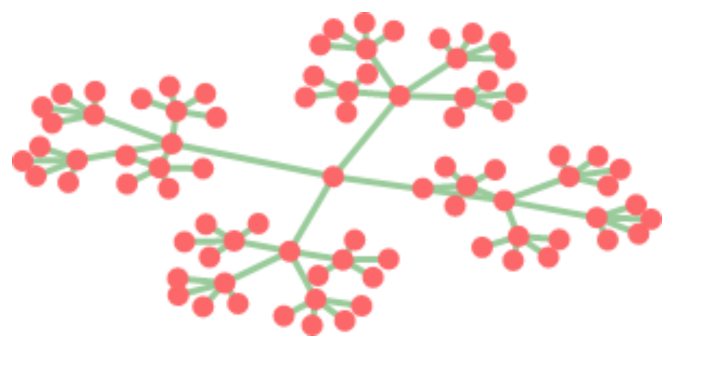
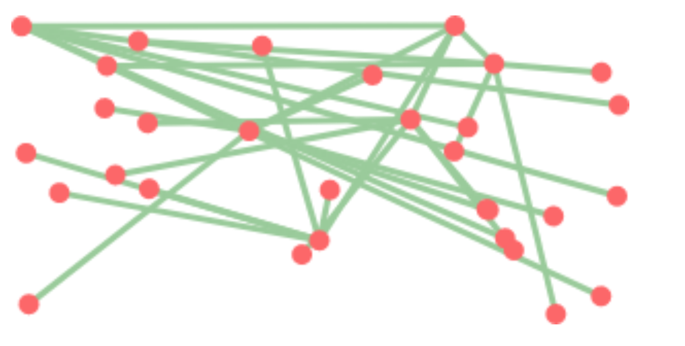
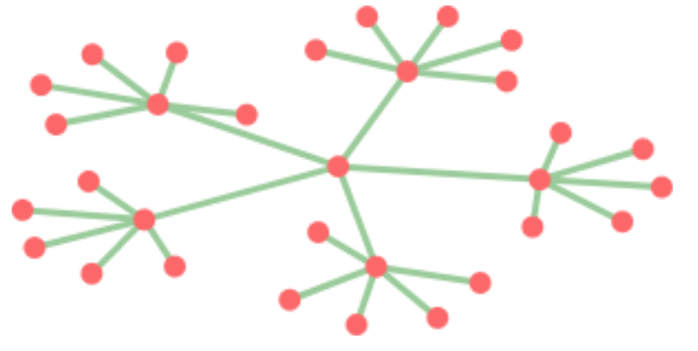
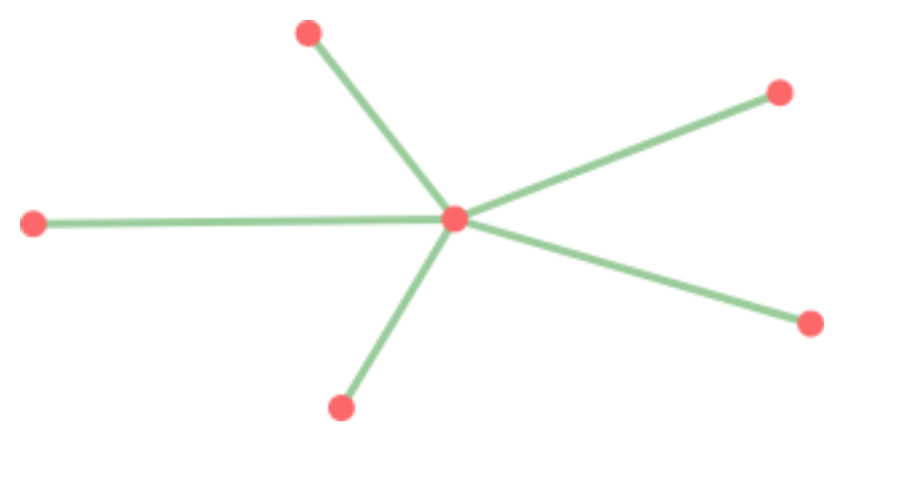
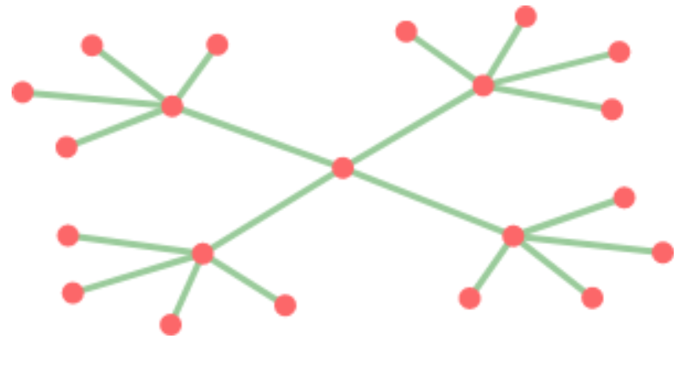
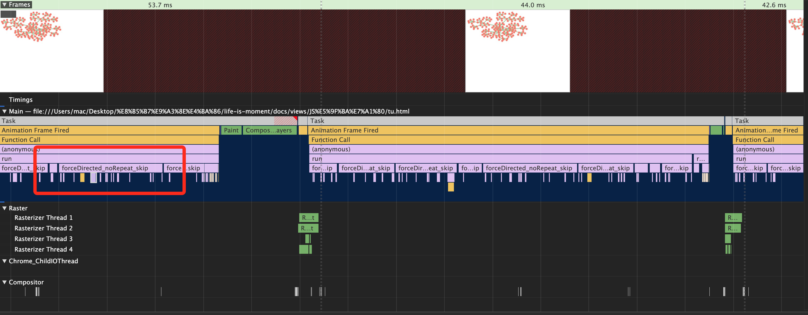
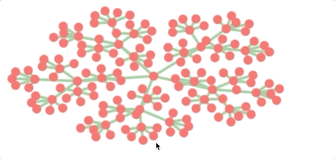

## 前言

   为给定的图找到美观的布局是一个总所周知的难题。没有已知的解决方案能可靠地为任意的图找到美观的布局, 特别是对应密集连接的大型图, 做到这一点尤其困难。但是对于某些特定类型的图, 例如, 平面图(可以在没有彼此相交的情况下绘制)存在有效的布局方法。在图的绘制过程中, 我们需要关注两个点： 1. 性能 2. 视觉效果。简言之就是如何快速构建出一张美观的图。本文将会使用力导向图布局的方法完成节点的布局, 最终的呈现效果如下:
   

## 定义图

  我们可以将图的布局表示为GraphNode对象的数组, 每个对象都带有其当前位置以及它所连接的变对应的节点的数组。我们将它们的起始位置随机化。

  ### 定义位置和力

  ```js
  class Vec {
    constructor(x, y) {
      this.x = x;
      this.y = y;
    }
    plus(other) {
      return new Vec(this.x + other.x, this.y + other.y);
    }
    minus(other) {
      return new Vec(this.x - other.x, this.y - other.y);
    }
    times(factor) {
      return new Vec(this.x * factor, this.y * factor);
    }
    get length() {
      return Math.sqrt(this.x * this.x + this.y * this.y);
    }
  }
  ```

  ### 定义GraphNode

  ```js
   class GraphNode {
    constructor() {
      this.pos = new Vec(Math.random() * 1000, Math.random() * 1000);
      this.edges = [];
    }

    connect(other) {
      this.edges.push(other);
      other.edges.push(this);
    }

    hasEdge(other) {
      return this.edges.includes(other)
    }

  }
  ```

  ```connect```方法用于构建图形时将节点连接到另外一个节点。```hasEdge```用于判断两个点是否连接。

  ### 定义构建树形图函数

  ```js
  function treeGraph(depth, branches) {
    let graph = [new GraphNode()];
    if (depth > 1) {
      for (let index = 0; index < branches; index++) {
        let subGraph = treeGraph(depth - 1, branches);
        graph[0].connect(subGraph[0]);
        graph = graph.concat(subGraph);
      }
    }
    return graph;
  }
  ```

  为什么使用树形图呢？ 树形图它不包含回路, 这使得我们能够更加容易的布局。它需要两个参数: 1. ```depth```树的深度 2. ``` branches ``` 每次拆分时需要创建的分支树。我们通过递归的手法构造具有指定形状的树形结构。

  ### 定义绘制的函数

  我们创建图前的准备工作都已经完成。我们需要将这些图的节点显示到画布上。我们定义一个``` drawGraph ```函数用于将图形绘制到画布上。

  ```js
  function drawGraph(graph) {
    let canvas = document.querySelector("canvas");
    if (!canvas) {
      canvas = document.body.appendChild(document.createElement("canvas"));
      canvas.width = canvas.height = 500;
    }
    let cx = canvas.getContext("2d");
    cx.clearRect(0, 0, canvas.width, canvas.height);
    let scale = new Scale(graph, canvas.width, canvas.height);
    cx.strokeStyle = "#99CC99";
    cx.lineWidth = 3;
    for (let i = 0; i < graph.length; i++) {
      let origin = graph[i];
      for (let target of origin.edges) {
        if (graph.indexOf(target) <= i) continue;
        cx.beginPath();
        cx.moveTo(scale.x(origin.pos.x), scale.y(origin.pos.y));
        cx.lineTo(scale.x(target.pos.x), scale.y(target.pos.y));
        cx.stroke();
      }
    }
    cx.fillStyle = "#FF6666";
    for (let node of graph) {
      cx.beginPath();
      cx.arc(scale.x(node.pos.x), scale.y(node.pos.y), nodeSize, 0, 7);
      cx.fill();
    }
  }
  ```

  ```js
  class Scale {
    constructor(graph, width, height) {
      let xs = graph.map(node => node.pos.x);
      let ys = graph.map(node => node.pos.y);
      let minX = Math.min(...xs);
      let minY = Math.min(...ys);
      let maxX = Math.max(...xs);
      let maxY = Math.max(...ys);

      this.offsetX = minX; 
      this.offsetY = minY;
      this.scaleX = (width - 2 * nodeSize) / (maxX - minX);
      this.scaleY = (height - 2 * nodeSize) / (maxY - minY);
    }
  ```

  这部分绘制到画布上的代码, 我就不赘述了, 这不是本文的重点。我相信大多数同学都能理解。下面我们创建一个深度为3并且每次拆分时创建5个分支的树形图。

  ```js
  drawGraph(treeGraph(3, 5))
  ```

  显示结果如下: 

  

  虽然图形是显示出来了, 但是这显然是一个没有好的观感体验的图, 点和线的位置杂乱无章。因此我们接下来首要的任务是将此图的布局变得美观。


  ## 力导向布局

  在开始``` 力导向布局 ``` 之前, 我们需要先了解什么是力导向算法.下面是百度百科上关于力导向算法的解释:

  > 力导向算法是一个图布局的算法。一般来说，力导向算法包含一下步骤：对网络型数据进行力学建模，通过一定的时间模拟，得到一个稳定的布局。对适用于一般网状结构数据绘图的算法来说，力导向算法是一种常被应用的方法。通过对每个节点的计算，算出引力和排斥力综合的合力，再由此合力来移动节点的位置。

  此外我们需要注意一点的是如果节点的数量过多, 力导向算法也无法求得令人满意的结果。因此在本文中节点的数量都是几百个。如果是成千上万个节点, 最后呈现的效果就不尽如人意了。

  有了上述的理论之后, 理解下面的布局算法就会稍稍容易点了。我们将每次移动一个节点, 计算作用于当前节点的力, 并沿着这些力的合力方向移动该节点。在上中学的时候, 我们都知道在理想的情况下,弹簧所施加的力可以用```胡克定律```来近似计算, 胡可定律表明```弹簧所施加的力 ``` 和 ```弹簧静止长度 ```与```当前长度 ```之间的差值成比例。

   即: △F=k·Δx.

   因此我们定义```springLength ``` 为40, 作为弹簧静止长度。定义```springStrength ```为0.1, 作为弹性系数。假如我们目前的长度是50, 那么弹力就是 (50 - 40) * 0.1 = 1;
   为了防止节点之间直接挨得太近或者太远。我们将每个节点模拟成带电的粒子,运用它们之间的排斥力做到相对合理的布局。因此我们使用库伦定律推导公式来完成不同节点位置的推导。关于库伦定律的解释如下:

   > 空中两个静止的点电荷之间的相互作用力，与它们的电荷量的乘积(q1q2)成正比，与它们的距离的二次方(r^2)成反比，作用力的方向在它们的连线上，同名电荷相斥，异名电荷相吸

   对应到我们的场景中, 首先我们图上所有的节点都是同极的电子, 如果两个节点靠的很近, 那么它们两个所产生的平方会非常小, 产生的力会变得很大。随着节点之间的距离增加, 排斥力会逐渐减弱。

   即: F=kQ1.Q2/r²

   同样的我们定义库仑常数k为1500. ```   const repulsionStrength = 1500 ```。

   基于以上的基础知识我就可以形成一个简单的推导思路:
  
   作用于给定节点的力是通过循环所有其他节点并且对其中每一个节点施加的排斥力来计算的。当另外一个节点与当前节点共享一条边时, 也会施加由弹簧引起的力。以下是基于``` 胡克定律 ``` 和 ``` 库伦定律 ```生成的推导算法:

   ```js

  const springLength = 40;
  const springStrength = 0.1;
  const repulsionStrength = 1500;

  function forceDirected_simple(graph) {
    for (let node of graph) {
      for (let other of graph) {
        if (other === node) continue;
        let apart = other.pos.minus(node.pos);
        let distance = Math.max(1, apart.length);
        let forceSize = -repulsionStrength / (distance * distance);
        if (node.hasEdge(other)) {
          forceSize += (distance - springLength) * springStrength;
        }
        let normalized = apart.times(1 / distance);
        node.pos = node.pos.plus(normalized.times(forceSize));
      }
    }
  }
   ```

   在我们这个场景中, 这两种力都取决于两个点之间的距离。对于每一对节点, 我们的函数将计算一个名为```apart```的向量, 该向量表示从当前节点到另一个节点的路径, 然后此函数通过获取向量的长度来得到实际的距离。为了防止节点之间的距离无限接近于0时产生无限大的力这种情况, 我们统一将小于1的距离统一都定为1。根据节点的距离,我们计算出这两个节点之间的作用力的大小。我们把标量值变为力向量, 因此需要将标量值乘以``` apart```向量的归一化版本。

   
   我们定义一个函数来测试我们力导向算法的实现: 

   ```js
  function runLayout(implementation, graph) {
      function run(steps, time) {
        let startTime = Date.now();
        for (let i = 0; i < 100; i++) {
          implementation(graph);
        }
        time += Date.now() - startTime;
        drawGraph(graph);
        if (steps === 0) console.log(time);
        else requestAnimationFrame(() => run(steps - 50, time))
      }
      run(4000, 0);
    }
   ```

  runLayout函数里面主要做了两件事情: 1. 记录运行4000步所需要的时间 2.每运行100步绘制图形当前的布局。第一件事主要是为后面算法性能优化做一个参照。第二件事情, 主要是让我们能够大致感受到算法的推导过程。为了能够更加直观的感受到算法推导的变化过程, 我们增加节点的数量。

  ``` js
  runLayout(forceDirected_simple, treeGraph(4, 5)) 
  ```
  执行以上代码我们可以得到下图结果:

  

  我们发现本来杂乱无章的点, 变得好看了很多了。为了测试算法的准备性, 我们模拟多种的情况的树:

  -  runLayout(forceDirected_simple, treeGraph(3, 5)) 

   

  -  runLayout(forceDirected_simple, treeGraph(3, 5)) 

   

  -  runLayout(forceDirected_simple, treeGraph(3, 5)) 

  

  有兴趣的同学可以尝试一下其他的情况, 由此我们可以得出此算法还是可以满足的对于外观这一点要求的。那么往往在实际业务中性能也是很重要的。算法的性能决定了, 耗时多久才能得到客户想要的结果(图)。

  ## 力导向算法的优化

  ``` js
  runLayout(forceDirected_simple, treeGraph(4, 5)) 
  ```
  执行以上代码, 我们打开谷歌浏览器的控制台发现, 它执行4000次迭代的时间大约在8500ms~9000ms之间。
  时间似乎有点太长了, 我们来看看是否能做的更好。

  ### 避免做重复的工作

  做某事的最快方法是完全避免做这件事情, 或者说至少不做它的一部分工作。在我们这个算法中, 每一对节点之间的力都被计算了两次, 一次是在移动第一个节点的时候, 另一次是移动第二个的时候.由于力的作用是相互的, 因此我们没有必要计算两次。

  因此我们需要将内循环修改为仅遍历当前节点之后的节点, 目的是让每一对的节点都只计算一次。以下是具体的算法推导过程: 

  ```js
  function forceDirected_noRepeat(graph) {
    for (let i = 0; i < graph.length; i++) {
      let node = graph[i];
      for (let j = i + 1; j < graph.length; j++) {
        let other = graph[j];
        let apart = other.pos.minus(node.pos);
        let distance = Math.max(1, apart.length);
        let forceSize = -repulsionStrength / (distance * distance);
        if (node.hasEdge(other)) {
          forceSize += (distance - springLength) * springStrength;
        }
        let applied =  apart.times(forceSize / distance);
        node.pos = node.pos.plus(applied);
        other.pos = other.pos.minus(applied);
      }
    }
  }
  ```

  我们重新执行:

  ``` js
  runLayout(forceDirected_noRepeat, treeGraph(4, 5)) 
  ```

  经过测试发现耗时只需要6300ms, 大约比之前快了30%左右。有兴趣的同学可以在其他浏览器上测试一下, 你会发现不同的浏览器提速的效果不一样, 这主要是浏览器的引擎有关。


  ### 牺牲一点点的布局效果, 提升算法效率

  当两个节点之间的距离很大时, 它们之间的产生的排斥力对布局效果的影响基本可以忽略不计。因此我们只需要定一个合适的距离, 忽略合适的力同样也可以达到一个好的布局。

  定义距离为175。

  根据以上的思路, 我们继续优化代码：

  ```js
  const skipDistance = 175;
  function forceDirected_noRepeat_skip(graph) {
    for (let i = 0; i < graph.length; i++) {
      let node = graph[i];
      for (let j = i + 1; j < graph.length; j++) {
        let other = graph[j];
        let apart = other.pos.minus(node.pos);
        let distance = Math.max(1, apart.length);
        let hasEdge = node.hasEdge(other);
        if(!hasEdge && distance > skipDistance) continue;
        let forceSize = -repulsionStrength / (distance * distance);
        if (node.hasEdge(other)) {
          forceSize += (distance - springLength) * springStrength;
        }
        let applied =  apart.times(forceSize / distance);
        node.pos = node.pos.plus(applied);
        other.pos = other.pos.minus(applied);
      }
    }
  }
  ```

  我们重新执行:

  ``` js
  runLayout(forceDirected_noRepeat_skip, treeGraph(4, 5)) 
  ```

  经过测试发现耗时只需要2700ms左右。很明显我们的速度快了至少50%。以上的两个优化项是我们对程序的推理
  , 达到的一个宏观下的优化结果。但是当程序执行微观优化的时候, 我们不能依赖于程序的推理,我们需要通过微观级别的观测才能分析出可以优化的点。而微观级别的观测可以通过浏览器自带的``` Performance ```获得。

  

  我们将红色每一个子任务都列个表格:

  | self time | total time | function |
  | :-----| ----: | :----: |
  | 7.95ms | 10.76ms | forceDirected_noRepeat_skip |
  | 1.51ms | 1.51ms | hasEdge |
  | 0.53ms | 0.53ms | minus |
  | 0.49ms | 0.49ms | Minor GC |


  ### 优化hasEdge函数

  这是 ``` hasEdge ``` 方法
  ```js
    hasEdge(other) {
      return this.edges.includes(other)
    }
  ```  

  将```hasEdge```方法的变体添加到``` GraphNode ``` 类中。

  ```js
  GraphNode.prototype.hasEdgeFast = function(other) {
    for (let i = 0; i < this.edges.length; i++) {
      if(this.edges[i] === other) return true
    }
    return false;
  }
  ```

  我们将不再调用 ``` includes ``` 方法, 而是调用``` GraphNode ```原型上的变体。

  ```js
   hasEdge(other) {
      return this.hasEdgeFast(other)
    }
  ```

  重新运行代码后发现时间大约快了600ms左右。


  ### 优化Minor GC

  ```Minor GC```所花费的时间即为我们清理不再使用的内存所花的时间。在我们对树进行布局的过程中, 必然会产生很多临时的向量。虽然我们创建的一些向量会被引擎优化掉, 但是创建这些对象还是急需要一些成本的。为什么避免创建对象的代码运行起来会更快呢? 主要是因为引擎必须找到一个存储对象的位置, 它必须弄清楚它们何时不再使用并回收他们, 当你访问它们的属性时, 它必须弄清楚他存储在内存中的位置。

  ```js
  function forceDirected_noRepeat_skip_noVector(graph) {
    for (let i = 0; i < graph.length; i++) {
      let node = graph[i];
      for (let j = i + 1; j < graph.length; j++) {
        let other = graph[j];

        let apartX = other.pos.x - node.pos.x;
        let apartY = other.pos.y - node.pos.y;
        let distance = Math.max(1, Math.sqrt(apartX*apartX + apartY*apartY))

        let hasEdge = node.hasEdge(other);
        if(!hasEdge && distance > skipDistance) continue;
        let forceSize = -repulsionStrength / (distance * distance);
        if (node.hasEdge(other)) {
          forceSize += (distance - springLength) * springStrength;
        }

        let forceX = apartX * forceSize / distance;
        let forceY = apartY * forceSize / distance;

        node.pos.x  += forceX;
        node.pos.y  += forceY;

        other.pos.x -= forceX;
        other.pos.y -= forceY;

      }
    }
  }
  ```

  新的代码比之前的代码更加的冗长。我们重新运行: 

  ```js
  runLayout(forceDirected_noRepeat_skip_noVector, treeGraph(4, 5));
  ```

  发现时间缩短到了1700ms。 9000ms -> 1700ms 已经是一个很大的进步空间了。但是并不是所有的程序都需要考虑``` 优化Minor GC ```。只有当你的数据量特别大时, 才需要考虑, 否则冗长的代码不利于维护。

  下图是最终优化后的效果图:

  

  ## 结尾

    本文的算法具体代码可以从我的github上获取, 有兴趣的同学可以运行代码体验一下算法推导过程。