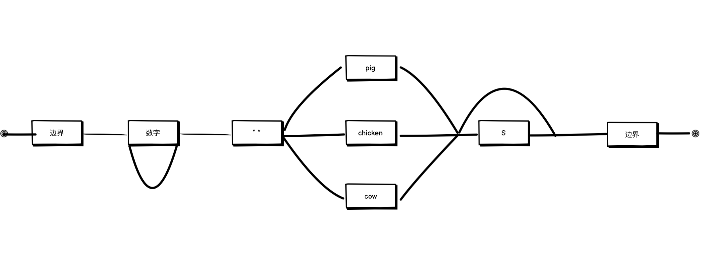

## 正则匹配机制

   当我们使用test或者exec的时候, 正则表达式会启动引擎在字符串中寻找匹配项。方法是从字符串的开头匹配正则表达式, 然后从第二个字符继续匹配正则表达式, 以此类推直到匹配或者字符串结尾为止。例如我们可以将此正则表达式: ``` /\b\d+ (pig|chicken|cow)s?\b/  ``` 构建为流程图:

   

   例如我们匹配 ```have 9 pigs```.那么整个流程如下图所示:

   - 首先在字符串的第五个位置处, 我们匹配到了单词的边界, 所以我们可以穿过第一个方框。
   - 仍然我们在第五个位置处, 匹配到了数字, 因此我们可以穿过第二个方框。
   - 接下来, 在第六个位置处, 分了两条路线, 一条路线是绕回到第二个数字方框之前, 另外一条路线向前移动经过保持单个空字符串的方框。由于第七个位置处是字符串而非数字, 因此我们选择第二条路线。
   - 在第八个位置, 我们到达了三向分支前面。我们在这里看不到``` chicken ``` 和 ``` cow ```, 但是可以看到 ```pig```, 所以我们采取那个分支。
   - 在第八个位置处, 我们经过了三向分支之后, 这里分为了两条路线, 一条路线是绕过```s``` 方块, 另外一条路线是去匹配 ``` s ``` 方块。当我们达到第11个位置的时候, 由于是字符串s, 因此第一条路线被```reject```了, 所以我们选择第二条路线。
   - 我们当前位于第十一个位置(字符串结尾)并且只能匹配单词边界。字符串的结尾都可认为是单词的边界, 因此当我们走完最后一个方框的时候就表明我们已经匹配了整个字符串。


  ::: tip
  注意: 当出现多向分支的时候, 有且仅有匹配某一项的时候才能通过。例如  ``` have 9 pigchickens ``` 会被认为是匹配失败的, 因为该字符串中同时存在pig和chicken, 不满足 ``` 有且仅有匹配某一项 ```这一项规则。
  :::

## 回溯

   当我们了解了正则的匹配机制后, 我们还需要思考一个问题。当字符串匹配失败的时候, 正则解析器是如何进行处理的呢？这就是本节的重点 —— 回溯。

   我们按照老规矩, 试着将此表达式``` /\b([01]+b|[\da-f]+h|\d+)\b/ ```用流程图的形式展示出来。

   当我们进入某个分支的时候, 它会记住当前位置。如果当前分支匹配不上, 它会返回并且尝试另外一个分支。比如对于字符串 ``` 103 ```, 对于第一个分支当他匹配到了第三个字符时, 发现没有b字符串,因此它会返回尝试第二条分支, 由于字符串中的数字后面没有h, 因此就继续返回, 开始第三条线路, 第三条线路是匹配所有的数字, 因此通过, 字符串匹配成功。当我们的字符串没有被匹配到, 从而返回上一分支起始位置的这个过程, 就叫做回溯。

   如果对回溯还有一点疑惑的话, 我们来看下一个例子:

   将 ``` /^.*x/ ``` 与 ``` abcxe ```匹配。 由于字符串末尾并没有x, 因此*号运算符会尝试从字符串末尾少一位开始匹配, 即 ``` abcx ```， 此时他依然没有发现在 
   ``` abcx ``` 之后有x, 因此它在此回溯 ``` abc ```, 发现字符串后有x, 因此匹配成功!