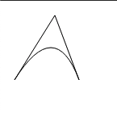
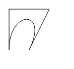
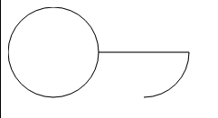
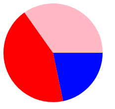
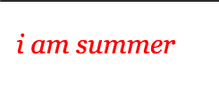
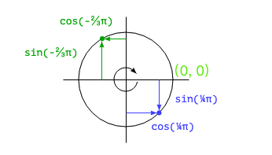
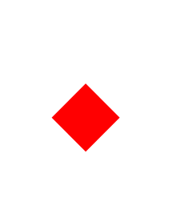
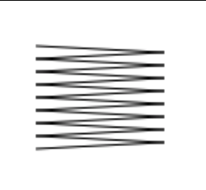
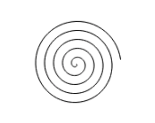
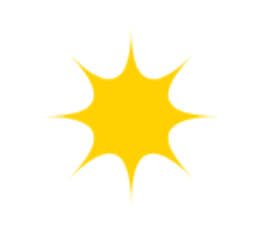

## 在画布上绘图

   浏览器为我们提供了多种显示图形的办法。比如使用样式对DOM元素进行定位和着色。但是在某些情况下, 单纯的使用常规HTML元素会很难完成任务。比如在两点之间连线。对此, 我们通常有两个选择
   , 第一种选择是基于DOM使用SVG, 第二种选择就是在画布上绘制。画布是封装图片的单个DOM元素, 它提供了一个编程接口, 用于将形状绘制到节点占用空间上。画布和SVG之间的区别主要在于, 在SVG中保留了
   形状的原始描述, 以便可以随时移动或者调整它们的大小。画布在绘制形状时立刻将其转换为元素(栅格上的彩色点), 一旦它们被绘制, 画布就不记得这些像素代表什么, 在画布上移动某个形状的唯一方法就是清除画布,并将形状重新绘制到新的位置上。

## svg

   ```html
    <svg xmlns="http://www.w3.org/2000/svg">
      <circle r="50" cx="50" cy="50" fill="red"></circle>  
    </svg>
   ```

   xmlns属性将元素更改为其他XML命名空间。这个命名空间由URL标识, 指定了我们当前正在用的方言。HTML中不存在的 ``` <circle> ``` 和 ``` <rect> ```标签在SVG中才有意义。

  

  这些标签就像HTML元素一样, 创建DOM元素, 脚本可以与之交互。比如我们可以通过下面的语句给circle设置为紫色。

  ```js
  let circle = document.querySelector('circle')
  circle.setAttribute('fill', 'purple')
  ```


## 画布元素
  
  画布图形可以绘制在canvas元素上。我们可以通过给其设置width 和 height属性确实它的属性。新画布是空的, 这意味着它完全透明, 因此在文档中是一块空白区域。
  canvas标签旨在允许不同的样式绘图。要访问实际的绘图接口, 我们首先要创建一个上下文(context), 它是一个对象, 其方法提供绘图接口。

  ```js
  <canvas width="100" height="100" />
  let canvas = document.querySelector('canvas')
  let context = canvas.getContext('2d');
  context.fillStyle = "red";
  context.fillRect(50, 50, 50, 50);
  ```

## 线和面

  在画布接口中, 形状可以被填充。```fillRect``` 方法可以用于填充形状。它的参数首先是矩形左上角的x坐标和y坐标, 然后是宽度和高度。类似的方法strokeRect用于绘制矩形的轮廓。这两个方法都不需要任何的其他参数。填充的颜色、笔画的粗细不是由方法的参数决定的, 而不是由上下文对象的属性决定的。

  fillStyle用于控制形状填充的方式。 strokeStyle用于决定描边的样式。

  ```js
  let canvas = document.querySelector('canvas')
  let context = canvas.getContext('2d');
  context.strokeStyle="red";
  context.strokeRect(5, 5, 50, 50);
  context.lineWidth = 10
  context.strokeRect(100, 5, 50, 50);
  ```

  


## 路径

  路径是一些系列线条。2D画布接口采用一种特殊的方法来描述这样的路径。这完全是通过副作用完成的。路径不是可以存储和传递的值。相反, 如果要对路径执行某些操作, 则需要执行一系列方法调用来描述形状。

  ```js
  let canvas = document.querySelector('canvas')
  let ctx = canvas.getContext('2d');
  ctx.beginPath();
  for (let y = 0; y < 100; y += 10) {
    ctx.moveTo(10, y);
    ctx.lineTo(90, y);
  }

  ctx.stroke()
  ```

  

  上述代码创建多条水平线段, 然后使用stroke方法对其进行描边。使用lineTo创建的每个线段从都路径的当前位置开始。除非调用moveTo, 当前位置通常是上一个线段的结尾。在调用moveTo的情况下, 下一个线段将从传递给moveTo的位置开始。

  填充路径时,每个相撞都会被单独填充。路径可以包含很多形状——每个moveTo动作开始一个新形状。但是在填充之前, 路径需要被封闭(意味着它的起点和重点处于相同位置)。如果路径尚未封闭, 则从其终点添加一条线段到其起点, 并填充形成的路径所包围的形状。

  ```js
  let canvas = document.querySelector('canvas')
  let ctx = canvas.getContext('2d');
  ctx.beginPath();
  ctx.moveTo(50, 10);
  ctx.lineTo(10, 70);
  ctx.lineTo(90, 70);
  ctx.closePath();
  ctx.fill()
  ```

  


## 曲线

   路径也可以包含曲线, 麻烦的是绘制曲线涉及更多操作。

   ```quadraticCurveTo``` 方法将曲线绘制到定点。为了确定线的曲率, 要给此方法提供 ``` 控制点 ``` 和 ``` 目标点 ```.

   ```js
  let ctx = document.querySelector('canvas').getContext('2d');
  ctx.beginPath();
  ctx.moveTo(10, 90);
  ctx.quadraticCurveTo(60, 10, 90, 90);
  ctx.lineTo(60, 10);
  ctx.closePath();
  ctx.stroke();
   ```

  

  我们从左到右绘制一条二次曲线, 以(60, 10)作为控制点, 然后绘制两条线段, 它们通过该控制点并返回到曲线的起点。


  bezierCurveTo 方法绘制了类似的曲线。这个曲线对于每个线路的断点都有两个控制点, 而不是单个控制点。

  ```js
  let ctx = document.querySelector('canvas').getContext('2d');
  ctx.beginPath();
  ctx.moveTo(10, 90);
  // 控制点1(10, 10) 控制点2(90, 10) 目标点(50, 50)
  ctx.bezierCurveTo(10, 10, 90, 10, 50, 90)
  ctx.lineTo(90, 10)
  ctx.lineTo(10, 10)
  ctx.closePath()
  ctx.stroke()
  ```

  两个控制点指定曲线两端的方向。离它们的相应点越远, 曲线就越朝那个方向凸出。

  

  arc方法是一种绘制会沿着圆的边缘弯曲的线的方法。它需要一对弧的中心坐标、一个半径、以及起始角和终止角。

  最后两个参数可以仅绘制圆的一部分。角度以弧度而非度数来度量。这就意味着整个圆的角度为2π, 或者 2*Math.PI， 大约为6.28.角度从位于圆中心点的右侧点开始计算, 然后从那里顺时针旋转。

  ```js
  let ctx = document.querySelector('canvas').getContext('2d');
  ctx.beginPath();
  ctx.arc(50, 50, 50, 0, 7);
  ctx.arc(150, 50, 50, 0, 0.5 * Math.PI);
  ctx.stroke()
  ```

  

 ## 绘制饼图

  我们的目标是将以下的 ``` result ```渲染成一个饼图。

  ```js
  const result = [
    { name: 'A', count: 100, color: 'red' },
    { name: 'B', count: 50, color: 'blue' },
    { name: 'C', count: 80, color: 'pink' }
  ]
  ```

  为了绘制饼图, 我们绘制了许多饼状切片, 每个切片都由一段弧线和一对连接弧线端点与该弧线的中心点的线段组成。我们可以通过将一个完整的圆除以反馈的总数, 然后把该数乘以选择某选项的人数来计算每个弧占用的角度。


  ```js
  const results = [
    { name: 'B', count: 50, color: 'blue' },
      { name: 'A', count: 100, color: 'red' },
      { name: 'C', count: 80, color: 'pink' }
    ]

  let ctx = document.querySelector('canvas').getContext('2d');
  let total = results.reduce((sum, { count }) => sum + count ,0);
  let currentAngle = 0;

  for (let result of results) {
    let sliceAngle = (result.count / total) * 2 * Math.PI;
    ctx.beginPath();
    ctx.arc(100, 100, 100, currentAngle, currentAngle + sliceAngle);
    currentAngle +=sliceAngle;
    ctx.lineTo(100, 100);
    ctx.fillStyle = result.color;
    ctx.fill()
  }
  ```

  

   但是我们没有在图形上告诉大家切片的含义, 因此我们需要一种方法将文本绘制到画布上。

## 添加文本

  2D画布绘图上下文提供了 ``` fillText ``` 和 ``` strokeText ```方法。后者可用于勾画字母轮廓, 但是通常filleText一般是我们经常用到的。

  ```js
  let ctx = document.querySelector('canvas').getContext('2d')
  ctx.font = "30px Georgia"
  ctx.fillStyle = "red"
  ctx.fillText('i am summer', 10, 50);
  ```

  我们通过使用font属性指定文本的大小、样式和字体。

  比如我们添加 ``` italic ``` 就可以将字体设置为斜体

  ```js
  ctx.font = "italic 30px Georgia"
  ```

  

  fillText 和 strokeText 的最后两个参数提供了绘制字体的位置。默认情况下, 它们指示文本的字母基线开始的位置, 即字母所“站”的线, 不计算j或者p等字母的悬挂部分。我们可以通过将
  ``` textAlign ``` 属性设置为 “end” 或者 “center”来更改水平位置, 或者通过将 ``` textBaseline ``` 设置为 "top" "middle" 来更改垂直位置。

  那么, 我们接下来就开始继续完善上面的饼图, 给饼图添加文字。

  我们在上面计算的时候都用的是弧度制, 因此要具体到实际文本的坐标我们还需要涉及Math.sin 和 Math.cos函数的知识点。

  

  ``` Math.cos ```  和 ``` Math.sin ``` 可以用于计算原点为(0, 0), 半径为1的圆周上的点。这两个函数都将它们的参数解释为这个圆上的位置, 零表示圆最右侧的点. 顺时针方向运动到2π将会绕过整个圆周. Math.cos可以计算出对应点的x坐标, Math.sin可以计算出对应点的y坐标。


  ```js
  const results = [
  { name: 'B', count: 50, color: 'blue' },
    { name: 'A', count: 50, color: 'red' },
    { name: 'C', count: 50, color: 'pink' },
    { name: 'D', count: 50, color: 'yellow' }
  ]

  let cx = document.querySelector("canvas").getContext("2d");
  let total = results.reduce(function(sum, choice) {
    return sum + choice.count;
  }, 0);

  let currentAngle = -0.5 * Math.PI;
  let centerX = 300, centerY = 150;

  results.forEach(function(result) {
    let sliceAngle = (result.count / total) * 2 * Math.PI;
    cx.beginPath();
    cx.arc(centerX, centerY, 100, currentAngle, currentAngle + sliceAngle);
    let middleAngle = currentAngle + 0.5 * sliceAngle;
    let textX = Math.cos(middleAngle) * 120 + centerX;
    let textY = Math.sin(middleAngle) * 120 + centerY;
    cx.textBaseLine = "middle";
    if (Math.cos(middleAngle) > 0) {
      cx.textAlign = "left";
    } else {
      cx.textAlign = "right";
    }
    cx.font = "15px sans-serif";
    cx.fillStyle = "black";
    cx.fillText(result.name, textX, textY);

    currentAngle += sliceAngle;
    cx.lineTo(centerX, centerY);
    cx.fillStyle = result.color;
    cx.fill();
  });
  ```

## 总结

   通过学习了以上的知识, 我们可以试着画一些好看的图形来巩固canvas基础知识

   - 菱形

   ```js
    let ctx = document.querySelector("canvas").getContext("2d");
    ctx.translate(100, 100)
    ctx.rotate(Math.PI / 4);
    ctx.fillStyle = "red";
    ctx.fillRect(20, 20, 60, 60);
    ctx.resetTransform();
   ```

  

  - 弹簧

  ```js
  const x = 240, y =20;
  let ctx = document.querySelector("canvas").getContext("2d");
  ctx.beginPath();
  ctx.moveTo(x, y);
  for (let i = 0; i < 8; i++) {
    ctx.lineTo(x + 80, y + i * 8 + 4);
    ctx.lineTo(x, y + i * 8 + 8);
  }
  ctx.stroke();
  ```

  

  - 旋涡

  ```js
  const x = 240, y =20;
  let ctx = document.querySelector("canvas").getContext("2d");
  let radius = 50, xCenter = x + radius, yCenter = y + radius;
  ctx.beginPath();
  ctx.moveTo(xCenter, yCenter);
    for (let i = 0; i < 300; i++) {
      let angle = i * Math.PI / 30;
      let dist = radius * i / 300;
      ctx.lineTo(xCenter + Math.cos(angle) * dist,
                yCenter + Math.sin(angle) * dist);
    }
  ctx.stroke();
  ```

  

  - 黄色星星

  ```js
  const x = 240, y =20;
  let ctx = document.querySelector("canvas").getContext("2d");
  let radius = 50, xCenter = x + radius, yCenter = y + radius;
    ctx.beginPath();
    ctx.moveTo(xCenter + radius, yCenter);
    for (let i = 1; i <= 8; i++) {
      let angle = i * Math.PI / 4;
      ctx.quadraticCurveTo(xCenter, yCenter,
                          xCenter + Math.cos(angle) * radius,
                          yCenter + Math.sin(angle) * radius);
    }
  ctx.fillStyle = "gold";
  ctx.fill();
  ```

  
