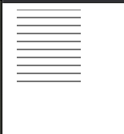

## 在画布上绘图

   浏览器为我们提供了多种显示图形的办法。比如使用样式对DOM元素进行定位和着色。但是在某些情况下, 单纯的使用常规HTML元素会很难完成任务。比如在两点之间连线。对此, 我们通常有两个选择
   , 第一种选择是基于DOM使用SVG, 第二种选择就是在画布上绘制。画布是封装图片的单个DOM元素, 它提供了一个编程接口, 用于将形状绘制到节点占用空间上。画布和SVG之间的区别主要在于, 在SVG中保留了
   形状的原始描述, 以便可以随时移动或者调整它们的大小。画布在绘制形状时立刻将其转换为元素(栅格上的彩色点), 一旦它们被绘制, 画布就不记得这些像素代表什么, 在画布上移动某个形状的唯一方法就是清除画布,并将形状重新绘制到新的位置上。

## svg

   ```html
    <svg xmlns="http://www.w3.org/2000/svg">
      <circle r="50" cx="50" cy="50" fill="red"></circle>  
    </svg>
   ```

   xmlns属性将元素更改为其他XML命名空间。这个命名空间由URL标识, 指定了我们当前正在用的方言。HTML中不存在的 ``` <circle> ``` 和 ``` <rect> ```标签在SVG中才有意义。

  

  这些标签就像HTML元素一样, 创建DOM元素, 脚本可以与之交互。比如我们可以通过下面的语句给circle设置为紫色。

  ```js
  let circle = document.querySelector('circle')
  circle.setAttribute('fill', 'purple')
  ```


## 画布元素
  
  画布图形可以绘制在canvas元素上。我们可以通过给其设置width 和 height属性确实它的属性。新画布是空的, 这意味着它完全透明, 因此在文档中是一块空白区域。
  canvas标签旨在允许不同的样式绘图。要访问实际的绘图接口, 我们首先要创建一个上下文(context), 它是一个对象, 其方法提供绘图接口。

  ```js
  <canvas width="100" height="100" />
  let canvas = document.querySelector('canvas')
  let context = canvas.getContext('2d');
  context.fillStyle = "red";
  context.fillRect(50, 50, 50, 50);
  ```

## 线和面

  在画布接口中, 形状可以被填充。```fillRect``` 方法可以用于填充形状。它的参数首先是矩形左上角的x坐标和y坐标, 然后是宽度和高度。类似的方法strokeRect用于绘制矩形的轮廓。这两个方法都不需要任何的其他参数。填充的颜色、笔画的粗细不是由方法的参数决定的, 而不是由上下文对象的属性决定的。

  fillStyle用于控制形状填充的方式。 strokeStyle用于决定描边的样式。

  ```js
  let canvas = document.querySelector('canvas')
  let context = canvas.getContext('2d');
  context.strokeStyle="red";
  context.strokeRect(5, 5, 50, 50);
  context.lineWidth = 10
  context.strokeRect(100, 5, 50, 50);
  ```

  


## 路径

  路径是一些系列线条。2D画布接口采用一种特殊的方法来描述这样的路径。这完全是通过副作用完成的。路径不是可以存储和传递的值。相反, 如果要对路径执行某些操作, 则需要执行一系列方法调用来描述形状。

  ```js
  let canvas = document.querySelector('canvas')
  let ctx = canvas.getContext('2d');
  ctx.beginPath();
  for (let y = 0; y < 100; y += 10) {
    ctx.moveTo(10, y);
    ctx.lineTo(90, y);
  }

  ctx.stroke()
  ```

  

  上述代码创建多条水平线段, 然后使用stroke方法对其进行描边。使用lineTo创建的每个线段从都路径的当前位置开始。除非调用moveTo, 当前位置通常是上一个线段的结尾。在调用moveTo的情况下, 下一个线段将从传递给moveTo的位置开始。

  填充路径时,每个相撞都会被单独填充。路径可以包含很多形状——每个moveTo动作开始一个新形状。但是在填充之前, 路径需要被封闭(意味着它的起点和重点处于相同位置)。如果路径尚未封闭, 则从其终点添加一条线段到其起点, 并填充形成的路径所包围的形状。

  ```js
  let canvas = document.querySelector('canvas')
  let ctx = canvas.getContext('2d');
  ctx.beginPath();
  ctx.moveTo(50, 10);
  ctx.lineTo(10, 70);
  ctx.lineTo(90, 70);
  ctx.closePath();
  ctx.fill()
  ```

  

  
