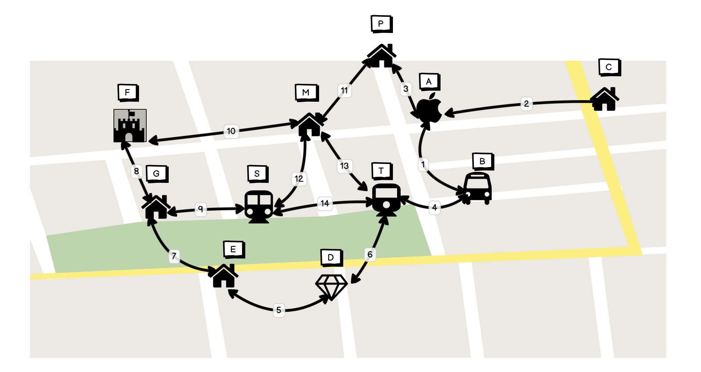
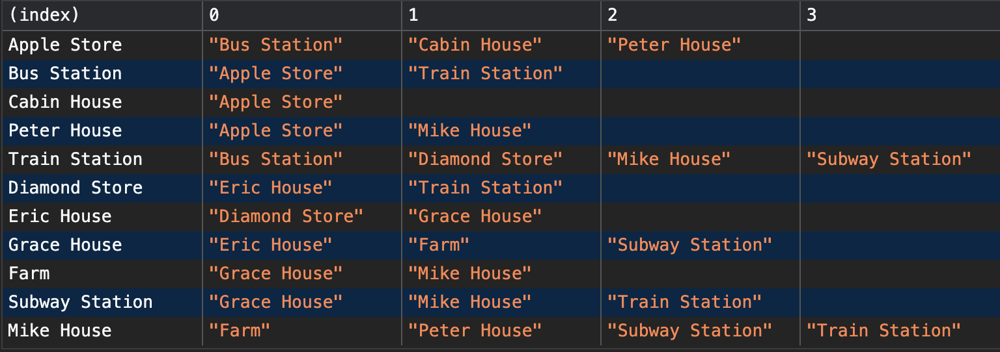
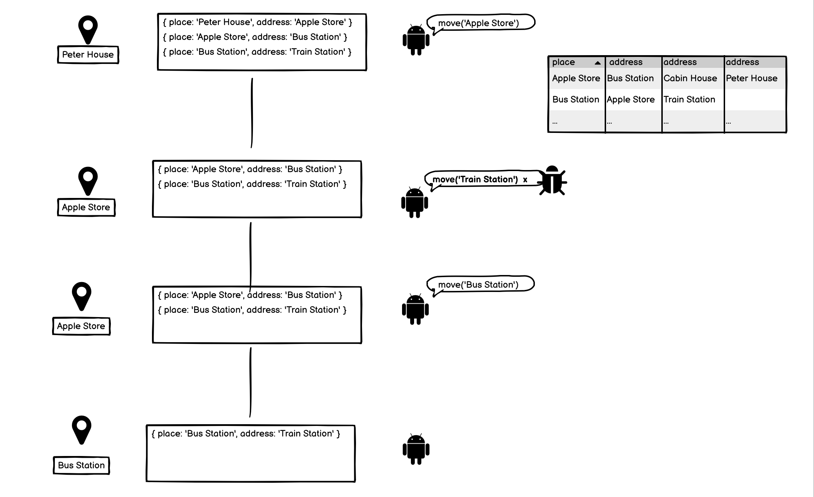
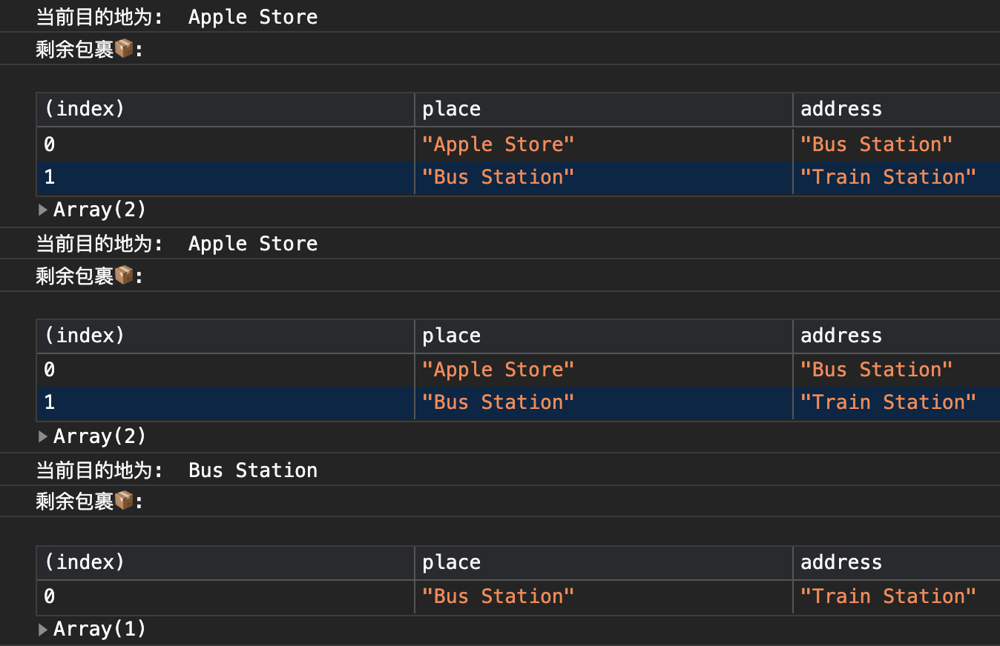
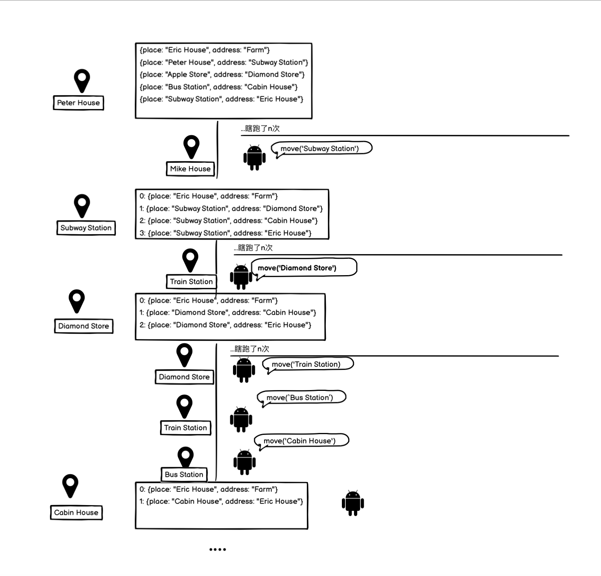

::: tip
   前言: 本文的例子摘自于《javascript编程精解》。笔者写这篇文章的目的是觉得这个小项目还蛮有趣的, 因此写下这篇文章分享给大家。
:::


## 村庄M

  M村由11个地点组成, 其间共有14条道路。我们可以用如下道路数组来描述: 

  ```js
  const roads = [
    'Apple Store - Bus Station', 'Apple Store - Cabin House',
    'Apple Store - Peter House', 'Bus Station - Train Station',
    'Diamond Store - Eric House', 'Diamond Store - Train Station',
    'Eric House - Grace House', 'Grace House - Farm',
    'Grace House - Subway Station', 'Mike House - Farm',
    'Mike House - Peter House', 'Mike House - Subway Station',
    'Mike House - Train Station', 'Subway Station - Train Station',
  ]
  ```

  村里的道路组成了一张图。这张图就是机器人要行走的世界:

  

  字符串数组不太容易使用, 因此我们按照起点终点将道路列表转化为 ``` [start, end]```的形式。

  ```js
  function buildGraph(edges) {
    let graph = Object.create(null);

    function addEdge(from, to) {
      if(!graph[from]) {
        graph[from] = [to];
      } else {
        graph[from].push(to);
      }
    }

    for (let [from, to] of edges.map(r => r.split('-'))) {
        addEdge(from, to);
        addEdge(to, from);
    }
    
    return graph;
  }
  ```

  那么, ```roads```经过``` buildGraph ``` 之后我们就可以清晰的发现, 从哪个地方可以到哪些地方。

  


## 任务

  我们的机器人在村庄内不停的移动。各个地点都有包裹, 每个包裹都要投递到其他地方。当机器人见到包裹时, 它会拾取包裹并将其送至目的地。当所有的任务都已送达是, 它就完成了任务。

  按照传统的面向对象编程, 马老师自然是对村庄上的各个元素定义对象, 创建类: 创建机器人类, 创建包裹类, 亦或是创建地点类等等, 然后这些对象可以包含当前状态的属性。我说不行, 按你的做法, 每个对象都有自己不断变化的状态, 这些程序通常都很难理解, 而且很容易出问题。

  马老师似乎不太服我啊，年轻人：来切磋切磋！很快啊, 我立马撸了一套 ``` 组合拳```。

  ```js
 class VillageState {
    constructor(place, parcels) {
      this.place = place;
      this.parcels = parcels;
    }

    move(destination) {
      if(!roadGraph[this.place].includes(destination)) {
        return this;
      } else {
        let parcels = this.parcels.map(item => {
          if(item.place !== this.place) return item;
          return { place: destination, address: item.address }
        }).filter(item => item.place !== item.address);
        return new VillageState(destination, parcels);
      }
    }
 }
  ```

  我们将村庄的状态浓缩为定义它的最小值集, 即机器人当前的位置以及它还未分发出去的包裹的集合, 每个包裹都包含起点和终点。

  ```move方法``` 是负责机器人产生移动的。首先它将会检查机器人当前的位置是否有去往目的地的道路。如果没有机器人就保持在原地, 并且它的包裹数量也不会变, 我们可以暂且认为它是一个无效的移动指令。如果存在这样的道路, 我们会创建一个新的状态, 用于改变机器人的位置和包裹数量。遍历机器人身上的包裹, 如果机器人当前位置和包裹中的起始地址一样, 那么机器人就会移动, move的位置(destination)就是机器人的下一次的起点位置, 同时身上的包裹将会减少。

  我们跑一个示例, 来验证算法的正确性: 

  ```js
 let first = new VillageState("Peter House", [
   { place: 'Peter House', address: 'Apple Store' }, 
   { place: 'Apple Store', address: 'Bus Station' },
   { place: 'Bus Station', address: 'Train Station' }]);

  let next = first.move('Apple Store');
  
  console.log('当前目的地为: ', next.place);

  console.table(next.parcels);

  let nextError = next.move('Train Station');
  
  console.log('当前目的地为: ', nextError.place);

  console.table(nextError.parcels);

  let second = next.move('Bus Station');
  
  console.log('当前目的地为: ', second.place);

  console.table(second.parcels);
  ```

  按照我们的算法，首先机器人的初始位置在 ``` Peter House ```。然后我们给了机器人一个``` move('Apple Store') ``` 的指令。查看上述地图, 机器人发现3号路线可以到达。
  因此机器人开始移动, 此时机器人的位置应该到达了``` Apple Store' ```， 它身上对应的包裹应该被卸下。此时机器人又接收到了 ``` move('Train Station') ```指令,机器人检查路线图, 发现没有对应的路可以走, 因此就保持原状。最后机器人又接收到了 ``` next.move('Bus Station') ```指令, 查看地图, 发现有路可走, 那么机器人就开始移动。整个过程如下图所示: 

  

  那么实际的输出结果, 是否与我们预想的一样呢?

  


## 模拟机器人送货

   送货机器人每次通过观察路线图, 从而判断它想要移动的方向。因此我们可以说机器人是一个函数, 它接收 ``` VillageState ``` 对象并且返回附近地点的名称。考虑到我们的机器人必须是通过"做什么"来改变状态。它必须通过访问所有的包裹的位置以及知道包裹的目的地来投递, 并且包裹只有被取得后才能被投递出去。

   ```js
  function runRobot(state, robot) {
    for (let turn = 0;;turn++) {
      if(state.parcels.length === 0) {
        console.log(`Done in ${turn}`);
        break;
      }

      let action = robot(state);
      state = state.move(action.direction);
      console.log(`Move to ${action.direction}`);
    }
  }
   ```

   那么最简单的策略就是: 机器人每一个回合都可以随意行走。这就意味着, 机器人很有可能会遇到所有的包裹, 并且在某一个时刻到它应该投递的地点。
   
   ```js
  function randomPick(array) {
      let choice = Math.floor(Math.random() * array.length);
      return array[choice];
  }

  function randomRobot(state) {
    return { direction: randomPick(roadGraph[state.place])};
  }

   ```

   为了让机器人工作, 我们需要一个方法, 来创建``` VillageState ```的初始状态, 即``` 机器人的初始位置 ``` 和 ``` 机器人的包裹数量 ```。


   ```js
  VillageState.random = (parcelCount = 5) => {
    const roadGraphKeys = Object.keys(roadGraph);
    let parcels = [];
    for (let i = 0; i < parcelCount; i++) {
      let address = randomPick(roadGraphKeys);
      let place;
      do {
        place = randomPick(roadGraphKeys);
      } while (place == address);
      parcels.push({ place, address});
    }
    return new VillageState('Peter House', parcels)
  }
   ```

   我们不希望把任何包裹从所在的地点投递到同一个目的地, 因此如果我们们循环得到了一个等于目的地的时候, 它会重新选择新的地点。
   
   我们继续来测试机器人的执行过程:

  ```js
  runRobot(VillageState.random(), randomRobot);
  ```

  


  由于机器人它没有提前计划, 所以最终机器人跑了84次, 才将5个包裹全部送完。因此, 我们需要给机器人制定路线。