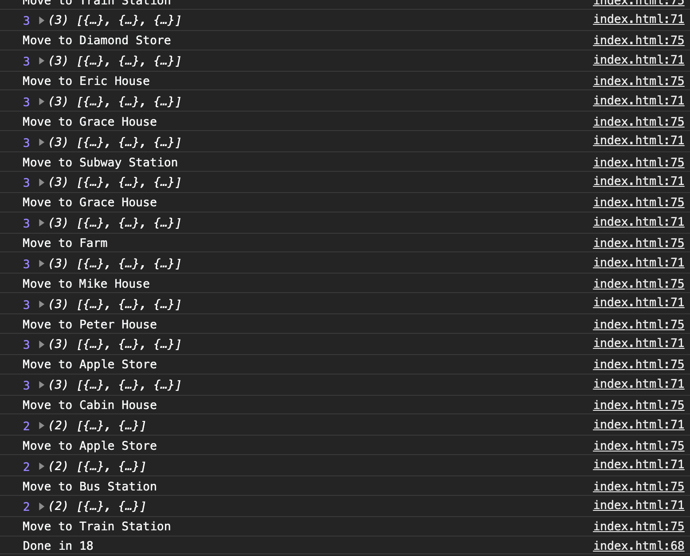
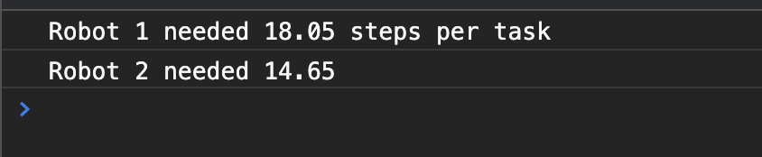

::: tip
   前言: 本文的例子摘自于《javascript编程精解》。笔者写这篇文章的目的是觉得这个小项目还蛮有趣的, 因此写下这篇文章分享给大家。
:::


## 背景

   村庄M由11个地点组成, 其间共有14条道路。我们可以用如下道路数组来描述: 

  ```js
  const roads = [
    'Apple Store - Bus Station', 'Apple Store - Cabin House',
    'Apple Store - Peter House', 'Bus Station - Train Station',
    'Diamond Store - Eric House', 'Diamond Store - Train Station',
    'Eric House - Grace House', 'Grace House - Farm',
    'Grace House - Subway Station', 'Mike House - Farm',
    'Mike House - Peter House', 'Mike House - Subway Station',
    'Mike House - Train Station', 'Subway Station - Train Station',
  ]
  ```

  村里的道路组成了一张图。这张图就是机器人要行走的世界:

  

  字符串数组不太容易使用, 因此我们按照起点终点将道路列表转化为 ``` [start, end]```的形式。

  ```js
  function buildGraph(edges) {
    let graph = Object.create(null);

    function addEdge(from, to) {
      if(!graph[from]) {
        graph[from] = [to];
      } else {
        graph[from].push(to);
      }
    }

    for (let [from, to] of edges.map(r => r.split('-'))) {
        addEdge(from, to);
        addEdge(to, from);
    }
    
    return graph;
  }
  ```

  那么, ```roads```经过``` buildGraph ``` 之后我们就可以清晰的发现, 从哪个地方可以到哪些地方。

  


## 任务

  我们的机器人在村庄内不停的移动。各个地点都有包裹, 每个包裹都要投递到其他地方。当机器人见到包裹时, 它会拾取包裹并将其送至目的地。当所有的任务都已送达是, 它就完成了任务。

  按照传统的面向对象编程, 马老师自然是对村庄上的各个元素定义对象, 创建类: 创建机器人类, 创建包裹类, 亦或是创建地点类等等, 然后这些对象可以包含当前状态的属性。我说不行, 按你的做法, 每个对象都有自己不断变化的状态, 这些程序通常都很难理解, 而且很容易出问题。

  马老师似乎不太服我啊，年轻人：来切磋切磋！很快啊, 我立马撸了一套 ``` 组合拳```。

  ```js
 class VillageState {
    constructor(place, parcels) {
      this.place = place;
      this.parcels = parcels;
    }

    move(destination) {
      if(!roadGraph[this.place].includes(destination)) {
        return this;
      } else {
        let parcels = this.parcels.map(item => {
          if(item.place !== this.place) return item;
          return { place: destination, address: item.address }
        }).filter(item => item.place !== item.address);
        return new VillageState(destination, parcels);
      }
    }
 }
  ```

  我们将村庄的状态浓缩为定义它的最小值集, 即机器人当前的位置以及它还未分发出去的包裹的集合, 每个包裹都包含起点和终点。

  ```move方法``` 是负责机器人产生移动的。首先它将会检查机器人当前的位置是否有去往目的地的道路。如果没有机器人就保持在原地, 并且它的包裹数量也不会变, 我们可以暂且认为它是一个无效的移动指令。如果存在这样的道路, 我们会创建一个新的状态, 用于改变机器人的位置和包裹数量。遍历机器人身上的包裹, 如果机器人当前位置和包裹中的起始地址一样, 那么机器人就会移动, move的位置(destination)就是机器人的下一次的起点位置, 同时身上的包裹将会减少。

  我们跑一个示例, 来验证算法的正确性: 

  ```js
 let first = new VillageState("Peter House", [
   { place: 'Peter House', address: 'Apple Store' }, 
   { place: 'Apple Store', address: 'Bus Station' },
   { place: 'Bus Station', address: 'Train Station' }]);

  let next = first.move('Apple Store');
  
  console.log('当前目的地为: ', next.place);

  console.table(next.parcels);

  let nextError = next.move('Train Station');
  
  console.log('当前目的地为: ', nextError.place);

  console.table(nextError.parcels);

  let second = next.move('Bus Station');
  
  console.log('当前目的地为: ', second.place);

  console.table(second.parcels);
  ```

  按照我们的算法，首先机器人的初始位置在 ``` Peter House ```。然后我们给了机器人一个``` move('Apple Store') ``` 的指令。查看上述地图, 机器人发现3号路线可以到达。
  因此机器人开始移动, 此时机器人的位置应该到达了``` Apple Store' ```， 它身上对应的包裹应该被卸下。此时机器人又接收到了 ``` move('Train Station') ```指令,机器人检查路线图, 发现没有对应的路可以走, 因此就保持原状。最后机器人又接收到了 ``` next.move('Bus Station') ```指令, 查看地图, 发现有路可走, 那么机器人就开始移动。整个过程如下图所示: 

  

  那么实际的输出结果, 是否与我们预想的一样呢?

  


## 模拟机器人送货

   送货机器人每次通过观察路线图, 从而判断它想要移动的方向。因此我们可以说机器人是一个函数, 它接收 ``` VillageState ``` 对象并且返回附近地点的名称。考虑到我们的机器人必须是通过"做什么"来改变状态。它必须通过访问所有的包裹的位置以及知道包裹的目的地来投递, 并且包裹只有被取得后才能被投递出去。

   ```js
  function runRobot(state, robot) {
    for (let turn = 0;;turn++) {
      if(state.parcels.length === 0) {
        console.log(`Done in ${turn}`);
        break;
      }

      let action = robot(state);
      state = state.move(action.direction);
      console.log(`Move to ${action.direction}`);
    }
  }
   ```

   那么最简单的策略就是: 机器人每一个回合都可以随意行走。这就意味着, 机器人很有可能会遇到所有的包裹, 并且在某一个时刻到它应该投递的地点。
   
   ```js
  function randomPick(array) {
      let choice = Math.floor(Math.random() * array.length);
      return array[choice];
  }

  function randomRobot(state) {
    return { direction: randomPick(roadGraph[state.place])};
  }

   ```

   为了让机器人工作, 我们需要一个方法, 来创建``` VillageState ```的初始状态, 即``` 机器人的初始位置 ``` 和 ``` 机器人的包裹数量 ```。


   ```js
  VillageState.random = (parcelCount = 5) => {
    const roadGraphKeys = Object.keys(roadGraph);
    let parcels = [];
    for (let i = 0; i < parcelCount; i++) {
      let address = randomPick(roadGraphKeys);
      let place;
      do {
        place = randomPick(roadGraphKeys);
      } while (place == address);
      parcels.push({ place, address});
    }
    return new VillageState('Peter House', parcels)
  }
   ```

   我们不希望把任何包裹从所在的地点投递到同一个目的地, 因此如果我们们循环得到了一个等于目的地的时候, 它会重新选择新的地点。
   
   我们继续来测试机器人的执行过程:

  ```js
  runRobot(VillageState.random(), randomRobot);
  ```

  


  由于机器人它没有提前计划, 所以最终机器人跑了84次, 才将5个包裹全部送完。因此, 我们需要给机器人制定路线, 并且让机器人自己记住路线。如果我们让机器人事先知道村庄中所有地点的路线, 那么只要机器人经过两次, 就肯定可以将包裹投递完。也就是说不管是几个包裹, 一定会在24次内跑完。

  除此之外, 要实现路线跟踪机器人, 我们需要利用机器人的记忆(memory)。机器人将其余的路径保存在记忆中, 并且每一个回合都舍弃第一个元素。

## 制定机器人路线

  以下是我们为机器人定义的一条完整的线路:

  ```js
   const mailRoute = [
   'Apple Store', 'Cabin House', 'Apple Store',
   'Bus Station', 'Train Station', 'Diamond Store', 
   'Eric House', 'Grace House', 'Subway Station', 
   'Grace House', 'Farm', 'Mike House', 'Peter House'
 ];
 ```

  那么机器人不再是``` randomRobot ```了。它应该是一个按照路线走的机器人, 我们暂且定义它为 ``` routeRobot ```

  ```js
  function routeRobot(state, memory) {
    if(memory.length === 0) {
      memory = mailRoute
    }
    return { direction: memory[0], memory: memory.slice(1) }
  }
  ```
  
  同时修改``` robot ``` 函数, 让其支持缓存。

  ```js
  function runRobot(state, robot, memory) {
    for (let turn = 0;;turn++) {
      if(state.parcels.length === 0) {
        console.log(`Done in ${turn}`);
        break;
      }
      let action = robot(state, memory);
      state = state.move(action.direction);
      memory = action.memory;
      console.log(`Move to ${action.direction}`);
    }
  }
  ```

  我们继续执行 ``` runRobot(VillageState.random(), routeRobot, []); ``` 
  
  

  这个机器人已经比之前的机器人快了很多, 几乎快了6倍左右。但是我们总是会让机器人变的更加聪明, 通常来说机器人并不需要走那么多。

##  优化机器人路线

  之前我们采用了固定线路的方式, 让机器人完成包裹的投递, 如果机器人将它的行为路线自动调整为需要完成的实际工作, 那么机器人的送货效率可以更上一层楼。要做到这一点的话, 我们必须针对性地移动到给定的包裹或者移动到包裹必须投递到的位置。即使目标在一次移动无法到达的地点也要这样做, 这就需要某种寻路功能。

  常混迹于leetCode的同学应该都知道, 通过图来寻找的路线问题是一个``` 搜索问题 ```。这类问题的关键之处在于: 给定一个解决方案是否有效的解决方案, 我们不能以1+1=2的方式直接计算方案。相反, 我们必须继续创建潜在的解决方案, 直到我们找到一个有效的解决方案为止。

  图中路线的数量是无限的，但是当我们搜索从A到B路线的时候, 我们只对那些从A出发的路线感兴趣, 至于其他的都是无效的路线, 我们不需要care。因此从这一点出发, 减少了机器人必须考虑的路线数量。

  事实上, 我们往往最感兴趣的肯定是``` 最短路线 ```。因此, 我们需要在查看较长路线的之前先查看较短的路线。一个好的方法是: 从起点开始增长路线, 探索尚未到访的每个可达到的地点, 直到路线到达目标为止。基于以上思路, 我们可以用以下的代码来描述它: 

  ```js
 function findRoute(graph, from, to) {
    let work = [{ at: from, route: [] }];
    for (let i = 0; i < work.length; i++) {
      let { at, route } = work[i];
      for (let place of graph[at]) {
        if(place === to) return route.concat(place);
        if(!work.some(r => r.at === place)) {
          work.push({ at: place, route: route.concat(place) });
        }
      }
    }
 }
  ```

  首先我们必须把率先到达的地点探索完成。即使可能还有其他较短的路径尚未探索过, 我们也不能每到达一个地点就立即探索它, 因为这意味着到达的地点也要立即被探索, 以此类推。因此在``` findRoute ``` 函数中, 保留了一个``` 工作列表 work ```。这是一系列应该接下来探索的地点, 以及让我们到达那里的路线。初始的work应该是起始位置和空的路线指引。

  然后, 通过获取列表中的下一个条目并且对其进行探索来执行搜索, 这就意味着查看该位置开始的所有道路。如果一个道路到达目标, 则可以返回完成的路线。否则, 如果我们之前没有查看过这个地点, 则会在列表中添加一个新的条目。如果我们之前探索过它, 我们就不需要再次探索了。因为我们首先会查看短路线, 所以如果我们找到了通过那个地点的新路, 它要么更长, 要么恰好与现在的一样长。

  ```js
 function goalOrientedRobot({ place, parcels }, route) {
    if(route.length === 0) {
      let parcel = parcels[0]
      if(parcel.place !== place) {
        route = findRoute(roadGraph, place, parcel.place);
      } else {
        route = findRoute(roadGraph, place, parcel.address);
      }
    }
    return { direction: route[0], memory: route.slice(1) }
 }
  ```

  它比``` routeRobot ```机器人优秀的地方在于, 它会将记忆值用作要移入的方向, 就像路线跟踪机器人一样。每当包裹为空时, 它必须弄清楚下一步该做什么。它需要处理集合中第一个未被投递的包裹, 如果包裹没有被拾取, 则算出一条通往它的路线。如果包裹已经被拾取. 它仍然需要被投递, 因此机器人会创建一条通往目标地址的路线。

  经过测试, 我们发现 ``` goalOrientedRobot ``` 机器人投递5个包裹所用的平均次数(大约16步), 比``` routeRobot ```快了一点。为了让结果更有说服力, 我们需要编写一个函数用于比较不同机器人之间的派发效率.

## 构建测试函数

```js

 function countSteps(state, robot, memory) {
  for (let steps = 0;; steps++) {
    if (state.parcels.length === 0) return steps;
    let action = robot(state, memory);
    state = state.move(action.direction);
    memory = action.memory;
  }
}

function compareRobots(robot1, memory1, robot2, memory2) {
  let total1 = 0, total2 = 0;
  for (let i = 0; i < 100; i++) {
    let state = VillageState.random();
    total1 += countSteps(state, robot1, memory1);
    total2 += countSteps(state, robot2, memory2);
  }
  console.log(`Robot 1 needed ${total1 / 100} steps per task`)
  console.log(`Robot 2 needed ${total2 / 100}`)
}

```

我们给两个机器人同时生成100个相同的任务, 当它们分别送完了所有包裹后, 输出每个任务的平均步数。经过多轮的测试, ``` routeRobot ``` 平均用时为18s, 而 ``` goalOrientedRobot ``` 的平均用时为15s。




## 写在最后

  如果小伙伴们有更聪明的机器人, 欢迎在评论探讨哦~。如果觉得本文有帮助, 请给我点个小小的赞[star](https://github.com/Summer-andy/life-is-moment)哦, 谢谢啦~ 

  