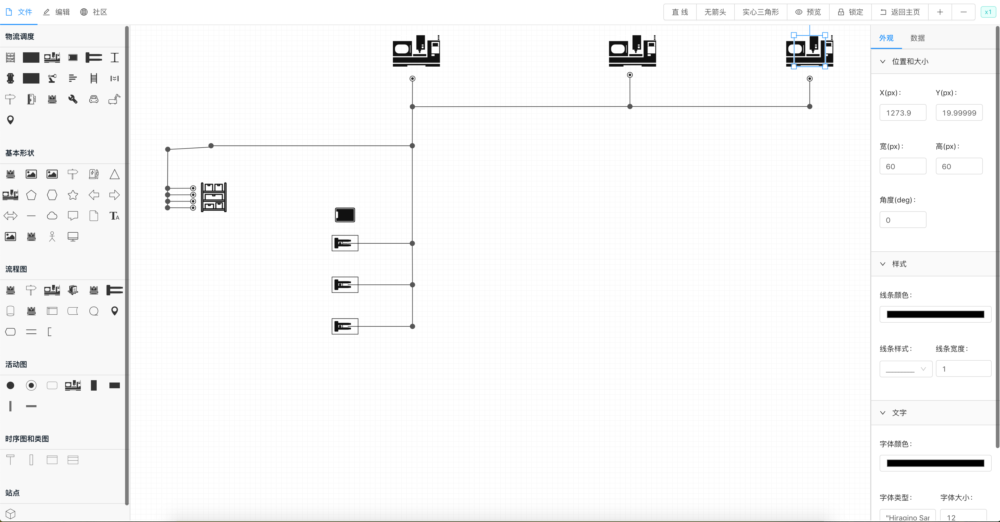
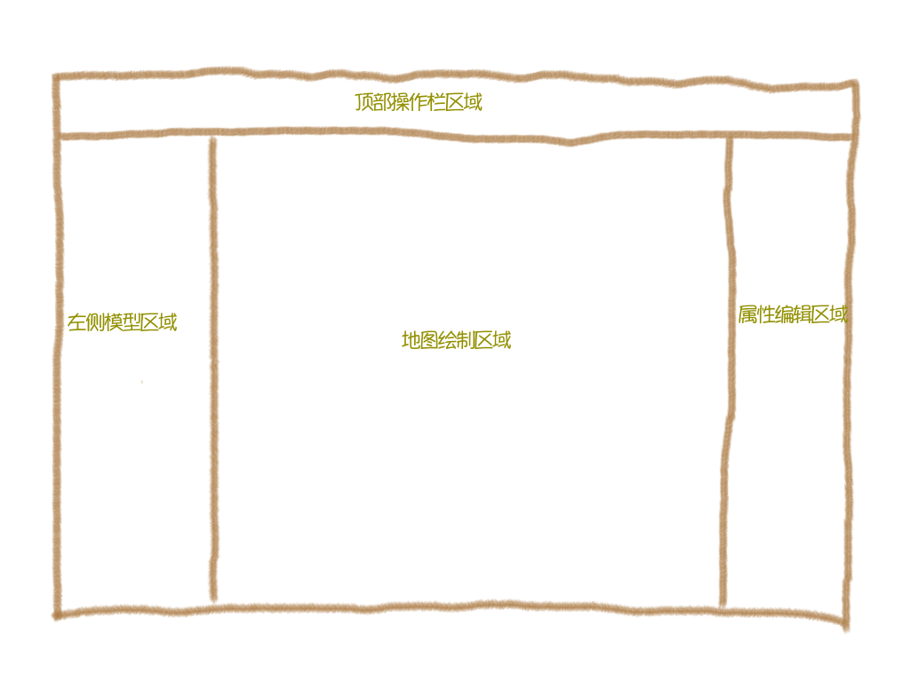
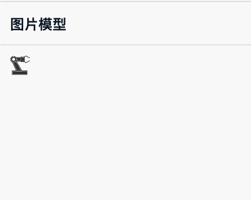

## 前言
  
  前些日子刚刚好也在做可视化监控相关的项目, 刚刚好想借着掘金的技术专题来跟大家分享一下整个搭建过程。 如果在搭建过程中有问题欢迎提[Issue](https://github.com/Summer-andy/topology-react/issues).
  可视化编辑器如下:

  


## 技术栈

  - React: 前端主流框架(react,vue,angular)之一,更适合开发灵活度高且复杂的应用
  - Ant Design: The world's second most popular React UI framework, 一般是React开发的标配UI库
  - Topology: 一款开源的基于canvas+typescript的绘图引擎


## 项目背景
 
   在高自动化的工厂中, 我们需要监控当前机器人或者小车的运行情况。但是由于不同的硬件供应厂商提供的地图接口信息可能会不一样(比如坐标系不一样, 机器人的角度计算规则不一样), 因此我们需要做的就是将所有不同型号的机器人或者小车都整合到一张地图中, 同时监控所有机器人的运行情况。

## 构建地图
  
   Topology的作者曾经也写过一篇关于如何基于Topology搭建一套在线绘图软件[https://juejin.im/post/6844903993915736078](https://juejin.im/post/6844903993915736078). 那么我为什么还要重新搭建一套React版本的呢？以下是我在实践过程中的个人思考:

   - 对于一个刚刚接触``` Topology ``` 的新手来说, 我希望在能满足主要功能的前提下, 例子越简单越好。
   - 示例的代码应该尽可能地做到0侵入式, 这里的侵入式主要指的是数据流方面, 比如例子里面用了dva, redux, flux等数据流框架, 那么如果你的项目
   中没有用到这些数据流框架,  你还得单独去安装对应的依赖到项目中并且你还需要去学习它。这对于新手来说, 不是特别友好。
   - 示例的项目架构应该尽可能的简洁,并且符合 ``` 潮流 ```.

  
  ### 初始化项目

   #### 使用 ``` create-react-app ``` 脚手架构建项目

  ```sh
    create-react-app myapp
  ```

   #### 安装UI组件库与绘图引擎

  ```sh
  npm install antd@3.26.7  @topology/core@0.2.30
  ```
  
  ### 功能区域布局

  
 
   编辑器主要分为四个部分: 

   - 顶部操作栏区域比如保存地图、导入地图、导出地图等等
   - 左侧模型区域比如地图中所需要用到的元素。
   - 地图绘制区域
   - 属性编辑区域, 主要用于对地图上的节点元素(Node), 线条元素(Line)的属性配置

     接下来, 我将会逐一讲解如何配置每个区域的一些基础功能。

  ### 模型区域配置

  模型配置区域支持自定义的图片, iconfont官网图标, 当然也支持[自定义开发的图形库](https://www.yuque.com/alsmile/topology/make-shape)。
  配置信息中最关键的是 ``` name ``` 字段, 引擎依据name的类型, 来判断渲染什么样的图型。比如当name为circle时, 模型将会被渲染成圆形。

  ```js
  export const iconList = [
    {
      group: '图片模型',
      children: [
        {
          icon: 'iconjiqi',
          data: {
            text: 'i am pic',
            rect: {
              width: 100,
              height: 100
            },
            name: 'circle',
            image: require('./machine.jpg')
          }
        }
      ]
    },
  ]
  ```

  以下是图形对照表: 

  此处缺少草图。

  当然我们也可以在图形中添加自定义图片、iconfont图标、自定义图形。比如我想在圆形容器内添加一个机床的图片。
  我们先遍历配置文件, 生成左侧的模型列表。并且给每一个模型添加拖动事件``` onDragStart ```.
  
  > 如果模型的渲染列表不想用iconfont上的图标来构建, 你也可以使用其他的标签(比如img)渲染。

  ```jsx
  <div className="tool">
  {
      iconList.map((item, index) => <div key={index}>
        <div className="title">{item.group}</div>
        <div className="button">
          {
            item.children.map((item, idx) => {
              return (<a key={idx} title={item.name} href="/#" >
                <i className={`iconfont  ${item.icon}`}>
                </i>
              </a>)
            })
          }
        </div>
      </div>)
    }
  </div>
  ```

  当然如果在渲染列表使用iconfont来渲染, 我们需要在项目中引入样式文件。

  :::warning
  此处缺少二张图， 第一张是iconfont上的链接引用图, 第二张是如何在项目中引入该链接
  :::

  

  ### 绘制区域配置

  我们引入```  @topology/core ``` 包, 并且通过 ``` Topology ``` 构造一个地图。我们定义一个div容器的id为``` topology-canvas ```, 在页面初始化时, 通过``` new Topology('topology-canvas', {}) ```。
  至此, 编辑器的绘制区域已经配置完成。怎么样？ 是不是so easy!

  ```js
  import { Topology } from '@topology/core';
  let canvas;
  const Layout = ({ history }) => {

    useEffect(() => {
      canvas = new Topology('topology-canvas', {});
    }, []);

    return  <>
        <!-- ... -->
        <div className="full" >
          <div id="topology-canvas" style={{ height: '100%', width: '100%' }} />
        </div>
        <!-- ... -->
    </>
  }
  ```

  ### 顶部操作配置

  顶部的操作一般是一些: 打开地图、新建地图、保存地图等等操作。UI的绘制我就不赘述了, 我就讲一下如何与地图进行交互, 我想这才是重点。其实大多数功能,  ``` Topology ```已经内置了, 我们只需要调用即可。
  举一些常用的操作: 

  > 以下用到的``` canvas ``` 变量指的是实例化地图后的值。如 ```  canvas = new Topology('topology-canvas', {})  ```

  - 新建地图
    
    ```js
    canvas.open({ nodes: [], lines: [] });
    ```

  - 导入json文件, 自动生成地图

    ```js
    import * as FileSaver from 'file-saver';
    // ...
    const onHandleImportJson = () => {
      const input = document.createElement('input');
      input.type = 'file';
      input.onchange = event => {
        const elem = event.srcElement || event.target;
        if (elem.files && elem.files[0]) {
          const reader = new FileReader();
          reader.onload = e => {
            const text = e.target.result + '';
            try {
              const data = JSON.parse(text);
              canvas.open(data);
            } catch (e) {
              return false;
            } finally {

            }
          };
          reader.readAsText(elem.files[0]);
        }
      };
      input.click();
    }
    ```

  - 将绘制完成的地图, 保存为json文件

    ```js
    import * as FileSaver from 'file-saver';
    // ...
    FileSaver.saveAs(
      new Blob([JSON.stringify(canvas.data)], { type: 'text/plain;charset=utf-8' }),
      `le5le.topology.json`
    );
    ```

  - 将绘制完成的地图, 保存为img

    ```js
      canvas.saveAsImage('le5le.topology.png');
    ```

    ### 属性编辑区域

    属性编辑区域的UI也不是我们关注的点(本文的编辑区域用的是Form组件), 我们需要关注编辑的数据如何传递到地图中, 从而改变地图上元素的表现。
    查看以下代码其实关键点就两步:

    - 将选中节点的值进行覆盖操作
    - 调用``` updateProps ``` 更新地图

    ```js
    const onHandleFormValueChange = useCallback(formValue => {
      const { rotate, data, lineWidth, strokeStyle, dash, color, fontSize, fontFamily, text, ...other } = formValue;
        const changedValues = { node: { rect: other, font: { color: , fontSize, fontFamily }, rotate, lineWidth, strokeStyle, dash, text, data } }
          // 遍历查找修改的属性，赋值给原始Node
          for (const key in changedValues.node) {
            if (Array.isArray(changedValues.node[key])) {
            } else if (typeof changedValues.node[key] === 'object') {
              for (const k in changedValues.node[key]) {
                selected.node[key][k] = changedValues.node[key][k];
              }
            } else {
              selected.node[key] = changedValues.node[key];
            }
          }
        canvas.updateProps(selected.node);
      }, [selected]);
    ```    

