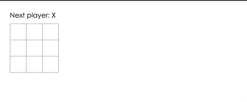
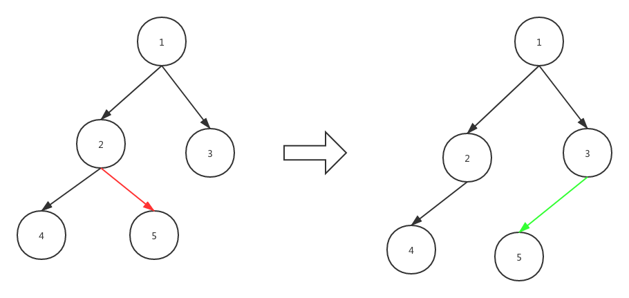

## 前言

   本篇文章适合使用React一年左右的小伙伴阅读。文章的主体内容是对winter老师公开课的复盘, 里面涉及到知识点与React源码无关, 因此大家可以放轻松阅读。
   我希望本篇文章可以作为大家开启阅读React源码大门的钥匙。

## 搭建环境
  
  - 配置webpack.config.js
    
    1. 添加 ```babel-loader``` 将es高级语法转化为浏览器能够读懂的语法
    2. 使用 ```@babel/preset-env ```作为预转译插件
    3. 使用 ```@babel/plugin-transform-react-jsx``` 解析jsx语法糖

  ```js
  module.exports = {
    entry: {
      main: './main.js'
    },
    module: {
      rules: [
        {
          test:  /\.js$/,
          exclude: /node_modules/,
          use: {
            loader: 'babel-loader',
            options: {
              presets: ['@babel/preset-env'],
              plugins: [[
                '@babel/plugin-transform-react-jsx'
              ]]
            }
          }
        }
      ]
    },
    optimization: {
      minimize: false
    },
    mode: 'development'
  }
  ```

  ### 新建html文件引入main.js

  为了更加直观的展示效果, 我们可以将打包后的script文件, 引入到html中。

  ```html
  <!DOCTYPE html>
  <html lang="en">
  <head>
    <meta charset="UTF-8">
    <meta name="viewport" content="width=device-width, initial-scale=1.0">
    <title>Document</title>
  </head>
  <body>
  </body>
  <script src="dist/main.js" ></script>
  </html>
  ```

  ### 编写一段jsx

  我们在main.js中编写一段jsx, 然后在控制台查看```main.js```经过编译后的结果。

  ```js
  let a = <div id="hello">hello world!</div>
  ```

  经过webpack编译后, 我们发现jsx被编译成了:

<iframe
  src="https://carbon.now.sh/embed?bg=rgba(171%2C%20184%2C%20195%2C%201)&t=seti&wt=sharp&l=auto&ds=true&dsyoff=20px&dsblur=68px&wc=true&wa=true&pv=0px&ph=0px&ln=false&fl=1&fm=Hack&fs=14px&lh=133%25&si=false&es=2x&wm=false&code=%2520%2520var%2520a%2520%253D%2520%252F*%2523__PURE__*%252FReact.createElement(%2522div%2522%252C%2520%257B%250A%2520%2520%2520%2520id%253A%2520%2522hello%2522%250A%2520%2520%257D%252C%2520%2522hello%2520world!%2522)%253B"
  style="width: 468px; height: 128px; border:0; transform: scale(1); overflow:hidden;"
  sandbox="allow-scripts allow-same-origin">
</iframe>

 与此同时, 我们发现控制台报了一个错误❌.

 ```js
 Uncaught ReferenceError: React is not defined
    at eval (main.js:1)
    at Object../main.js (main.js:96)
    at __webpack_require__ (main.js:20)
    at main.js:84
    at main.js:87
 ``` 

 我们发现当``` @babel/plugin-transform-react-jsx ``` 解析jsx的时候, 会自动地从```React```中调用``` createElement ``` 方法。那么如果想要把```React.createElement``` 修改成 ``` ToyReact.createElement ``` 该怎么办呢？

我们通过查看babel官网中的插件列表, 可以详细地看到[babel-plugin-transform-react-jsx](https://www.babeljs.cn/docs/babel-plugin-transform-react-jsx)的用法。

  - pragma
    接收一个``` string ```类型的字符串, 默认值是```React.createElement```.
    当遇到jsx标签时, 将会用pragma的值去替换它。如果我们将pragma值设为 ``` ToyReact.createElement ```, 那么main.js中的代码将会被解析成:

      <iframe
      src="https://carbon.now.sh/embed?bg=rgba(171%2C%20184%2C%20195%2C%201)&t=one-dark&wt=sharp&l=auto&ds=true&dsyoff=20px&dsblur=68px&wc=true&wa=true&pv=0px&ph=0px&ln=false&fl=1&fm=Hack&fs=14px&lh=133%25&si=false&es=2x&wm=false&code=var%2520a%2520%253D%2520ToyReact.createElement(%2522div%2522%252C%2520%257B%250A%2520%2520id%253A%2520%2522hello%2522%250A%257D%252C%2520%2522hello%2520world!%2522)%253B%250A"
      style="width: 367px; height: 146px; border:0; transform: scale(1); overflow:hidden;"
      sandbox="allow-scripts allow-same-origin">
    </iframe>

  - pragmaFrag
    接收一个 ``` string ```类型的字符串, 默认值是 ``` React.Fragment ```
    当解析到空标签时, 会使用pragmaFrag的值替换它。比如我们将 ``` main.js ```的内容改成
    ``` let a = <>hello world!</> ```。那么解析后的结果是:

    <iframe
    src="https://carbon.now.sh/embed?bg=rgba(171%2C%20184%2C%20195%2C%201)&t=one-dark&wt=sharp&l=auto&ds=true&dsyoff=20px&dsblur=68px&wc=true&wa=true&pv=0px&ph=0px&ln=false&fl=1&fm=Hack&fs=14px&lh=133%25&si=false&es=2x&wm=false&code=var%2520a%2520%253D%2520ToyReact.createElement(React.Fragment%252C%2520null%252C%2520%2522hello%2520world!%2522)%253B"
    style="width: 620px; height: 92px; border:0; transform: scale(1); overflow:hidden;"
    sandbox="allow-scripts allow-same-origin">
    </iframe>

  - useBuiltIns
    接收一个 ``` Boolean ``` 类型的值, 默认值是 ``` false ```
    当传递prop的时候,直接用```Object.assign()```方法, 而不是其他的Babel插件。
  - useSpread
  - throwIfNamespace

   我们更新一下```webpack.config.js```的配置,

   ```js
    use: {
      loader: 'babel-loader',
      options: {
        presets: ['@babel/preset-env'],
        plugins: [[
          '@babel/plugin-transform-react-jsx',
          {
            pragma: 'ToyReact.createElement',
            pragmaFrag: 'ToyReact.Fragment'
          }
        ]]
      }
    }
   ```
   ok! 至此我们的环境搭建已经完成, 接下来可以愉快的开发啦!

 ## 编写ToyReact

  ### 创建ToyReact.js

  由于我们并没有编写ToyReact的相关内容, 因此控制台会报错。接下来, 我们新建```ToyReact.js```,
  并且新增一个``` createElement ``` 方法来创建一个实体DOM。

  那么``` createElement ```方法如何写呢?
  
  ```js
  var a = ToyReact.createElement("div", {
    id: "hello"
  }, "hello world!");
  ```

  我们发现,```createElement``` 传递三个参数

   - 标签的类型
   - 属性
   - 子节点
  
  ```js
  export const ToyReact = {
    createElement(type, attributes, ...children) {

      const element = document.createElement(type);
      
      for (let name in attributes) {
        element.setAttribute(name, attributes[name])
      }

      return element;
    }
  }
  ```

  我们通过调用```document.createElement``` 方法创建实体DOM, 并且遍历jsx的上的自定义属性,将各个属性挂载到实体DOM中。我们可以在控制台打印``` createElement ``` 方法返回的值。

  ```html
    <div id="hello"></div>
  ```

  这时候返回的是实体DOM, 貌似还缺点什么❓emm, 子节点好像没有考虑, 我们可以先简单处理一下children(后面优化)

  ```diff
  export const ToyReact = {
    createElement(type, attributes, ...children) {
      const element = document.createElement(type);
      for (let name in attributes) {
        element.setAttribute(name, attributes[name])
      }

  +   for (let child of children) {
  +      const node = document.createTextNode(child)
  +      element.appendChild(node)
  +    }
      return element;
    }
  }
  ```

  接下来我们将实DOM插入到文档就可以看到 hello world!了。

  ```js
  import { ToyReact } from './ToyReact';
  let a = <div id="hello">hello world!</div>
  document.body.appendChild(a);
  ```

  ### 重构ToyReact.js

  为了保持与React API的风格一致, 我们需要改变main.js的代码

  ```js
  import { ToyReact } from './ToyReact';

  class TestComponent {
    render() {
      return <div id="hello">hello world!</div>
    }
  }

  ToyReact.render(<TestComponent />, document.body)
  ```
  我们发现新的代码比之前的代码多了一个render的方法, 并且也使用类的写法通过render返回jsx. 那么应该从何处着手修改ToyReact里面的代码呢？

  - 实例化TestComponent, 获取它return的jsx
  - render还是负责将实DOM插入到document.body中

    #### 修改createElement

    首先我们需要判断一下``` type ```的类型, 因为传进来的type不再是之前的元素标签(比如div)字符串了。而是变成了``` function ```.其次呢, 我们最好将元素、文本节点剥离开来。元素节点是可以被添加属性以及子节点的, 而在文本节点上我们不能做任何事情。剥离开来的目的是为了让```createElement```方法变得不那么臃肿, 同时将元素和文本抽离出来, 各自的逻辑，维护起来也更加方便。

      <iframe
      src="https://carbon.now.sh/embed?bg=rgba(171%2C%20184%2C%20195%2C%201)&t=one-dark&wt=sharp&l=auto&ds=true&dsyoff=20px&dsblur=68px&wc=true&wa=true&pv=0px&ph=0px&ln=false&fl=1&fm=Hack&fs=14px&lh=133%25&si=false&es=2x&wm=false&code=export%2520const%2520ToyReact%2520%253D%2520%257B%250A%2520%2520createElement(type%252C%2520attributes%252C%2520...children)%2520%257B%250A%2520%2520%2520%2520%250A%2520%2520%2520%2520const%2520element%2520%253D%2520document.createElement(type)%253B%250A%2520%2520%2520%2520%250A%2520%2520%2520%2520for%2520(let%2520name%2520in%2520attributes)%2520%257B%250A%2520%2520%2520%2520%2520%2520element.setAttribute(name%252C%2520attributes%255Bname%255D)%250A%2520%2520%2520%2520%257D%250A%2520%2520%2520%2520%250A%250A%2520%2520%2520%2509for%2520(let%2520child%2520of%2520children)%2520%257B%250A%2520%2520%2520%2520%2520%2520const%2520node%2520%253D%2520document.createTextNode(child)%250A%2520%2520%2520%2520%2520%2520element.appendChild(node)%250A%2520%2520%2520%2520%257D%250A%2520%2520%2520%2520%250A%2520%2520%2520%2520return%2520element%253B%250A%2520%2520%257D%250A%257D"
      style="width: 459px; height: 398px; border:0; transform: scale(1); overflow:hidden;"
      sandbox="allow-scripts allow-same-origin">
    </iframe>

   #### 定义ElementWrapper类

   新建ElementWrapper类,并且新增 ```创建实体DOM```方法 以及 ```setAttribute```和 ``` appendChild ``` 方法。

  ```js
  class ElementWrapper {
      constructor(type) {
        this.root = document.createElement(type)
      }

      setAttribute(name, value) {
        this.root.setAttribute(name, value)
      }

      appendChild(component) {
        this.root.appendChild(component.root)
      }
  }
  ```

   ::: warning
  以上appendChild方法中```component``` 都是经过 ``` ElementWrapper``` 或者
  ``` TextNodeWrapper ``` 实例化后的值。
  ```component.root``` 指代的即是元素节点或者文本节点。
   :::

   #### 定义TextNodeWrapper类

   新建TextNodeWrapper类, 并且只需要创建一个文本节点即可。

  ```js
  class TextNodeWrapper {
    constructor(content) {
      this.root = document.createTextNode(content);
    }
  }
  ```

  #### 修改createElement方法

  ```js
  createElement(type, attributes, ...children) {
    let element;
    // 判断element的类型, 如果是元素标签的字符串类型, 那么就通过ElementWrapper创建实DOM, 否则就直接实例化本身返回其render的jsx, 进行重新调用createElement构建元素。
    if(typeof type === 'string') {
       element = new ElementWrapper(type);
    } else {
      element = new type;
    }

    for (let name in attributes) {
      element.setAttribute(name, attributes[name])
    }

    for (let child of children) {
      // 如果child是字符串那么直接实例化TextNodeWrapper,得到文本节点。
      if(typeof child === 'string') {
        child = new TextNodeWrapper(child)
      }
      element.appendChild(child)
    }
    
    return element;
  },

  ```
  #### 新增Component类

  这里有的同学可能会有疑问, 为什么需要新增一个额外的类。

  当babel解析到``` TestComponent ```的时候, 我们直接实例化它, 并且给实例化后的值 ``` setAttribute ```属性以及```  appendChild ``` 子节点。 我们当然不能在main.js中写这些方法的具体实现。因此我们让TestComponent去```继承``` Component, 让Component类去实现这两个方法。

  ```js
  export class Component {
    constructor(props) {
      this.props = Object.create(null);
      this._root = null;
      this.children = []
    }

    setAttribute(name, value) {
        this.props[name] = value; 
    }

    appendChild(component) {
      this.children.push(component);
    }

    get root() {
      if(!this._root) {
        this._root = this.render().root;
      }
      return this._root
    }
  }
  ```

  #### 新增render方法

  ```js
  render(component, parentElement) {
      parentElement.appendChild(component.root)
  }
  ```
  
  #### 修改main.js代码

  相较于之前, 我们让TestComponent去继承了Component类, 从而使得``` TestComponent ``` 拥有获取props和添加子节点的能力。

  ```js
  import { ToyReact, Component } from './ToyReact';

  class TestComponent extends Component  {
    render() {
      return <div id="hello">hello world!</div>
    }
  }

  ToyReact.render(<TestComponent name="123" />, document.body)
  ```

  我们发现页面上已经能够正常显示我们编写的``` hello world! ```了。我们试着往``` TestComponent ```添加children。

  ```js
  import { ToyReact, Component } from './ToyReact';

  class TestComponent extends Component  {
    render() {
      return <div id="hello">hello world!{this.children}</div>
    }
  }

  ToyReact.render(
    <TestComponent name="123">
      <div>i</div>
      <div>am</div>
    </TestComponent>, 
  document.body)
  ```

  我们再次运行代码, 发现页面报错了。其实我们很容易能够猜到为什么？我们尝试打印``` this.children ```的值,
  this.children 是一个数组,里面包含了两个元素。然而我们之前的代码没有考虑过这种情况, 因此我们需要修改createElement方法, 让他能够把children里面的数组给解析出来。

  ```js
  createElement(type, attributes, ...children) {
    let element;
    if(typeof type === 'string') {
       element = new ElementWrapper(type);
    } else {
      element = new type;
    }

    
    for (let name in attributes) {
      element.setAttribute(name, attributes[name])
    }

    function insertChildren(children) {
      for (let child of children) {
        if(typeof child === 'string') {
          child = new TextNodeWrapper(child)
        }
        if(typeof child === 'object' && child instanceof Array) {
          insertChildren(child);
          return;
        }
        element.appendChild(child)
      }
    }

    insertChildren(children);
    
    return element;
  },
  ```

  我们通过一个简单的递归函数去处理child是数组的情况。现在我们的页面可以正常的显示DOM结构, 并且拥有props的能力。
  下一步我们需要让页面能够```动起来```， 也就是我们能够使用类似React中的this.setState()方法去改变页面的显示。

  ## 让ToyReact能够“动起来”

  在让它动起来前, 我们先来了解一下一个不太常用的api ``` range ```.

  ### range的定义

  MDN是这样定义它的: ``` Range 接口表示一个包含节点与文本节点的一部分的文档片段 ```.我认为在此基础上,稍稍修改一下会更好理解。
  ``` Range 接口能够表示文档中任意节点之间的一部分文档(HTML DOM)片段。```。

  ### range API的简单使用

  ```html
    <p id="p1"> hello<span> world !</span><span> world !</span></p>
  ```

  -  Range.setStart(startNode, startOffset) 设置Range的起点

      接收二个参数第一个参数是节点, 第二个参数是节点的偏移量。比如拿上面的例子来说:

      ```js
      const p1 = document.getElementById('p1');
      range.setStart(p1, 1)
      ```

      range的起始位置应该是
      
      ```js
                        range起始位置
                          |
                          |
                          |  
          <p id="p1">hello <span> world !</span><span> world !</span></p>
      ```
      那么如果``` setStart ```的第二个参数是0,那么range的起始位置则是:

      ```js
                range起始位置
                  |
                  |
                  |  
       <p id="p1">hello <span> world !</span><span> world !</span></p>
      ```
      
      其实很容易理解，p1元素节点下面有三个子节点。一个是文本节点hello, 另外两个则是元素节点 ```<span> world !</span>```。

  -  Range.setEnd(startNode, startOffset) 设置Range的结束位置。

     接收二个参数第一个参数是节点, 第二个参数是节点的偏移量。我们还是拿上面的例子来说:

      ```js
      const p1 = document.getElementById('p1');
      range.setEnd(p1, p1.childNodes.length)
      ```

      ```js
                                                              range结束位置
                                                                |
                                                                |
                                                                |  
       <p id="p1">hello <span> world !</span><span> world !</span> </p>
      ```

  -  Range.insertNode(Node) 在Range的起始位置插入节点。

     ```html
      <p id="p1"> hello<span> world !</span><span> world !</span><span> world!</span></p>
     ```

     ```js
      const range = document.createRange();
      const p1 = document.getElementById('p1');
      const element = document.createElement('p');
      element.appendChild(document.createTextNode('123'));
      range.setStart(p1, 0);
      range.setEnd(p1, p1.childNodes.length);
      range.insertNode(element)
     ```

     当执行完``` insertNode ``` 方法后,会在文本节点hello前面添加一个p元素节点。

  -  Range.deleteContents() 移除来自 Document的Range 内容。

     调用此方法会删除range内的所有节点。

     ```html
      <p id="p1"> hello<span> world !</span><span> world !</span><span> world!</span></p>
     ```

     ```js
      const range = document.createRange();
      const p1 = document.getElementById('p1');
      range.setStart(p1, 0)
      range.setEnd(p1, p1.childNodes.length)
      range.deleteContents()
     ```

     以上代码执行后p1节点下面的所有节点都将被删除。

  ::: warning
  range的其他api本篇文章中不会涉及,因此就不一一介绍了。
  :::

  ### 使用range重构ToyReact

  我们为什么要用range去重构之前的代码呢？我认为主要是出于以下的考虑:

  - 1.使用range我们可以在任意节点处插入DOM
  - 2.为接下来的重新渲染与虚拟DOM的比对做铺垫

  
我们修改的基本思路是: 

  - 从渲染DOM的地方开始着手, 使用range去完成DOM的实际操作
  - 仔细阅读之前的代码, 你会发现它无法进行重新渲染。因此我们需要定义一个私有的方法能够让DOM树重新render。

  为了让渲染DOM树的方法, 变得不那么容易让外部调用, 我们使用```Symbol``` 返回的唯一标识符作为函数名。

  ```js
    const RENDER_TO_DOM = Symbol('render to dom')
  ```

  #### 修改Component类

  我们需要在Component类中添加一个私有的方法, 因为this.render()返回的值有可能是一个Component, ElementWrapper, TextNodeWrapper。因此在其余二个类中, 我们
  也需要去添加``` RENDER_TO_DOM ``` 方法。

  ```js
    [RENDER_TO_DOM](range) {
      this.render()[RENDER_TO_DOM](range);
    }
  ```

  #### 修改ElementWrapper和TextNodeWrapper类

  在这二个类中, 我们将实DOM渲染到页面。因此在``` RENDER_TO_DOM ``` 中我们需要往range中插入节点。

  ```js
    [RENDER_TO_DOM](range) {
      range.deleteContents();
      range.insertNode(this.root);
    }
  ```

  #### 修改render函数

   由于我们不再使用```get root()``` 方法来获取实DOM, 因此我们通过调用 ``` RENDER_TO_DOM ``` 来插入节点。

   ```js
     render(component, parentElement) {
      const range = document.createRange();
      range.setStart(parentElement, 0);
      range.setEnd(parentElement, parentElement.childNodes.length);
      range.deleteContents();
      component[RENDER_TO_DOM](range)
    }
   ```

  我们已经初步完成了重构,距离页面动起来还有点距离, 但是此时页面正常显示没问题。如果代码跑不起来的可以查看 [feautre/range分支的代码](https://github.com/Summer-andy/Toy-React/tree/feautre/range).
  review代码看看哪儿出错了。

  #### 修改main.js

  我们需要有一个主动的行为去更新页面。 我们在页面添加一个计数器, 每点击一次按钮, 页面上的数字加一.

  ```js
  import { ToyReact, Component } from './ToyReact';

  class TestComponent extends Component {
    constructor() {
      super();
      this.state = {
        count: 1
      }
    }
    render() {
      return <div id="hello">
        hello world!
        <span>{
            this.state.count.toString()
          }
          <button onClick={() => this.count ++ }>点击</button>
          </span>
          {
            this.children
          }
        </div>
    }
  }

  ToyReact.render(<TestComponent></TestComponent>, document.body)
  ```

  #### 支持事件的绑定以及新增重新渲染函数

  我们点击onClick页面似乎没有反应。其实这边有二个很重要的点没有处理: 

  - 我们需要处理``` onClick ``` 事件函数
  - 我们需要将改变后count的值重新渲染到页面上

  首先只有元素节点上才能绑定事件, 因此我们肯定是在``` ElementWrapper ```类中进行修改。我们写一个简单的正则来匹配所有on开头的事件, 比如onClick, onHover, onMouseUp.....。

  ```js
  setAttribute(name, value) {
    if(name.match(/^on([\s\S]+)/)) {
      this.root.addEventListener(RegExp.$1.replace(/^[\s\S]/, s => s.toLowerCase()), value)
    }
    this.root.setAttribute(name, value)
  }
  ```

  接下来就是思考如何编写一个重新渲染的方法了, 当我们点击按钮的时候, count的值其实已经改变了。只是内容没有改变, 那么如果要做到count实时更新，我们就需要每次都去更新range的内容。
  我们在Component类中新增一个``` rerender ```方法进行更新操作。

  ```js
  constructor(props) {
    ...
    this._range = null;
  }

  [RENDER_TO_DOM](range) {
      this._range = range;
      this.render()[RENDER_TO_DOM](range);
  }

  rerender() {
    this._range.deleteContents();
    this[RENDER_TO_DOM](this._range) 
  }
  ```

  实现的过程很简单, 其实就是将range的内容全部删除(不删除的话之前的内容将会保留), 然后重新执行添加Node的方法。

  我们在```main.js```中的按钮点击事件修改为 ```  <button onClick={() => { this.state.count ++; this.rerender()} }>点击</button> ```。至此, 页面已经能够动起来了。但是为了
  与React的API保持一致, 我们需要将 ``` this.state.count ++; this.rerender() ``` 合并为 ``` this.setState({ count: count++ }) ```。

   #### 新增setState方法

  setState方法主要是将新的state与老的state比较, 然后进行一个深拷贝的操作。如果this.state不存在或者类型不是对象的时候, 我们直接使用新的state去替换它。
  然后通过递归将新的state中的值直接赋值到旧的对应的state值。
  
   ```js
    setState(newState) {
      if(this.state === null && typeof this.state !== 'object') {
        this.state = newState;
        this.rerender();
        return;
      }

      let merge = (oldState, newState) => {
          for (const key in newState) {
            if(oldState[key] === null || typeof oldState[key] !== 'object') {
              oldState[key] = newState[key]
            } else {
              merge(oldState[key], newState[key]);
            }
          }
      }
      merge(this.state, newState);
      this.rerender();
    }
   ```

   #### 集成React官网示例Tic Tac Toe

  为了让ToyReact更加健壮, 我们将React官网的例子作为ToyReact的Demo, 顺便对ToyReact进行一些小修小补。

  - 修改main.js

  我们需要将官网中函数式写法修改为类写法, 因为ToyReact暂时不能处理传入函数式的组件。

  ```js
  import { ToyReact, Component } from './ToyReact';

  class Square extends Component {
    render() {
      return (
        <button className="square" onClick={this.props.onClick}>
          {this.props.value}
        </button>
      );
    }
  }

  class Board extends Component {
    constructor(props) {
      super(props);
      this.state = {
        squares: Array(9).fill(null),
      };
    }

    handleClick(i) {
      const squares = this.state.squares.slice();
      squares[i] = 'X';
      this.setState({ squares: squares });
    }

    renderSquare(i) {
      return (
        <Square
          value={this.state.squares[i]}
          onClick={() => this.handleClick(i)}
        />
      );
    }

    render() {
      const status = 'Next player: X';

      return (
        <div>
          <div className="status">{status}</div>
          <div className="board-row">
            {this.renderSquare(0)}
            {this.renderSquare(1)}
            {this.renderSquare(2)}
          </div>
          <div className="board-row">
            {this.renderSquare(3)}
            {this.renderSquare(4)}
            {this.renderSquare(5)}
          </div>
          <div className="board-row">
            {this.renderSquare(6)}
            {this.renderSquare(7)}
            {this.renderSquare(8)}
          </div>
        </div>
      );
    }
  }

  class Game extends Component {
    render() {
      return (
        <div className="game">
          <div className="game-board">
            <Board />
          </div>
          <div className="game-info">
          </div>
        </div>
      );
    }
  }


  ToyReact.render(
    <Game />,
    document.getElementById('root')
  );
  ```

  - 修改main.html

  我们将官网的样式与根节点root引入。

  ```html
    <!DOCTYPE html>
    <html lang="en">
    <head>
      <meta charset="UTF-8">
      <meta name="viewport" content="width=device-width, initial-scale=1.0">
      <title>Document</title>
    </head>
    <style>

    body {
      font: 14px "Century Gothic", Futura, sans-serif;
      margin: 20px;
    }

    ol, ul {
      padding-left: 30px;
    }

    .board-row:after {
      clear: both;
      content: "";
      display: table;
    }

    .status {
      margin-bottom: 10px;
    }

    .square {
      background: #fff;
      border: 1px solid #999;
      float: left;
      font-size: 24px;
      font-weight: bold;
      line-height: 34px;
      height: 34px;
      margin-right: -1px;
      margin-top: -1px;
      padding: 0;
      text-align: center;
      width: 34px;
    }

    .square:focus {
      outline: none;
    }

    .kbd-navigation .square:focus {
      background: #ddd;
    }

    .game {
      display: flex;
      flex-direction: row;
    }

    .game-info {
      margin-left: 20px;
    }

    </style>
    <body>
      <div id="root"></div>
    </body>
    <script src="dist/main.js" ></script>
    <script >
    </script>
    </html>
  ```

  - 修改ElementWrapper类支持className

    我需要单独处理```className```这个属性, 因为元素节点的类名是通过赋值到class上才能生效.

    ```js
    setAttribute(name, value) {
      // ...
      if(name === 'className') {
        name = 'class'
      }
      // ...
    }
    ```

    我们尝试打包, 查看页面渲染情况, 官网的例子在我们这儿也能够正常运行。
    

  ## 让ToyReact拥有虚拟DOM与Diff算法

  ### 什么是虚拟DOM

   虚拟DOM本质上其实是对真实DOM的一种映射关系。它是一种以对象的形态来表示真实存在的DOM。举个例子:

   ```html
  <ul id="ul1">
    <li name="1">world !</li>
    <li name="2">world !</li>
    <li name="3">world !</li>
  </ul>
   ```

   上面的html代码如果以虚拟DOM的形态来表示的话, 那么就是:

   ```js
    {
        type: 'ul',
        props: {      
          id: 'ul1'
        },
        children: [
          { type: 'li', props: {name: '1'}, children: ['world !']},
          { type: 'li', props: {name: '2'}, children: ['world !']},
          { type: 'li', props: {name: '3'}, children: ['world !']},
        ]
    }
   ```

   ### 什么是Diff算法

  Diff算法其实是通过比对新旧虚拟DOM树,然后将不同的部分渲染到页面中,从而达到最小化更新DOM的目的。

  以下图DOM为例:

  

  Diff算法采用按照深度遍历规则遍历的, 因此遍历的过程如下:
  - 1. 对比节点1(没有变化)
  - 2. 对比节点2(没有变化)
  - 3. 对比节点4(没有变化)
  - 4. 对比节点5```(节点5被移除, 记录一个删除的操作)```
  - 5. 对比节点3(没有变化)
  - 6. 对比节点3的children```(新增节点5, 记录一个新增操作)```

  因此在实际渲染的过程中, 会执行节点5的删除和新增操作, 其余节点不会发生任何变化。

  ### 再次重构ToyReact.js

  在对虚拟DOM和Diff算法有所了解后, 我们又得重构ToyReact.js。这一路, 我们一直在重构ToyReact.js的路上。

  重构之前我们对比一下官方的例子和我们的例子区别:

  官网的例子:

  

  我们每次点击按钮, 它都只更新自个儿的节点。其他节点都不会重新渲染。我们来继续看一下ToyReact的渲染的过程。

   

  我们每次点击按钮, 整颗DOM树都重新渲染了, 这对于复杂页面的性能消耗将会非常巨大。因此我们迫切需要引入虚拟DOM+Diff算法来解决这个问题。

  #### 定义虚拟DOM

  对于元素节点来说, 虚拟DOM应该包含三样东西:
  - 节点的类型(比如div, span, p)
  - 节点上的props
  - 节点的children

  然而对于文本节点来说, 它的类型是固定的, 唯一不同的就是他的内容了, 因此它的虚拟DOM就比较简单了

  - 节点的类型(text)
  - 节点的内容(content)

  那么对应到ToyReact中的代码片段应该是``` ElementWrapper ``` 和 ``` TextNodeWrapper ``` 这两个类。

  ```js

  class ElementWrapper {
    // ...

    get vdom() {
      return {
        type: this.type,
        props: ？？？,
        children: ？？？
      }
    }

    // ...
  }

  ```

  除了type属性我们可以通过构造函数中的参数获得, 其余的props和children我们都无法获得。但是呢这二个属性在Component类中都有, 因此我们可以让ElementWrapper类去继承Component类。、

  ```js
    class ElementWrapper {
    // ...

    get vdom() {
      return {
        type: this.type,
        props: this.props,
        children: this.children.map(item => item.vdom)
      }
    }

    // ...
  }
  ```

  同时我们还需要先注释掉``` ElementWrapper ```类中的 ``` setAttribute ``` 和 ``` appendChild ``` 方法。不然的话我们子节点的虚拟dom就塞不进去了, 因为ElementWrapper类中方法与Component类中方法重名了。


  由于它是虚拟DOM, 因此它的children也应该是虚拟的children.因此在``` TextNodeWrapper ``` 类中, 也需要定义一个获取虚拟DOM的方法。

  ```js
  class TextNodeWrapper {
    constructor(content) {
      this.root = document.createTextNode(content);
      this.content = content;
    }

  // ...
    get vdom() {
      return {
        type: '#text',
        content: this.content
      }
    }
    // ...
  }
  ```

  ok, 我最后需要在Component类中也定义个获取虚拟dom的方法, 通过递归的方法获取虚拟dom树。

  ```js
  export class Component {
    // ...
    get vdom() {
      return this.render().vdom;
    }
    // ..
  }
  ```

  #### 查看虚拟DOM

   我们可以修改main.js中的代码来输出虚拟dom.

   ``` js
  let game = <Game />
  console.log(game.vdom);
   ```

  

  ok! nice, 这就是我们想要的虚拟dom的结构。我们接下来先将注释掉的二个方法重新补上, 因为``` setAttribute ``` 和 ``` appendChild ```方法都是对实DOM的操作, 所以我打算把这两个
  函数的实现全部放到 ``` RENDER_TO_DOM ```函数中。

  ```js
  [RENDER_TO_DOM](range) {
    range.deleteContents();
    let root = document.createElement(this.type);

    for (const name in this.props) {
      let value = this.props[name];
      if (name.match(/^on([\s\S]+)/)) {
        root.addEventListener(RegExp.$1.replace(/^[\s\S]/, s => s.toLowerCase()), value)
      }
      if (name === 'className') {
        root.setAttribute('class', value)
      } else {
        root.setAttribute(name, value)
      }
    }

    for (const child of this.children) {
        const childRange = document.createRange();
        childRange.setStart(root, root.childNodes.length);
        childRange.setEnd(root, root.childNodes.length);
        child[RENDER_TO_DOM](childRange);
    }

    range.insertNode(root);
  }

  ```

  第一部分的for循环其实做的就是 ``` setAttribute ``` 的事情, 将属性赋值到元素上, 第二部分的for循环做的事情则是通过递归的方式插入child.
