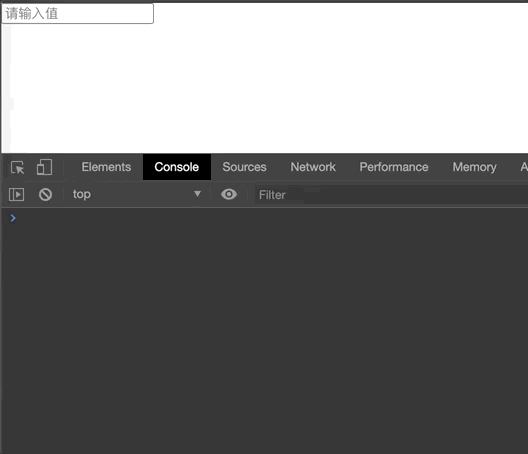
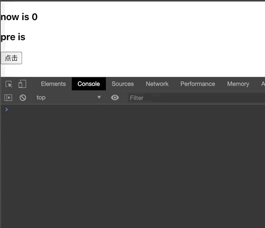
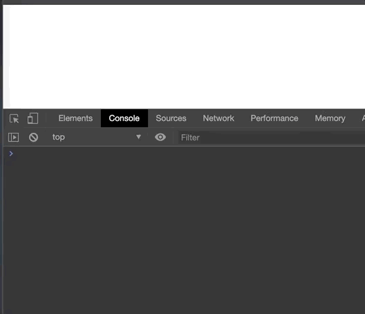

## 前言

::: tip
For you a thousand times over 为你，千千万万遍 ———————— 《追风筝的人》
:::

## 温馨提示

本文所有的自定义 Hook 均来自于[https://usehooks.com/](https://usehooks.com/)。由于这上面的内容都是英文并且篇幅比较长, 可能有的小伙伴阅读起来会比较吃力, 因此我将会挑一些比较常用的自定义 Hook 来分享。 如果大家看了本篇文章中的自定义Hook后觉得意犹未尽, 可以去[https://usehooks.com/](https://usehooks.com/)查看更多哦！

## useAsync

### 📚 简单描述

使用自定义钩子, 将异步函数作为输入, 将返回的值、状态、是否立即执行异步函数作为输出, 我们可以很方便地来跟踪异步调用的状态。

### ✨ 动画效果


### 🌰 使用示例

```js
import React from 'react';
import { BoxLoading } from 'react-loadingg';
import useAsync from './component/useAsync';
function App() {
  const axiosFunc = () => {
    return new Promise((resolve, reject) => {
      setTimeout(() => {
        Math.random() * 10 < 5 ? resolve('我小于5!') : reject('我不比5小!');
      }, 1000);
    });
  };

  const [excute, value, pending, error] = useAsync(axiosFunc, false);

  return (
    <div style={{ height: 100, width: 100, position: 'relative' }}>
      {!pending && <button onClick={excute}>点击我加载接口</button>}
      {pending && <BoxLoading />}
      <b style={{ color: 'green' }}>{value}</b>
      <b style={{ color: 'red' }}>{error}</b>
    </div>
  );
}

export default App;
```

### 🚀 自定义 Hook

```js
const useAsync = (asyncFunction, immediate = true) => {
  const [pending, setPending] = useState(false);
  const [value, setValue] = useState(null);
  const [error, setError] = useState(null);

  const execute = useCallback(() => {
    setPending(true);
    setValue(null);
    setError(null);
    return asyncFunction()
      .then((response) => setValue(response))
      .catch((error) => setError(error))
      .finally(() => setPending(false));
  }, [asyncFunction]);

  useEffect(() => {
    if (immediate) {
      execute();
    }
  }, [execute, immediate]);

  return { execute, value, pending, error };
};
```

## useWhyDidYouUpdate

### 📚 简单描述

Hook 是一个闭包, 每次更新状态,都会让我们的组件重新渲染, 因此我们通常都会在必要的时候使用`useMemo` 或者 `useCallBack`缓存值或者函数, 从而达到优化的目的。

### ✨ 动画效果


### 🌰 使用示例

```js
import React, { useState } from 'react';
import useWhyDidYouUpdate from './component/useWhyDidYouUpdate';

const Counter = React.memo((props) => {
  useWhyDidYouUpdate(props);
  return <div style={props.style}>{props.count}</div>;
});

function App() {
  const [count, setCount] = useState(0);
  const [userId, setUserId] = useState(0);

  const counterStyle = {
    fontSize: '3rem',
    color: 'red',
  };

  return (
    <div>
      <div className="counter">
        <Counter count={count} style={counterStyle} />
        <button onClick={() => setCount(count + 1)}>Increment</button>
      </div>
      <div className="user">
        
        <button onClick={() => setUserId(userId + 1)}>Switch User</button>
      </div>
    </div>
  );
}

export default App;
```

::: warning

我们发现当我们点击 Switch User 按钮的时候, Counter 组件还是重新渲染了, 但是它的 props 是没有任何改变的。我们从控制台上可以看到, `Counter`组件的更新是因为`style`被重新初始化赋值了。
那么很明显, 这是没有必要的更新, 因此我们可以使用`useMemo` 来缓存一下 counterStyle。

:::

### 🚀 自定义 Hook

```js
import { useRef, useEffect } from "react";

export default function useWhyDidYouUpdate(props) {

  const previousProps = useRef();

  useEffect(() => {

    if(previousProps.current) {

      const allKeys = Object.keys({ ...previousProps.current, ...props })

      const changeProps = { };

      allKeys.forEach(key => {
        /**
        * 如果说上一次props对应key的值与本次渲染props对应key的值不一样， 那么就放到changeProps中
        */
        if(previousProps.current[key] !== props[key]) {
          changeProps[key] = {
            from: previousProps.current[key],
            to: props[key]
          }
        }
      })

      if(JSON.stringify(changeProps) !== '{}') {
        console.log('[why-did-you-update]', changeProps);
      }

    previousProps.current = props;
  })
}
```

## useDebounce

### 📚 简单描述

    当接口的调用或者页面的渲染依赖于state变化的时候, 可以在适当的时候使用useDebounce来做一下防抖。

### ✨ 动画效果



### 🌰 使用示例

```js
import React, { useState, useEffect } from 'react';
import useDebounce from './component/useDebounce';

function App() {
  const [count, setCount] = useState('');

  const debounceData = useDebounce(count, 1000);

  useEffect(() => {
    console.log(debounceData);
  }, [debounceData]);

  return (
    <div>
      <input placeholder="请输入值" onChange={(e) => setCount(e.target.value)} />
    </div>
  );
}

export default App;
```

### 🚀 自定义 Hook

```js
import { useState, useEffect } from 'react';

export default function useDebounce(value, delay) {
  const [debouncedValue, setDebouncedValue] = useState(value);

  useEffect(() => {
    const handler = setTimeout(() => {
      setDebouncedValue(value);
    }, delay);

    return () => {
      clearTimeout(handler);
    };
  }, [value, delay]);

  return debouncedValue;
}
```

## usePrevious

### 📚 简单描述

在我们使用 class 写法编写 React 应用的时候, 我们可以通过`componentDidUpdate` 来获取之前的 props 和 state。那么在 Hook 中
我们可以使用 usePrevious 来获取指定某个值的上一次状态。

### ✨ 动画效果



### 🌰 使用示例

```js

import React, { useState } from 'react';
import usePrevious from './component/usePrevious';

function App() {
  const [count, setCount] = useState(0);

  const preData = usePrevious(count);

  return (
    <div>
      <h3>now is {count}</h3>
      <h3>pre is {preData}</h3>
      <button onClick={() => setCount(count + 1)}>点击</button>
    </div>
  );
}

export default App;


```

### 🚀 自定义 Hook

```js
import { useRef, useEffect } from 'react';
export default function usePrevious(value) {
  
  const ref = useRef();
  
  useEffect(() => {
    ref.current = value;
  }, [value]); 
  
  return ref.current;
}
```

## useWindowSize

### 📚 简单描述

当我们改变浏览器窗口时, 可能需要对页面的一些组件进行高度的计算。

### ✨ 动画效果



### 🌰 使用示例

```js
import React , { useEffect } from 'react';
import useWindowSize from './component/useWindowSize';
import useDebounce from './component/useDebounce';
function App() {

  const size = useWindowSize();

  const data =  useDebounce(size, 500)

  useEffect(() => {
    console.log(data);
  }, [data])

  return (
    <div>

    </div>
  );
}

export default App;
```

::: tip

这里使用了``` useDebounce ```做了防抖。
:::

### 🚀 自定义 Hook

```js

import { useEffect, useState } from 'react';

export default function useWindowSize() {
  const isClient = typeof window === 'object';

  function getSize() {
    return {
      width: isClient ? window.innerWidth : undefined,
      height: isClient ? window.innerHeight : undefined
    };
  }

  const [windowSize, setWindowSize] = useState(getSize);

  useEffect(() => {
    if (!isClient) {
      return false;
    }
    
    function handleResize() {
      setWindowSize(getSize());
    }

    window.addEventListener('resize', handleResize);
    return () => window.removeEventListener('resize', handleResize);
  }, []); 

  return windowSize;
}

```

## 总结:

  Hook的出现很大程度上解决了代码复用难这个问题,并且它提供了一种更优雅的方式去编写组件。当然Hook也有一些不足的地方,事实上很多时候我们以为的"不足"实际上是因为我们对它的理解还不够深刻,或者说我们还不习惯于它的写法。通过编写自定义Hook, 在一定程度上可以帮助我们对于Hook的理解更加深刻。