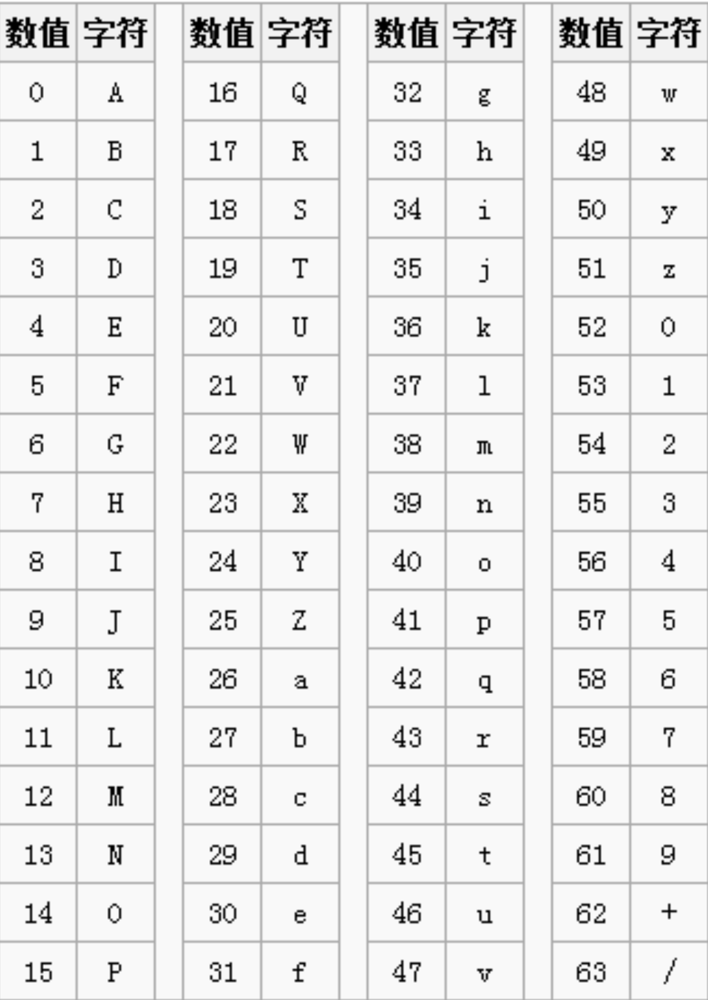
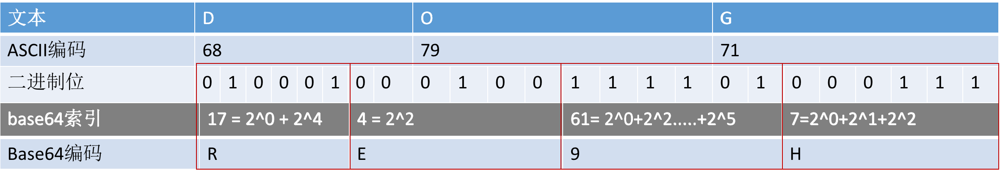
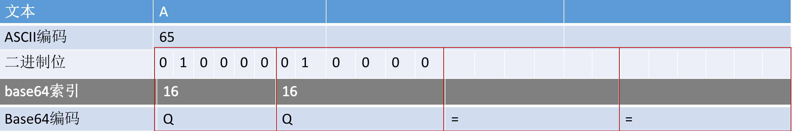

#### 前言: 前两天发现了一个很奇怪的bug, 在mac环境下的chrome浏览器可以正常显示中文字符解码后的内容,但是在windows环境下却显示为乱码。由于本人水平实在有限,翻阅网上的资料没找到对应的解决方案,因此我打算一步一步从底层开始学习,研究一下到底哪一步出错了。这篇文章是我研究的第一阶段,后面会持续更新。

#### 从后端小老弟返回的base64开始

 都说base64, base64 那么这到底是个啥? base64 是一组相似的二进制到文本(binary-to-text encoding)的编码规则，使得二进制数据在解释成 radix-64 的表现形式后能够用 ASCII 字符串的格式表示出来。这时候可能有的人会问, 计算机中的信息不都是使用二进制信息表示的么？为啥还要整一个 binary-to-text encoding 这玩意儿出来,原来是因为在网络传输中,使用http, ftp, smtp等 协议中, 二进制数据传输可能会存在某些问题。比如我要传递一个 int 1, 二进制数据是 0X00000001 给服务器, 首先我们的客户端是能够正常发送的,但是在 libevent(Libevent 是一个用 C 语言编写的、轻量级的开源高性能事件通知库)收到以后,他会把数据截断,因为前两位 0X00 是字符串的停止符,所以只能用 base64 来解决这个问题,base64 将二进制的内容转化成一组有意义的字符串,然后服务器端解码即可,虽然说传输的数据包可能胡稍微大一点,但是对于现在来说 数据包的增大 对于传输的速度的改变来说已经让我们很难感知出来了。
 
#### 为啥是 base64，而不是 base128, base32, base16呢......?
 
 这里可能有的同学会有疑问, 为啥是 base64，而不是 base128, base32, base16....。百度百科对于 base64 有一个很好的解释: base64 是一种基于 64 个可打印字符来表示二进制数据的方法,那么不知道的同学又有一个疑问了，什么是可打印字符呢？我们在文章前面提到了base64 里面字符的表现形式是通过 ASCII 字符集中的 64 个字符来表示的, 而在 ASCII 字符集中的字符可以分为: 控制字符 和 可显示字符。那么控制字符和可显示字符的形态是怎么样的呢？我们来看一下 ASCII 字符集表(完整版可以查看百度百科的介绍):

| Bin(二进制) | Oct(八进制) | Dec(十进制 ) | Hex(十六进制) |       缩写/字符        |    解释    |
| :---------- | ----------: | :----------: | :-----------: | :--------------------: | :--------: |
| 0000 0000   |          00 |      0       |     0x00      |       NUL(null)        |   空字符   |
| 0000 0001   |          01 |      1       |     0x01      | SOH(start of headline) |  标题开始  |
| 0000 0002   |          02 |      2       |     0x02      |  STX (start of text)   |  正文开始  |
| .........   |          .. |      ..      |     ....      |          ....          |    ....    |
| 0001 1111   |         037 |      31      |     0x1F      |  US (unit separator)   | 单元分隔符 |
| 0010 0000   |         040 |      32      |     0x20      |        (space)         |    空格    |
| .........   |          .. |      ..      |     ....      |          ....          |    ....    |
| 0111 1111   |        0177 |     127      |     0x7F      |      DEL (delete)      |    删除    |

Base64字符表

我们其实可以通过表格的解释其实能够大致明白,0~32 字符表示的都是一些控制类的字符比如标题开始,正文开始,传输结束,请求....,包括最后一个删除的字符。那么像中间的一些符号(逗号,分号)以及里面的一些阿拉伯数字以及大小写英文字符等都是可以显示出来让我们看到的就是可显示字符。因此32~127之间的字符是属于可打印字符。127-32=95,但是二进制数据由01表示,并且编码单位只能是2的指数,但是呢2的7次大于95了，所以我们只能选择1~6位的进制来表示了, 2的6次等于64,所以这个64是这么由来的。

#### 如何用Base64表示传统字符呢?

那么问题又来了,一个字节有 8 个 bit 位,而 64 个字符用 6 个bit位就可以表示完了,那么剩下的二个 bit 位岂不是白白浪费了么？那么怎么用 6 个有效的 bit 位来表示传统字符的 8 个 bit 位呢？首先 8 和 6 的最小公倍数是 24,那么我们可以使用 4 个 base64 字符来表示 3 个传统字符所表示的。这里有一个规则,不知道大家想到没有, 传统字符要转化成base64字符最小的单位是三个字节。 那么这里就会分为两种情况了, 第一种是每一次转化的字符串都是三个字节三个字节转换的， 第二种情况是最后一次转化的时候字符串不够三个字节。我简单地画了两张图分别表示两种情况以及对应的处理方案:

1.第一种情况:DOG是三个字符,那么一共就是24个的bit,可以用4个base64的字符来表示.红框表示的是DOG对应的base64，6个有效位转化成相应的索引值再对应 base64字符表,得出DOG对应的base64字符是RE9H。

1.第二种情况:我们转着转着发现最后一次不够三个字节了,我们就拿下图的示例来说吧,比如它最后一次转化只有一个A了,他会把剩余的4位补0从而算出第二个base64的编码,后面空着的用=号补齐。因此最后的结果是QQ==。其实不用=也不耽误解码，之所以用=，可能是考虑到多段编码后的base64字符串拼起来也不会引起混淆,因此我们可以得出一个结论,base64字符串中只可能在最后出现一个或者两个=号,不可能出现两个以上的等号以及在中间是不可能出现等号的。

#### 读后感:
     1. 希望我们读完这篇文章的时候可以大致了解base64的编码过程以及base64字符的一些常识判断比如=号的情况
     2. 我们得明白base64编码是可以通过解码获得对应的二进制数据的,如果我们想对base64数据进行加密的话可以考虑从字符序列进行定制来进行加密

#### 那么中文字符是如何转换的呢？我们下一期文章见