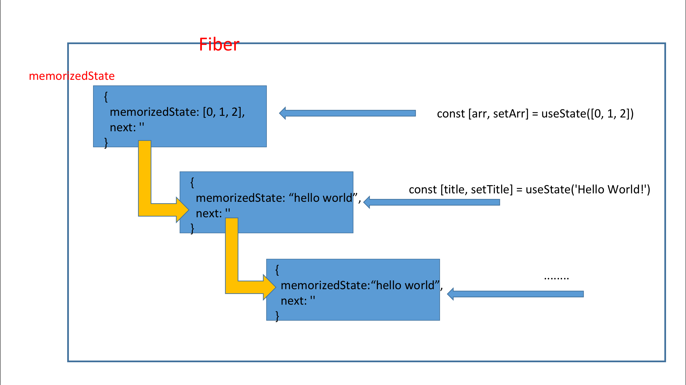

#### 前言: 
     每一个人都有属于自己的一片森林,也许我们不曾去过,但是它一直在那里,总会在那里。
     迷失的人迷失了,相逢的人会再次相逢。 
                                                        -- 《挪威的森林》

### 什么是Hook规则？ 
    
  简单来说Hooks规则就是我们在使用Hooks编写程序的时候需要遵循的规范。

  ::: warning
   不要在循环,条件或者嵌套函数中调用Hook.
  :::


  ::: warning
   不要在普通的 JavaScript 函数中调用 Hook.
  :::

### 实战应用(入坑版)  

  我们接下来将会举一个错误的例子,并且将会展开分析为什么不能这么写, 这么写会导致什么错误发生。
  
  ⚠️ 错误示例(非完整版):
  
  ```js
  import React, { Fragment, useState, useEffect } from 'react';

  const Child = () => {
    const [title, setTitle] = useState('Hello World!');
    return <h1>{title}</h1>;
  };

  const Layout = () => {
    const [arr, setArr] = useState([0, 1, 2]);
    const renderItem = () => {
      return arr.map(() => {
        return Child();
      });
    };
    return <Fragment>{renderItem()}</Fragment>;
  };

  export default Layout;
  ```
  
  我们都知道在组件中使用state hooks和effect hooks,靠的是Hook的调用顺序,这样React才能知道哪个state对应那个useState。那么我们先来捋一下上述示例代码Hooks的调用顺序。

  ```js
  // ------------
  // 首次渲染
  // ------------

  useState([0, 1, 2]) // 使用[0, 1, 2]数组初始化arr
  useState('Hello World!') // 使用'Hello World!'初始化title
  useState('Hello World!') // 使用'Hello World!'初始化title
  useState('Hello World!') // 使用'Hello World!'初始化title


  // ------------
  // 第二次渲染
  // ------------

  useState([0, 1, 2]) // 读取变量名为arr的state
  useState('Hello World!') // 读取变量名为title的state - (A hook)
  useState('Hello World!') // 读取变量名为title的state - (B hook)
  useState('Hello World!') // 读取变量名为title的state - (C hook)
  ```
  
  以上就是Hooks的调用顺序了,上述这段代码确实没有什么问题,也可以正常执行。接下来我们稍微修改一下代码。

  ``` diff
  import React, { Fragment, useState, useEffect } from 'react';

  const Child = () => {
    const [title, setTitle] = useState('Hello World!');
    return <h1>{title}</h1>;
  };

  const Layout = () => {
    const [arr, setArr] = useState([0, 1, 2]);
    const renderItem = () => {
      return arr.map(() => {
        return Child();
      });
    };
 
 +   useEffect(() => {
 +     setTimeout(() => {
 +      setArr([0, 1])
 +    }, 500);
 +  }, [])

    return <Fragment>{renderItem()}</Fragment>;
  };

  export default Layout;
  ```

  我们抛开effect的钩子不谈,就看state的钩子。我们可以很容易地得出第三次Hooks调用的顺序是:

  ``` js

  // ------------
  // 第三次渲染
  // ------------

  useState([0, 1]) // 读取变量名为arr的state
  useState('Hello World!') // 读取变量名为title的state
  useState('Hello World!') // 读取变量名为title的state
  ```

  我们发现程序抛出异常了,原因是: 重新渲染后的钩子比预期的钩子要少。

  :::danger
     Rendered fewer hooks than expected.
     This may be caused by an accidental early return statement.
  :::

  我们再🤔思考一下, 如果我们第三次渲染的时候, 渲染的钩子数量大于等于上一次的时候会不会抛出异常呢？我们来试验一下。

  ``` diff
  import React, { Fragment, useState, useEffect } from 'react';

  const Child = () => {
    const [title, setTitle] = useState('Hello World!');
    return <h1>{title}</h1>;
  };

  const Layout = () => {
    const [arr, setArr] = useState([0, 1, 2]);
    const renderItem = () => {
      return arr.map(() => {
        return Child();
      });
    };
 
 +   useEffect(() => {
 +     setTimeout(() => {
 +      setArr([0, 1, 2, 3])
 +    }, 500);
 +  }, [])

    return <Fragment>{renderItem()}</Fragment>;
  };

  export default Layout;
  ```

  我们惊讶地发现,程序竟然可以正常运行。那么这时候,我们仔细推敲一下Hooks的第一个规则: ``` 不要在循环,条件或者嵌套函数中调用Hooks ```, 其实这个规则的深层意思就是, ``` 要让上一次的Hooks的知道它应该返回什么。``` 什么意思呢? 就是说我们在第三次渲染的时候, 应该让 A, B, C hook知道我应该返回什么值。当arr变化为[0, 1]的时候, C hook是不知道应该返回什么东西的, 因此程序就会报错。但是, 当arr变化为[0, 1, 2, 3]的时候, A, B, C hook都知道自己应该返回什么值, 因此程序可以正常运行。既然本文讲的是深度理解Hooks规则,那么我们接下来将会进行源码架构的分析。

  ### 深入Hooks源码架构设计

   :::warning
     为了保证大家都能看懂,下面的内容不会过多地涉及Hooks源码解析。 
   :::

   首先我们得明白, Hook的更新流程是通过链表完成的。如果大家对于为什么用链表感兴趣的可以去看这篇文章: [无意识设计-复盘React Hook的创造过程](https://github.com/shanggqm/blog/issues/4)。
   那么链表的结构应该是怎么样的呢？

   我们来模拟一下上述例子首次渲染的过程:

   -  初始化的时候(组件还未渲染): ``` firstWorkInProgressHook = workInProgressHook = null ```
   -  组件初次渲染的时候
         
        +   使用[0, 1, 2]数组初始化arr: ``` firstWorkInProgressHook = workInProgressHook = hook1 ```
        +   使用'Hello World!'初始化title: ``` workInProgressHook = workInProgressHook.next = hook2 ```
        +   使用'Hello World!'初始化title: ``` workInProgressHook = workInProgressHook.next = hook3 ```
        +   使用'Hello World!'初始化title: ``` workInProgressHook = workInProgressHook.next = hook4 ```
  


   这个过程,其实就是一个用链表存储的过程, 那么每一个hook至少应该能够保存当前它自己的信息和下一个节点(hook)的信息并且拥有能够更新这个链表的功能。

   ``` js
    type Hook = {
      memoizedState: any, // 上次更新完的最终状态
      queue: UpdateQueue<any, any> | null, // 更新队列
      next: Hook | null,  // 下一个hook
    };
   ```
   
   那么我们可以很容易的摸出, 整个链表应该长什么样子:

   ```js

   const fiber = {
    //...
    memoizedState: {
        memoizedState: [0, 1, 2], 
        queue: {
            // ...
        },
        next: {
            memoizedState: 'Hello World!',
            queue: {
                // ...
            },
            next: 'Hello World'
        }
    },

    // ...
    memoizedState: {
        memoizedState: 'Hello World', 
        queue: {
            // ...
        },
        next: {
            memoizedState: 'Hello World!',
            queue: {
                // ...
            },
            next: 'Hello World'
        }
    },

    //...
}
   ```

  ::: danger
      整个链表是在mount时构造的,因此当我们执行update操作的时候一定要保证执行顺序,
      不然的话整个链表就乱了。这时候, 我们联想到Hooks的第一条规则: 不要在循环,条件
      或者嵌套函数中调用Hooks, 大家应该能够大致理解为什么要遵守这个规则了吧。接下来, 
      我们复盘一下, 上面的错误例子，加深一下我们的印象。
  :::

  我们先描绘初始化hook时候的样子:

  

  当我们执行更新arr操作的时候, ``` setArr([0, 1])  ```, 第三个hook的next会找不到下一个节点.因此会在finishHooks的时候会抛出异常。我们可以在``` react-dom.development.js ```看到
  我们更新到第三个hooks的时候, 会出现找不到下一个hook的情况, 因此``` didRenderTooFewHooks ``` 为 ```false```。所以抛出了上面例子中的异常。
  ``` js
   // 源码部分
   function finishHooks() {
    // ...
    var didRenderTooFewHooks = currentHook !== null && currentHook.next !== null;
    // ...
    !!didRenderTooFewHooks ? invariant(false, 'Rendered fewer hooks than expected. This may be caused by an accidental early return statement.') : void 0;
    // ...
   }
  ```

  ### 总结:
      
  -  由于hook大量采用了链表的结构, 因此我们在使用Hook编写程序的时候, 应该清楚每一次执行更新的时候是否会造成链表顺序结构的改变。
  -  如果我们真的需要在循环,条件或者嵌套函数中调用Hook,那么我们可以将被调用的Hook转化成一个独立的React组件。
  ``` diff
  import React, { Fragment, useState, useEffect } from 'react';

  const Child = () => {
    const [title, setTitle] = useState('Hello World!');
    return <h1>{title}</h1>;
  };

  const Layout = () => {
    const [arr, setArr] = useState([0, 1, 2]);
    const renderItem = () => {
 +     return arr.map((_, index) => {
 -     return arr.map(() => {
 -       return Child();
 +       return <Child key={index} />
      });
    };
 
    useEffect(() => {
      setTimeout(() => {
       setArr([0, 1])
     }, 500);
   }, [])

    return <Fragment>{renderItem()}</Fragment>;
  };

  export default Layout;
  ```
   
  ### 参考文档:
   
   [无意识设计-复盘React Hook的创造过程](https://github.com/shanggqm/blog/issues/4)

   [Hook规则](https://zh-hans.reactjs.org/docs/hooks-rules.html)
   
   [React Hooks 进阶](https://github.com/SunShinewyf/issue-blog/issues/50)
