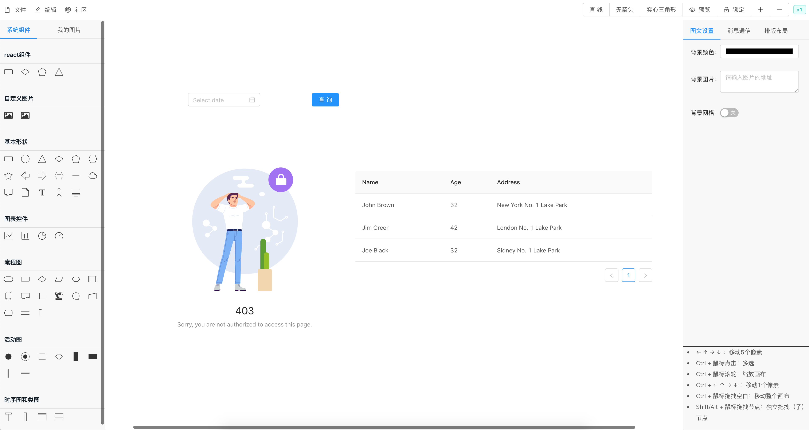

## 前言

   Hi，大家好。今天来跟大家分享一下如何将React组件注入到Topology中。

   效果如下所示: 

   


## 在画布中封装第三方UI库

   在Topology中默认支持: ``` rectangle ``` 、 ``` circle ``` 、 ``` triangle ```等等节点。而对于非内置的节点, 则需要通过调用 ``` registerNode ``` 方法将自定义的节点注册到画布上。

   为了让大家能够有一个较为直观的了解, 我们浅析@topology/core中涉及到的源码。

   ```js
   // registerNode: Register a custom node.
   // name - The name of node.
   // drawFn - How to draw.
   // anchorsFn - How to get the anchors.
   // iconRectFn - How to get the icon rect.
   // textRectFn - How to get the text rect.
   // force - Overwirte the node if exists.
    export function registerNode(
      name: string,
      drawFn: (ctx: CanvasRenderingContext2D, node: Node) => void,
      anchorsFn?: (node: Node) => void,
      iconRectFn?: (node: Node) => void,
      textRectFn?: (node: Node) => void,
      protect?: boolean
    ) {
      // Exist
      if (drawNodeFns[name] && protect) {
        return false;
      }

      drawNodeFns[name] = drawFn;
      anchorsFns[name] = anchorsFn;
      iconRectFns[name] = iconRectFn;
      textRectFns[name] = textRectFn;

      return true;
    }
   ```

   我们通过源码可以发现, registerNode函数中最重要的入参即是 ```name ``` 和 ``` drawFn ```,
   而通过注释我们可以轻松的知道 name 即是节点的名称 而 drawFn即代表如何绘制对应节点。

   那么我们的思路就很清楚了, 重写```drawFn``` 即可。

  ### 新增drawFn函数

   ```js
  import React from 'react';
  import ReactDOM from 'react-dom';
  import { s8, createDiv, rectangle } from '@topology/core';
  // 存放原生dom节点
  const reactNodesData = {};

  const reactNodes = (ReactComponent) => (ctx, node) => {
    // 绘制一个底图，类似于占位符。
    rectangle(ctx, node);

    // 如果未知组件，直接返回
    if (!ReactComponent) {
      return;
    }

    // 需要设置一个唯一的id，方便绘画引擎识别
    if (!node.elementId) {
      node.elementId = s8();
    }

    // 节点的elementLoaded用于判断第三方图形库是否第一次加载，是否需要初始化
    // 这是一个辅助变量，用户自己赋值使用或不用
    if (!node.elementLoaded) {
      // 创建一个div容器
      reactNodesData[node.id] = {
        div: createDiv(node)
      };
      node.elementLoaded = true;
      document.body.appendChild(reactNodesData[node.id].div);
      
      // 添加当前节点到div层，否则无法显示
      node.addToDiv();

      // 初始化 react 组件
      if(node && node.data && node.data.props) {
        reactNodesData[node.id].component = ReactDOM.render(
          <ReactComponent {...node.data.props} />,
          reactNodesData[node.id].div
        );
      }

      node.elementRendered = false;
    }

    // 节点的elementRendered用于判断第三方图形库是否需要重绘
    // 绘画引擎需要重绘节点时，会把此属性设置为false
    if (!node.elementRendered) {
      // 初始化时，等待父div先渲染完成，避免初始图表控件太大。
      setTimeout(() => {
        // 重绘完成，避免不必要的重复重绘
        node.elementRendered = true;
      });
    }
  };

  export default reactNodes;
   ```

### 注册自定义节点

  ```js
    import { registerNode } from '@topology/core';
    import { Modal, Tabs, Button, DatePicker, Result, Table } from 'antd';

    registerNode('button', reactNodes(Button), null, null, null);
    registerNode('datePicker', reactNodes(DatePicker), null, null, null);
    registerNode('result', reactNodes(Result), null, null, null);
    registerNode('table', reactNodes(Table), null, null, null);
  ```

  引入antd组件库, 并且将按钮、时间选择器、结果页、表格注册到画布中。

### 定义配置项

  由于之前我们已经注册了自定义的节点到画布了, 因此我们通过编写对应的配置项直接拖拽生成对应的节点。

  组件的props我们可以存储在自定义的数据data中。

  ```js
  {
      group: 'react组件',
      children: [
        {
          text: '按钮',
          icon: 'icon-rectangle',
          name: 'button',
          data: {
            autoRect: true,
            strokeStyle: '#fff',
            rect: {
              x: 100,
              y: 200,
              width: 100,
              height: 200
            },
            name: 'button',
            data: {
              props: {
                type: 'primary',
                children: '查询'
              }
            }
          }
        },
        {
          text: '日期组件',
          icon: 'icon-diamond',
          name: 'datePicker',
          data: {
            strokeStyle: '#fff',
            rect: {
              x: 100,
              y: 200,
              width: 300,
              height: 200
            },
            name: 'datePicker',
            data: {
              props: {}
            }
          }
        },
        {
          text: '结果页',
          icon: 'icon-pentagon',
          name: 'result',
          data: {
            strokeStyle: '#fff',
            rect: {
              x: 100,
              y: 200,
              width: 200,
              height: 200
            },
            name: 'result',
            data: {
              props: {
                status: '403',
                title: '403',
                subTitle: 'Sorry, you are not authorized to access this page.'
              }
            }
          }
        },
        {
          text: '表格',
          icon: 'icon-triangle',
          name: 'table',
          data: {
            strokeStyle: '#fff',
            rect: {
              x: 100,
              y: 200,
              width: 600,
              height: 400
            },
            name: 'table',
            data: {
              props: {
                columns: columns,
                dataSource: data
              }
            }
          }
        }
      ]
    },
  ```

  ### 需要解决的问题

  我们现在只是做到了能够将UI组件显示在画布上, 但是在实际的场景中还需要有事件与组件交互等等, 这一块我目前还在构思中, 如果大家有好的想法欢迎在评论区留言呀 ~ 
  

