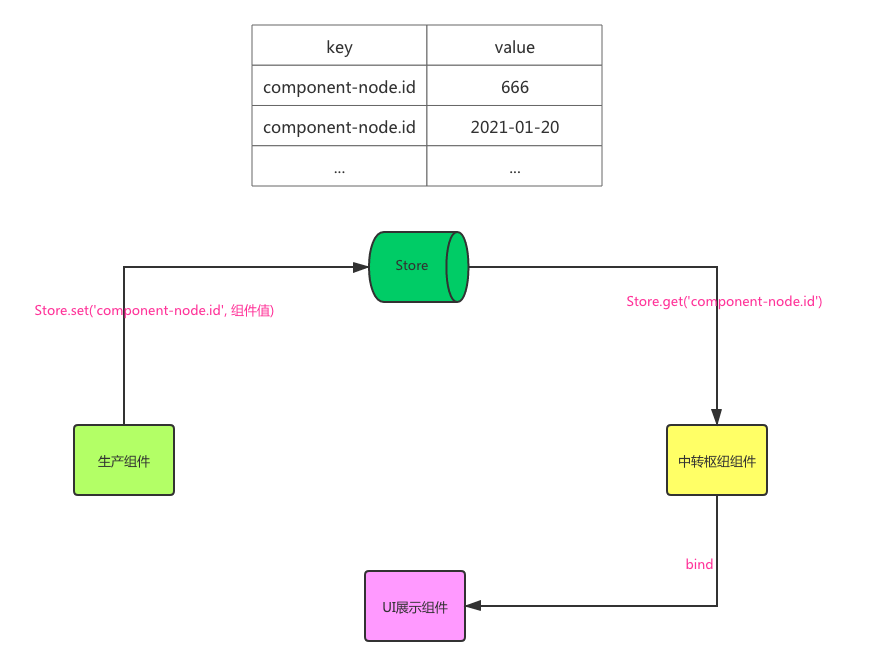
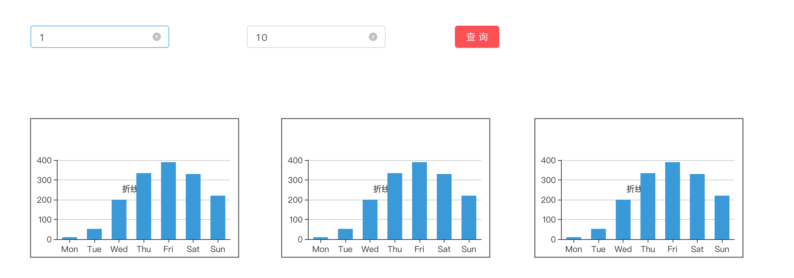

## 前言

  在上一篇文章中, 我们的Topology支持UI组件的渲染, 因此在这一篇文章中, 我将会带着大家完成事件与图表组件交互。

### 概览

  

  组件之间的事件交互, 我们不采用直接赋值的方式, 而是采用通过Store来间接的完成这个操作。采用这种方式, 会让我们的逻辑变得很清晰, 并且数据的集中化管理也会让我们能够更加方便地调试代码。

### 定义生产组件的配置

  什么是生产组件。顾名思义, 它就是单纯的为其他组件提供数据支持的组件。比如input, timePicker等等, 他们往往都是给查询按钮提供源数据。如果在Topology中, 要做到这样的效果我们需要怎么配置呢？

  ```js
      {
        text: '输入框文本',
        icon: 'icon-diamond',
        name: 'input',
        data: {
          rect: {
            x: 100,
            y: 200,
            width: 200,
            height: 50
          },
          name: 'input',
          data: {
            props: {
              allowClear: true // 组件的props
            }
          },
          events: [ // 事件的绑定
            {
              type: 'doFn',
              action: 'Function',
              value: `let fun = (a) =>  console.log(params + a); fun(123);`,
              params: 123,
              name: 'onChange'
            }
          ]
        }
      }
  ```

  上图是```input```生产组件对应的配置项。我们通过在events中新增事件的配置。比如我们想在输入框中输入一些字符串, 然后点击一个按钮(消费组件), 这时候会向后台发起一个异步请求, 异步请求的参数值来源于输入框。那么我们就需要去监听onChange事件, 不断的往Store里面去更新值, 只有这样消费组件从Store拿到的值才是最新的。

  关于event里面事件的定义可以参考源码部分的定义, 本文就不再赘述了。

  ```js
    events: { type: EventType; action: EventAction; value: string; params: string; name?: string }[] = [];
    private eventFns: string[] = ['link', 'doStartAnimate', 'doFn', 'doWindowFn', '', 'doPauseAnimate', 'doStopAnimate'];
    enum EventType {
    Click,
    DblClick,
    WebSocket,
    Mqtt,
  }

  enum EventAction {
    Link,
    StartAnimate,
    Function,
    WindowFn,
    SetProps,
    PauseAnimate,
    StopAnimate,
  }
  ```

  当我们配置完消费组件后, 我们就需要在插件中去处理事件与值的派发了。

  ### 事件的处理

  事件处理分为两部分: 1. 处理自定义的函数 2.生产组件值的派发

  首先我们先定义个``` eventProps ```用于存储React中一些合成事件。通过遍历events数组, 对事件进行一些包装(参数传递以及值派发)。

  我们通过 ```  let _fn = new Function('params', element.value); ``` 对原有的函数进行一层包装, 目的是为了支持参数的传递, 如果后续需要涉及到接口的调用返回参数, 我们也可以
  基于目前代码进行修改。

  由于不同组件不用方法回调出来的值的形态也不一样, 因此我们需要对一些特殊的组件单独处理。比如 ``` datePicker ``` 的onChange后的值是moment, 因此我们需要去解析一下等等。
  然后我们调用``` Store.set ``` 方法将组件的值派发到Store中。最后将``` eventProps ``` 解构到React组件上。
  

  ```js
    let eventProps = {};
    if (node.events.length > 0) {
      node.events.forEach((element) => {
        let _fn = new Function('params', element.value);
        eventProps[element.name] = async (componentValue) => {

          /**
          * 对不同组件的回调函数进行特殊的处理, 将组件的回调值传入Store中, 供其他组件使用.
          */

          if (['datePicker'].includes(node.name)) {
            Store.set(`componentValue-${node.id}`, moment(componentValue).format('YYYY-MM-DD'));
          } else if (['input'].includes(node.name)) {
            Store.set(`componentValue-${node.id}`, componentValue.target.value);
            node.data.props.value = componentValue.target.value;
          } else {
            Store.set(`componentValue-${node.id}`, componentValue);
          }

          await _fn(element.params);
        };
      });
    }

    reactNodesData[node.id].component = ReactDOM.render(
      <ReactComponent {...node.data.props} {...eventProps} />,
      reactNodesData[node.id].div
    );
  ```

  这里的Store用的框架自带的[le5le-store](https://github.com/le5le-com/le5le-store), 支持以下操作:

  ```js
  import { Store } from 'le5le-store';

  Store.set('name', 'topology');
  Store.get('name');

  // 实时监听变化
  const subcribe = Store.subcribe('name', value => {
    console.log('name:', value);
  });
  // 取消订阅（监听）
  subcribe.unsubcribe();


  Store.set('obj', { str: 'abc', num: 1, arr: ['aaa', 111], children: { key: 123 } });
  Store.get('obj.num'); // == 1

  Store.get('obj').num = 100;
  // 通知obj.num发生变化，触发订阅回调函数
  Store.updated('obj.num');
  ```

  刚刚好够用, 因此我们也不需要引入其他的第三方数据流框架了。当我们的生产组件完成值的派发后, 它的使命也就完成了, 接下来, 就看消费组件的了。


  ### 定义中转枢纽组件的配置

  中转枢纽组件的意思就是从Store里面去拿我想要的值， 除此之外它还要负责异步请求数据, 并且还要处理返回的值, 提供给展示组件使用。

  以下是中转枢纽组件的相关配置

  ```js
      {
        text: '按钮',
        icon: 'icon-rectangle',
        name: 'button',
        data: {
          autoRect: true,
          strokeStyle: '#fff',
          rect: {
            x: 100,
            y: 200,
            width: 100,
            height: 50
          },
          name: 'button',
          data: {
            // 组件属性配置
            props: {
              type: 'primary',
              children: '查询'
            },
            // 异步请求配置
            http: {
              api: '/api/topologies?',
              type: 'get',
              paramsGetStyle: 'subscribe',
              paramsArr: []
            },
            // 绑定如图表图例id
            bind: []
          },
          events: [
            {
              type: 'doFn',
              action: 'Function',
              value: `let fun = (a) =>  params + a; fun(123); return 1231;  `,
              params: 123,
              name: 'onClick'
            }
          ]
        }
      }
  ```

  相较于生产组件, 我们多了 http 这一配置项

  ```js
     http: {
          api: '/api/topologies?',
          type: 'get',
          paramsArr: []
      }
  ```
  
   - api代表的即是后端的地址
   - type代码请求的类型
   - paramsArr指的是查询条件


  下面我们着重来讲一下 ``` paramsArr ```。

  paramsArr中的每一项都包含: 1. paramsKey  2.paramsValue

  paramsKey就是url中query的key值, 而paramsValue即是value值。这个value的值我们可以从Store中获取。

  ```js
  const renderForm = () => {
    getFieldDecorator('keys', { initialValue: [] });
    const keys = getFieldValue('keys');
    return keys.map((item, idx) => (
      <div key={idx}>
        <Col span={24}>
          <Form.Item label={`${idx + 1}参数名key`}>
            {getFieldDecorator(`paramsKey[${idx}]`, {
              initialValue: void 0
            })(<Input style={{ width: 180 }} placeholder="请填写key" />)}
          </Form.Item>
        </Col>

        <Col span={24}>
          <Form.Item label={`${idx + 1}参数value`}>
            {getFieldDecorator(`paramsValue[${idx}]`, {
              initialValue: void 0
            })(
              <Select style={{ width: 180 }} placeholder="请选择绑定的源数据">
                {canvas.data.pens.map((item) => (
                  <Select.Option key={item.id} value={`componentValue-${item.id}`}>
                    {item.id}
                  </Select.Option>
                ))}
              </Select>
            )}
          </Form.Item>
        </Col>
      </div>
    ));
  };
  ```

  由于Store中定义key的规则是 ```componentValue-``` + ```组件的id```。因此在选择 ```paramsValue``` 的时候, 我们可以直接从 ``` pens ``` 上把数据拉下来。

  配置完成后, 我们依然需要在插件中去处理中转枢纽组件相关的逻辑。

  ```js
    const { api, type, paramsArr } = node.data.http;
    const queryData = {};
    paramsArr.forEach((item) => {
      queryData[item.key] = Store.get(item.value);
    });
    /**
      * 异步请求在此调用, 并且将获得的数据塞入store
      */
    const data = await Axios[type](`${api}${querystring.stringify(queryData)}`);
    Store.set(`http-${node.id}`, data);
  ```

  我们将paramsArr转化成可被 ``` querystring ``` 序列化的模板。

 > node 中的 querystring 模块提供用于解析和格式化 URL 查询字符串的实用工具。

  有了数据以后, 我们是不是要渲染呢？

  因此中转枢纽组件接下来的任务就是渲染图表(展示组件)。

  那么此时就有一个问题了, 是展示组件去订阅数据源呢？还是中枢组件直接去绑定展示组件。

  我选择后者, 我的想法是尽量把操作都集中化, 不要太分散。

  因此在中枢组件的定义中还有一项配置即是: ``` bind ```,

  通过绑定图表的id, 在我们发起查询的时候, 就根据bind的值进行逐个控制。

  ```js
  if (node.data.bind && node.data.bind.length > 0) {
        node.data.bind.forEach((b) => {
          let _pen = canvas.data.pens.find((pen) => pen.id === b);
          let idx = canvas.data.pens.findIndex((pen) => pen.id === b);
          if (_pen.data.echarts) {
            canvas.data.pens[idx].elementRendered = false;
            const { seriesFunction } = canvas.data.pens[idx].data.echarts.option;
            let _seriesFn = new Function('params', seriesFunction);
            canvas.data.pens[idx].data.echarts.option = _seriesFn(data)
          } else {
            // 暂时忽略线条节点的处理
            if (canvas.data.pens[idx] instanceof Line) {
              return;
            }
            // 后期可以处理正常的节点
          }
        });
    }
  ```

  为了能够让开发者更加的灵活, 我们将 ``` echarts ``` 的option做成一个回调函数, 开发者可以根据后台返回的值, 自行处理option中的某些项。

  ### 定义消费组件的配置

      在上一节, 我们提到过消费组件这个词, 它就是单纯的展示组件。比如最常见的ECharts图表组件。

      ```js
      {
        elementRendered: false,
        name: '折线图',
        icon: 'icon-line-chart',
        data: {
          text: '折线图',
          rect: {
            width: 300,
            height: 200
          },
          name: 'echarts',
          data: {
            echarts: {
              option: {
                xAxis: {
                  type: 'category',
                  data: ['Mon', 'Tue', 'Wed', 'Thu', 'Fri', 'Sat', 'Sun']
                },
                yAxis: {
                  type: 'value'
                },
                series: [
                  {
                    data: [820, 932, 901, 934, 1290, 1330, 1320],
                    type: 'line'
                  }
                ],
                seriesFunction: ` return {
                  // ....
                  series: [
                    {
                      name: '直接访问',
                      type: 'bar',
                      barWidth: '60%',
                      data: params.map(item => XXX)
                    }
                  ]
                }`
              }
            }
          }
        }
      },
      ```

      我们可以根据params的值对 ``` seriesFunction ``` 进行配置地改写。


 ### 写在最后

    最后我们的效果如下所示:

   

    我们接下来要做的就是针对每一项做细致的优化, 有兴趣的小伙伴可以关注一下 [github](https://github.com/Summer-andy/topology-react)


