## 前言

   在前面几篇文章中, 我们已经完成了组件的绘制以及事件的交互, 那么本篇文章就带着大家使用这个工具构建一个报表看板界面和一个表格查询界面。

## 构建报表看板

   ### 组件的摆放

   从我们的组件库中拖取两个标签、两个输入框、一个按钮、一个图表控件, 并且按照合适的位置摆放好。

   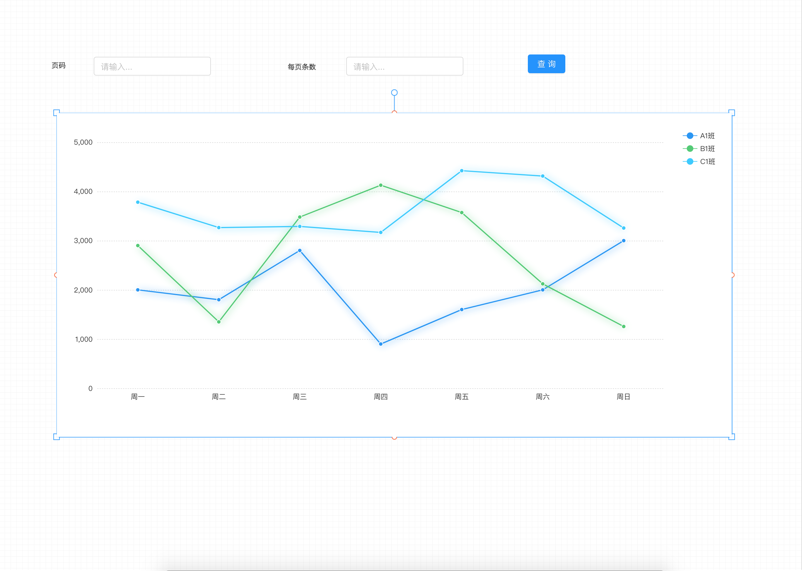

   ### 根据API配置图表Http属性

   我们这里使用外部公开的API, 进行配置。

   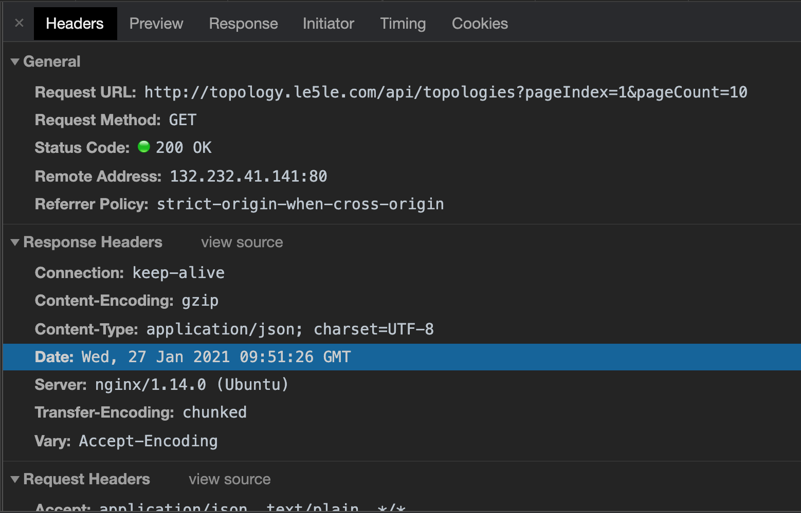

   通过简单的分析, 这个api是 ``` get ``` 请求, 并且需要传递两个参数: ``` pageIndex ``` 和 ``` pageCount ```.接下来, 需要查看返回的数据。

   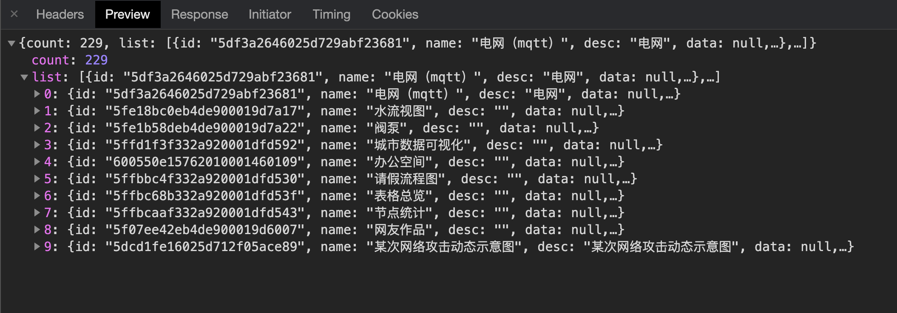

   返回数据分为两部分: ``` count ``` 和 ``` list ```。

   ok, 根据以上的信息, 我们已经可以对图表进行配置接口了。

   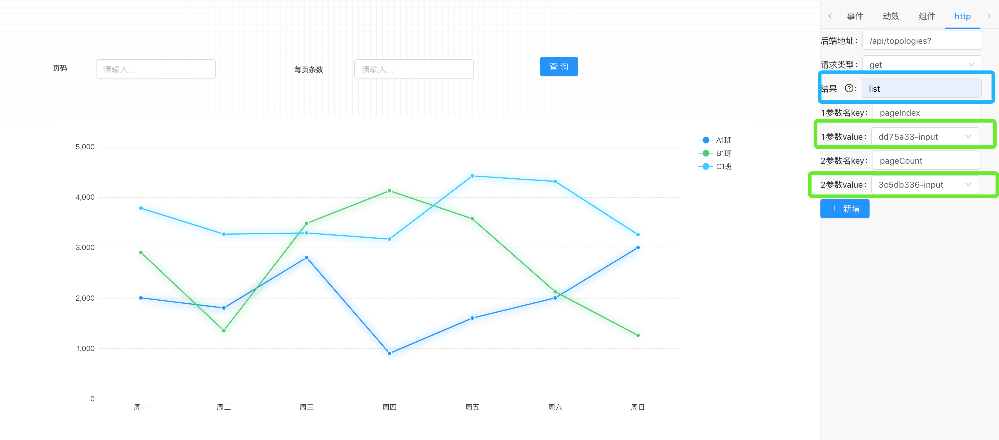
   
   相信大家除了框框中的几个有点看不懂, 其余的应该都能理解。下面我对框框中的配置做一下介绍:

   - 结果
  
     由于API返回的数据格式是: ``` { list: [], count: XXX } ```, 因此我在处理结果的时候,
     使用lodash的```get```方法。

     ```js
     get({ list: [], count: XXX }, 'list', XXX)
     ```

     因此此处填写的list, 是为了解析API返回的结果。

   -  参数value

      API中的 ```pageIndex ``` 和 ``` pageCount ```的值 是需要我们传递的, 传递的值是通过输入框来确定的。因此参数的value, 我们直接绑定对应的输入框即可。

  ### 根据API返回值配置图表option

  此时, 我们已经能够发起请求, 并且拿到数据了, 接下来我们需要把返回的数据渲染图表上。

  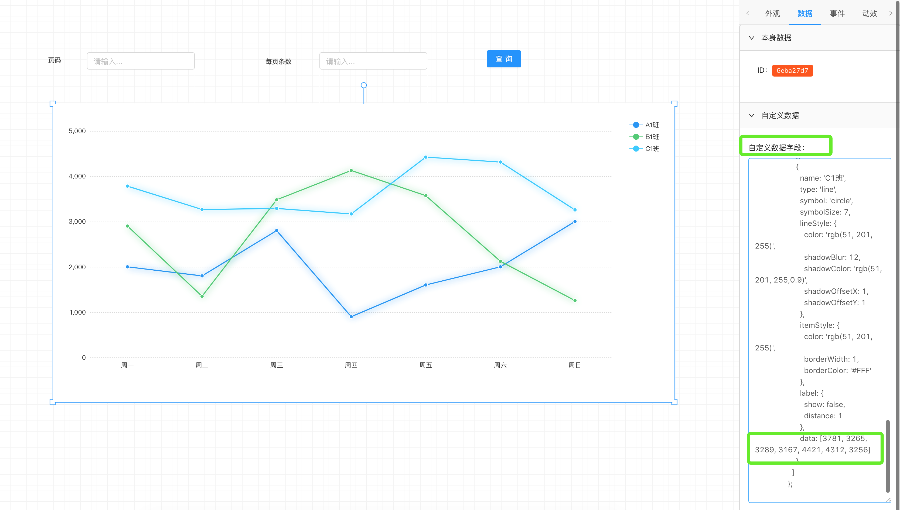

  我们需要使用真实的数据替换data里面的mock数据。在接口的返回值中有一个 ``` view ```字段, 这个字段代表访问量, 那么我们就以这个值来作为图表渲染的值。

  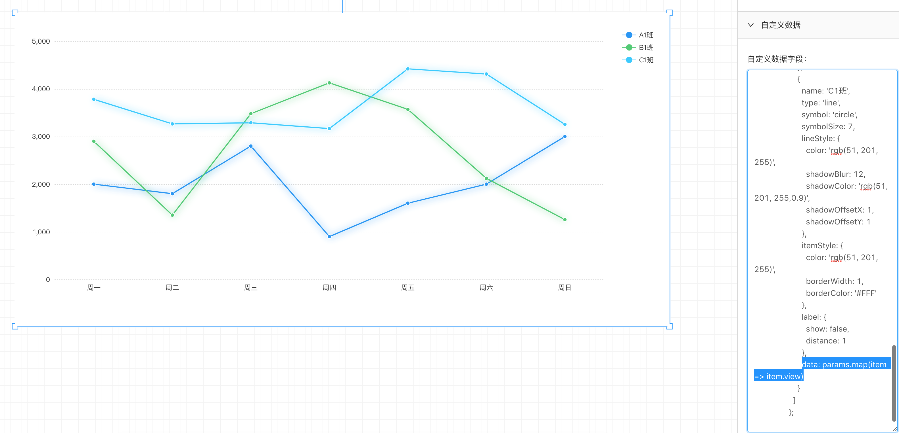

  接口的值(list数组), 我们通过 ``` params ``` 传递出来, 获取每一项的view 渲染到图表上。

  ### 给按钮绑定触发的图例

  当我们完成了基础的配置后, 就需要有类似按钮这样的组件来触发它, 按钮的配置十分简单, 只需要绑定要刷新的组件即可。

  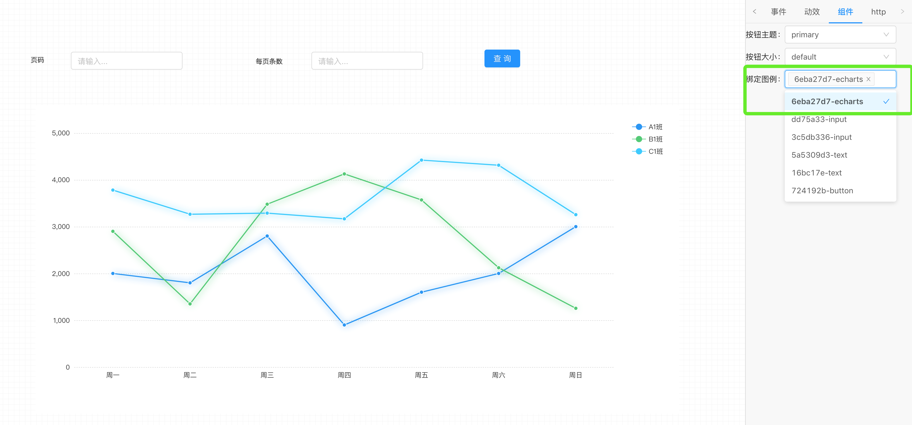

  ### 效果展示

  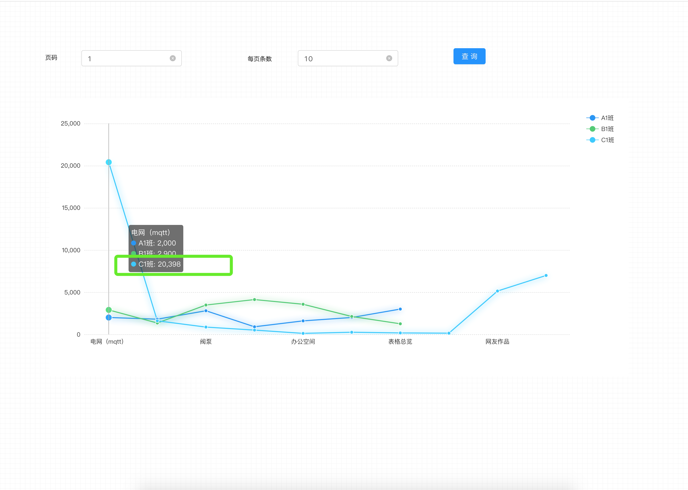

  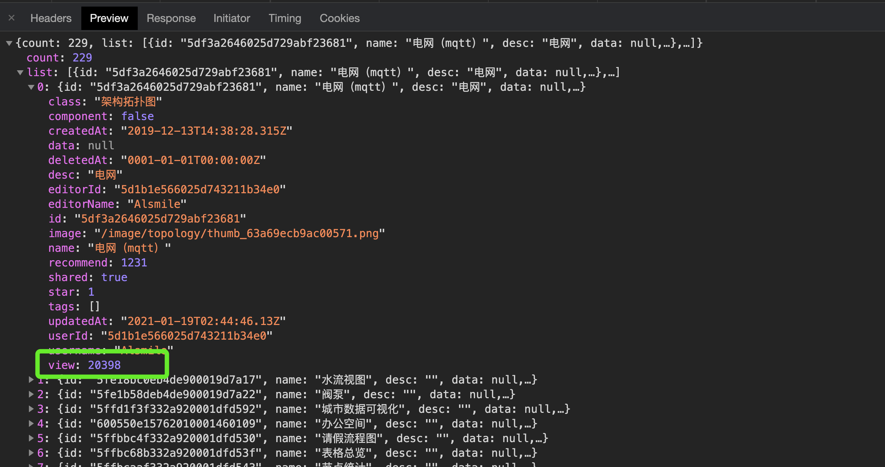

  ok! 一个简单的报表看板查询界面就完成啦！


  ## 构建表格查询界面

  假如你会了以上图表看板操作, 那么相信以下的步骤对你来说也是小case了
    
  ### 组件的摆放

  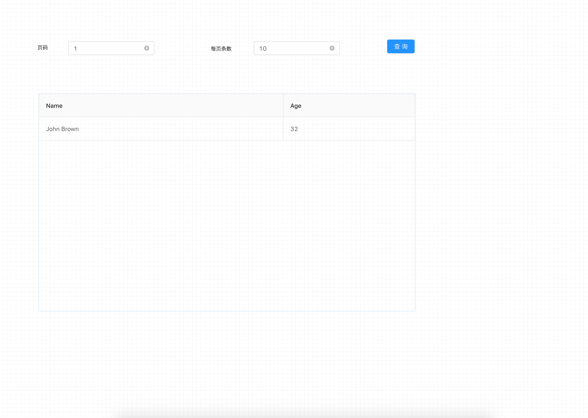

  ### 给Table设置columns

  表格少不了columns的设置, 因此在组件这一栏, 我们可以给表格添加columns。

  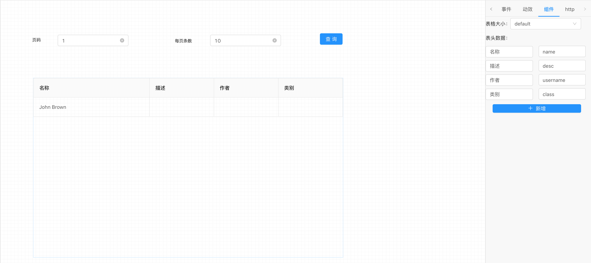

  ###  根据API配置表格Http属性

  这一步跟上面配置图表一模一样。

  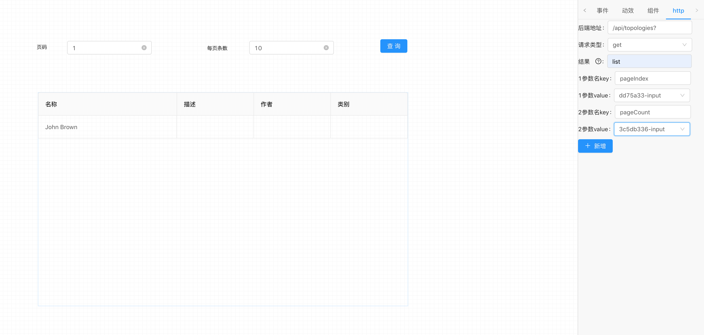

  ###  给按钮绑定触发的图例

  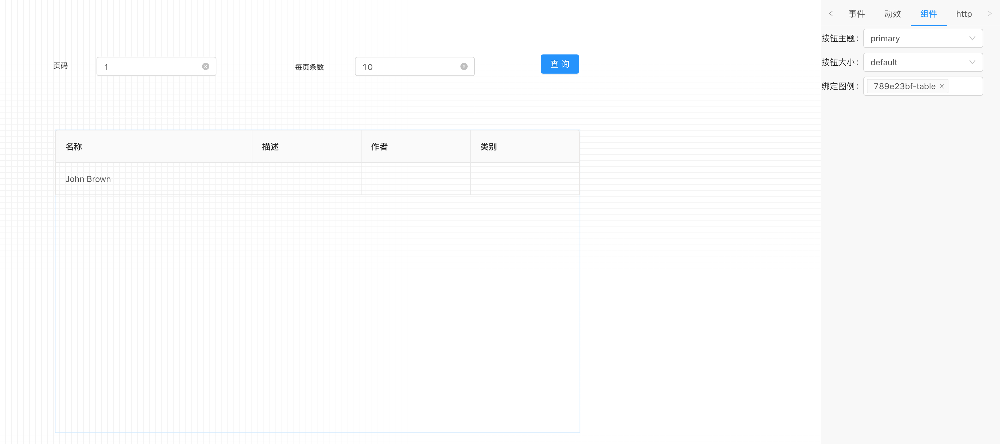

  ### 效果展示

  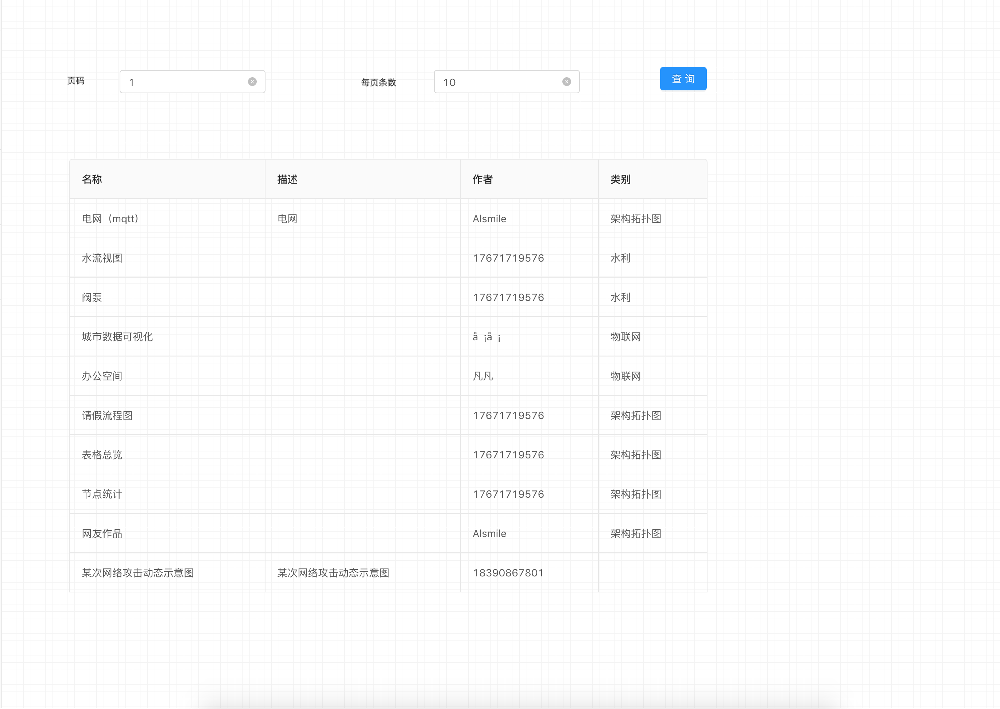


## 最后

   目前只能完成简单页面的展示(也有好几个bug), 后续我会不断地投入时间去慢慢的完善它。有兴趣的小伙伴可以一起来玩呀！[https://github.com/Summer-andy/topology-react](https://github.com/Summer-andy/topology-react).


