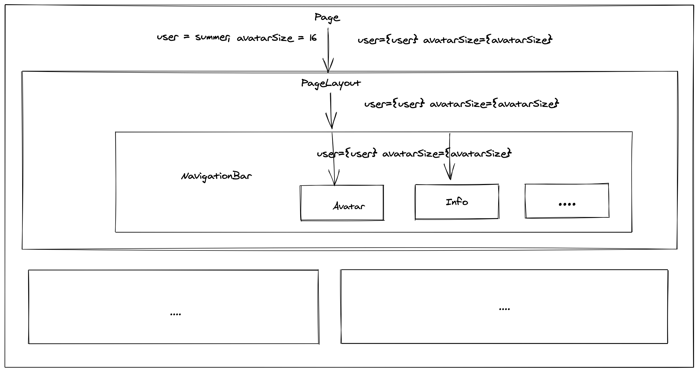
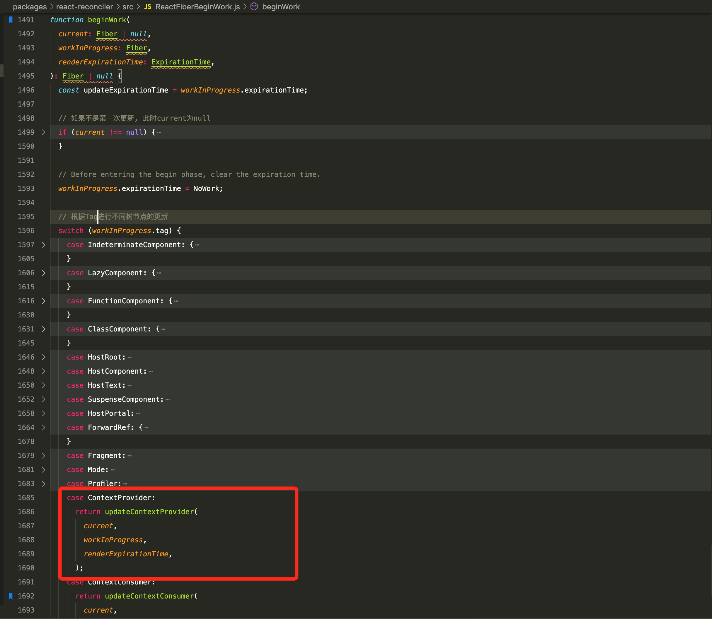
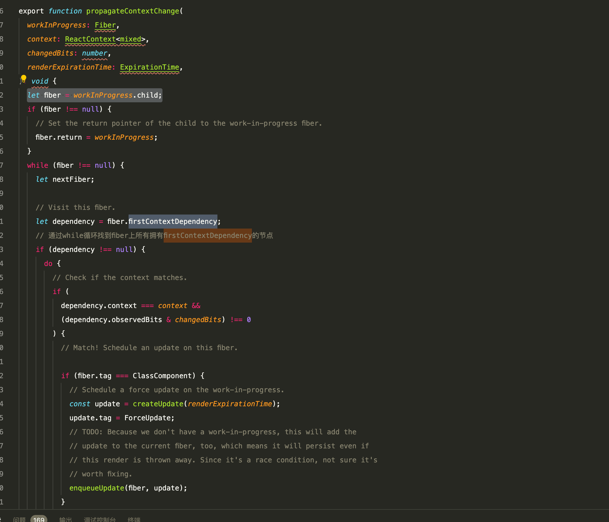
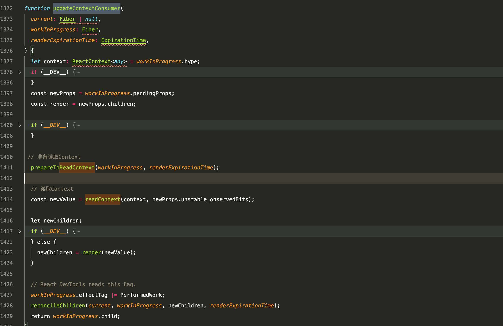
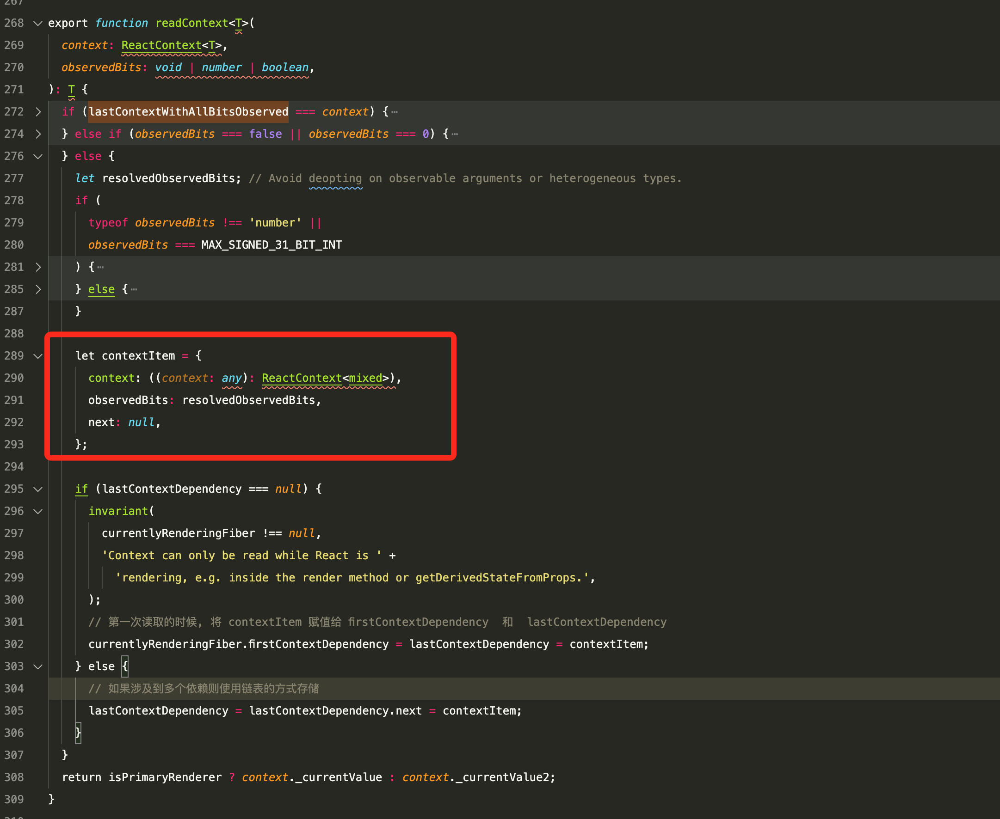

## 前言

   在一个典型的React应用中, 数据都是通过props属性自顶向下传递的, 也就是我们通常所说的父传子。但是在某些场景下(换肤), 很多底层的子组件都是需要接收来自于换肤属性, 这会让我们的代码中有很多显示传递props的代码。Context 提供了一种在组件之间共享此类值的方式，而不必显式地通过组件树的逐层传递 props。


## 什么情况下使用Context

   Context的主要应用场景在于: ``` 不同层级 ``` 的组件需要访问```相同```的一些数据。

   下面我们来看一个例子: 

   场景是这样的: 页面的根组件是一个``` Page ```, 我们需要向目标组件层层向下传递 ``` user ``` 和 ``` avatarSize ```, 从而深度嵌套的 ```Avatar``` 和 ``` Info ``` 组件可以读取到这些属性。
   
   

   ```js
   <Page user={user} avatarSize={avatarSize} />
    // ... 渲染出 ...

   <PageLayout user={user} avatarSize={avatarSize} />
    // ... 渲染出 ...

   <NavigationBar user={user} avatarSize={avatarSize} />
    // ... 渲染出 ...

   <Avatar user={user} size={avatarSize} />
   <Info user={user} size={avatarSize} />
   ```

   如果最后只有Avatar和Info组件使用到了这两个属性, 那么这种层层传递的方式会显示十分冗余。如果后面还需要新增类似```color```、 ``` background ```  等属性, 我们还得在中间层一个个地加上。

   在React官方文档中, 提供了一种无需``` Context ```的方案, 使用 component composition（组件组合）在Page组件中将 ``` Avatar ``` 和  ``` Info ``` 组件传递下去。

   ```js
    function Page(props) {
      const user = props.user;
      const userComponent = (
        <div>
          <Avatar user={user} size={props.avatarSize} />
          <Info user={user} size={props.avatarSize} />
        </div>
      );
      return <PageLayout userComponent={userLink} />;
    }

    <Page user={user} avatarSize={avatarSize} />
    // ... 渲染出 ...
    <PageLayout userComponent={...} />
    // ... 渲染出 ...
    <NavigationBar userComponent={...} />
    // ... 渲染出 ...
    {props.userComponent}
   ```

   通过上面这种方式, 可以减少我们React代码中无用props的传递。但是这么做有一个缺点: 顶层组件会变得十分复杂。

   那么这时候, Context是不是最佳的实践方案呢？

   答案是不一定。因为一旦你使用了```Context```, 组件的复用率将会变得很低。

   在16.x之前的Context API有一个很不好点: 如果``` PageLayout ``` 的props改变，但是在他的生命周期中 ``` shouldComponentUpdate ``` 返回的是false, 会导致 ``` Avatar ``` 和  ``` Info ```的值无法被更新。但是在16.x之后新版的 ``` Context ``` API, 就不会出现这个问题, 具体原理我们在后面会讲到, 此处先简单的提一下。

   如果我们的这个组件不需要被复用, 那么我觉得使用Context应该是目前的最佳实践了。我觉得官网对Context的翻译中，这句话讲的特别好: ``` Context 能让你将这些数据向组件树下所有的组件进行“广播”，所有的组件都能访问到这些数据，也能访问到后续的数据更新  ```, 当我初学的时候, 我一看到这句话,就对Context有了一个清晰且深刻的认识, 但是作为一个前端工程师, 我们的认知绝不停步于此。

   
   ```js
  import React, { Component, createContext, PureComponent } from 'react';

  const SizeContext = createContext();

  class User extends Component {
    render() {
      return <SizeContext.Consumer>
        {
          value => <span style={{ fontSize: value }}>我是其枫</span>
        }
      </SizeContext.Consumer>
    }
  }

  class PageLayout extends PureComponent {
    render() {
      return <NavigationBar />
    }
  }

  class NavigationBar extends PureComponent {
    render() {
      return <User/>
    }
  }

  class Page extends Component {
    state = {
      fontSize: 20
    }
    render() {
      const { fontSize } = this.state;
      return (
        <SizeContext.Provider value={fontSize}>
          <button
            type="button"
            onClick={() => this.setState({ fontSize: fontSize + 1 })}
          >
            增加字体大小
          </button>
          <button
            type="button"
            onClick={() => this.setState({ fontSize: fontSize - 1 })}
          >
            减少字体大小
          </button>
          <PageLayout />
        </SizeContext.Provider>
      );
    }

  }

  export default Page;
   ```

  通过使用Context, 可以让我们的代码变得更加的优雅。如果大家觉得这种写法不太优雅

  ```js 
    <SizeContext.Consumer>
      {
        value => <span style={{ fontSize: value }}>我是其枫</span>
      }
    </SizeContext.Consumer> 
  ```

  那么我们可以使用 ``` contextType  ``` 来进一步优化代码

  ```js
  class User extends Component {
    static contextType = SizeContext;
    render() {
      return <span style={{ fontSize: this.context }}>我是其枫</span>
    }
  }
  ```

  > 注意: 它只支持单个Context, 如果多个的话还是只能使用嵌套的手法。

  如果我们想要定义多个Context, 比如新增一个颜色的Context的。我们只需在Page组件中新增一个 ``` Provider ``` , 并且在消费方也新增一个 ``` Consumer ``` 即可。

  ```js
    <SizeContext.Provider value={fontSize}>
      <button
        type="button"
        onClick={() => this.setState({ fontSize: fontSize + 1 })}
      >
        增加字体大小
      </button>
      <button
        type="button"
        onClick={() => this.setState({ fontSize: fontSize - 1 })}
      >
        减少字体大小
      </button>
      <ColorContext.Provider value="red">
      <PageLayout />
      </ColorContext.Provider>
    </SizeContext.Provider>
  ```

  ```js
    <SizeContext.Consumer>
      {
        fontSize => <ColorContext.Consumer>{color => <span style={{ fontSize, color }}>我是其枫</span> }</ColorContext.Consumer>
      }
    </SizeContext.Consumer>
  ```

  多个Context的消费方的编程体验其实还是不太友好的, Hook出现之后, 也推出了 ``` useContext ``` 这个API, 帮助我们解决了这个问题。

  ```js
  const User = () => {
    const fontSize = useContext(SizeContext);
    const color = useContext(ColorContext);
    return (
      <span style={{ fontSize, color }}>我是其枫</span>
    );
  };
  ```

  在此, 我觉得有两个点是值得我们思考的: 

  - 在16.X之后新版的Context是如何解决 类似``` shouldComponentUpdate ```的问题

  - Function Component是如何做到可以订阅多个Context的
  
  接下来, 我们将会带着大家层层解开谜团, 探索新版Context的实现原理。

  ## 新版Context的实现原理

  有源码阅读经验的朋友应该对 ``` ReactFiberBeginWork.js ``` 下面的 ``` beginWork `` 方法都不陌生吧。如果你之前没有看过源码也没关系, 在本文你只需要知道这个方法是用来执行对整棵树的每一个节点进行更新的操作即可。那么我们的源码解析就从 beginWork 开始。

  ### Context的设计

  ```js
   var context = {
      ?typeof: REACT_CONTEXT_TYPE,
      _currentValue: defaultValue,
      _currentValue2: defaultValue,
      Provider: null,
      Consumer: null
    };
  ```

  我们通过createContext会创建一个context对象, 该对象包含一个 ``` Provider ``` 以及 ``` Consumer ```。

  Provider的_context指向是context本身。

  ```js
  context.Provider = {
    $$typeof: REACT_PROVIDER_TYPE,
    _context: context,
  };
  ```

  下面我们来看一下Consumer, 它的_context也是指向它本身

  ```js
   const Consumer = {
      $$typeof: REACT_CONTEXT_TYPE,
      _context: context,
      _calculateChangedBits: context._calculateChangedBits,
    };
  ```

  ### Provider的更新

  当我们第一次渲染的时候, 此时fiber树上当前的节点肯定是不存在的, 因此就不走 ```   if (current !== null) { // ... } ``` 这里面的逻辑。我们在创建 ``` ColorContext.Provider  ```的时候, React会为我们的fiber节点打上一个 ``` tag ```, 比如在此会被打上一个叫做 ``` ContextProvider ``` 的WorkTag。其他节点也是类似, 目前一共有18种tag。

  ```js
  export const FunctionComponent = 0;
  export const ClassComponent = 1;
  export const IndeterminateComponent = 2; // Before we know whether it is function or class
  export const HostRoot = 3; // Root of a host tree. Could be nested inside another node.
  export const HostPortal = 4; // A subtree. Could be an entry point to a different renderer.
  export const HostComponent = 5;
  export const HostText = 6;
  export const Fragment = 7;
  export const Mode = 8;
  export const ContextConsumer = 9;
  export const ContextProvider = 10;
  export const ForwardRef = 11;
  export const Profiler = 12;
  export const SuspenseComponent = 13;
  export const MemoComponent = 14;
  export const SimpleMemoComponent = 15;
  export const LazyComponent = 16;
  export const IncompleteClassComponent = 17;
  ```

  

  - 首次更新Provider

  当React处理Provider节点的时候, 会调用 ``` updateContextProvider ``` 方法进行Provider的更新

  

  由于是首次渲染, 所以当前fiber上的props是空的, 不存在 ``` memoizedProps ```。因此我们在这一步中仅仅执行了 ``` pushProvider ``` 和 ``` reconcileChildren ```。首先调用 ``` pushProvider ``` 将当前fiber以及它的props推入到栈(Stack)中。在React更新的过程中有一个栈模块(fiberStack), 在遍历树的时候, 它会存储上下文。
  
  在推入完成后, context的当前的值会置为传进来的值。

  ```js
  if (isPrimaryRenderer) {
    push(valueCursor, context._currentValue, providerFiber);
    context._currentValue = nextValue;
  }
  ```

  此时, Consumer上的值其实已经更新了。

  当然如果执行 ``` pushProvider ```  的是发现不是第一次更新它会将 ``` _currentValue2 ``` 的修改为最新的值。

  ```js
    push(valueCursor, context._currentValue2, providerFiber);
    context._currentValue2 = nextValue;
  ```
  
  最后执行 ``` reconcileChildren ``` 将结果赋值给workInProgress.child。


  - 非首次更新Provider

  当再次更新Provider的时候, 程序会进入 ``` oldProps !== null ```中

  ```js
  if (oldProps !== null) {
    const oldValue = oldProps.value;
    // 计算新老context上props的变化
    const changedBits = calculateChangedBits(context, newValue, oldValue);
    if (changedBits === 0) {
      // No change. Bailout early if children are the same.
      if (
        oldProps.children === newProps.children &&
        !hasLegacyContextChanged()
      ) {
        return bailoutOnAlreadyFinishedWork(
          current,
          workInProgress,
          renderExpirationTime,
        );
      }
    } else {
      // The context value changed. Search for matching consumers and schedule
      // them to update.
      propagateContextChange(
        workInProgress,
        context,
        changedBits,
        renderExpirationTime,
      );
    }
  }
  ```

 程序是否更新取决于 ``` calculateChangedBits ```计算后的值,

 ```js
export function calculateChangedBits<T>(
  context: ReactContext<T>,
  newValue: T,
  oldValue: T,
) {
  if (
    (oldValue === newValue &&  
      (oldValue !== 0 || 1 / oldValue === 1 / (newValue: any))) || //排除 + 0 和 - 0
    (oldValue !== oldValue && newValue !== newValue) // eslint-disable-line no-self-compare 排除NaN
  ) {
    // No change
    return 0;
  } else {
    const changedBits =
      typeof context._calculateChangedBits === 'function'
        ? context._calculateChangedBits(oldValue, newValue)
        : MAX_SIGNED_31_BIT_INT;

    return changedBits | 0;
  }
}
 ```
 我们可以看到在这段代码中, 如果props没有变化,并且排除了 +0 和 -0 以及NaN 的情况, 此时结果返回0。除此之外的其他情况都是要进行更新的。 节点的更新调用的是 ``` propagateContextChange ``` 这个函数

 在首先渲染完成后, 我们已经将子树赋值给workInProgress.child。因此在第二次更新的时候, 我们可以直接通过 ``` let fiber = workInProgress.child; ``` 拿到子树。

 

 此时, 我们通过遍历fiber上的所有节点找到所有拥有 ``` firstContextDependency ```的节点。
 
 > ``` firstContextDependency ``` 的初始化赋值在 ``` readContext ``` 方法中, 后面讲到 ``` Consumer ```的时候, 我们会提及。
 
 接着通过while循环判断节点上依赖的context是否依赖当前context, 如果是React将会创建一个更新 ``` createUpdate() ```,
 并且打上 ``` ForceUpdate ```的标签代表强制更新, 最后把它塞到队列里面。为了确保本次更新渲染周期内它一定会被执行, 我们将 fiber上的 ``` expirationTime ```的值改为当前正在执行更新的 ``` expirationTime ```。

最后更新workInProgress上的子树。

### Consumer的更新

   Consumer的更新比较纯粹, 它一共涉及三个主要阶段: 1. prepareToReadContext(准备读取Context) 2. readContext(开始读取readContext) 3.子节点的渲染

  

 
  - prepareToReadContext

    在每次准备读取Context的时候, React都会把树上挂着的依赖给清空

    ```js
    export function prepareToReadContext(
      workInProgress: Fiber,
      renderExpirationTime: ExpirationTime,
    ): void {
      currentlyRenderingFiber = workInProgress;
      lastContextDependency = null;
      lastContextWithAllBitsObserved = null;

      // Reset the work-in-progress list
      workInProgress.firstContextDependency = null;
    }
    ```
 - readContext

   

   在readContext中, 通过链表存储的形式, 将fiber上所有依赖的context都记录下来。在下一次更新后, Provider那边就可以通过fiber节点, 拿到它所依赖的context了。


### Hook下useContext的解析

  Hook下的所有钩子都是通过dispatch派发出来的

  ```js
  const HooksDispatcherOnRerender: Dispatcher = {
    readContext,
    useCallback: updateCallback,
    useContext: readContext,
    useEffect: updateEffect,
    useImperativeHandle: updateImperativeHandle,
    useLayoutEffect: updateLayoutEffect,
    useMemo: updateMemo,
    useReducer: rerenderReducer,
    useRef: updateRef,
    useState: rerenderState,
    useDebugValue: updateDebugValue,
    useDeferredValue: rerenderDeferredValue,
    useTransition: rerenderTransition,
    useMutableSource: updateMutableSource,
    useOpaqueIdentifier: rerenderOpaqueIdentifier,

    unstable_isNewReconciler: enableNewReconciler,
  };
  ```

  在上述的代码中, 在使用Hook的同时, 实际上是调用了 ``` readContext ``` 这个API。它直接调用了底层的API, 让我们可以直接获得最新context的值。

  在我们之前执行 ``` pushProvider ``` 的时候会分别将值赋值给context的  ```_currentValue ``` 和  ``` _currentValue2 ```. 因此当我们调用useContext的时候``` readContext ``` 返回的已经当前context的最新值了。

  ```js
  function readContext() {
    // ...
  return isPrimaryRenderer ? context._currentValue : context._currentValue2;
  }
  ```

   
