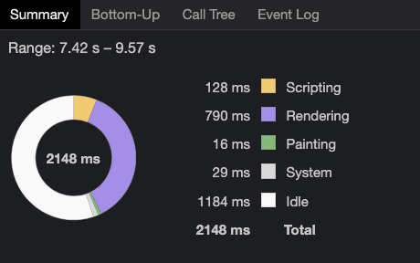

## 前言

   在一个页面中, 如果页面中某个元素的几何属性变了, 就会导致页面的重排重绘。如果一个页面元素或者结构十分简单的时候, 那么我们几乎可以不考虑由于重排重绘所消耗的时间。但是在一个复杂的页面中, 我们可以减少重排重绘的时间达到优化渲染的目的。

   ``` CSS Containment ``` (css容器)  允许我们将页面中的一部分树独立开来, 独立开来的目的是为了告诉浏览器, 在这个独立树内部的一切活动都不会影响到除它之外的内容。 因此在复杂的页面中, 使用 ``` CSS Containment ``` 能够达到优化渲染提升性能的目的。

## 基本使用

   ```html
  <body>
    <h1>My blog</h1>
    <button>改变article的内容</button>
    <button>改变article外的内容</button>
    <article>
      <h2>Heading of a nice article</h2>
      <p>Content here.</p>
    </article>
    <article>
      <h2>Another heading of another article</h2>
      <p>More content here.</p>
    </article>
  </body>
   ```

  我们给两个 ``` article ```中分别插入50000个节点, 来观察一下页面渲染(paint)所需要的时间。

  

  第一次渲染的时候 ``` Painting ``` 花费 ``` 51ms ```, 我们再继续追加 50000个节点看看整体Painting时间。

  

  以上没有设置 ``` contain ``` 的时候渲染情况, 现在我们给 ``` article ``` 添加

  ```css
  article {
    contain: paint;
  }
  ```
 
   
  

  给 ``` article ```添加了以上属性后, 浏览器就会忽略 ``` article ``` 中屏幕外不可见的元素, 也就是那些浏览器不可见的元素将不会被 ``` painting ```

  为什么 ``` painting ``` 的时间只有16ms呢, 因此我们一下子添加了50000个节点,但是屏幕可见区域并不能够显示这么多节点。因此超出屏幕外的节点就不会被 ``` painting ```

  

  我们再次添加50000个节点, 按照猜想, ``` painting ``` 的时间应该接近于 0。

  

  果然跟我们猜想的一样, 图中的1ms应该是按钮点击后重新paint的时间了。

  > 区别于overflow:hidden， 首先overflow需要指定元素的高度, 其次尽管overflow, 但是也会造成 ``` painting ```.

  当我们点击添加按钮的时候, 浏览器会执行以下操作

  - 计算样式(算出各个元素的几何信息)
  - 重排(根据几何信息排列好位置)
  - 更新层级树
  - 开始绘图
  - 合成图层
  
     

  我们可以发现, 其实页面渲染大部分的时间都耗费在计算样式和重排阶段。因此如果我们能够对上面两个阶段进行优化, 那么将会大大提高页面的性能。

  当然contain 还有其他属性, 可以帮我们优化性能。

     

  上面的paint我们已经介绍过了。

  接下来我们看一下 ``` size ``` 的属性对页面渲染的影响。

  ```css
  article {
    contain: size;
  }
  ```
  
  在平常情况下, 如果我们不给父元素设置高度, 那么如果我们给其添加子元素, 父元素的高度会受子元素的影响。 
  
     
  
  添加了  ``` contain: size; ``` 属性即可让父元素不受子元素的影响。

     


  接下来, 我们重点看一下 ```  contain: layout; ```

  这个属性的意思就是: 设了该属性以后, 其外部元素将不会影响其内部元素的布局。

  我们举一个简单的例子, 比如此时我们在页面上生成了一个遮挡物, 遮住了容器内的部分元素。

   

  当我们给容器设置  ```  contain: layout; ```后

   

  我们发现内容不会被挡住了。

  至于  ```  contain: style; ``` 我们可以暂时不用管, 因为该属性暂时被移除了。

   

  除此之外, 还有 ```strict ``` 和  ``` content ``` 它们都是基础属性的组合。

  ``` contain: strict ```   等价于   ``` contain: size layout paint ```

  ``` contain: content ``` 等价于 ``` contain: layout paint ```

## 兼容性

  

   支持率大约在75%左右, 我们可以看到截止目前为止IE和Safari是不支持的。大家可以酌情使用 ~ 