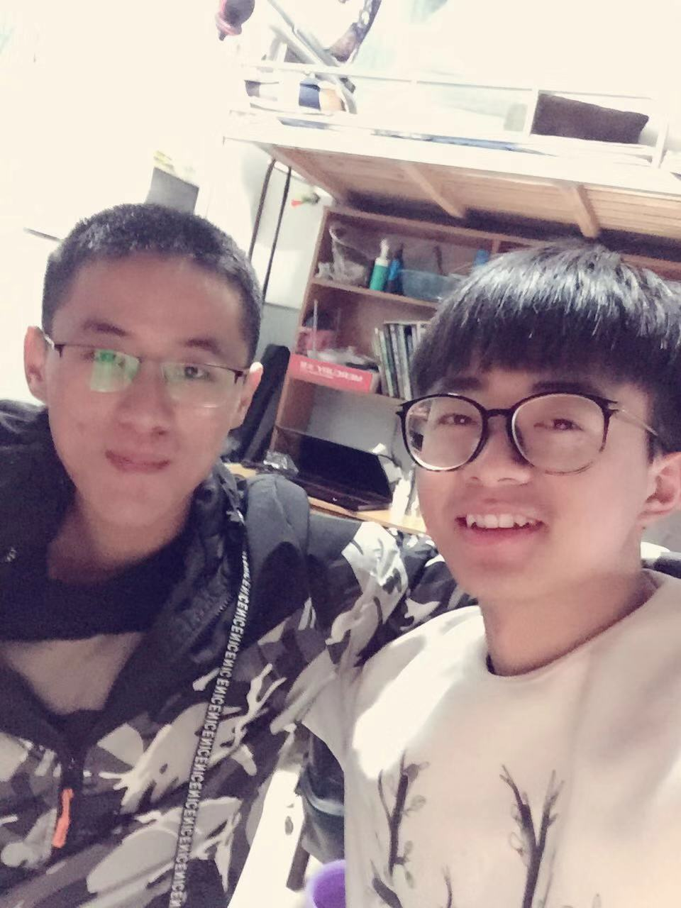

#### 2018年2月去了青岛。去逛了栈桥,八大关,五四广场,海洋世界等著名景点, 当然去一座城市怎么着也得尝一下当地的美食,我们去了劈柴院,云霄路,还有一个什么广场等小吃街。再次特别感谢青岛的室友请我吃的海鲜大餐。在此附上合照。

#### 2018年3月 年前我和实验室的伙伴们报名了服务外包大赛, 所以放假回来以后我们立刻投入到比赛中, 本来以为不会得奖, 没想到竟然得了一个小奖.在此,感谢实验室小伙伴的一起努力。

#### 2018年4月 开始阅读前端相关的书籍. 通过上次比赛,让我明白,要成为一个合格的前端攻城狮,我需要给自己装备“武器”。这是我在4月份阅读过的书籍《js设计模式》,《锋利的jqery》,《http详解》，《css禅意花园》。

#### 2018年5月, 准备大学期末考试。

#### 2018年6月, 开始学习react和vue，把实验室之前老师给我们布置的任务,用react技术栈重构一遍。

#### 2018年7月-12月, 开始准备开始寻找暑假实习的工作。在此特别感谢吴总给我这个机会, 让我能够在慧程开始我的生活。也特别感谢刘老师,龚哥,阳哥对我工作以及学习上的教导。

#### 2019目标: 1. 阅读4本前端相关的书籍, 阅读1本规划类的书籍, 阅读一本国外名著。2. 至少参与一次前端社区活动。3.把犀牛书在啃一遍。 4.把js设计模式梳理一遍