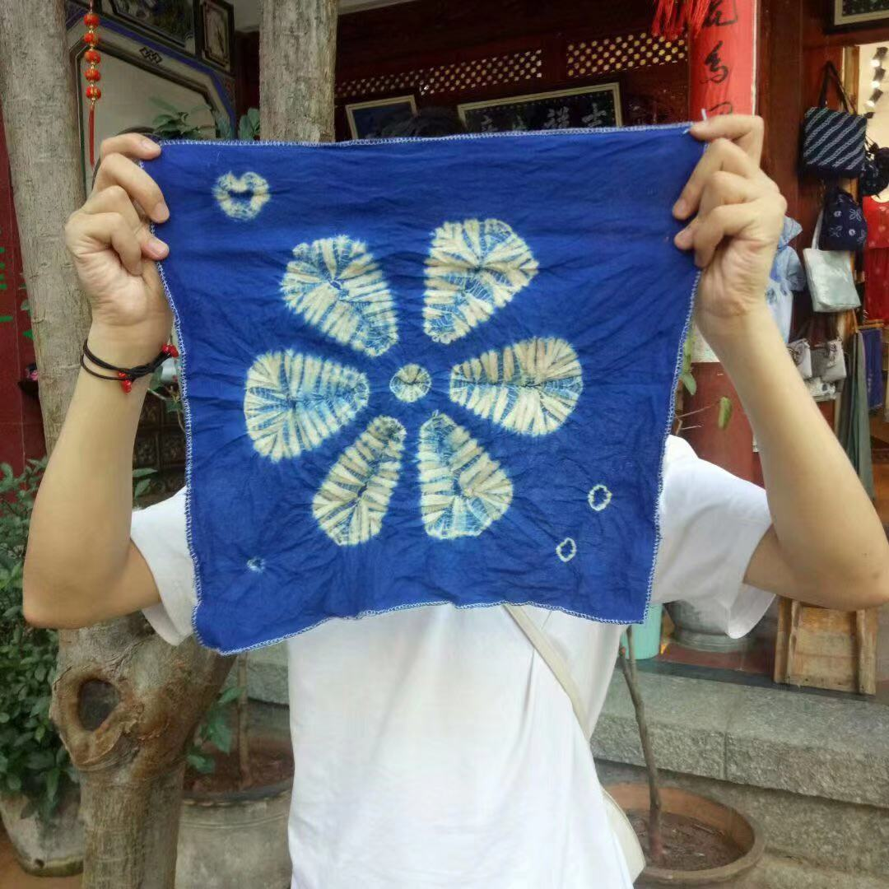

 
 

 ##### 每一段你经历过的快乐亦或是难过的时光,在若干年后都是一杯值得你细细品味的咖啡。就好比电影《红猪》里面的插曲《一去不复返的时光》一样,在人生中每个不同阶段来听这首插曲都会有不同的感觉。本文是对自己2019年的生活做一个整体的回顾以及在2020年需要提升自己的地方做一次记录。

 
 ### 2019-06 
 ##### 2019年6月学校举行了毕业典礼🎓,这也意味着我即将踏出校门开始我新的生活。在踏上去上海的列车前, 我们去了美丽的七彩云南。我记得在中学时期, 对《彩云之南》这首歌特别有感觉。因此从那会儿开始, 就特别希望能够去云南感受一下秀色的丽江, 闪耀着银光的玉龙雪山, 泸沽湖旁湛蓝的天空......。
  
 ##### 这是我当时在大理学的扎染, 除了边上一些圈圈点点以外, 我感觉还扎的还行哈哈。

 ##### 2019年6月12号我踏上了去上海的列车。很荣幸能够收到慧程offer, 并且能够让我在研发部担任前端开发这个岗位。我任职期间参与了慧程前端架构的整个设计与开发, 让我对前端开发这个职位有了更进一步的了解,也让我明白自己还欠缺哪方面的知识。

 ### 2019-07至2019-09
 ##### 在这期间我们产品的前端架构从一个复杂的单体应用拆分成了一个个单独的模块包。在这期间,我们形成了适合我们业务的组件库,工具包,脚手架......。因为随着实施部门项目订单的增多, 使用我们产品的项目也越来越多,所以仅仅使用git拉分支的方式, 给不同的项目构建不同的项目其实是一件特别浪费我们精力的事情,而且效果也不是很好。因此,我们用learn 将我们的产品以模块功能来区分划分成多个包加以版本管理, 我们将一整个MES产品拆分成PMS(生产管理)、EMS(设备管理)、QMS(质量管理)、BASE(基础模块)、Core(核心模块)。同时我们将模块中的components、redux、国际化等统统都暴露出去,供二次开发者使用。

 ### 2019-10至2019-11
 ##### 由于之前都是以业务需求```快速实现```为主, 因此在开发过程中积累下来了好多我不太熟悉的知识点,因此在下班后,我对各个知识点进行了沉淀。期间用storybook倒腾了一个[组件库](https://github.com/sixiaodong123/react-loading),虽然现在组件库的文档和api还不是特别完善。


 ### 2019-12-至今
 ##### 又要开始忙碌起来了,在开始忙之前聆听了一场音乐会🎵, 算是对自己"味蕾"的一种补偿吧。

 ### 2020
 ##### 新的一年,我应该在技术的深度上更进一步。多做总结、多做输出。最好能够帮助到其他人。新的一年祝大家能够找到适合自己的一条```路```。