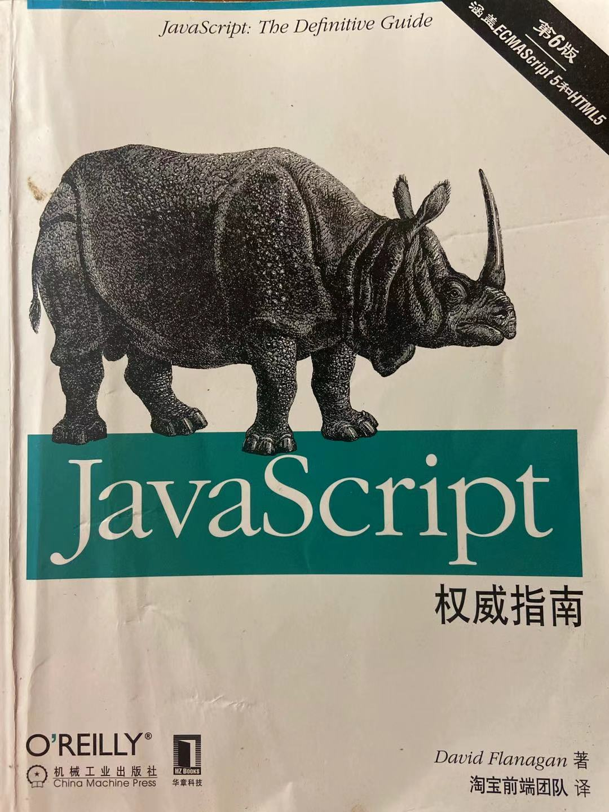
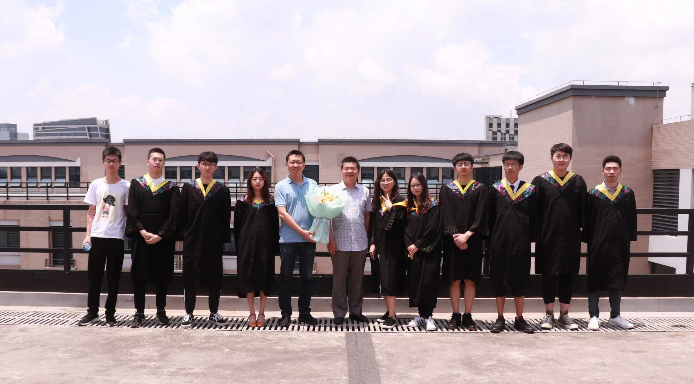
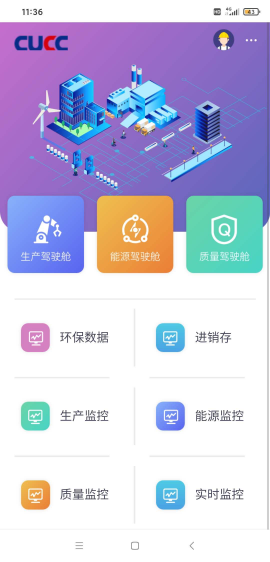
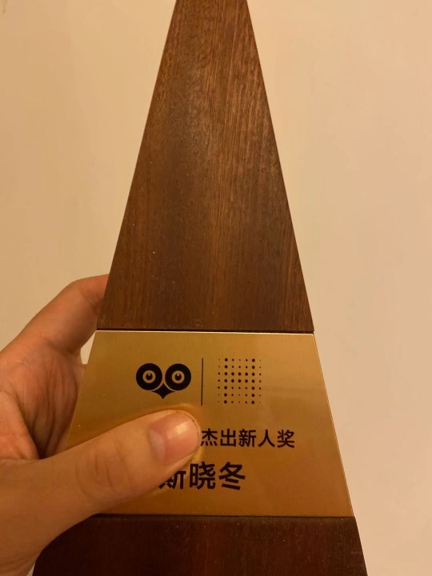
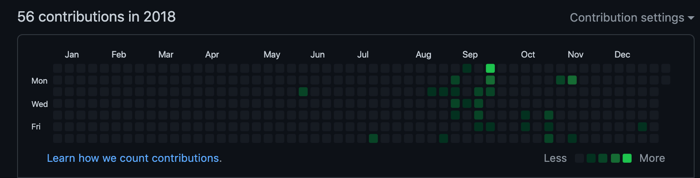
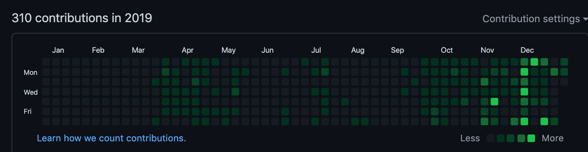
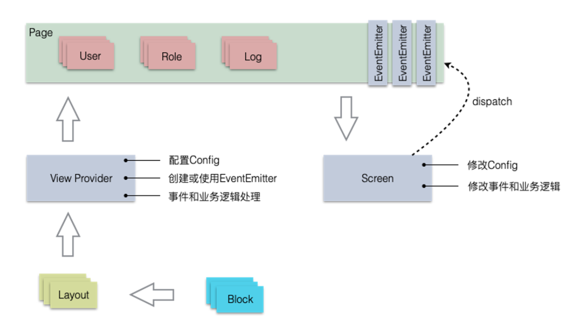
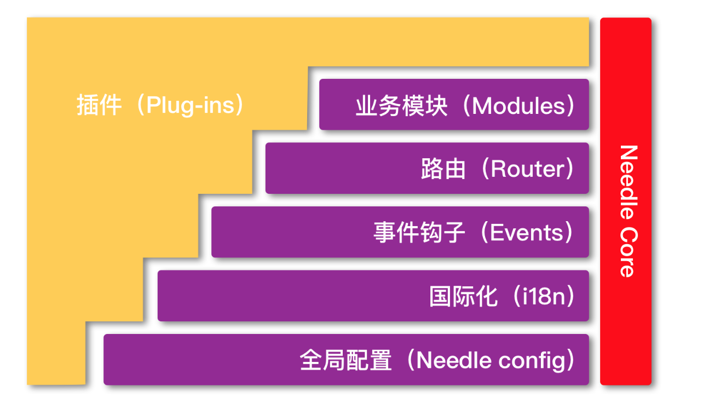
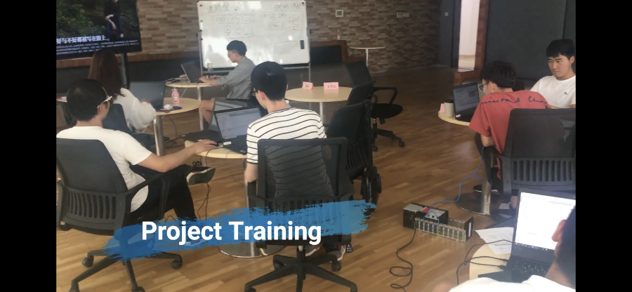

<!-- ---
title: 24岁, 接触前端的这三年。
date: 2020-12-14
tags:
 - 随笔记录
categories:
 - 年终总结
--- -->

## 

时间来到了2017年, 彼时React和Vue似乎也没有像现在那么流行。那时的我, 还是实验室的一个小萌新, 满脸疑惑地看着学长在小黑板上给我们讲``` ajax ```, 当时的我仅仅也只是会写简单的JSP页面而已。因此, 对于学长说的ajax, 我基本一句也听不懂, 什么异步刷新的, 对此根本没有一点儿概念。

这一晃三年过去了, 从纯粹的只知道用jsp写课程设计页面、 使用jquery + ajax前后端分离开发实验室项目、 使用React/Vue进行毕业设计项目的开发、能够基于React开发出属于公司业务的一套框架。从一开始听学长分享、自己在实验室给学弟学妹分享、在公司给其他团队做培训分享, 这一路走来有苦有甜, 值此2020年, 将它整理下来分享给大家。

## 坐实验室板凳的第一年

   与大多数班里的同学一样, 我怀着一颗汲取知识的心, 进入了实验室。我到现在还记得当时实验室老师对我们说的话: 大家能够选择实验室, 我很高兴, 但是实验室是有淘汰制度的。不过我相信, 大部分的同学是最后自己放弃了。 想想当时, 确实是这样, 没到一年, 当初接近20人的成员, 到最后只有两名了。中间大部分的同学, 都是坚持不下去主动退出了。我很感谢当时的自己最后能够留下来。

   那时候, 基本一上完学校的课, 我就去实验室待着。记得当时, 实验室的学长给我们布置了任务, 让我们先自学一段时间的html和css, 两周后, 在实验室进行测试(不能联网百度)。当时的我, 只会写div, 连基本的块级元素和行内元素这些个专有名词都不知道。我当时内心很慌张, 怕写不出来就会被劝退。

   两周后的某个晚自修, 群里发来了测试的通知。一切都是那么的顺利, 我似乎是第一个搞定的。当时的我, 特别紧张, 因为当你写完后, 实验室的学长学姐都会过来围着你, 仔细地看着屏幕上的代码, 这感觉犹如实习生刚刚进公司, 一群大佬围着你的屏幕。当时, 他们的评价是: 写的html不够语义化, css基础样式掌握的不太好。依稀记得, 当时所有的元素我都加了id, 通通使用id选择器来进行样式的布局。不过最后我还是通过了测试。

   > 在实验室学习期间, 我基本每天都在晚上11点左右离开, 在此很感谢考研的室友们对我的理解和包容, 因为每次回去室友都已经躺在床上休息了。

   在实验室沉淀了半年后, 实验室的老师给我们分配了一个软件硬件结合的项目。事实上, 都过不了一年, 半年后同一批进来实验室的就仅仅剩下我和另外一位同学了。

   如果实验室的学长是我前端的启蒙师的话, 那么实验室的另外一位同届小伙伴[Rikhard-Dong](https://github.com/Rikhard-Dong) 可以算是真正引领我进入前端Zone的大神了(我们都称他为大神, 或许是因为他是ACM大神, 亦或是他精通各种操作系统的使用, 我其实到最后都没有搞清楚为什么大家都称呼他为大神, 总之在当时, 他对于在编程领域的广度与深度着实让我震撼)。

   > Zone的概念，出自《黑子的篮球》，指为少数天才球员能够进入的领域。进入此领域后，各项能力皆达到高峰，视野也会变大，有时间限制。只有对篮球绝对喜欢，才能进入Zone的境界

   当然, 我并没有很强的编程天赋, 在这里引用Zone, 其实是每当我遇到瓶颈的时候, ``` Rikhard-Dong ``` 都会指点我。虽然他是后端, 但是我的ajax是他教的、 git的使用、 前端项目的部署等等, 他总能在我需要帮助的时候, 告诉我应该如何去做。

   这是我们最后离开实验室时他送给我的犀牛书。
   

   在实验室后面的项目中, 我使用的是Jquery加Bootstrap完成前端的功能。回顾在实验室的这一年, 我基本都是在学习基础知识、将所学的知识应用于实际项目中, 并且了解了多人协作的编码方式。

   年后我们还参与了浙江省服务外包大赛, 本来以为不会得奖的, 结果竟然得奖了。感谢小伙伴们的夜以继日的付出。

   那场比赛后, 我们都开始准备实习的事情了。也是在那时候起, 我才慢慢地接触到React、Vue、Redux、Sass、Webpack、MVVM等等在当时看来很高大上的技术。刚刚接触React那会儿, 着实让我头疼。不过还好, 实验室中有一位学长一直在研究这方面, 每次在我遇到问题的时候, 我都会在实验室等他下班给我解惑。

   很快, 实验室的一年就过去了。在这一年, 大部分的时间都是自己一个人呆在实验室, 甚至放假也是呆在实验室学习, 因此我将此阶段称之为 ``` 坐实验室板凳的第一年 ```

   下图是我们实验室同学在大楼顶层的合照:

   

   快实习的时候, 实验室的老师问我和[Rikhard-Dong](https://github.com/Rikhard-Dong) 愿意留在实验室实习吗？可能是对大城市的向往与更加广阔的技术平台, 我还是选择了告别实验室, 前往上海。

   感谢 ``` Rikhard-Dong ``` 、 ``` 保通学长 ``` 、 ``` 何老师 ```、 ``` 杨磊学长 ``` 、 ``` 锦波学长 ``` 、 [牧云云学长](https://juejin.cn/user/4195392100763480) 等不少人的关照, 希望有缘能够江湖再见吧。

## 奔赴上海的第二年
   
   第一次独自一人来到上海, 心中有一种莫名的激动与忐忑。到了实习的公司后, 公司安排了我们为其一个月的学习适应计划。在此期间, 我们都被称为 ```  trainee  ```。

   参加本次适应计划的共有20名左右的同学, 都是刚刚毕业的同学, 而我就比较特殊了, 应该是唯一一个实习期间来参加```  trainee  ```的。大部分的同学都是来自于北方, 因此经过这为其一个的洗礼, 我一口"标准的"普通话变成了东北话, 每次我回学校的时候, 同学们都被我说话的口音给惊呆了。

   在这一个月的培训中, 主要是让我们对公司企业文化和核心业务有一个全面的了解, 同时开拓我们的眼界以及开始培养团队合作精神。

   一个月的时间, 我们学习了企业级的编程准则、PLC编程、技术人员应该掌握的销售技巧等等。经过一个月的洗礼, 公司准备将我们派发到各个部门不同的业务线中, 并且开始认领师傅。可能是由于, 我在培训期间的表现比较不错, 事业部的总监想让我去公司的产品部门。当时, 我去的时候公司还没有成立产品研发部, 直到10月份产品经理、 后端架构师 、前端架构师陆续到达。在此之前, 我先被安排到项目做APP的开发。

  

  这是之前做的一个水泥行业的app。

  产品研发部门成立后, 我就开始跟着前端架构师一步一步的搭建产品前端框架, 我们从框架语言的选型、UI框架的选型等等都做了细致入微的调查与研究, 最后我们选择了React+ Ant Design技术栈。
  
  这一年也是我技术飞速成长的一年。

  在这一年, 我们团队的融合也非常的迅速。记得团队刚刚成立之初, 那段时间我的直属领导Fred, 天天下班带着我们守图打怪以及产品经理周末带着我们去网咖打LOL。现在想起来, 这何尝不是一种培养团队默契的一种好的方式呢？ 我到现在都特别喜欢我们那个团队。工作上简单的、类似的问题, 几乎都不用怎么沟通, 仿佛都形成了默契。因此, 我们研发的效率特别高, 团队的氛围十分的融洽。除此之外, 我的老大让我们上班之余, 有自己的一个可以钻研的方向, 比如 ``` 可视化 ```、 ``` 工程化 ``` 、 ``` low-Code ``` 等等， 然后定期分享各自研究的成果。

  如果说Fred给我带来的是技术广度提升的话, 那么vickyhoo给我带来的则是技术的深度的提升, 每次CodeReview, 我都会把问题和疑惑全部暴露出来, 他们对技术精益求精的态度都给我起到了一个很好的模范作用。

  凭借着这一年的努力, 我拿到了最佳新人奖。同时, 我（口琴）和 产品经理 (尤克里里) 以及团队的其他成员的(合唱)年会节目《童年》, 也拿到了最佳表演奖。

  

## 技术沉淀的第三年

   随着自己研究的点越来越深入, 越发觉得自己的基础知识还不够强硬, 因此接下来一年我几乎都在沉淀自己。
   
   在这一年我阅读了

   - 深入浅出React和Redux
   - 你不知道的javascript(上中下)
   - 深入理解typescript
   - javascript编程精解
   - javascript权威指南

   可以看到2018和2019年的区别

  

  

   这一年我们也研发了自研的前端框架(needle-block)。
  
   随着互联网的发展趋势，越来越多优秀的技术和框架层出不穷，其目的都是为了降本增效。根据这个原则，我们也比较注重研发提效，最好一个人可以干多个人的活。关于提效，其中比较重要的就是不要写重复的代码，要做提取和组件化。为了更有效的复用，我们将页面拆分成5个层级：

   - 组件，指通用组件，我们会陆续提取更多通用组件到HUI中。
   - 业务组件，指不能提取通用组件的，由多个组件组成的定制化组件，可以理解成代码片段
   - 区块(Block)，由多个组件组成的通用型块级模板，通过配置决定Block的最终实现。
   - 标准布局(Layout)，提供多套标准布局，可以装载不同的Block和业务组件。
   - 页面模板，装载Layout，事件处理及业务处理。
   
   

  基于这套框架我们主要解决了以下问题: 

   - 减少重复的代码编写，重点关注在事件处理和业务处理
   - 不需要标准模块源码也能灵活改变页面内容
   - 多人协作也能达到页面标准化布局

   同时, 我们利用插件化的思想对产品架构进行升级。

   

   为了方便老项目的升级, 我还写一个升级脚本工具 ``` needle-codemod ```。它可以用来老的项目一键升级到最新的架构, 同时还会自动检测出有问题的代码。

   除此之外, 我还负责了对第三届``` trainee ``` 的前端技术培训工作。

   

   图中的锅盖头就是我本人。

   这一年, 唯一让我觉得遗憾的是: 我没有带好我的徒弟。事后, 我反思了一下, 对于新人我没有做到Fred和Vickyhoo对我那样认真、负责。既然她选择了前端, 那么我就应该尽我最大的能力, 去帮助她赶上我们的节奏, 让她和我们一起进步, 实现自己的价值。在她气馁的时候, 应该鼓励她引导她, 不知道是碍于性别还是什么, 我总是不敢做出行动, 如果还有下次, 我一定会当一个负责任的师傅。

  
## 致谢
   
   回首往事, 这一路走来感谢朋友们对我的照顾与陪伴。

   - 感谢[Rikhard-Dong](https://github.com/Rikhard-Dong)在我每次遇到瓶颈的时候帮助我突破。
   - 感谢Jessie在我[奔赴上海的第二年]对我生活上的照顾。
   - 刘老师在对待问题的思考方向上给与了我很好的榜样、龚哥对于产品的设计与带领团队的方式上让我收获颇丰、 Fred以及Vickyhoo在对待技术的态度和管理上给我起到了很棒的带头作用。
   - 感谢Rabbit女士一直陪伴着我,在我遇到困难时给予我安慰和鼓励。
   

   最后引用Grace的话送给自己也送给大家:

  > 要像孩子一样时刻保持一颗好奇心, 这个好奇心就是学习。时刻保持成长, 才能拥有想要的人生。生命的意义在于开拓而不是固守, 无论什么时候我们都不该失去前行的勇气。

   写于2020/12/14 2:38分。