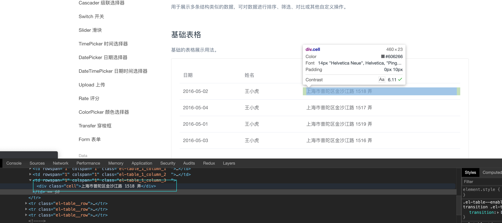

:::tip
贺兰山的积雪融化着,

腾格里的沙子飘飞着。 

额济纳的胡杨挺拔着,

巴丹吉林的黑城屹立着。

只有骆驼还在迁徙,

骏马还在奔腾,

鸿雁在返乡的路上,

牧人在孤独地彷徨。
:::

## 前言 
   在后台管理系统开发的过程中,各种按钮、输入框、表格等控件的使用频率是非常高的。那么当组件库的控件不太满足我们的业务的时候, 我们就需要自己改造一下组件。本文是我在开发过程中对于Table组件的一些思考。


### 示例1
  
  
  
   当数据源的格式长度都不能确定的时候,往往会出现上图的情况，表格不规整,并且由于某一条数据特别多,导致表格的高度拉长,原本一页可以显示20条表格数据的, 结果只能显示10几条数据了。假如Age字段是关键信息, 那么按照上图这么显示,是不是会影响我们的观感呢,等等一系列的问题都会让我们的系统变的很不Nice。不好的地方我也不多说了, 我们直接开始进入正题吧。


   我先说一下我个人初步的想法:
   当我们能确定表格某一列大致宽度的时候, 我们尽量定个宽度。那么很多时候,对于某些字段的宽度我们是确定不了的。那么这个时候，我们该如何处理呢？


   我们先来看一下初步处理后的效果:

  


  我们将Name和Age这种能够确定的列定宽后, 让剩余不确定column宽度的Address和Tags按照我们的算法给它适合的宽度。当Address或者Tags中的内容很长的时候, 他会自动的帮我们添加省略号,并且当我们鼠标移入的时候, 可以显示tooltip看到所有的内容。

  那么我们是如何做到的呢？
  
  我们将antd的Table组件再封装了一层, 并且对columns的render进行了处理,通过根据column上showOverflowTooltip的值来判断是否需要显示tooltip。
  
  当然这里最重要的是, 所谓合适宽度的计算: 

  

  ```js

  const columns = [
    {
      title: 'Name',
      dataIndex: 'name',
      key: 'name',
      width: 150
    },
    {
      title: 'Age',
      dataIndex: 'age',
      key: 'age',
      width: 150
    },
    {
      title: 'Address',
      dataIndex: 'address',
      key: 'address',
    },
    {
      title: 'Tags',
      key: 'tags',
      dataIndex: 'tags'
    },
  ];

  ```

  当我们给Name和Age设置宽度为150后, 可以在上图看到th的宽度为182px,多出来的36px是左右的padding值总和。Table的总宽度可以通过访问DOM获得。因此界面上还剩下: ``` 1615px - 182px - 182px = 1251px  ```.那么我们如何分配1251px呢？简单一点就直接平均分吧，因为我们都不能够确定它的大致宽度。下面就是平均分的算法:

   - 获取Table的宽度
   - 计算出已经定义宽度的column的宽度总和, 由于antd的table中td自带padding 左右各16px,因此我们算的时候需要加上32px
   - 计算未设置column的数量
   - 计算出未设置column合适的宽度: 可分配的宽度除以未设置column的数量

  ```js

    const columnStyle = {
        whiteSpace: 'nowrap',
        overflow: 'hidden',
        textOverflow: 'ellipsis'
    };

    ...

    const arr = []; // 定义一个数组存储新的column
    const totalWidth = document.getElementById(uuid) ? document.getElementById(uuid).clientWidth : 80; // 计算Table的宽度
    const hasWidth = props.columns.reduce((pre,cur) => { return (cur.width + 32 || 0) + pre }, 0); // 计算已有宽度总和(32是每个td内容前后padding各16)
    const hasNoWidthNumber = props.columns.filter(item => !item.width).length; // 计算未设置width的columns数量
    const columnWidth = parseInt((totalWidth - hasWidth) / hasNoWidthNumber, 10) - 32; // 计算出column的宽度

    props.columns.forEach(element => {
      if (!element.render) {
        element['render'] = ele => {
          if (element.showOverflowTooltip === false) {
            return ele;
          }
          return (
            <Tooltip placement="leftTop" title={ele}>
              <div
                style={{
                  width: element.width || columnWidth,
                  ...columnStyle
                }}
              >
                {ele}
              </div>
            </Tooltip>
          );
        };
      }
      arr.push(element);
    });
  ```

  似乎我们最开始的问题已经得以解决。那么我们来思考一个问题,实现这个效果最关键的点在哪儿呢？是表格内容宽度的计算，也就是columnWidth的计算。因此问题点就来了,columnWidth的值是依赖当前表格显示的宽度, 那么当我们拉伸界面的时候, Table的宽度高度也会发生变化。那么这个columnWidth的值 是不是应该也要随之变化呢？这会导致一个问题,我们需要实时监听Table的尺寸,那么这不是很消耗性能么？还有一个问题,有必要多次渲染Tooltip么？为什么不能在我们要查看的时候, 这个Tooltip在生效呢？只要我们深入一想，我们就会发现这个Table还是有很多问题, 它变得又不Nice了。

  我们来罗列一下问题点:
  
  - 动态计算宽度影响性能
  - 没必要渲染多余的Tooltip组件
  

  参考了国内外一些优秀的组件库之后, 我发现已经有组件库实现了这个Table的功能,我们以大家都熟悉的element-ui的Table组件来剖析一下, 它是如何处理Table数据溢出问题。

   
  我们首先来看element-ui是如何解决问题2的。

  我们来看一段代码:

  ```js
    <table
      class="el-table__body"
      cellspacing="0"
      cellpadding="0"
      border="0">
      <colgroup>
        {
          this.columns.map(column => <col name={ column.id } key={column.id} />)
        }
      </colgroup>
      <tbody>
        {
          data.reduce((acc, row) => {
            return acc.concat(this.wrappedRowRender(row, acc.length));
          }, [])
        }
        <el-tooltip effect={ this.table.tooltipEffect } placement="top" ref="tooltip" content={this.tooltipContent }></el-tooltip>
      </tbody>
    </table>
  ```

 我们发现它在表格内容体中嵌套了一个tooltip组件。看到这段代码我们应该大致可以猜到，它的tooltip肯定是通过某一个行为动作去控制的,显示的值应该也是在这个时候赋值的。

 这时候, 我们只要找到tooltipContent被赋值的地方即可。果然我们发现一个叫做 ``` handleCellMouseEnter ```方法, 看这个命名我们很容易可以猜出, 这个方法应该是处理鼠标移入表格单元的时候，去处理一些事件。

```js

  handleCellMouseEnter(event, row) {
    const table = this.table;
    const cell = getCell(event);

    ... 

    // 判断是否text-overflow, 如果是就显示tooltip
    const cellChild = event.target.querySelector('.cell');
    if (!(hasClass(cellChild, 'el-tooltip') && cellChild.childNodes.length)) {
      return;
    }
    ...
    const range = document.createRange();
    range.setStart(cellChild, 0);
    range.setEnd(cellChild, cellChild.childNodes.length);
    const rangeWidth = range.getBoundingClientRect().width;
    const padding = (parseInt(getStyle(cellChild, 'paddingLeft'), 10) || 0) + (parseInt(getStyle(cellChild, 'paddingRight'), 10) || 0);
    if ((rangeWidth + padding > cellChild.offsetWidth || cellChild.scrollWidth > cellChild.offsetWidth) && this.$refs.tooltip) {
      const tooltip = this.$refs.tooltip;
      this.tooltipContent = cell.innerText || cell.textContent;
      ...
      this.activateTooltip(tooltip);
    }
  }

```

我们仔细查看``` handleCellMouseEnter ```方法, 我们又发现了一个惊喜: 他这里竟然也计算了宽度, 并且根据这个宽度做了一些计算后进行了Tooltip进行了一些处理。

当我看到大佬计算宽度的方法后,再看看提交的时间(2 years ago), 我顿时留下了没有技术的泪水。不管怎么样，流着泪也要继续看完。

可能有的同学, 也不太清楚document.createRange()这个api的意思。所以我们简单地介绍一下:

::: tip
Range 对象表示文档的连续范围区域。
:::

我们来举几个例子加深一下印象:

示例1: 

```html
<p id="p1"><span>hello</span>world</p>
```

```js
var range1 = document.createRange(),
    range2 = document.createRange(),
    p1 = document.getElementById("p1");
    range1.selectNode(p1);
    range2.selectNodeContents(p1);
```

```html
              range1
                |
|-----------------------------------|
|                                   |
<p id="p1"> <span>hello</span>world </p>
           |                       |
           |-----------------------|
                       |
                      range2 
```

::: tip
selectNode和selectNodeContents的区别就是在于边界点的选择上。
:::


示例2: 

```html
<p id="p2">hello World!</p>
```

```js
range = document.createRange();
p2 = document.getElementById("p2").childNodes[0];
range.setStart(p2,1);
range.setEnd(p2,8)
```

```html
             range
               |
             |----|
             |    |
<p id="p2">hello World!</p>
```

::: warning
  range所选取的内容是 llo Wo
:::

我们了解了range对象后, 我们再来看一下这二行代码:

```js
  const cellChild = event.target.querySelector('.cell'); // 获取表格单元DOM
  range.setStart(cellChild, 0);
  range.setEnd(cellChild, cellChild.childNodes.length);
```

我们可以很容易的知道range选中的内容就是数据源。



OK! 我们继续, 既然已经拿到range的连续范围区域, 接下来肯定是算出这个区域的宽度咯。

```js
  const rangeWidth = range.getBoundingClientRect().width;
```
当我在w3c查看range对象方法的时候, 既然没有发现有这个方法, 然后我又去MDN上找,原来```getBoundingClientRect()```的意思是: 返回一个 DOMRect 对象，该对象限定了选定的文档对象的内容，该方法返回了一个矩形，这个矩形包围了该文档对象中所有元素的边界矩形集合。那么它的width属性代表的就是元素(选定的文档对象的内容)在浏览器中的宽度了。我估计w3c上没有更新是因为某些浏览器的支持度不是很好吧。毕竟官方也给了一个warning。

::: warning
这是一个实验中的功能
此功能某些浏览器尚在开发中，请参考浏览器兼容性表格以得到在不同浏览器中适合使用的前缀。由于该功能对应的标准文档可能被重新修订，所以在未来版本的浏览器中该功能的语法和行为可能随之改变。
:::

那么我们再去看一下``` getBoundingClientRect ```对现代浏览器的支持情况:


我们可以看到，浏览器的支持情况还是挺棒的,连IE都可以到9了。 既然浏览器的支持度这么棒, 那么我们可以放心使用了。我们继续分析接下来的代码

```js
 const padding = (parseInt(getStyle(cellChild, 'paddingLeft'), 10) || 0) + (parseInt(getStyle(cellChild, 'paddingRight'), 10) || 0);
```

这段代码应该是获取表格单元padding值。

```js
if ((rangeWidth + padding > cellChild.offsetWidth || cellChild.scrollWidth > cellChild.offsetWidth) && this.$refs.tooltip) {
  const tooltip = this.$refs.tooltip;
  this.tooltipContent = cell.innerText || cell.textContent;
  ...
  this.activateTooltip(tooltip);
}
```

上面这段代码就是根据单元格的内容的宽度判断是否显示tooltip了。当单元格里面的数据的长度大于单元格的实际长度那么就显示tooltip, 内容也就是在这个时候赋值上去的。

到这里我们的两个问题点也基本解决了。我们可以发现element-ui在某些细节的设计上面还是很棒的。