## 前言

  本文旨在提供一种app全链路开发的思路与简单的实现。 随着互联网技术的不断发展, 各大厂纷纷推出了跨平台框架。比如Facebook推出的React Native, 它的底层对Android和iOS平台的原生代码进行封装, 通过编写JavaScript就可以调用原生的API.再比如阿里开源的``` weex ```, 其实它也是通过集成WeexSDK之后，让开发者使用 JavaScript来开发移动应用。至于其他的框架在此就不赘述了。我想通过本文表达个人对于app开发的一些看法与实践。不管是``` React Native``` 也好, 还是 ``` weex ``` 也罢, 它其实无形之中提升了部分人的开发门槛。我想很多人在安装``` React Native ```的时候会遇到各种各样的奇奇怪怪的错误, 甚至真的如有些网友所调侃到 ``` 环境装好, 就相当于学完一半了 ```, 这其实也从侧面烘托出了上手成本之高。可能有些同学只想跑一个``` Hello World ``` 尝尝鲜而已。

  那么有没有办法让我们在开发PC端的同时, 不用很刻意的切换技术栈去学习一门新的语言去开发app呢？相比以往``` 心智模型 ```这个词在今年让我格外在意。我认为一个好的框架应该尽可能地让用户降低心智负担。当然不同的人对于同一个框架的心智负担肯定是不一样, 这往往跟他的学习习惯, 思维方式等等因素相关。接下来我将会从以下几个方面入手, 分享一套app的全链路开发。

## 构建UI库

   UI组件库我准备选择framework7-react.这边提供了两种方式初始化APP.

   - 使用framework7-cli构建APP

   首先你需要脚手架:
   
   ```js
    npm install -g framework7-cli --unsafe-perm=true --allow-root
   ```

  然后在桌面新建一个文件夹,在该文件夹下面执行``` framework7 create ```, 根据引导填写对应的信息即可完成App的构建

  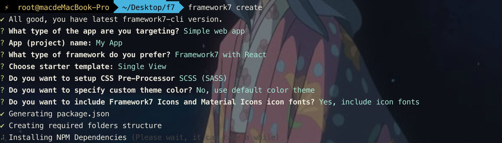

   - 使用现成的demo

  [demo](https://github.com/Summer-andy/framework7-appstore-react)

  安装依赖(npm i), 启动项目后可以在```  http://0.0.0.0:8081/ ``` 中看到如下界面: 
  
  

  其实它的交互体验还是很棒的。那么我们来看一下开发体验。下面我截取了一段主容器的代码: 

  <iframe
  src="https://carbon.now.sh/embed?bg=rgba(171%2C%20184%2C%20195%2C%201)&t=seti&wt=none&l=auto&ds=false&dsyoff=20px&dsblur=68px&wc=true&wa=true&pv=56px&ph=56px&ln=false&fl=1&fm=Hack&fs=14px&lh=133%25&si=false&es=2x&wm=false&code=import%2520React%252C%2520%257B%2520useState%252C%2520useEffect%252C%2520useRef%2520%257D%2520from%2520%27react%27%253B%250Aimport%2520%2524%2520from%2520%27dom7%27%253B%250A%250Aimport%2520%257B%250A%2520%2520App%252C%250A%2520%2520Views%252C%250A%2520%2520View%252C%250A%2520%2520Toolbar%252C%250A%2520%2520Link%252C%250A%257D%2520from%2520%27framework7-react%27%253B%250A%250Aimport%2520PWA%2520from%2520%27..%252Fjs%252Fpwa%27%253B%250Aimport%2520routes%2520from%2520%27..%252Fjs%252Froutes%27%253B%250A%250Aconst%2520AppComponent%2520%253D%2520()%2520%253D%253E%2520%257B%250A%2520%2520const%2520%255BactiveTab%252C%2520setActiveTab%255D%2520%253D%2520useState(%27today%27)%253B%250A%2520%2520const%2520previousTab%2520%253D%2520useRef(null)%253B%250A%250A%2520%2520useEffect(()%2520%253D%253E%2520%257B%250A%2520%2520%2520%2520previousTab.current%2520%253D%2520activeTab%253B%250A%2520%2520%257D%252C%2520%255BactiveTab%255D)%253B%250A%250A%2520%2520%252F%252F%2520Framework7%2520Parameters%250A%2520%2520const%2520f7params%2520%253D%2520%257B%250A%2520%2520%2520%2520name%253A%2520%27App%2520Store%27%252C%250A%2520%2520%2520%2520theme%253A%2520%27ios%27%252C%250A%2520%2520%2520%2520routes%252C%250A%2520%2520%2520%2520autoDarkTheme%253A%2520true%252C%250A%2520%2520%257D%253B%250A%2520%2520if%2520(process.env.NODE_ENV%2520%253D%253D%253D%2520%27production%27)%2520%257B%250A%2520%2520%2520%2520%252F%252F%2520Register%2520service%2520worker%2520in%2520production%2520mode%2520only%250A%2520%2520%2520%2520PWA.init()%253B%250A%2520%2520%257D%250A%250A%2520%2520function%2520onTabLinkClick(tab)%2520%257B%250A%2520%2520%2520%2520if%2520(previousTab.current%2520!%253D%253D%2520activeTab)%2520return%253B%250A%2520%2520%2520%2520if%2520(activeTab%2520%253D%253D%253D%2520tab)%2520%257B%250A%2520%2520%2520%2520%2520%2520%2524(%2560%2523view-%2524%257Btab%257D%2560)%255B0%255D.f7View.router.back()%253B%250A%2520%2520%2520%2520%257D%250A%2520%2520%257D%250A%2520%2520return%2520(%250A%2520%2520%2520%2520%253CApp%2520params%253D%257Bf7params%257D%253E%250A%250A%2520%2520%2520%2520%2520%2520%253CViews%2520tabs%2520className%253D%2522safe-areas%2522%253E%250A%2520%2520%2520%2520%2520%2520%2520%2520%253CToolbar%2520tabbar%2520labels%2520bottom%253E%250A%2520%2520%2520%2520%2520%2520%2520%2520%2520%2520%253CLink%250A%2520%2520%2520%2520%2520%2520%2520%2520%2520%2520%2520%2520onClick%253D%257B()%2520%253D%253E%2520onTabLinkClick(%27today%27)%257D%250A%2520%2520%2520%2520%2520%2520%2520%2520%2520%2520%2520%2520tabLink%253D%2522%2523view-today%2522%250A%2520%2520%2520%2520%2520%2520%2520%2520%2520%2520%2520%2520tabLinkActive%250A%2520%2520%2520%2520%2520%2520%2520%2520%2520%2520%2520%2520iconF7%253D%2522today%2522%250A%2520%2520%2520%2520%2520%2520%2520%2520%2520%2520%2520%2520text%253D%2522Today%2522%250A%2520%2520%2520%2520%2520%2520%2520%2520%2520%2520%252F%253E%250A%2520%2520%2520%2520%2520%2520%2520%2520%2520%2520%253CLink%250A%2520%2520%2520%2520%2520%2520%2520%2520%2520%2520%2520%2520onClick%253D%257B()%2520%253D%253E%2520onTabLinkClick(%27games%27)%257D%250A%2520%2520%2520%2520%2520%2520%2520%2520%2520%2520%2520%2520tabLink%253D%2522%2523view-games%2522%250A%2520%2520%2520%2520%2520%2520%2520%2520%2520%2520%2520%2520iconF7%253D%2522rocket_fill%2522%250A%2520%2520%2520%2520%2520%2520%2520%2520%2520%2520%2520%2520text%253D%2522Games%2522%250A%2520%2520%2520%2520%2520%2520%2520%2520%2520%2520%252F%253E%250A%2520%2520%2520%2520%2520%2520%2520%2520%2520%2520%253CLink%250A%2520%2520%2520%2520%2520%2520%2520%2520%2520%2520%2520%2520onClick%253D%257B()%2520%253D%253E%2520onTabLinkClick(%27apps%27)%257D%250A%2520%2520%2520%2520%2520%2520%2520%2520%2520%2520%2520%2520tabLink%253D%2522%2523view-apps%2522%250A%2520%2520%2520%2520%2520%2520%2520%2520%2520%2520%2520%2520iconF7%253D%2522layers_alt_fill%2522%250A%2520%2520%2520%2520%2520%2520%2520%2520%2520%2520%2520%2520text%253D%2522Apps%2522%250A%2520%2520%2520%2520%2520%2520%2520%2520%2520%2520%252F%253E%250A%2520%2520%2520%2520%2520%2520%2520%2520%2520%2520%253CLink%250A%2520%2520%2520%2520%2520%2520%2520%2520%2520%2520%2520%2520onClick%253D%257B()%2520%253D%253E%2520onTabLinkClick(%27arcade%27)%257D%250A%2520%2520%2520%2520%2520%2520%2520%2520%2520%2520%2520%2520tabLink%253D%2522%2523view-arcade%2522%250A%2520%2520%2520%2520%2520%2520%2520%2520%2520%2520%2520%2520iconF7%253D%2522gamecontroller_alt_fill%2522%250A%2520%2520%2520%2520%2520%2520%2520%2520%2520%2520%2520%2520text%253D%2522Arcade%2522%250A%2520%2520%2520%2520%2520%2520%2520%2520%2520%2520%252F%253E%250A%2520%2520%2520%2520%2520%2520%2520%2520%2520%2520%253CLink%250A%2520%2520%2520%2520%2520%2520%2520%2520%2520%2520%2520%2520onClick%253D%257B()%2520%253D%253E%2520onTabLinkClick(%27search%27)%257D%250A%2520%2520%2520%2520%2520%2520%2520%2520%2520%2520%2520%2520tabLink%253D%2522%2523view-search%2522%250A%2520%2520%2520%2520%2520%2520%2520%2520%2520%2520%2520%2520iconF7%253D%2522search%2522%250A%2520%2520%2520%2520%2520%2520%2520%2520%2520%2520%2520%2520text%253D%2522Search%2522%250A%2520%2520%2520%2520%2520%2520%2520%2520%2520%2520%252F%253E%250A%2520%2520%2520%2520%2520%2520%2520%2520%253C%252FToolbar%253E%250A%250A%2520%2520%2520%2520%2520%2520%2520%2520%253CView%2520id%253D%2522view-today%2522%2520onTabShow%253D%257B()%2520%253D%253E%2520setActiveTab(%27today%27)%257D%2520main%2520tab%2520tabActive%2520url%253D%2522%252Ftoday%252F%2522%2520%252F%253E%250A%2520%2520"
  style="width: 824px; height: 442px; border:0; transform: scale(1); overflow:hidden;"
  sandbox="allow-scripts allow-same-origin">
</iframe>

 我们发现开发模式基本同我们开发PC Web类似。可能唯一需要注意一点的是, 它的路由跳转方式。路由表也跟PC端类似如下图所示, 大致一圈看下来其实它几乎不需要花很大的时间就可以让你
 上手开发app应用了。可能唯一的缺点就是: 没有中文文档。不过我觉得组件的api命名都大差不差, 基本上的属性你也不需要花费很多时间磨, 而且示例代码写的足够多。

<iframe
  src="https://carbon.now.sh/embed?bg=rgba(171%2C%20184%2C%20195%2C%201)&t=seti&wt=none&l=auto&ds=false&dsyoff=20px&dsblur=68px&wc=true&wa=true&pv=56px&ph=56px&ln=false&fl=1&fm=Hack&fs=14px&lh=133%25&si=false&es=2x&wm=false&code=import%2520Today%2520from%2520%27..%252Fpages%252FToday%27%253B%250Aimport%2520Games%2520from%2520%27..%252Fpages%252FGames%27%253B%250Aimport%2520Apps%2520from%2520%27..%252Fpages%252FApps%27%253B%250Aimport%2520Arcade%2520from%2520%27..%252Fpages%252FArcade%27%253B%250Aimport%2520Search%2520from%2520%27..%252Fpages%252FSearch%27%253B%250Aconst%2520routes%2520%253D%2520%255B%250A%2520%2520%257B%250A%2520%2520%2520%2520path%253A%2520%27%252Ftoday%252F%27%252C%250A%2520%2520%2520%2520component%253A%2520Today%252C%250A%2520%2520%257D%252C%250A%2520%2520%257B%250A%2520%2520%2520%2520path%253A%2520%27%252Fgames%252F%27%252C%250A%2520%2520%2520%2520component%253A%2520Games%252C%250A%2520%2520%257D%252C%250A%2520%2520%257B%250A%2520%2520%2520%2520path%253A%2520%27%252Fapps%252F%27%252C%250A%2520%2520%2520%2520component%253A%2520Apps%252C%250A%2520%2520%257D%252C%250A%2520%2520%257B%250A%2520%2520%2520%2520path%253A%2520%27%252Farcade%252F%27%252C%250A%2520%2520%2520%2520component%253A%2520Arcade%252C%250A%2520%2520%257D%252C%250A%2520%2520%257B%250A%2520%2520%2520%2520path%253A%2520%27%252Fsearch%252F%27%252C%250A%2520%2520%2520%2520component%253A%2520Search%252C%250A%2520%2520%257D%252C%250A%2520%2520%257B%250A%2520%2520%2520%2520path%253A%2520%27%252Fapp%252F%253Aid%27%252C%250A%2520%2520%2520%2520asyncComponent%253A%2520()%2520%253D%253E%2520import(%252F*%2520webpackChunkName%253A%2520%2522app-details%2522%2520*%252F%252F*%2520webpackPreload%253A%2520true%2520*%252F%2520%27..%252Fpages%252FAppDetails%27)%252C%250A%2520%2520%257D%252C%250A%2520%2520%257B%250A%2520%2520%2520%2520path%253A%2520%27%252Faccount%252F%27%252C%250A%2520%2520%2520%2520popup%253A%2520%257B%250A%2520%2520%2520%2520%2520%2520asyncComponent%253A%2520()%2520%253D%253E%2520import(%252F*%2520webpackChunkName%253A%2520%2522account%2522%2520*%252F%252F*%2520webpackPreload%253A%2520true%2520*%252F%2520%27..%252Fpages%252FAccount%27)%252C%250A%2520%2520%2520%2520%257D%252C%250A%2520%2520%257D%252C%250A%2520%2520%257B%250A%2520%2520%2520%2520path%253A%2520%27(.*)%27%252C%250A%2520%2520%2520%2520asyncComponent%253A%2520()%2520%253D%253E%2520import(%252F*%2520webpackChunkName%253A%2520%2522404%2522%2520*%252F%2520%27..%252Fpages%252F404%27)%252C%250A%2520%2520%257D%252C%250A%255D%253B%250Aexport%2520default%2520routes%253B"
  style="width: 824px; height: 442px; border:0; transform: scale(1); overflow:hidden;"
  sandbox="allow-scripts allow-same-origin">
</iframe>

UI组件就暂时告一段落了, 当然你也使用其他纯UI的组件.那么接下来我们看下来它是如何与原生API进行通信的。
 
## 集成原生API

在我们开发app的时候, 基本上避免不了与原生交互。比如调用手机摄像头, 麦克风, 相机等等。那么这个时候我们就需要考虑web如何与Native交互的架构方式了。
那么本章节, 我打算使用cordova体系来完成这个架构。考虑到有些同学没有接触过移动开发,那么大概率是不清楚``` cordova ```是什么了？

引用百度百科上的话:

> Cordova提供了一组设备相关的API，通过这组API，移动应用能够以JavaScript访问原生的设备功能，如摄像头、麦克风、电量等。它使用HTML, CSS & JS进行移动App开发多平台共用一套代码.Cordova支持如下移动操作系统：iOS, Android,ubuntu phone os, Blackberry, Windows Phone, Palm WebOS, Bada 和 Symbian.

如果你还有疑惑, 那么再上一张图, 你或许就明白了它到底是用来干嘛的。

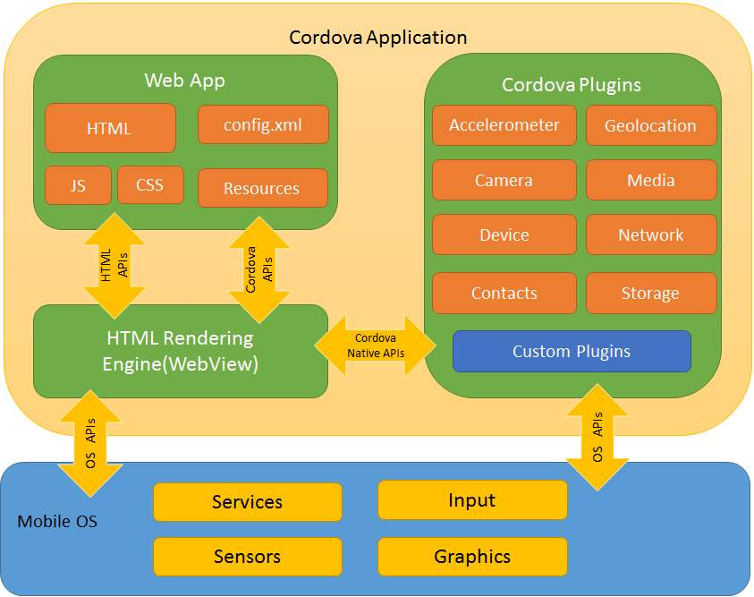

简单的来说, 如果想要调用原生的接口, 我们需要将一些基础的API封装成cordova插件, 注册到上图的``` Cordova Plugins ```中。然后我们的web应用可以通过调用window.cordova调用插件池里面的API, 从而达到调用原生接口的目的。那么接下来, 我将会带着大家, 完成这一整个过程。

### 初始化cordova项目

首先需要全局安装``` cordova ```

```sh
 sudo npm install -g cordova
```

接下来初始化项目工程

```sh
cordova create hello com.example.hello HelloWorld
```

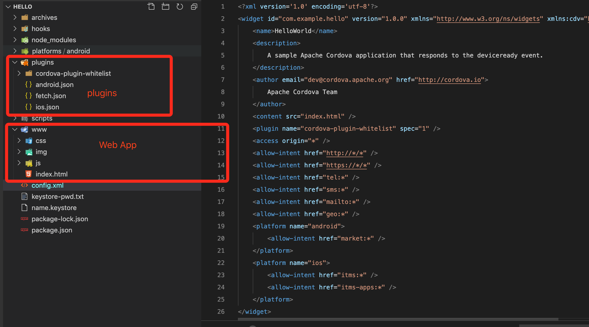

上图中的www文件指的其实就是html、css、js。很明显我们可以将构建的UI组件库移植到www文件夹.需要注意的是一点是我们需要在入口文件: ``` index.html ```中引入```<script type="text/javascript" src="cordova.js"></script>```。否则通过window调用不了cordova相关的插件就会出现找不到插件的错误。

### 添加Native插件

我们添加一个``` cordova-plugin-device``` 插件, 用于查看设备的信息。

```sh
cordova plugin add cordova-plugin-device
```

添加成功后我们可以在plugins中, 发现多了一个cordova-plugin-device文件夹。并且能够在plugins下的android.json和ios.json中查看如下信息:

```json
  "installed_plugins": {
    "cordova-plugin-whitelist": {
      "PACKAGE_NAME": "com.example.hello"
    },
    "cordova-plugin-device": {
      "PACKAGE_NAME": "com.example.hello"
    }
  }
```

### 自定义Native

在开发过程中, 难免会遇到一些奇奇怪怪的需求, 需要我们基于原生开发自定义插件。那么如何开发一个自定的插件, 可以参考此[插件](https://github.com/Summer-andy/cordova-urovo-pda-plugin)。


### 调用Native插件

 查阅官方文档中cordova-plugin-device的使用:

 ```js
document.addEventListener("deviceready", onDeviceReady, false);
function onDeviceReady() {
    console.log(device.cordova);
}
 ```

 我们发现在用例中直接调用device即可获取对应的数据。那么在我们的Web APP中通过``` window.device ```即可。我们使用android studio将APP打包到本地的手机上, 通过谷歌浏览器的 [webview调试工具](chrome://inspect/#devices)进行真实的调试。

 我们在控制台输入``` window.device ```

 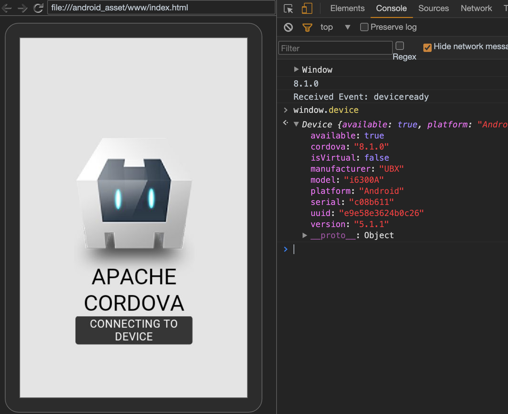

 我们发现它输出了设备的型号, uuid, 安卓的版本等等信息。那么看到这些信息毫无疑问, Web APP已经拥有了与原生交互的能力。 当我们的开发阶段已经完成, 这时候我们需要打包发布APP。那么这个时候就需要了解android/ios打包服务了。

## 集成android/ios打包服务

  在上述两个大章节中, 我们分别对技术进行了选型, 但是我们并没有将它们结合起来。那么接下来我们主要干两件事情: 1. 通过脚本拉取web app的代码进行打包替换www文件夹 2.编写自动化脚本对app进行签名并且打包成APK文件以及ipa文件。

  为了统一脚本的管理, 我们在根目录下新建scripts文件夹, 用于存放脚本。

  ### 编写脚本, 拉取web app代码

  一般企业都会选择在内网上搭建gitlab用于代码托管。为了方便, 我就使用github替代gitlab。在此之前我已将web app上传到[github](https://github.com/Summer-andy/framework7-appstore-react).接下来我们通过编写shell脚本进行代码的拉取并且将打包后的文件替换www目录, 最后在入口文件index.html中添加cordova.js

  新建build.sh

  ```sh
  #!/usr/bin/env bash
  set -e

  red='\e[21;31m%s\e[0m\n'
  green='\e[21;32m%s\e[0m\n'
  yellow='\e[21;33m%s\e[0m\n'
  blue='\e[21;34m%s\e[0m\n'
  magenta='\e[21;35m%s\e[0m\n'
  cyan='\e[21;36m%s\e[0m\n'
  white='\e[21;97m%s\e[0m\n'
  darkgray='\e[21;90m%s\e[0m\n'

  GIT_REPO="https://github.com/Summer-andy/framework7-appstore-react"
  ROOT_DIR="${PWD}"
  APP_DIR="${ROOT_DIR}/app"
  WWW_DIR="${ROOT_DIR}/www"

  rm -rf $WWW_DIR

  if [ $# -eq 1 ]; then
    APP_DIR=$1
    printf "$yellow" "Building --> ${APP_DIR}"
  elif [ ! -d $APP_DIR ]; then
    #
    printf "$green" "APP direction not exist, will clone from git remote."
    git clone $GIT_REPO $APP_DIR
  else
    printf "$yellow" "${APP_DIR}"
    # 更新 git
    cd $APP_DIR
    git checkout master
    if test -n "$(git status --porcelain)"; then
      printf "$red" 'Unclean working tree. Commit or stash changes first.' >&2;
      exit 128;
    fi

    if ! git fetch --quiet 2>/dev/null; then
      printf "$red" 'There was a problem fetching your branch. Run `git fetch` to see more...' >&2;
      exit 128;
    fi

    if test "0" != "$(git rev-list --count --left-only @'{u}'...HEAD)"; then
      printf "$red" 'Remote history differ. Please pull changes.' >&2;
      exit 128;
    fi

    printf "$green" 'No conflicts.' >&2;
    printf "$green" 'Pull changes to master'
    git merge &>/dev/null;
  fi

  cd $APP_DIR
  # BUILD
  yarn install --silent
  yarn build-prod

  # move dist to ./www
  printf "$yellow" "Moving static files to -> ${WWW_DIR}"
  cd $ROOT_DIR
  mv $APP_DIR/build $WWW_DIR

  # transform index.html
  node scripts/www.js

  printf "$cyan" "Ready for package."
  printf ""
  printf ""
  ```

  因为涉及到文件的写入操作, 为了方便, 我们编写一个node脚本, 目的是为了将一些必要的信息添加到index.html中。
  
  新建www.js文件
  ```js
  let FS = require('fs');
  let htmlfile = './www/index.html'

  // read the index.html from build folder
  let data = FS.readFileSync(htmlfile, 'utf8');

  function insertContent(fullContent, beforeWhat, newContent) {
    // get the position before which newContent has to be added
    const position = fullContent.indexOf(beforeWhat);
    // since splice can be used on arrays only
    let fullContentCopy = fullContent.split('');
    fullContentCopy.splice(position, 0, newContent);
    return fullContentCopy.join('');
  }

  // will add the <meta> tags needed for cordova app
  const afterAddingMeta = insertContent(
    data,
    '<link',
    `<meta name="format-detection" content="telephone=no">` +
    `<meta name="msapplication-tap-highlight" content="no">`
  );

  // will add <script> pointing to cordova.js
  const afterAddingScript = insertContent(
    afterAddingMeta,
    '<script',
    `<script type="text/javascript" src="cordova.js"></script>`
  );

  // updates the index.html file
  FS.writeFile(htmlfile, afterAddingScript, 'utf8', err => {
    if (err) {
      throw err;
    }
  });
  ```

  为了运行方便我们将脚本集成到项目的scripts中: 

  ```json
  "build": "sh ./scripts/build.sh",
  ```

  那么我们只需要简单的执行``` npm run build ``` 即可完成Web APP与cordova的融合。

  ### android打包服务

  在上述步骤都完成后, 我们可以开始对app进行原生打包。打包的脚本其实很简单, 直接运行``` cordova platform add android ```即可完成。

  ```sh
  #!/usr/bin/env bash
  set -e
  darkgray='\e[21;90m%s\e[0m\n'

  if [ ! -d 'platforms/android' ]; then
    # rm -rf ./platforms/android
    printf "$darkgray" "$ cordova platform add android"
    cordova platform add android
  fi
  ```

  执行完以上脚本后, 我们可以在platform文件夹下面看到android工程。其实对于开发阶段来说, 到这基本就够了,我们可以安装android studio对app进行编译联机调试。

  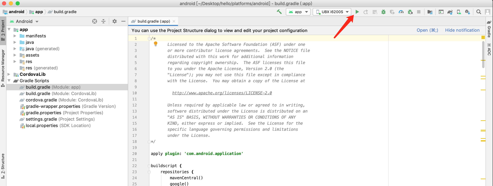

  那么当我们app都开发并且自测完成的时候, 这时候就需要发布一个app的内测版本给测试。
  那么我们正式打包app的时候, 不管是苹果还是安卓都是需要证书的。苹果的证书需要单独购买, 而安卓的证书我们可以自己创建。下面我就以安卓为例: 

  > 在开始之前, 大家的电脑确保要安装好java以及gradle, 用于安卓打包签名。

  创建keyStore

  ```sh
  keytool -genkey -v -keystore  ~/Desktop/app.keystore -alias test -storepass 123456 -keypass 123456
  ```

  为了安全起见, 我们可以将重要的信息隐藏起来,比如``` -storepass 123456 -keypass 123456 ```。

  构建打包脚本

  新建``` android-package ```脚本
  ```sh
  #!/usr/bin/env bash
  set -e

  red='\e[21;31m%s\e[0m\n'
  green='\e[21;32m%s\e[0m\n'
  yellow='\e[21;33m%s\e[0m\n'
  blue='\e[21;34m%s\e[0m\n'
  magenta='\e[21;35m%s\e[0m\n'
  cyan='\e[21;36m%s\e[0m\n'
  white='\e[21;97m%s\e[0m\n'
  darkgray='\e[21;90m%s\e[0m\n'

  APP_NAME='Hello'
  ANDROID_RELEASE_DIR="${PWD}/platforms/android/app/build/outputs/apk/release/"
  RELEASE_DIR="${PWD}/archives/"

  printf "$cyan" "Building apk, please wait."
  cordova build android --release

  # PRINT THE PASSWORD
  KEYSTORE_PWD=$(head -n 1 keystore-pwd.txt)
  printf "$cyan" "Password for signing:"
  printf "\n\n"
  printf "  $cyan" "********************"
  printf "  $cyan" "* ${KEYSTORE_PWD} *"
  printf "  $cyan" "********************"
  printf "\n\n"

  printf "$cyan" "Signing apk, please wait."
  jarsigner -verbose -keystore name.keystore -storepass ${KEYSTORE_PWD} -signedjar "${ANDROID_RELEASE_DIR}${APP_NAME}.apk" "${ANDROID_RELEASE_DIR}app-release-unsigned.apk" name.keystore

  if [ ! -d $RELEASE_DIR ]; then
  mkdir $RELEASE_DIR
  fi

  mv "${ANDROID_RELEASE_DIR}${APP_NAME}.apk" $RELEASE_DIR

  printf "$cyan" "Signed the following apk(s):"
  printf "\n\n"
  printf "  $cyan" "${RELEASE_DIR}${APP_NAME}.apk"
  printf "\n\n"
  ```

  > 注意: 在脚本中, 我已将重要的信息都是存储在文件中``` keystore-pwd.txt ```。

  执行上述脚本, 即可自动帮我们在项目的根目录archives文件夹下生成已签名过的apk。

  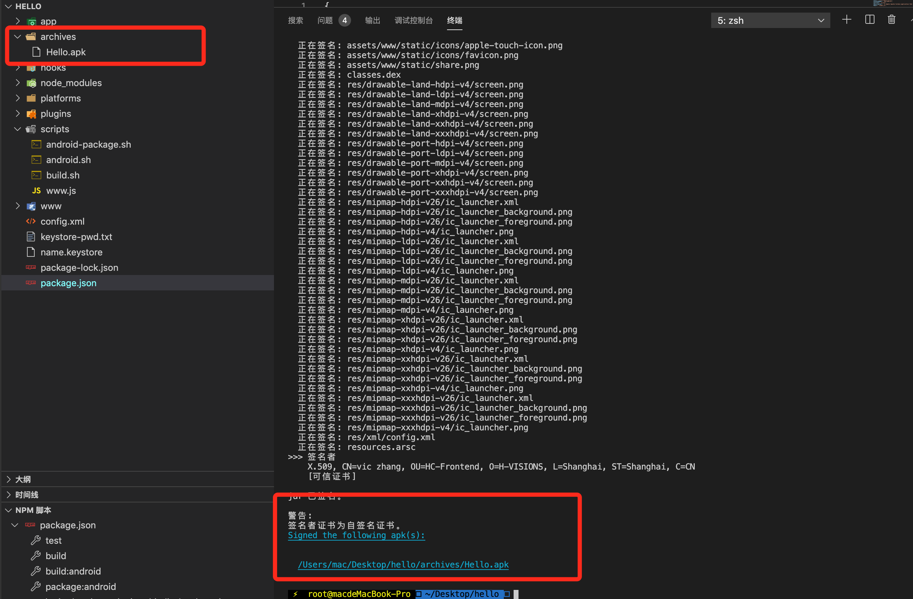

  此时的apk已经可以直接发给测试安装了, 但是这样会带来一些问题: 1. 版本不好管理 2.文件传来传去很容易搞错, 我们需要通过脚本将打包好的apk直接上传到第三方托管平台, 供测试下载。那么这一过程, 我将会放到下一小节中与大家分享。如果大家不需要打包ios, 那么可以直接看最后小节。


  ### ios打包服务

  app打成ios工程, 其实也很简单只需要执行一行脚本就可以了。为了与android的统一, 我们也新建一个ios.sh

  ```sh
  #!/usr/bin/env bash
  set -e
  darkgray='\e[21;90m%s\e[0m\n'
  if [ ! -d 'platforms/ios' ]; then
    # rm -rf ./platforms/ios
    printf "$darkgray" "$ cordova platform add ios"
    cordova platform add ios
  fi
  ```

 执行脚本, 即可在platform中生成ios工程。ios比较麻烦的一点是不论是开发还是内测发布都需要apple证书。因此我们还需要针对不同的环境生成不同的证书。
 注意: 在windows中是做不了这件事情的哦!证书的创建可以参考Dcloud中的[这篇文章](https://ask.dcloud.net.cn/article/152), 虽然年份有点久了, 但亲测有用。

 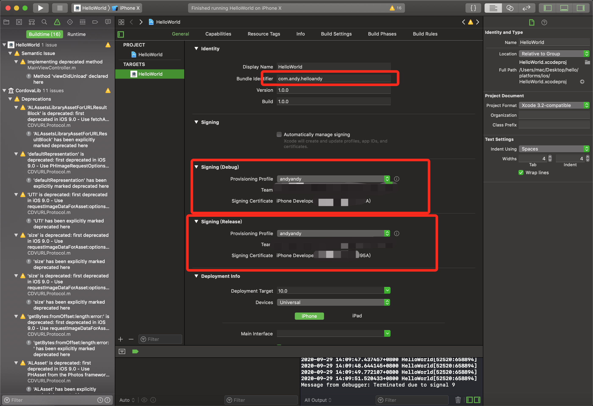。

 红色框出来的部分一定要注意不能爆红, 每一个app都是对应一个Identifiers。证书和描述文件一定要对应当前app的 Identifier Id.

 有xcode的同学可以将app运行在模拟器上或者连接真机调试, 主要是测试一下与原生的交互有没有问题。

 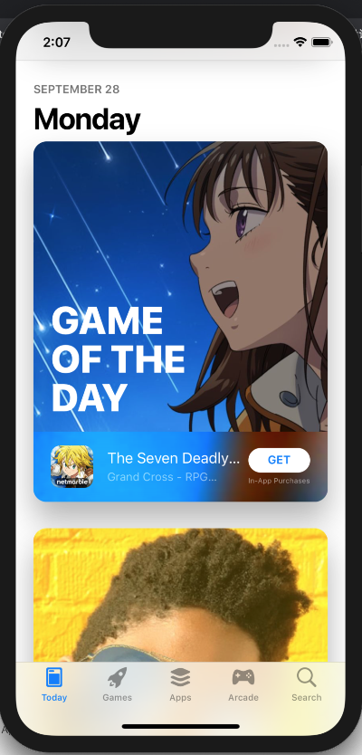.

## 集成fastlane实现自动化部署

搞过ios发布的同学都知道, ios的发布需要上传各种型号设备的屏幕截图等等繁琐的程序。那么有没有工具可以自动化这些流程呢？这就是我们这一小节的主角 - ``` fastlane ```

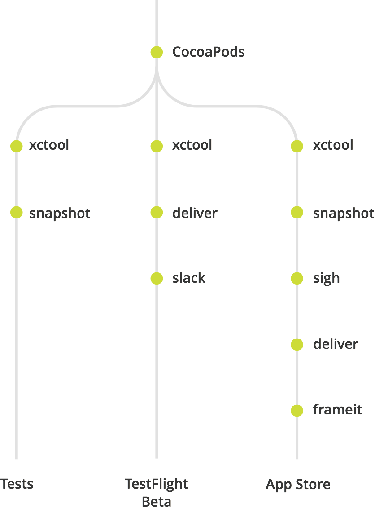

[fastlane](https://github.com/fastlane/fastlane)是用Ruby语言编写的一套自动化工具集和框架，每一个工具实际都对应一个Ruby脚本，用来执行某一个特定的任务。

### 安装fastlane

```sh
sudo gem install fastlane
```

### 初始化fastlane

在对应的android或者ios工程中执行```fastlane init ```, 按照信息填写完即可。如果你项目已经添加了fastlane.那么再次执行fastlane init的时候 会出现如下图所示:

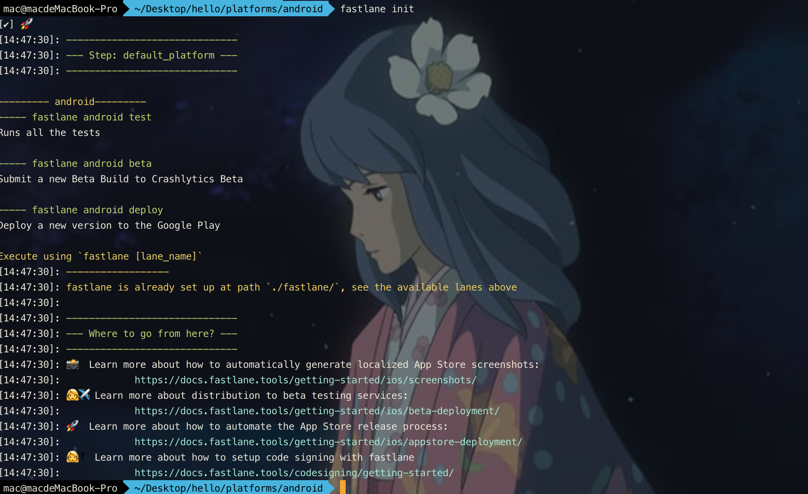

> 注意: android的fastlane和ios的目录结构是不一样。

### 目录结构介绍

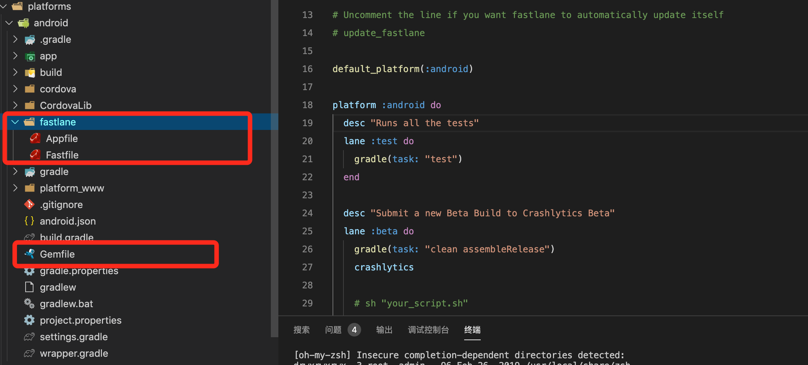

- Appfile

存储App信息，比如Apple ID，App Identifier，Team ID等信息。

- Fastfile

自动化脚本配置文件，所有的任务都是在这个文件来调度的。

- Gemfile

Gemfile就帮我们进行了gem的管理，就像podfile管理pod

### fastlane社区

其实fastlane社区已经为我们提供了很多实用插件。我们只需要根据插件的使用方式对齐进行组合即可。比如我们本章节的目的就是要通过fastlane将我们的应该推到第三方平台中。
那么大家可以选择蒲公英或者fir。

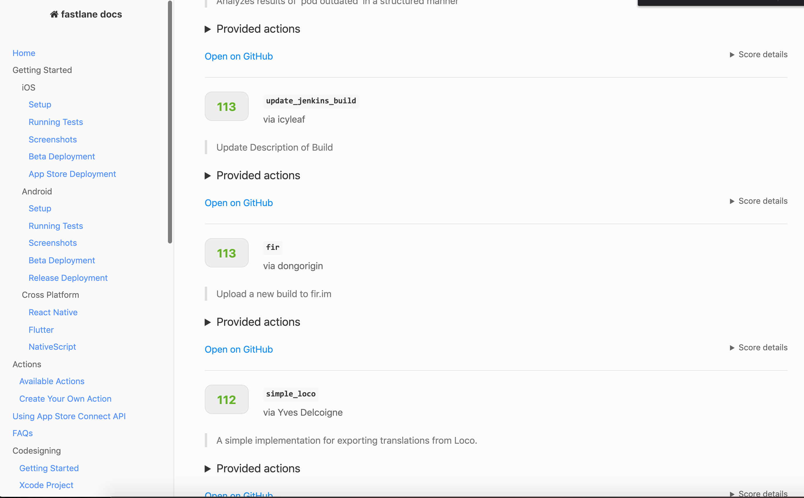

### fastlane插件

我选择使用``` fastlane-plugin-fir ```作为示例向大家展示如何发布app.因为蒲公英的平台我没有进行实名认证。只有实名认证了, 才能在那上面托管app。

```sh
bundle exec fastlane add_plugin fir
```

我们需要在项目中添加```fir```, 那么添加完了之后就需要开始编码了, 我们之前说过Fastfile文件是用来编写脚本的, 因此毫无疑问我们需要在``` Fastfile ```中编写对应的代码：

```ruby
default_platform(:android)

platform :android do

  desc "deploy to fir.im"
  lane :deployfire do

    result = fir(
      api_token: 'XXXXX',
      apk_path: '/archives/Hello.apk',
    )

end
```

代码中的```  api_token ```， 可以从官网的个人信息栏 ```API Token```处获得。

### 执行fastlane脚本

```
bundle exec fastlane deployfire
```

如果出现如下图所示, 既表明发布成功

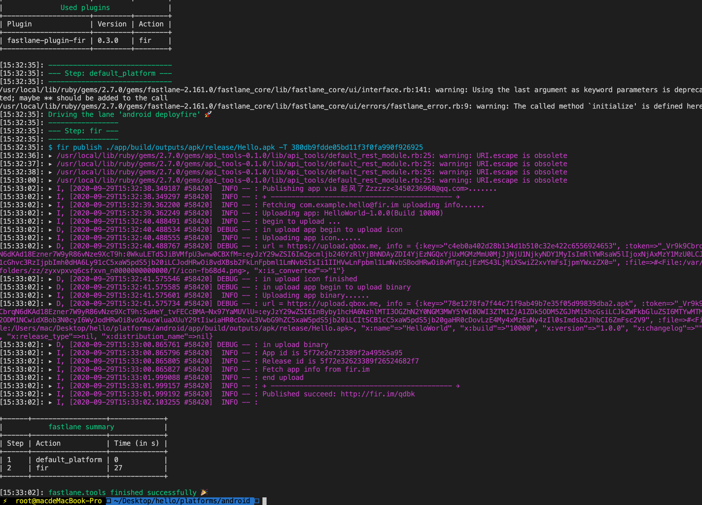

最后大家可以在fir平台上下载了。

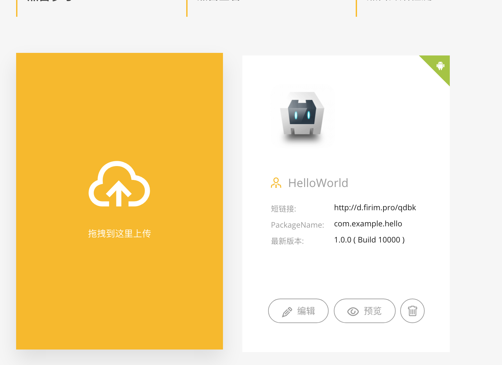

最后也可以通过[点击此处](http://d.firim.pro/qdbk), 下载我们的app.

## 假的结尾

感谢大家能够看到这里, 我相信看完文章的你, 一定收获了许多。可能你会觉得有点繁琐, 但是这些配置都是一劳永逸的。并且这个体系你可以随意切换UI库, 至于打包发布这些配置我们只需要让团队中的某位同学来负责搭建即可,其他同学的业务照常推进即可。之前用React开发PC端的, 照样也可以用React开发APP, 可以说几乎是"零"成本。并且我们只需要执行几个脚本就可以完成app的打包发布了。如果大家有需要, 我会将整个体系开源出来, 供大家使用。由于ios的打包发布内容较多, 我打算另起文章, 并且我将会 大家有兴趣的可以期待一下 ~