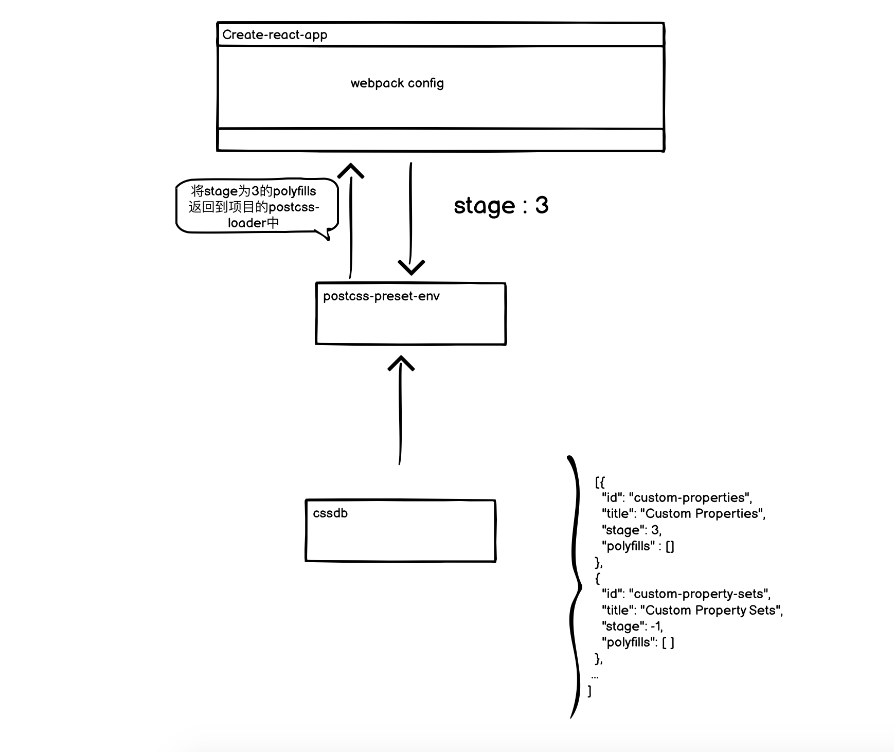

## 前言

   前些日子, 在项目发布的过程中CI突然报错了。我一看日志是来自于一段css代码的报错, 内容大致如下: 

   ```css
   :root {
     --swiper-navigation-size: 44px;
   }

   .swiper-button-next,.swiper-button-prev {
     margin-top: calc(var(--swiper-navigation-size)*-1/2)
   }
   ```

   1. 这段代码为什么在```run ```的时候不报错, 却在 ``` build ```的时候报错了呢？
   2. 那为什么又与 ``` create-react-app ``` 有关呢？
   3. 如何解决？

   本文就以上三个问题, 与大家展开讨论。
  
## 复现错误

   ### 使用create-react-app创建项目

   ``` create-react-app css ```

   ### 在App.css添加异常代码

  ```css
  :root {
    --distance: 44px + 44px;
  }

  .App {
    margin-top: calc(var(--distance)/2 * -1);
    text-align: center;
  }
  ```

   ### 弹出项目webpack配置

   ``` npm run eject ```


   ### 打包项目

   ``` npm run build ```

   


   ### 定位到报错的loader

   既然错误是与css有关的, 那么我们自然是找到webpack中关于css处理的部分。根据排除法, 我最后把目光锁在了以下代码:

   ```js
      {
        loader: require.resolve('postcss-loader'),
        options: {
          ident: 'postcss',
          plugins: () => [
            require('postcss-flexbugs-fixes'),
            require('postcss-preset-env')({
              autoprefixer: {
                flexbox: 'no-2009',
              },
              stage: 3,
            }),
            postcssNormalize(),
          ],
          sourceMap: isEnvProduction ? shouldUseSourceMap : isEnvDevelopment,
        },
      }
   ```

   经过调试我发现只需要将 ``` postcss-preset-env ```中的stage设为大于3即可。那么 ```  postcss-preset-env ``` 各个配置分别代表什么意思呢?

  ::: tip
  注意: 在没有任何配置的情况下，postcss-preset-env会开启stage 2阶段的特性并支持所有浏览器
  ::: 

  - stage: 
  
    此属性决定了哪些CSS特性需要被填充。

    stage共分为5个阶段，分别是：

    - stage-0 非官方草案
    - stage-1 编辑草案或早期工作草案
    - stage-2 工作草案
    - stage-3 候选版本
    - stage-4 推荐标准

  - features

    此属性决定了哪些特性应该被开启或者关闭。  

  - browsers  

    postcss-preset-env使用browserslist来配置目标环境。

  - autoprefixer

    postcss-preset-env集成了autoprefixer。  


    那么问题就来到了 ``` postcss-preset-env ``` 与 ``` stage ``` 之间的关系了。


## 探寻postcss-preset-env与stage的奥秘

  根据官网对postcss-preset-env介绍: 

  ::: tip
  PostCSS Preset Env lets you convert modern CSS into something most browsers can understand, determining the polyfills you need based on your  targeted browsers or runtime environments.
  :::

  简单地来说, ``` PostCSS Preset Env ``` 可以将现代的高级CSS语法转换为大多数浏览器都能理解的内容，根据目标浏览器或运行时环境确定所需的polyfill。

  我们直接进入主题, 看 ``` PostCSS Preset Env ``` 这个包返回的是什么东西？

  ```js

  import cssdb from 'cssdb';

  export default postcss.plugin('postcss-preset-env', opts => {
   
    const polyfillableFeatures = cssdb.concat(
      // additional features to be inserted before cssdb features
      getTransformedInsertions(insertBefore, 'insertBefore'),
      // additional features to be inserted after cssdb features
      getTransformedInsertions(insertAfter, 'insertAfter')
    ).filter(
      // inserted features or features with an available postcss plugin
      feature => feature.insertBefore || feature.id in plugins
    ).sort(
      // features sorted by execution order and then insertion order
      (a, b) => idsByExecutionOrder.indexOf(a.id) - idsByExecutionOrder.indexOf(b.id) || (a.insertBefore ? -1 : b.insertBefore ? 1 : 0) || (a.insertAfter ? 1 : b.insertAfter ? -1 : 0)
    ).map(
      // polyfillable features as an object
      feature => {
        // target browsers for the polyfill
        const unsupportedBrowsers = getUnsupportedBrowsersByFeature(feature.caniuse);

        return feature.insertBefore || feature.insertAfter ? {
          browsers: unsupportedBrowsers,
          plugin:   feature.plugin,
          id:       `${feature.insertBefore ? 'before' : 'after'}-${feature.id}`,
          stage:    6
        } : {
          browsers: unsupportedBrowsers,
          plugin:   plugins[feature.id],
          id:       feature.id,
          stage:    feature.stage
        };
      }
    );

    // staged features (those at or above the selected stage)
    const stagedFeatures = polyfillableFeatures

    // browsers supported by the configuration
    const supportedBrowsers = browserslist(browsers, { ignoreUnknownVersions: true });

    // features supported by the stage and browsers
    const supportedFeatures = stagedFeatures;

    return (root, result) => {
      const polyfills = supportedFeatures
      return polyfills;
    };
  });
  ```

  查看以上代码我们发现它最后返回的是一个``` polyfills ``` 数组。而归根到底这个数组的内容来自于 ``` cssdb ``` 这个包。那么这又是什么东西呢？

  根据官方解释: 

  :::tip
  cssdb is a comprehensive list of CSS features and their positions in the process of becoming implemented web standards.
  :::

  翻译后大致的意思是: ``` cssdb ``` 是CSS功能及其在成为已实现的Web标准过程中的位置的完整列表。

  如果加上下面的源代码示例, 大家可能会对这句话更容易理解一点。

  ```json
  [
    ...,
  {
    "id": "custom-properties",
    "title": "Custom Properties",
    "description": "A syntax for defining custom values accepted by all CSS properties",
    "specification": "https://www.w3.org/TR/css-variables-1/",
    "stage": 3,
    "caniuse": "css-variables",
    "docs": {
      "mdn": "https://developer.mozilla.org/en-US/docs/Web/CSS/var"
    },
    "example": "img {\n  --some-length: 32px;\n\n  height: var(--some-length);\n  width: var(--some-length);\n}",
    "polyfills": [
      {
        "type": "PostCSS Plugin",
        "link": "https://github.com/postcss/postcss-custom-properties"
      }
    ]
  },
  ...
  ]
  ```

  至此,我们可以发现一个有趣的事情: ``` postcss-preset-env ``` 中的polyfills基本上都来自于 ``` cssdb ```。我们可以通过软链(yarn link)的方式, 将这些包(postcss-preset-env)link到我们创建的项目。然后直接将 ``` postcss-preset-env ``` 中node_modules下的 ``` cssdb ``` 的json文件中的 ``` custom-properties ``` 给移除掉。最后重新打包项目, 我们发现build通过了。那么如果我们将它的``` stage ```修改为 ``` 2 ```呢 ? 我们再次打包发现打包依然通过了。

  那么``` stage ```与 ``` postcss-preset-env```关系就很明显了, 我们可以用下面这张图表示: 

  

  接下来, 我们需要将目光聚焦于 ``` postcss-custom-properties ```.


## 深入挖掘postcss-custom-properties

  
  PostCSS Custom Properties lets you use Custom Properties in CSS, following the CSS Custom Properties specification.
  

  简言之, 它的作用就是让你能够在css中使用自定义的变量。除此之外还有很重要的一点就是: 

  :::tip
  Note: This plugin only processes variables that are defined in the :root selector.(这个插件只处理 :root 下面的自定义变量)
  :::
  
  当我们尝试在官网的github中寻找答案时, 可以从issue上入手。

  很快, 一个名为[ParserError with plus or minus sign](https://github.com/postcss/postcss-custom-properties/issues/161)的issue引起了我的注意。

  

  

  

  

  我大致翻译一下这个issue的内容:

  - 在2018年12月28号, ``` andreymal ``` 提了一个关于编译失败的issue.

    它试图通过使用postcss来编译

    ```css
    :root {
      --foowith: 50px + 50px
    } 
    ```

    结果遇到了ParserError的错误。


   - 在2019年4月份的时候, ``` remithomas ``` 它也遇到了ParserError的错误。碰巧的是, 它编译的代码与我们的示例代码似乎差不多

   ```css
    calc(var(--gutter-width)*0.5*-1)
   ``` 

   - 与此同时, 仓库的维护者 ``` jonathantneal  ``` 表明: 切换到PostCSS Values Parser 3将是一项重大突破，他可以自己做到这一点。 有人有兴趣参加PR吗？


   - 很快 ``` remithomas  ```  当即就回复了: I will do a PR to upgrade to PostCSS Values Parser 3。

   - 最后它提了一个[pr](https://github.com/postcss/postcss-custom-properties/pull/172) 来解决这个issue下的问题.


   那么最后我们可以通过查看这个pr下的文件改动, 可以看到, 它升级了 ``` postcss-values-parser(一个基于PostCSS的CSS属性值解析器) ``` 那么至此, 我们的问题已经搞清楚了, 接下来我们需要关心的是, 如何解决这个问题。

## 解决问题

  其实很简单, 我们只需要将对应的依赖库升级即可。

  

  因此我们试着将本地link的postcss-preset-env项目中``` postcss-custom-properties ``` 升级至``` 9.1.1 ```即可。ok！ 我们重新打包 ``` postcss-preset-env ```, 最后重新打包我们的项目。

  

  oh, 我们成功啦 ~ 


## 提PR

   首先我们需要给 ```  postcss-preset-env  ``` 提一个PR, 请求升级 ``` postcss-custom-properties  ``` 至9.1.1。不过似乎已经有人提了, 这个PR目前还在进行中。

   那么我们只能等到 ``` postcss-preset-env ``` 仓库的管理员合了这个PR, 才能给 ``` create-react-app ``` 提PR了。 经过这么一番探索, 我们发现, 一开始提的 [PR](https://github.com/facebook/create-react-app/pull/10131) 并不合理, 因此我们需要关闭它, 并且需要在之前关联的issue中表明我们的探索过程。

   


## 写在最后

   如果大家在项目中遇到类似的错误, 可以将 ``` postcss-preset-env ``` fork到本地, 手动去升级 ``` postcss-custom-properties ``` 的版本, 然后关联到项目中。

   完结！ 撒花 ~ 

   