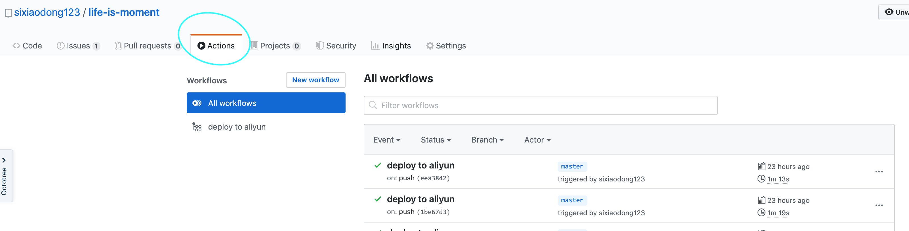
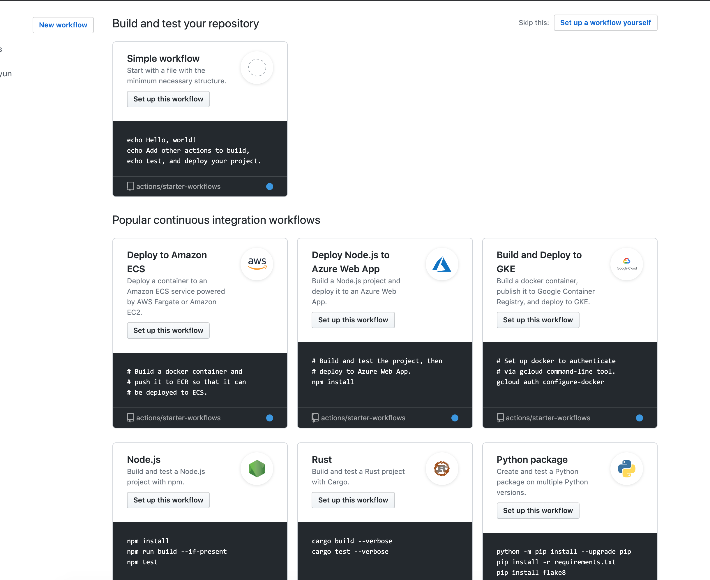
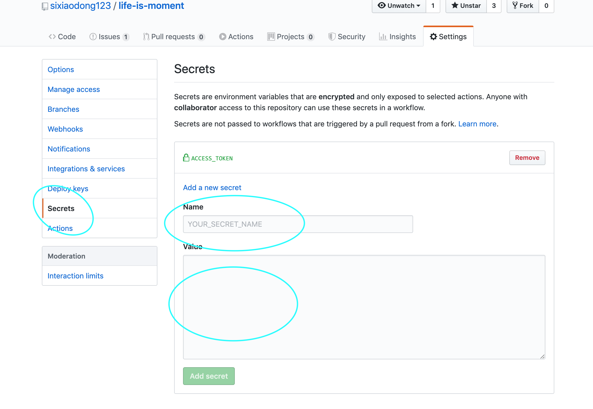

##### 前言: 查看本文可以了解如何使用github 的Actions部署前端项目。

##### 首先我们来了解一下关于Actions中常常会用到的一些名词：
 - workflow （工作流程）：持续集成一次运行的过程，就是一个 workflow。
 - job （任务）：一个 workflow 由一个或多个 jobs 构成，含义是一次持续集成的运行，可以完成多个任务。
 - step（步骤）：每个 job 由多个 step 构成，一步步完成。
 - action （动作）：每个 step 可以依次执行一个或多个命令（action）

##### 1.创建一个github项目并且创建Actions


##### 2.然后点击New workflow即可选择对应的模板


##### 3.这时候你的项目目录会生成一个yml文件。 假如我们的需求是当我们往master提交代码的时候,就自动打包发布部署到对应的服务器中.那么我们的yml文件的内容就是大概是这样的

```yml
name: deploy to aliyun  #工作流的名称
on:                     #触发条件
  push:
    branches:
      - master
jobs:
  build:
    runs-on: ubuntu-latest
    steps:
      # 切换分支
      - name: Checkout
        uses: actions/checkout@master 
      # 下载 git submodule
      - uses: srt32/git-actions@v0.0.3
        with:
          args: git submodule update --init --recursive
      # 使用 node:10
      - name: use Node.js 10
        uses: actions/setup-node@v1
        with:
          node-version: 10
      # npm install
      - name: npm install and build
        run: |
          npm install
          npm run docs:build
        env:
          CI: true
      # Deploy
      - name: Deploy aliyun
        uses: easingthemes/ssh-deploy@v2.0.8  
        env:
         SSH_PRIVATE_KEY: ${{ secrets.ACCESS_TOKEN }} #服务器的私钥
         REMOTE_HOST: "139.196.82.33"  # 服务器的地址
         REMOTE_USER: "root"  #用户名
         SOURCE: "./docs/.vuepress/dist/"  #源文件地址
         TARGET: "/webSrc/dist"  #目标文件地址
         ARGS: '-avzr --delete'
```

##### 4.进入到我们的服务器我就以阿里云的centos系统来举例了。首先这边需要注意一下,这个工作流最主要的地方就是如何使用服务器的私钥登录服务器了。我们使用了easingthemes/ssh-deploy@v2.0.8 这个插件来帮助我们完成这个流程。那么我们如何获取服务器的私钥呢？
  - 执行` ssh-keygen `， 一路回车,它正常情况下会在系统的 `/root/.ssh/`文件夹下面生成三个文件,分别是 ` authorized_keys `授权的key, ` id_rsa `私钥, ` id_rsa.pub `公钥.
  - 执行 `cat id_rsa.pub >> authorized_keys ` 然后我们需要将公钥复制到authorized_keys 文件中
  - 确保连接成功,我们需要给文件设置权限: ``` chmod 600 authorized_keys ```, ``` chmod 700 ~/.ssh ```
  - 编辑ssh的配置文件  `vim /etc/ssh/sshd_config `，修改对应配置属性 
    ```
      RSAAuthentication yes
      PubkeyAuthentication yes
      PermitRootLogin yes 
    ```
  - 重启ssh服务器 ` service sshd restart `
  - 复制私钥到github中。 ，注意复制文件要复制全，包括上下的  ``` -------- BEGIN .... ----------- ```。name的话就是` ACCESS_TOKEN `了, value 就是私钥的内容了, 现在我们就完成了一个简单的git Actions工作流啦。


##### 5.总结: 使用工作流可以减少我们的重复劳动力,可以避免一些意料之外的错误,比如环境等等。最后整个demo可以查看我GitHub上的` life-is-moment `项目.
  