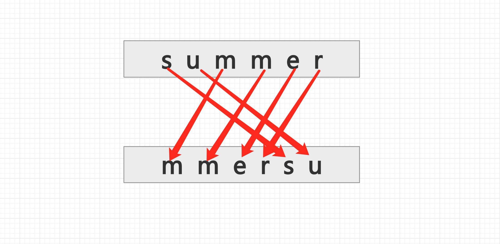
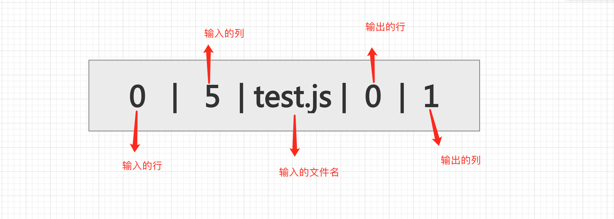

## 前言

   ``` Sourcemap ```其实是一个信息对应文件, 里面存储着代码转换前后对应的信息位置。转换前后的代码对应着的就是源代码和生产代码。它本质上解决了在打包过程中, 代码经过babel编译转化后, 由于代码差异性过大, 造成无法debug的问题。

## Sourcemap原理

   我们从Sourcemap的结构开始学习它的映射机制。

   ```js
    {
     "version":3, // Sourcemap 使用的是第三版标准产出的
     "sources":["test1.js","test2.js"],
     "names":["getName","name","getAge","age"],
     "mappings":"AAAA,SAASA,QAAQC,MACf,MAAO,aAAeA,KCDxB,SAASC,OAAOC,KACd,MAAO,YAAcA"
    }
   ```

   一般Sourcemap主要是通过 ``` uglify-js ``` 生成的。比如我们可以通过以下的命令压缩以下两个文件。

  ```sh
  npx uglifyjs test.js test2.js -o output.js --source-map "url='output.js.map'"
  ``` 

  // test1.js

   ```js
    function getName(name) {
      return 'my name is' + name;
    }
   ```

  // test2.js

   ```js
    function getName(name) {
      return 'my name is' + name;
    }
   ``` 

   ``` sources ``` 指的就是被开启Sourcemap的压缩源文件。也就是 ``` test1.js ``` 和 ``` test2.js ```.

   ``` names ``` 指的是转化前所有的变量名和属性名。

   ``` mappings ``` 的内容是指 转化前和转化后的映射集合关系的集合, ```分号(;)```代表一行,  每行的 mapping用``` 逗号(,) ```分开。

   下面我们重点来看一下 ``` mappings ``` 的内容, 

   ```js
    "mappings":"AAAA,SAASA,QAAQC,MACf,MAAO,aAAeA,KCDxB,SAASC,OAAOC,KACd,MAAO,YAAcA"
   ```

   咋眼一看, 很看出上述字母分别代表啥意思, 所以更别提搞清楚映射关系了。我们来看下例子,

   假如我们现在有 ``` test.js ``` 文件, 内容为 summer, 经过压缩处理后输出的文件是 ``` test1.js ```, 其内容为 ``` mmersu ``` (ps: 为了方便理解匹配关系, 假定压缩后的内容)
   
   

   我们以s字符为例: 它在输入中的坐标为(0, 1), 在输出中坐标为(0, 5), 因此映射关系为:

   

   因此假如Sourcemap的结构是如下所示, 

   ```js
    {
     "version":3, // Sourcemap 使用的是第三版标准产出的
     "sources":["test.js","test1.js"],
     "names":["s", "u", "m", "m", "e", "r"],
     "mappings":"XXXXXX"
    }
   ```

   那么s的的存储结构可以简化为

   ```
   0|5|0|0|1|0
   ```

   第三位数0代表当前文件在sources中的位置, 最后一位字符表示当前字符在names中的位置。

   我们看到很多sourcemap后的文件都是一行的, 因此输出的行号可以省略。

   ```
   0|5|0|1|0
   ```

   上面记录的位置都是绝对位置, 如果这个文件特别大, 那么行列会很大, 因此我们可以使用相对位置记录行列信息。

   


   
