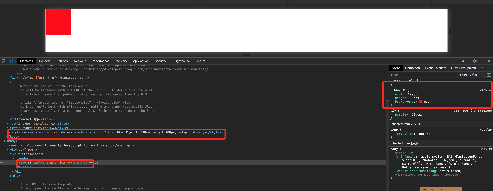

## 前言: 


## 如何开始阅读源码?

  ### 常用的API


  - styled 
  
    ```styled``` 基本上是我们最常用的API之一。例如我想要创建一个长和宽分为100px、且背景为红色的div.那么
    我们只需要编写如下代码即可:

    ```js
    const DivContainer = styled.div`
      width: 100px;
      height: 100px;
      background: red;
    `
    ```

  - createGlobalStyle  

    生成全局的css样式。例如我们需要将web应用中所有的p标签文字颜色为红色, 那么代码如下

    ```js
    const GlobalStyle = createGlobalStyle`
      h1 {
        color: red;
      }
    `
    ```

  - keyframes

    没有动画的css是没有灵魂的, 因此``` keyframes ``` 也是一个很重要的一个API.例如我们想要实现一个交替循环若隐若现的按钮, 那么代码如下: 

    ```js
    const pulse = keyframes`
      0% {
        opacity: 0;
        height: 100px;
        width: 100px;
      }
      100% {
        opacity: 1;
        height: 100px;
        width: 100px;
      }
    `

    const animation = props => css` ${pulse} ${props.animationLength} infinite alternate`;

    const PulseButton = styled.button`
      animation: ${animation};
    `
    ```

    还有一些其他API, 就不赘述了。既然我们已经学会了, 如何通过 ``` styled-components ``` 构建样式。那么我们需要知道它是如何将上述代码转化为css和js的, 并且它们存在的形态是什么?对于第一个问题, 可能暂时还不太好解释, 那么先来看第二个问题. 第二个问题换一种说法, 其实就是styled-components的产物是什么。

  ### styled-components的产物

  打开浏览器, 审查对应div块级元素。

    

  通过上图, 我们可以发现。在head中生成了关于这个div的```style```标签, 它定义了文档中对应div的样式。
  除此之外, 它还给div添加了类名。仔细观察可以发现, 类名的后半部分字符串与style标签中的类名是一致的。
  那么它的整个过程应该是: 1. 生成style标签, 并且插入到head中  2.生成唯一的类名, 添加到对应元素的class上。

   ### 阅读源码的方式

   当我们对它的产物有所了解后, 其实这里有两种方法阅读源码:

   - 第一种方法: 我们可以根据它的产物, 比如``` <style> .XXXX { background: red } </style> ```, 很明显这东西肯定是通过``` document.createElement('style') ```创建的, 那么我们在源码中查找对应片段的代码, 然后一步一步向上摸索, 但是这种方法适合简单的项目。

   - 第二种方法: 这种方法应该是看任何源码最常用的方法了, 我们通过查看``` styled-components ``` export出来的接口, 一步一步的向下摸索。比如我们在第一小节中提及的常用API.但是, 这种方法可能会让大家在阅读源码的过程中迷失自我, 即假如源码中的逻辑嵌套太深或者分支太多, 我们很容易陷入源码的汪洋大海。

   那么, 对于``` styled-components ```这个项目, 我们采用第二种最通用的办法。


   ### 从styled开始

   > 为了方便, 我接下来将``` styled-components ```简写为 ``` sc ```。

   #### 构建入口函数

   ```js
  var domElements = [
    'a',
    'abbr',
    'address',
    ...
  ]

  var styled = function styled(tag) {
    return constructWithOptions(createStyledComponent, tag)
  }

  domElements.forEach(function(domElement) {
    styled[domElement] = styled(domElement)
  })
   ```

   初次使用sc的同学, 可能会对它的语法奇怪。竟然还能这么写, 其实如下代码

  ```js
  const DivContainer = styled.div`
    width: 100px;
    height: 100px;
    background: red;
  `
  ```

还能修改成: 

```js
  const DivContainer = styled.div({
    width: '100px',
    height: '100px',
    background: 'red'
  })
```

因此我们能够很容易地得出: ```styled.div``` 等于 ``` styled('div') ``` 这个结论。那么后面跟着的模板字符串又是怎么一回事呢? 我们先来看一个简单的例子: 

```js
function latex(str) { 
  return { "cooked": str[0], "raw": str.raw[0] }
} 

latex`\unicode`

// { cooked: undefined, raw: "\\unicode" }
```

上述例子摘自于[MDN](https://developer.mozilla.org/en-US/docs/Web/JavaScript/Reference/Template_literals), 函数后接模板字符串是 ES6 的一个新语法特性。我们可以通过在函数后面添加模板字符串为其传参。那么我们接下来查看``` constructWithOptions ```函数是如何处理参数的。

```js
function constructWithOptions(componentConstructor, tag, options) {

  var templateFunction = (...args) =>  componentConstructor(tag, options, ...args);

  return templateFunction;
}
```

首先``` constructWithOptions ``` 接收三个参数, 第一个参数```componentConstructor```, 它指代的是```createStyledComponent```函数, 这个函数我们接下来会讲到。第二个参数```tag```, 指代的是styled后的标签名称, 比如div。第三个参数是options, 用来传递一些参数,由于它并不是很重要,因此我们可以把它忽略。

读到这里, 细心的同学应该也发现了, 之前的styled.XX其实是一个柯里化函数。类似F()()。


### 构建DOM元素函数

既然我们现在已经能够接收到所有的参数了。那么我们接下来自然而然的会想到页面上的DOM是如何被构建出来的呢？
那么刚刚好``` createStyledComponent ``` 函数给了我们答案。

```js
function createStyledComponent(target, options = {}, rules) {
    const {
      attrs = EMPTY_ARRAY,
      componentId = generateId(options.displayName, options.parentComponentId),
      displayName = generateDisplayName(target)
    } = options;

    const styledComponentId =
    options.displayName && options.componentId
      ? `${escape(options.displayName)}-${options.componentId}`
      : options.componentId || componentId;

    var WrappedStyledComponent;
    var componentStyle = new ComponentStyle(rules, styledComponentId);


    // eslint-disable-next-line react-hooks/rules-of-hooks
    var forwardRef = (props, ref) =>  useStyledComponentImpl(WrappedStyledComponent, props, ref);
    
    forwardRef.displayName = displayName;

    WrappedStyledComponent = React.forwardRef(forwardRef);
    WrappedStyledComponent.attrs = attrs;
    WrappedStyledComponent.componentStyle = componentStyle;
    WrappedStyledComponent.target = target;
    WrappedStyledComponent.styledComponentId = styledComponentId;

    return WrappedStyledComponent;
  }
```

通过查看以上代码, 我们发现它return了一个 ``` WrappedStyledComponent ```。代码中的WrappedStyledComponent又是等于```  React.forwardRef(forwardRef) ```。


## 结尾   


