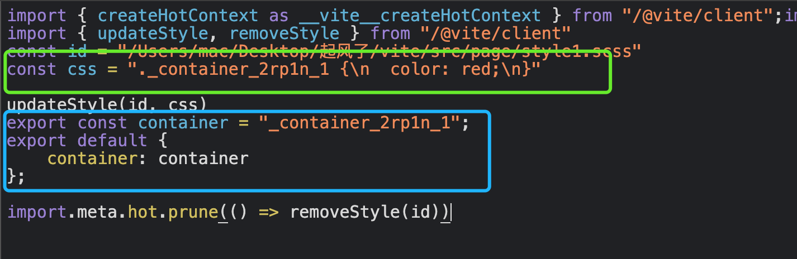
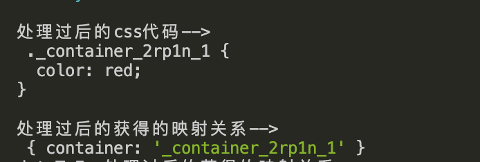
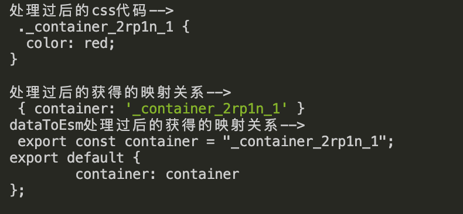
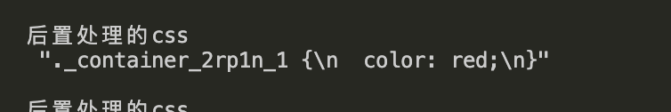
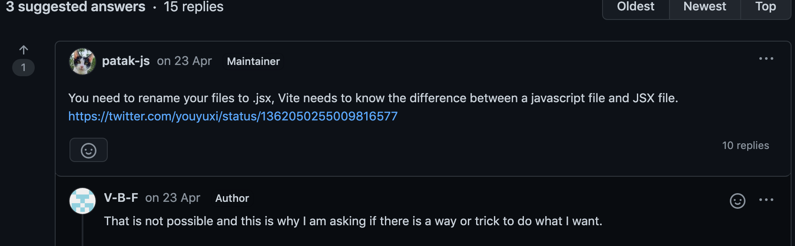
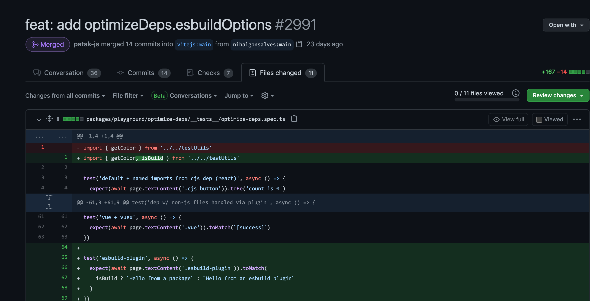

## 前言

   虽然基于vite构建的项目非常的快, 但是如果想要将老的项目跑在vite上可能需要花费好多时间。因为不同的项目规范不一样, 比如有的react项目要求了必须使用```.jsx``` 作为React语法糖文件的后缀, 当然也有的项目直接使用 ``` .js```结尾, 但是归根到底, 都是使用``` babel-loader ``` 或者 ``` esbuild-loader ``` 对jsx处理。但是呢, vite实际上是不支持 ``` .js ``` 结尾的jsx文件, 那么出现这种情况, 我们只能通过编写vite插件去适配我们之前的项目。本文将会完成一个插件, 该插件支持任意css文件模块化(ps: vite只支持 ```.module.xxxx``` 被模块化)。

## 建立思路

   首先需要确定的是, 我们最终的结果是要变成什么样子。

   

   我们需要将以下代码:

   ```scss
  .container {
    color: red;
  }
   ```

  转化为上图的代码。

  我们选择常用的css处理器postcss来完成这项任务, 当然光靠postcss是当然不够的, 还需要配上它的插件。在这里, 我们选择 ``` postcss-modules ```这个插件。

  ``` postcss-modules  ``` 可以帮我们将以下代码

  ```css
  .title {
    color: green;
  }

  .article {
    font-size: 16px;
  }
  ```

  转化为

  ```css
  ._title_xkpkl_5 {
    color: green;
  }

  ._article_xkpkl_10 {
    font-size: 16px;
  }
  ```

  除此之外, 我们还可以得到转化后class的映射关系

  ```js
  {
    "title": "_title_xkpkl_5",
    "article": "_article_xkpkl_10"
  }
  ```

  只有得到这个映射关系, 我们以下代码才可以生效。 它通过style.title 可以获取到对应的class类名, 然后再去样式表中去匹配对应的样式。

  ```js
    <div className={style.title}></div>
  ```
  
  当我们得到这些有用的信息后, 我们还需要把它们组织起来, 更新到对应的文件上, vite为我们提供后置处理插件, 我们只需要将结果return回去即可。

## 编写前置插件

   以下是一个前置插件的标准模板, 一般来说, 我们只需要关注 ``` transform ``` 里面的内容的即可。首先第一个参数 ``` raw ``` 代表的是文件里面的代码, ``` id ``` 即是文件的绝对路径。

   ```js
  export default function viteTransformCSSModulesPlugin() {
    const name = 'vite-plugin-transform-css-modules';
    return {
      enforce: 'pre',
      name,
      async transform(raw, id) {
   
      }
    };
  }
  ```
  
  我们也不是每一个文件都要经过postcss处理器进行模块化。因此我们需要编写一些条件去过滤掉。比如: .module.scss 文件我们就不去处理交给内置的插件去处理即可, 还有非css的文件我们也不需要处理, node_modules下的文件我们也不需要处理。

  ```js
  const cssLangs = `\\.(scss|styl|stylus|pcss|postcss)($|\\?)`;
  const cssLangRE = new RegExp(cssLangs);
  const cssModuleRE = new RegExp(`\\.module${cssLangs}`);

  export default function viteTransformCSSModulesPlugin() {
    const name = 'vite-plugin-transform-css-modules';
    return {
      enforce: 'pre',
      name,
      async transform(raw, id) {
        if (cssLangRE.test(id) && !id.includes('node_modules') && !cssModuleRE.test(id)) {
        
        }
      }
    };
  }
  ```

  接下来, 我们需要编写一个 函数去获取 css代码 和 模块映射关系。

  ```js
   const { code: css, modules } = await compileCSS(id, raw);
  ```

  通过 ```  postcss-modules ``` 处理后, 我们就可以获得从 ``` postcssResult.css ``` 中获取处理后的css,  通过 ``` getJSON ``` 函数可以获取map映射关系。

  ```js
  async function compileCSS(id, code) {
    let modules;
    let postcssPlugins = [];
    postcssPlugins.unshift(
      (await import('postcss-modules')).default({
        ...modulesOptions,
        getJSON(cssFileName, _modules, outputFileName) {
          modules = _modules;
          if (modulesOptions && typeof modulesOptions.getJSON === 'function') {
            modulesOptions.getJSON(cssFileName, _modules, outputFileName);
          }
        }
      })
    );

    const postcssResult = await (await import('postcss')).default(postcssPlugins).process(code, {
      to: id,
      from: id,
      map: {
        inline: false,
        annotation: false
      }
    });

    return {
      ast: postcssResult,
      modules,
      code: postcssResult.css
    };
  }
  ```

  我们可以查看一下输出的结果。

  ```js
   console.log('处理过后的css代码-->\n', css);
   console.log('处理过后的获得的映射关系-->\n', modules);
  ```

  

  接下来, 我们需要通过 ``` dataToEsm ```  将我们的数据转化ESModule数据。

  ```js
  import { dataToEsm } from '@rollup/pluginutils';
  const modulesCode = dataToEsm(modules, { namedExports: true, preferConst: true });
  console.log('dataToEsm处理过后的获得的映射关系-->\n', modulesCode);
  ```

  

  至此我们的前置插件已经处理好了。完整代码如下:

  ```js
  export default function viteTransformCSSModulesPlugin() {
    const name = 'vite-plugin-transform-css-modules';
    return {
      enforce: 'pre',
      name,
      async transform(raw, id) {
        if (cssLangRE.test(id) && !id.includes('node_modules') && !cssModuleRE.test(id)) {
          // 获取模块化后的css源代码 以及 模块化的对象名
          const { code: css, modules } = await compileCSS(id, raw);
          // 使用dataToEsm将模块化对象转化为字符串
          const modulesCode =
            modules && dataToEsm(modules, { namedExports: true, preferConst: true });
          // 导出模块话后的字符串给后置的插件使用
          exportModules = modulesCode;
          return {
            code: css,
            map: { mappings: '' }
          };
        }
        return undefined;
      }
    };
  }
  ```
## 编写后置插件

  后置处理插件的定义与前置插件不同的是 ``` enforce ``` 这个参数, 并且transform回调参数中的 ``` css```
  是我们前置处理器返回的结果。

  ```js
  export default function viteTransformCSSModulesPluginPost() {
    const name = 'vite-plugin-transform-css-modules-post';
    return {
      enforce: 'post',
      name,
      async transform(css, id) {
  
      },
    };
  }
  ```

  我们可以通过简单的截取操作, 把css结果获取到。

  ```js
      const startStr = 'const css = ';
      const cssCodeStartIndex = css.indexOf(startStr);
      const cssCodeEndIndex = css.indexOf('updateStyle(id, css)');
      const cssStr = css.slice(cssCodeStartIndex + startStr.length, cssCodeEndIndex);
  ```

  

  在前置处理中, 我们已经获得了ESModule的编码, 我们利用ESModule的特性, 可以将其导出给后置处理器使用,因为ESModule导出的值是一个引用。

  ```js
    async transform(css, id) {
      if (cssLangRE.test(id) && !id.includes('node_modules') && !cssModuleRE.test(id)) {
        let startStr = 'const css = ';
        const cssCodeStartIndex = css.indexOf(startStr);
        const cssCodeEndIndex = css.indexOf('updateStyle(id, css)');
        const cssStr = css.slice(cssCodeStartIndex + startStr.length, cssCodeEndIndex);
        const pathIdx  = id.indexOf('/src/');
        const str = id.slice(pathIdx, id.length);
        return [
          `import.meta.hot = __vite__createHotContext('${str}');`,
          `import { updateStyle, removeStyle } from "/@vite/client"`,
          `const id = ${JSON.stringify(id)}`,
          `const css = ${cssStr}`,
          `updateStyle(id, css)`,
          // css modules exports change on edit so it can't self accept
          `${exportModules || `import.meta.hot.accept()\nexport default css`}`,
          `import.meta.hot.prune(() => removeStyle(id))`
        ].join('\n')
      }
      return undefined;
    },
  ```

  至此一个后置处理器, 我们也完成了。再也不用局限于vite设定的module.XXX了。

  ## 支持.js结尾的jsx语法糖

  我们之前提到过, vite是不支持 .js结尾的jsx语法糖的。作者也说过为什么不支持:

  

  Vite要求对JSX处理使用.jsx扩展名的原因是，在大多数情况下，纯的js文件不需要完整的AST转换即可在浏览器中工作。在.js文件中允许JSX意味着每个提供的文件都必须经过完全AST处理，以防万一它包含JSX。

  

  vite的主要维护者, 也表明了我们最好还是改一下后缀名称。可能是因为社区中大多数开发者觉得改文件名这种方式不太好, 后来vite支持我们自己写esbuild插件

  

  因此我们在vite.config.js配置以下代码即可: 

  ```js
  import fs from 'fs/promises';
  ...
  optimizeDeps: {
    esbuildOptions: {
      plugins: [
        {
          name: "load-js-files-as-jsx",
          setup(build) {
            build.onLoad({ filter: /src\/.*\.js$/ }, async (args) => {
              return ({
                loader: "jsx",
                contents: await fs.readFile(args.path, "utf8"),
              })
            });
          },
        },
      ],
    },
  },
  ```

## 写在最后

   文章中的示例我已经上传到[github仓库](https://github.com/Summer-andy/vite-react-template), 供大家方便调试 ~ 

  