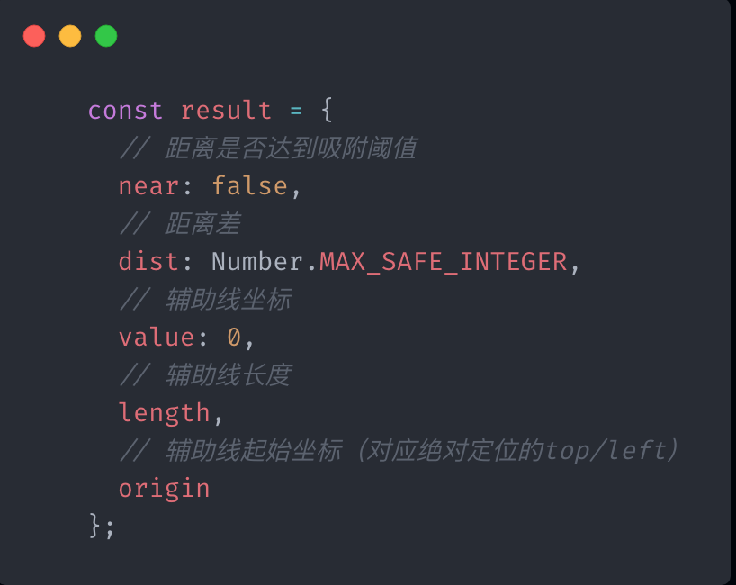

## 拖拽模块的搭建

   拖拽基于``` react-draggable ``` 库的 ``` DraggableCore ``` 组件。
   ``` DraggableCore ``` 接收的 ``` position ``` 属性包含x和y两个参数, 我们在拖拽的过程中会不断的更新position属性。

   我们一开始先定义一组散列的方块。

   ```js
   const initialChildren = [
   { id: 1, background: '#8ce8df', size: 100, position: { x: 100, y: 0 } },
   { id: 2, background: '#8ce8df', size: 100, position: { x: 200, y: 106 } },
   { id: 3, background: '#afc7fd', size: 102, position: { x: 500, y: 106 } },
   { id: 4, background: '#d2aff6', size: 150, position: { x: 100, y: 316 } },
   { id: 5, background: '#fee493', size: 200, position: { x: 480, y: 376 } }
   ];
   ```

   定义完方块后, 我们在容器中将这些方块渲染出来。

      

   ```js
    <DraggableCore
      grid={[1, 1]}
      position={{ x: dragX, y: dragY }}
      onStart={onHandleDragStart}
      onDrag={onHandleDrag}
      onStop={onHandleStop}
    >
      {React.cloneElement(children, {
        style
      })}
    </DraggableCore>
   ```   

   以上是每一个方块的代码, 每个方块都是可以被拖拽的。因此 ``` DraggableCore ``` 组件中我们用了 ``` position ``` 属性, 我们将拖拽后新的坐标传入该组件中, 同时我们需要监控一开始拖拽时方块的起点, 然后监控拖拽时的坐标, 最后监控拖拽结束后一些清除的操作。

   每个方块的起始坐标都是位于左上角。譬如, 我们拿id为3的方块来说。

   ```js
   { id: 3, background: '#afc7fd', size: 102, position: { x: 500, y: 106 } },
   ```

   它的坐标为(500, 106), 那么这个坐标在图上意味着

      

   因此当我们在拖拽的时候, 其实还有一段相对距离要计算。假设我们拖拽的点在方块中心, 我们在画布上往右移动了 ``` DragX ```, 往下移动了 ``` DragY ```, 最后求拖动完成后方块的坐标。

      

   首先我们需要监听 ``` onStart ``` 事件, 

   ```js
   const onHandleDragStart = (ev, b) => {
      lastDragX = b.lastX - 500;
      lastDragY = b.lastY - 106;
   };
   ```

   上述代码中 ``` b.lastX ``` 和 ``` b.lastY ```代表拖动滑块时的坐标位置。那么 ``` lastDragX ``` 和  ``` lastDragY ``` 算出来的就是拖动点相对于滑块的距离。

   那么拖动的时候滑块的实时坐标就应该是拖动点的xy坐标分别减去 ``` lastDragX ``` 和 ``` lastDragY ``` 即可。

   ```js
   const onHandleDrag = (ev, b) => {
    const _dragX = b.lastX - lastDragX.current;
    const _dragY = b.lastY - lastDragY.current;
  };
   ```

## 参照线的设计思路
   
      

   上图列举了常见的几种参考线, 以中间红色方框为基准对照框, 有垂直方向的对照线, 也有水平方向的对照线, 有底部对照线 也有顶部对照线。

   当我们在拖动的过程中, 其余的方块皆为对照块, 因此在开始拖动的时候我们需要生成一组可以被参照的对照组块。
   
   对照组的每个滑块都应至少包含以下信息: 
      

      

   当滑块朝着x轴的方向移动的时候, 有三个参照距离分别为: l、lr 、r, 同样的当滑块朝着y轴方向移动的时候, 参照距离为: t、tb、b.
   除此之外显示参照线还需要计算出 参照线的长度、坐标、滑块与滑块之间的参照线的差值。

      
   
   如果在我们在水平方向有拖动的时候 我们会与l、lr、r都会有交集。我们lr来算, 此时 ``` 距离差 dist ``` 和  ``` 辅助线 ```的坐标是可以被算出来的。

   ```js
   switch (dire) {
      case 'lr':
        result.dist = x + W / 2 - lr;
        result.value = lr;
        break;
      case 'll':
        result.dist = x - l;
        result.value = l;
        break;
      case 'rr':
        result.dist = x + W - r;
        result.value = r;
        break;
      case 'tt':
        result.dist = y - t;
        result.value = t;
        break;
      case 'bb':
        result.dist = y + H - b;
        result.value = b;
        break;
      case 'tb':
        result.dist = y + H / 2 - tb;
        result.value = tb;
        break;
      default:
        break;
    }
   ```

   接下来我们需要计算辅助线的长度和起始点。比如下图中的参照线, 它的长度就是 ``` y1 - y + h1 ```, 当然它的长度也是绿色框框的顶部距离与蓝色框框的顶部距离的差值。
   起始坐标为绿色框框距离顶部的值。

   

