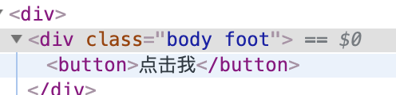

### 使用 classnames 这个包主要是有两个目的:1. 使我们的 css module 更加强大 2.类名的删除增加更加的方便,从此告别了 removeClass 这些操作。

### 如何安装？

`yarn add classnames`

### 如何使用？

```
    import classnames from 'classnames';
     <div className={classnames({'body': true, 'foot':true })}>
       <button onClick={() => this.setState({ count: this.state.count + 1 })}>点击我</button>
     </div>
```


### 打开浏览器的元素审查器



