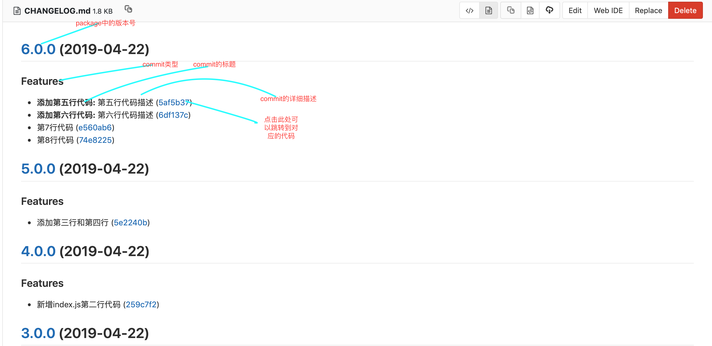

<!--
 * @Author: Andy
 * @Date: 2019-04-26 16:48:59
 * @LastEditors: Andy
 * @LastEditTime: 2019-04-26 16:48:59
 -->
### 你是否已经习惯了git add . -> git commit ... -> git push?。随着我们的项目功能越来越多团队越来越大,那么我们的项目的分支会有爆发性的增加。如果我们还是只使用传统的三步曲,那么我们的项目会变得非常难以追溯。

### 如何解决该问题呢？ 
#### 使用changelog 和 commitizen 来解决项目难以追溯的问题。commitizen用于规范化你的提交记录, changelog可以根据你的提交记录自动生成日志记录,日志里面有你项目对应的版本以及时间我觉得最重要的是可以直接根据changelog定位到你当时提交的代码。

#### 全局安装commitizen 
```   npm install -g commitizen ```

#### 设置支持angular格式的commit message
``` commitizen init cz-conventional-changelog —save-exact ```

#### 最后我们用 ``` git cz  ``` 代替 ``` git commit ```


#### 接下来我们全局安装一下changelog
``` npm install -g conventional-changelog-cli   ```

#### 生成所有的changelog
``` conventional-changelog -p angular -I CHANGELOG.md -s -r 0 ```

#### 我们可以在package.json中的scripts添加自定快捷启动方式
```
  "changelog": "npx conventional-changelog -p angular -u | tail -n +3",
  "beforeStage": "npx conventional-changelog -p angular -i CHANGELOG.md -s"
```
当我们执行``` npm run changelog  ```的时候会列出我们之前commitizen中的信息
执行``` npm run  beforeStage ```会将我们的信息自动写到CHANGELOG.md上


### 最后我们git push ....  可以在CHANGELOG.md上看到
